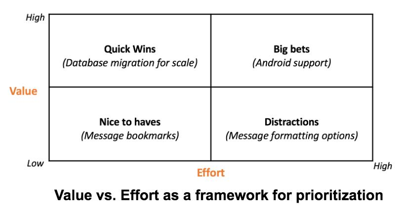
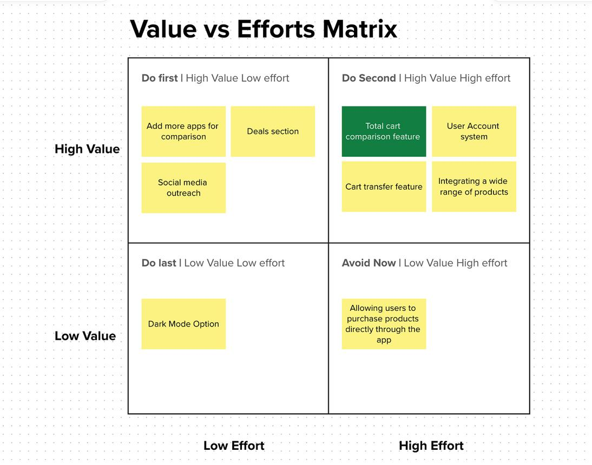
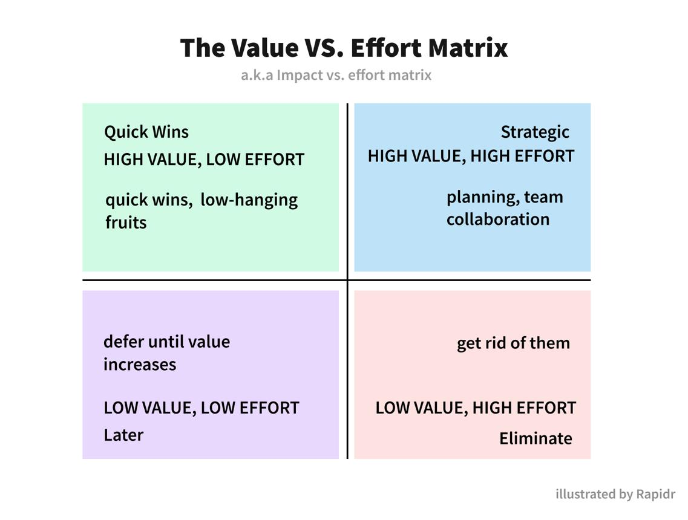

# Agile Masterclass_M3 (29-42)

**Agile Masterclass**

**Module 3 -- Scrum Mastery**

**Lesson 29: Scrum Introduction -- History, Philosophy, Theory,
Framework, and Foundations**

**Learning Objectives**

By the end of this lesson, you will understand:

-   What Scrum is.

-   Why Scrum was created.

-   History of Scrum.

-   Scrum mindset.

-   Scrum theory.

-   Scrum pillars.

-   Scrum values.

-   Scrum framework overview.

-   Scrum vs Agile.

-   Scrum lifecycle.

-   When Scrum works and when it doesn\'t.

**1. What is Scrum?**

**Simple definition**

**Scrum is an Agile framework that helps teams develop complex products
through iterative development, frequent feedback, and continuous
improvement.**

Simple meaning:

Scrum helps a team build something complex step-by-step instead of
trying to build everything at once.

**Simple Real-Life Analogy**

Imagine building a house.

**Traditional approach:**

Plan everything for 1 year.

↓

Build entire house.

↓

Show customer.

Problem:

Customer says:

\"I wanted different rooms.\"

Too late.

**Scrum approach:**

Build step-by-step:

Sprint 1:

Build foundation.

Show customer.

Get feedback.

Sprint 2:

Build rooms.

Show customer.

Get feedback.

Sprint 3:

Add finishing.

The customer gets involved continuously.

**2. Why was Scrum created?**

Software development has a problem:

Software is not like manufacturing.

You cannot always predict everything.

Examples:

Customer changes requirements.

Technology changes.

Market changes.

Users discover new needs.

Traditional methods assumed:

\"We know everything before starting.\"

Reality:

\"We learn while building.\"

Scrum was created to manage:

-   Complexity.

-   Uncertainty.

-   Changing requirements.

**3. History of Scrum**

Scrum originated from research by:

**Hirotaka Takeuchi**

and

**Ikujiro Nonaka**

in 1986.

They studied successful Japanese companies.

They found:

High-performing teams worked differently.

They were:

-   Cross-functional.

-   Collaborative.

-   Self-organizing.

They published a famous paper:

**\"The New New Product Development Game\"**

The paper introduced the idea of teams working like a rugby \"scrum.\"

Later:

**Jeff Sutherland**

and

**Ken Schwaber**

formalized Scrum for software development.

**4. Why the name \"Scrum\"?**

The name comes from rugby.

In rugby:

Players form a scrum:

-   Work together.

-   Move as one unit.

-   Adapt quickly.

Software teams should behave similarly.

**5. Scrum vs Agile**

This is a very common interview question.

**Agile**

Agile is a mindset.

It is based on:

-   Values.

-   Principles.

**Scrum**

Scrum is a framework implementing Agile.

Analogy:

Agile = Religion/philosophy

Scrum = One way of practicing that philosophy

Example:

Agile approaches:

-   Scrum.

-   Kanban.

-   XP.

-   Lean.

**6. Scrum Theory**

Modern Scrum is based on:

**Empiricism**

Meaning:

Make decisions based on:

-   Observation.

-   Experience.

-   Evidence.

Simple example:

Instead of saying:

\"Users will love this feature.\"

Build a small version.

Measure usage.

Learn.

**7. Three Pillars of Scrum**

Scrum is built on three pillars.

**Pillar 1: Transparency**

Everyone should see:

-   What is happening.

-   Current progress.

-   Problems.

Examples:

Visible:

-   Product Backlog.

-   Sprint Goal.

-   Burndown chart.

Healthcare example:

Everyone can see:

AI pharmacovigilance development progress.

**Pillar 2: Inspection**

Regularly check progress.

Examples:

-   Sprint Review.

-   Daily Scrum.

-   Testing.

Question:

\"Are we building the right thing?\"

**Pillar 3: Adaptation**

If something is wrong:

Change.

Example:

AI extraction accuracy is low.

Team adapts:

-   Improve model.

-   Change approach.

-   Add validation.

**Scrum Framework Overview**

Scrum has:

**Accountabilities**

Who is responsible?

-   Product Owner.

-   Scrum Master.

-   Developers.

**Events**

When do we inspect and adapt?

-   Sprint.

-   Sprint Planning.

-   Daily Scrum.

-   Sprint Review.

-   Sprint Retrospective.

**Artifacts**

What creates transparency?

-   Product Backlog.

-   Sprint Backlog.

-   Increment.

**Scrum Framework Diagram**

Product Goal

↓

Product Backlog

↓

Sprint Planning

↓

Sprint

\-\-\-\-\-\-\-\-\-\-\-\-\-\-\-\-\-\-\-\-\-\-\-\--

Daily Scrum

Development

Testing

Collaboration

\-\-\-\-\-\-\-\-\-\-\-\-\-\-\-\-\-\-\-\-\-\-\-\--

↓

Sprint Review

↓

Sprint Retrospective

↓

Improved Sprint

**8. Scrum Characteristics**

**1. Iterative**

Work happens repeatedly.

Example:

Sprint 1:

Basic case management.

Sprint 2:

AI extraction.

Sprint 3:

Signal detection.

**2. Incremental**

Product grows step-by-step.

**3. Time-boxed**

Events have fixed duration.

Example:

Sprint:

2 weeks.

**4. Adaptive**

Teams adjust based on feedback.

**9. Scrum Lifecycle Example**

Let\'s build:

**AI Pharmacovigilance Platform**

**Step 1: Product Vision**

Goal:

\"Reduce manual adverse event processing using AI.\"

**Step 2: Product Backlog**

Features:

-   Case intake.

-   AI extraction.

-   MedDRA coding.

-   Signal detection.

**Step 3: Sprint Planning**

Team selects:

Sprint Goal:

\"Create automated case intake.\"

**Step 4: Sprint Execution**

Developers build.

Tester validates.

BA clarifies requirements.

**Step 5: Sprint Review**

Stakeholders see working feature.

Feedback collected.

**Step 6: Retrospective**

Team discusses:

What went well?

What should improve?

**10. Scrum Principles**

Scrum promotes:

**Self-management**

Teams decide how to work.

**Collaboration**

Business and technology work together.

**Continuous improvement**

Every sprint improves.

**Customer focus**

Deliver valuable outcomes.

**11. When Scrum works best**

Scrum works well when:

**1. Requirements change**

Example:

AI products.

**2. Complex problems exist**

Example:

Healthcare platforms.

**3. Customer feedback is important**

**4. Cross-functional teams exist**

**12. When Scrum may not work well**

Scrum may struggle when:

**1. Work is predictable**

Example:

Routine data entry.

**2. Teams cannot collaborate**

**3. No product ownership exists**

**4. Organization refuses change**

**13. Scrum Myths**

**Myth 1:**

\"Scrum means daily meetings.\"

Wrong.

Daily Scrum is only one event.

**Myth 2:**

\"Scrum eliminates planning.\"

Wrong.

Scrum has continuous planning.

**Myth 3:**

\"Scrum Master is a project manager.\"

Wrong.

Scrum Master is a coach and facilitator.

**Myth 4:**

\"Product Owner tells developers what code to write.\"

Wrong.

PO defines value, not technical implementation.

**14. Scrum in Healthcare**

Example:

Hospital Management System.

Sprint 1:

Patient registration.

Sprint 2:

Doctor appointment.

Sprint 3:

Prescription management.

Sprint 4:

Analytics.

Stakeholders provide feedback every sprint.

**15. Scrum in Pharmacovigilance**

AI Drug Safety Platform:

**Product Owner:**

Pharmacovigilance manager.

**Scrum Team:**

-   Developers.

-   Data scientists.

-   QA.

-   BA.

Sprint example:

Goal:

\"Reduce manual case entry.\"

Deliver:

AI extraction prototype.

**16. Scrum in AI Products**

AI development is uncertain.

Scrum helps manage:

-   Model experiments.

-   User feedback.

-   Data issues.

-   Changing requirements.

Example:

AI chatbot.

Sprint 1:

Basic conversation.

Sprint 2:

Medical knowledge integration.

Sprint 3:

Safety validation.

**Common mistakes**

**Mistake 1:**

Treating Scrum as a checklist.

Wrong.

Scrum is a mindset.

**Mistake 2:**

Following ceremonies but ignoring values.

Wrong.

**Mistake 3:**

Product Owner not available.

Problem:

Requirements become unclear.

**Best Practices**

-   Maintain clear product vision.

-   Keep backlog prioritized.

-   Involve stakeholders.

-   Deliver working increments.

-   Encourage transparency.

-   Improve continuously.

**Interview Questions**

**Q1. What is Scrum?**

**Answer:**

Scrum is an Agile framework that helps teams develop complex products
through iterative development, inspection, and adaptation.

**Q2. Difference between Agile and Scrum?**

**Answer:**

Agile is a mindset based on values and principles, while Scrum is a
framework used to implement Agile.

**Q3. What are Scrum pillars?**

**Answer:**

1.  Transparency

2.  Inspection

3.  Adaptation

**Q4. Why does Scrum use iterations?**

**Answer:**

Because complex products require continuous feedback and learning.

**Q5. What is empiricism?**

**Answer:**

Making decisions based on observation, experience, and evidence.

**Mini Quiz**

Answer these:

1.  What is Scrum?

2.  Who created Scrum?

3.  Difference between Agile and Scrum?

4.  What are the three Scrum pillars?

5.  Why is Scrum useful for AI products?

**Practical Assignment**

For your AI Pharmacovigilance Platform:

Create:

**Product Vision**

Example:

\"Build an AI-powered system that reduces manual drug safety
processing.\"

Create:

**First 3 Sprints**

Sprint 1:

Goal:

?

Sprint 2:

Goal:

?

Sprint 3:

Goal:

?

Explain:

-   Why did you choose these priorities?

-   What feedback would you collect?

**Summary**

Scrum is:

A framework for managing complex product development through:

✅ Iterations\
✅ Collaboration\
✅ Feedback\
✅ Transparency\
✅ Continuous improvement

Core foundation:

**Empiricism + Three Pillars + Scrum Values**

**Key Takeaways**

-   Scrum is an Agile framework.

-   Created from research on high-performing teams.

-   Formalized by Jeff Sutherland and Ken Schwaber.

-   Uses Sprints to deliver increments.

-   Based on transparency, inspection, and adaptation.

-   Very useful for AI and healthcare product development.

**Lesson 30: Scrum Roles and Accountabilities (Deep Dive)**

**Learning Objectives**

By the end of this lesson, you will understand:

-   What Scrum accountabilities are.

-   Difference between role and accountability.

-   Product Owner responsibilities.

-   Scrum Master responsibilities.

-   Developer responsibilities.

-   Stakeholder involvement.

-   How a Scrum team works together.

-   Healthcare and AI examples.

-   Interview expectations.

**1. Understanding Scrum Accountabilities**

First, understand one important change.

Older Scrum versions used the word:

**Roles**

Modern Scrum uses:

**Accountabilities**

**Why?**

Because Scrum is not about job titles.

Example:

A person may be:

-   Pharmacovigilance expert.

-   Business Analyst.

-   Product Owner.

The important thing is:

\"What responsibility does this person own?\"

**Simple analogy**

Imagine a hospital emergency department.

There are different responsibilities:

-   Someone decides treatment priority.

-   Someone coordinates workflow.

-   Someone performs medical procedures.

The titles may differ, but accountability remains.

**Scrum Team Structure**

A Scrum Team contains:

1.  Product Owner

2.  Scrum Master

3.  Developers

Together:

They create valuable product increments every Sprint.

**Scrum Team Diagram**

Scrum Team

\|

\-\-\-\-\-\-\-\-\-\-\-\-\-\-\-\-\-\-\-\-\-\-\-\-\-\-\-\-\-\-\--

Product Owner

Scrum Master

Developers

\-\-\-\-\-\-\-\-\-\-\-\-\-\-\-\-\-\-\-\-\-\-\-\-\-\-\-\-\-\-\--

Product Increment

**2. Product Owner (PO)**

**Simple definition**

The Product Owner is accountable for:

Maximizing the value of the product resulting from the work of the Scrum
Team.

Simple meaning:

The Product Owner decides:

-   What should be built.

-   Why it matters.

-   What gives maximum business value.

**Real-life analogy**

Think about a restaurant.

The chef knows how to cook.

But someone decides:

-   Which dishes customers want.

-   Which menu items are priorities.

-   What customers will pay for.

That person is like a Product Owner.

**Product Owner Responsibilities**

**1. Product Vision**

The PO defines:

Where are we going?

Example:

AI Pharmacovigilance Platform vision:

\"Reduce manual adverse event processing by 70% using AI.\"

**2. Product Backlog Management**

PO owns:

-   Creating backlog.

-   Ordering backlog.

-   Prioritizing backlog.

Example:

Backlog:

Priority 1:

AI case extraction

Priority 2:

MedDRA coding automation

Priority 3:

Dashboard analytics

**3. Stakeholder Management**

PO communicates with:

-   Customers.

-   Business leaders.

-   Regulatory teams.

-   Users.

Example:

Pharma stakeholders say:

\"We need faster FDA reporting.\"

PO converts this into product requirements.

**4. Define Product Goals**

Example:

Goal:

\"Reduce ICSR processing time from 5 days to 1 day.\"

**5. Accept or Reject Work**

During Sprint Review:

PO checks:

Does this meet expectations?

**Product Owner Does NOT:**

❌ Assign tasks to developers.

❌ Manage people.

❌ Decide technical solutions.

❌ Act as project manager.

**Product Owner in Healthcare**

Example:

Drug Safety Product Owner.

Responsibilities:

-   Understand pharmacovigilance workflow.

-   Prioritize safety features.

-   Work with regulators.

-   Define business value.

**Product Owner in AI Product**

AI Medical Assistant:

PO decides:

Feature:

\"Add symptom checking.\"

But does NOT decide:

Which ML algorithm developers use.

**Product Owner Skills**

A good PO needs:

**Business skills**

-   Market understanding.

-   Strategy.

**Communication**

-   Stakeholder management.

**Domain knowledge**

Healthcare/pharma knowledge is valuable.

**Decision-making**

Prioritization.

**3. Scrum Master**

**Simple definition**

The Scrum Master is accountable for:

Establishing Scrum and helping everyone understand Scrum theory and
practice.

Simple meaning:

Scrum Master is:

-   Coach.

-   Facilitator.

-   Process guide.

**Real-life analogy**

A cricket coach.

The coach does not play every ball.

The coach:

-   Improves team performance.

-   Removes obstacles.

-   Helps players improve.

**Scrum Master Responsibilities**

**1. Coach the Team**

Teaches:

-   Scrum principles.

-   Agile mindset.

-   Continuous improvement.

**2. Facilitate Scrum Events**

Helps conduct:

-   Sprint Planning.

-   Daily Scrum.

-   Sprint Review.

-   Retrospective.

**3. Remove Impediments**

Example:

Developer cannot access test environment.

Scrum Master helps solve it.

**4. Protect Scrum Team**

Example:

Stakeholder constantly interrupts developers.

Scrum Master protects focus.

**5. Improve Team Effectiveness**

Helps team become better.

**Scrum Master Does NOT:**

❌ Assign tasks.

❌ Manage developers.

❌ Act as boss.

❌ Track employees.

**Scrum Master in Healthcare**

Example:

AI Pharmacovigilance Team problem:

Regulatory team delays approvals.

Scrum Master helps remove communication barriers.

**4. Developers**

**Simple definition**

Developers are:

People who create any aspect of a usable product increment.

Important:

Developer does not only mean programmer.

Developers can include:

-   Software engineers.

-   Data scientists.

-   Test engineers.

-   Designers.

-   Analysts.

**Developer Responsibilities**

**1. Create Increment**

They build working product features.

Example:

Sprint goal:

\"Automate adverse event extraction.\"

Developers create:

AI extraction module.

**2. Maintain Quality**

Developers follow:

Definition of Done.

**3. Plan Their Work**

Developers decide:

How to complete sprint work.

**4. Collaborate**

They work with:

-   PO.

-   Scrum Master.

-   Users.

**Developer Does NOT:**

❌ Wait for detailed instructions.

❌ Work only individually.

❌ Ignore business needs.

**5. Stakeholders**

Important:

Stakeholders are NOT Scrum Team members.

But they influence product success.

**Who are stakeholders?**

Examples:

Healthcare:

-   Doctors.

-   Patients.

-   Pharmacovigilance managers.

-   Regulatory authorities.

-   Hospital administrators.

**Stakeholder Responsibilities**

Provide:

-   Feedback.

-   Requirements.

-   Business information.

**Stakeholder Example**

AI Drug Safety Platform:

Stakeholder:

Safety Officer.

Feedback:

\"AI extraction accuracy is insufficient.\"

PO updates priorities.

**6. How Everyone Works Together**

Example:

AI Pharmacovigilance Platform

**Product Owner**

Says:

\"We need automated adverse event extraction.\"

**Developers**

Decide:

How to build AI extraction.

**Scrum Master**

Ensures:

Team works effectively.

**Stakeholders**

Provide:

Feedback and domain knowledge.

**Collaboration Flow**

Stakeholders

↓

Product Owner

↓

Product Backlog

↓

Developers

↓

Product Increment

↓

Stakeholder Feedback

↓

Improvement

**7. Product Owner vs Business Analyst**

Important for your career.

Many companies combine these roles.

  -----------------------------------------------------------------------
  **Product Owner**               **Business Analyst**
  ------------------------------- ---------------------------------------
  Owns product value              Analyzes requirements

  Prioritizes backlog             Clarifies requirements

  Defines vision                  Creates documentation

  Makes decisions                 Facilitates understanding

  Customer focused                Process focused
  -----------------------------------------------------------------------

In healthcare:

BA may understand:

-   Pharmacovigilance workflows.

-   Regulations.

-   User needs.

PO decides:

Which features come first.

**8. Product Owner vs Product Manager**

  -----------------------------------------------------------------------
  **Product Owner**                     **Product Manager**
  ------------------------------------- ---------------------------------
  Sprint level                          Product strategy

  Backlog                               Roadmap

  Team collaboration                    Market analysis

  Short-term delivery                   Long-term vision
  -----------------------------------------------------------------------

In many companies:

One person may perform both roles.

**Common Mistakes**

**Mistake 1:**

PO = Boss

Wrong.

PO manages product decisions, not people.

**Mistake 2:**

Scrum Master = Project Manager

Wrong.

Scrum Master coaches Agile practices.

**Mistake 3:**

Developers only code.

Wrong.

Developers create complete increments.

**Best Practices**

**Product Owner**

-   Keep backlog clear.

-   Prioritize continuously.

-   Understand users.

**Scrum Master**

-   Coach instead of command.

-   Remove obstacles.

-   Encourage improvement.

**Developers**

-   Collaborate.

-   Own quality.

-   Self-manage.

**Interview Questions**

**Q1. What are the three Scrum accountabilities?**

Answer:

-   Product Owner

-   Scrum Master

-   Developers

**Q2. What is the main responsibility of Product Owner?**

Answer:

Maximize product value by managing and ordering the Product Backlog.

**Q3. Is Scrum Master a project manager?**

Answer:

No. Scrum Master is a servant leader and Agile coach.

**Q4. Can a Business Analyst become a Product Owner?**

Answer:

Yes. BA skills like requirement analysis, stakeholder management, and
domain knowledge help in the PO role.

**Mini Quiz**

Answer these:

1.  What is the main accountability of Product Owner?

2.  What does Scrum Master do?

3.  Are developers only programmers?

4.  Who owns Product Backlog?

5.  Difference between Product Owner and Product Manager?

**Practical Assignment**

For your AI Pharmacovigilance Platform:

Define:

**Product Owner**

Who should be the PO?

What decisions will they make?

**Scrum Master**

What problems will they solve?

**Developers**

List team members needed.

Example:

-   Frontend developer.

-   Backend developer.

-   AI engineer.

-   QA.

-   Data analyst.

**Stakeholders**

List five stakeholders.

**Summary**

Scrum has three accountabilities:

**Product Owner**

Creates value.

**Scrum Master**

Improves the way of working.

**Developers**

Create the product.

Together:

They transform ideas into valuable working products.

**Key Takeaways**

✅ Product Owner owns value\
✅ Scrum Master owns Scrum effectiveness\
✅ Developers own product creation\
✅ Stakeholders provide feedback\
✅ Scrum is collaborative, not hierarchical

**Lesson 31: Product Owner Deep Dive -- Vision, Strategy, Backlog
Management, Prioritization, and Real Product Owner Work**

**Learning Objectives**

By the end of this lesson, you will understand:

-   What a Product Owner really does daily.

-   Product vision creation.

-   Product strategy.

-   Product goals.

-   Backlog ownership.

-   Prioritization techniques.

-   Stakeholder management.

-   Working with developers.

-   Product Owner mistakes.

-   Healthcare and AI Product Owner examples.

**1. What is a Product Owner?**

**Simple definition**

A Product Owner is the person accountable for:

Maximizing the value of the product by deciding what should be built and
why.

Simple meaning:

A Product Owner answers three questions:

**1. Why are we building this?**

Business value.

**2. What should we build?**

Features.

**3. What should we build first?**

Priority.

**Real-Life Analogy**

Imagine you are opening a hospital.

Many people suggest ideas:

Doctor:

\"We need electronic prescriptions.\"

Nurse:

\"We need better patient records.\"

Patient:

\"We need online appointments.\"

Management:

\"We need cost reduction.\"

Someone must decide:

-   Which problem is most important?

-   Which feature gives maximum value?

-   What should happen first?

That person is the Product Owner.

**2. Product Owner Mindset**

A beginner Product Owner thinks:

\"My job is to collect requirements.\"

Wrong.

A good Product Owner thinks:

\"My job is to solve customer problems and maximize business outcomes.\"

Example:

Customer says:

\"We need a chatbot.\"

Weak PO:

\"Create chatbot feature.\"

Strong PO:

\"Why do users need a chatbot?\"

Maybe the real problem:

Patients cannot get answers quickly.

Solution could be:

-   Better FAQ.

-   Search.

-   AI assistant.

**3. Product Owner Responsibilities Overview**

A Product Owner manages:

Vision

\|

Strategy

\|

Roadmap

\|

Backlog

\|

Prioritization

\|

Sprint Collaboration

\|

Feedback

\|

Improvement

**4. Product Vision**

**What is Product Vision?**

Product vision describes:

The future state we want to create.

It answers:

-   Who are we helping?

-   What problem are we solving?

-   What impact do we want?

**Example: AI Pharmacovigilance Platform**

Weak vision:

\"We want to build AI software.\"

Strong vision:

\"We want to create an AI-powered pharmacovigilance platform that
reduces manual case processing time, improves regulatory compliance, and
enables faster drug safety decisions.\"

**Product Vision Template**

Use:

**For \[customer\]**

Who?

↓

**Who needs \[problem\]**

Pain point?

↓

**Our product provides \[solution\]**

How?

↓

**To achieve \[business outcome\]**

Impact?

Example:

For:

Pharmacovigilance teams

Who need:

Faster adverse event processing

Our product provides:

AI-assisted case processing

To achieve:

50% reduction in processing time.

**5. Product Strategy**

**What is Product Strategy?**

Product strategy explains:

How we will achieve the vision.

Vision:

Where we want to go.

Strategy:

How we get there.

Example:

Vision:

AI Drug Safety Platform.

Strategy:

Phase 1:

Digitize case processing.

Phase 2:

Add AI extraction.

Phase 3:

Add predictive safety signals.

Phase 4:

Enterprise automation.

**Product Strategy Components**

**1. Target Users**

Who uses the product?

Example:

-   Drug safety officers.

-   Medical reviewers.

-   Regulatory teams.

**2. Customer Problems**

Example:

Manual data entry.

Slow reporting.

Human errors.

**3. Differentiation**

Why choose us?

Example:

AI-powered automation.

**4. Business Goals**

Example:

Reduce processing cost by 40%.

**6. Product Goal**

**Definition**

A Product Goal describes the future objective of the product.

Example:

Product Goal:

\"Create an AI-assisted adverse event processing system that reduces
manual review workload.\"

Difference:

Vision:

Long-term dream.

Goal:

Specific achievement.

**7. Product Roadmap**

**What is a roadmap?**

A roadmap shows:

-   Major features.

-   Timeline.

-   Strategic direction.

Example:

AI Pharmacovigilance Roadmap:

Q1

\|

Case Management

Q2

\|

AI Data Extraction

Q3

\|

MedDRA Automation

Q4

\|

Signal Detection AI

**Roadmap is NOT:**

❌ A detailed task list.

❌ Developer schedule.

❌ Fixed forever.

**8. Product Backlog Ownership**

The Product Owner owns the Product Backlog.

The PO ensures:

**Visibility**

Everyone understands work.

**Ordering**

Most valuable items first.

**Clarity**

Items are understandable.

**Product Backlog Example**

AI PV Platform:

  -----------------------------------------------------------------------
  **Priority**            **Item**
  ----------------------- -----------------------------------------------
  1                       User login

  2                       Case intake

  3                       AI extraction

  4                       Medical coding

  5                       Signal detection
  -----------------------------------------------------------------------

**9. Backlog Prioritization**

This is one of the most important PO skills.

You cannot build everything.

You decide:

\"What gives maximum value?\"

**Technique 1: MoSCoW**

Very common.

**Must Have**

Critical.

Example:

User authentication.

**Should Have**

Important but not mandatory.

Example:

Advanced dashboard.

**Could Have**

Nice feature.

Example:

Custom themes.

**Won\'t Have**

Not now.

Example:

Mobile app in first release.

**Technique 2: Value vs Effort Matrix**

Compare:

Business value

vs

Development effort

High Value

\|

\| Build First

\|

\|

\|

\|\_\_\_\_\_\_\_\_\_\_\_\_\_\_\_\_

Effort

Example:

AI extraction:

High value + medium effort

Build early.

**Technique 3: RICE Scoring**

Used by many product teams.

Formula:

RICE =

Reach × Impact × Confidence

\-\-\-\-\-\-\-\-\-\-\-\-\-\-\-\-\-\-\-\-\-\-\-\-\-\-\--

Effort

Example:

Feature:

AI summarization.

Reach:

1000 users.

Impact:

High.

Confidence:

80%.

Effort:

Medium.

**Technique 4: Cost of Delay**

Question:

\"What happens if we delay this?\"

Example:

Regulatory reporting feature.

Delay = compliance risk.

High priority.

**10. Stakeholder Management**

A Product Owner works with many stakeholders.

Healthcare example:

Stakeholders:

-   Pharmacovigilance head.

-   Doctors.

-   Regulatory affairs.

-   IT security.

-   Patients.

-   Business leadership.

Problem:

Everyone wants different things.

PO responsibility:

Balance:

Customer Need

\+

Business Goal

\+

Technical Reality

\+

Regulatory Requirements

**11. Product Owner Daily Activities**

A typical day:

**Morning**

Review metrics.

Check backlog.

**Team Discussion**

Clarify user stories.

Answer questions.

**Stakeholder Meeting**

Collect feedback.

**Prioritization**

Reorder backlog.

**Product Thinking**

Analyze:

\"What problem should we solve next?\"

**12. Product Owner and Developers**

A good PO does not say:

\"Build exactly this.\"

A good PO explains:

Problem:

\"Doctors need faster access to patient history.\"

Developer decides:

Technical solution.

**13. Product Owner and Business Analyst**

This is important for you.

Many organizations combine these roles.

BA focuses:

\"What does the user need?\"

PO focuses:

\"Which need creates highest value?\"

Example:

BA discovers:

Users spend 3 hours entering cases.

PO decides:

AI extraction should be priority.

**14. Product Owner in AI Products**

AI products require special thinking.

Traditional software:

Requirement → Build → Test

AI:

Problem → Data → Experiment → Learn → Improve

AI Product Owner manages:

-   Data availability.

-   Model performance.

-   User feedback.

-   AI risks.

Example:

AI medical chatbot.

PO must consider:

Accuracy.

Safety.

Bias.

Privacy.

**15. Product Owner in Pharmacovigilance**

Example:

AI ICSR Processing System.

PO decisions:

Should we automate:

-   Data extraction?

-   Duplicate detection?

-   Coding?

-   Narrative generation?

Prioritization:

First:

Reduce manual workload.

Later:

Advanced prediction.

**Common Product Owner Mistakes**

**Mistake 1:**

Accept every stakeholder request.

Problem:

No priority.

**Mistake 2:**

Focus only on features.

Problem:

Ignore outcomes.

**Mistake 3:**

Not understanding users.

Problem:

Build wrong product.

**Mistake 4:**

Being unavailable to team.

Problem:

Development slows.

**Best Practices**

A great Product Owner:

✅ Understands users deeply\
✅ Maintains clear vision\
✅ Prioritizes ruthlessly\
✅ Communicates clearly\
✅ Uses data for decisions\
✅ Collaborates with teams\
✅ Focuses on outcomes

**Interview Questions**

**Q1. What is the main responsibility of Product Owner?**

Answer:

To maximize product value by managing and ordering the Product Backlog.

**Q2. Difference between Product Vision and Product Roadmap?**

Answer:

Vision defines future direction; roadmap explains how we plan to achieve
it.

**Q3. How do you prioritize backlog?**

Answer:

Using methods like MoSCoW, RICE, WSJF, Cost of Delay, and Value vs
Effort.

**Q4. Can Product Owner reject stakeholder requests?**

Answer:

Yes. The PO must prioritize based on product value and strategy.

**Mini Quiz**

Answer these:

1.  What is the difference between vision and strategy?

2.  Who owns Product Backlog?

3.  What does RICE stand for?

4.  What is the difference between BA and Product Owner?

5.  Why is AI Product Ownership different from traditional products?

**Practical Assignment**

Create Product Owner documents for:

**AI Pharmacovigilance Platform**

**1. Product Vision**

Write 2--3 sentences.

**2. Product Goal**

Write one measurable goal.

**3. Roadmap**

Create:

Phase 1

Phase 2

Phase 3

**4. Prioritize these features:**

-   Login

-   AI extraction

-   Dashboard

-   Signal detection

-   Regulatory reports

Use MoSCoW.

**Summary**

A Product Owner is not a requirement collector.

A Product Owner is:

The person responsible for maximizing product value.

Core responsibilities:

-   Vision

-   Strategy

-   Roadmap

-   Backlog

-   Prioritization

-   Stakeholder alignment

**Key Takeaways**

✅ PO owns product value\
✅ PO manages backlog priority\
✅ PO connects users, business, and technology\
✅ PO makes difficult trade-offs\
✅ AI Product Owners must manage uncertainty and experiments

**Lesson 32: Scrum Master Deep Dive -- Servant Leadership, Coaching,
Facilitation, Impediment Removal, and Agile Team Improvement**

**Learning Objectives**

By the end of this lesson, you will understand:

-   What a Scrum Master really does.

-   Why Scrum Master is not a Project Manager.

-   Servant leadership.

-   Coaching techniques.

-   Facilitation skills.

-   Removing impediments.

-   Improving team maturity.

-   Scrum Master metrics.

-   Healthcare and AI examples.

-   Interview expectations.

**1. What is a Scrum Master?**

**Simple definition**

A Scrum Master is accountable for:

Establishing Scrum as defined in the Scrum Guide and helping everyone
understand Scrum theory and practice.

Simple meaning:

A Scrum Master helps the team become:

-   More effective.

-   More collaborative.

-   More Agile.

**Real-life analogy**

Think about a football coach.

The coach does not:

❌ Score every goal.

❌ Play every match.

The coach:

✅ Trains players.

✅ Improves teamwork.

✅ Removes obstacles.

✅ Helps the team perform better.

A Scrum Master works similarly.

**2. Why Does Scrum Need a Scrum Master?**

Without guidance, teams often fall into problems:

**Problem 1:**

Daily Scrum becomes a status meeting.

Instead of:

\"How can we coordinate?\"

It becomes:

\"Reporting to manager.\"

**Problem 2:**

Product Owner gives unclear requirements.

**Problem 3:**

Team ignores retrospectives.

**Problem 4:**

External people interrupt the team.

Scrum Master prevents these problems.

**3. Scrum Master vs Project Manager**

Very common interview question.

  -----------------------------------------------------------------------
  **Project Manager**              **Scrum Master**
  -------------------------------- --------------------------------------
  Manages project                  Coaches team

  Assigns tasks                    Helps self-management

  Tracks schedule                  Improves flow

  Controls people                  Supports people

  Manages risks                    Helps remove impediments

  Command-and-control              Servant leadership
  -----------------------------------------------------------------------

**Example**

Developer says:

\"I cannot complete this task because test environment access is
blocked.\"

Project Manager approach:

\"Why are you late?\"

Scrum Master approach:

\"What is blocking you? How can we remove it?\"

**4. Servant Leadership**

This is the foundation of Scrum Master role.

**What is Servant Leadership?**

A leader who serves the team instead of controlling the team.

Traditional leadership:

Manager

\|

\|

Employees

Servant leadership:

Team

↑

Scrum Master supports team

**Servant Leader Behaviors**

A Scrum Master:

**Listens**

Understands problems.

**Coaches**

Helps people improve.

**Removes barriers**

Makes work easier.

**Empowers**

Allows teams to make decisions.

**5. Scrum Master Responsibilities**

According to Scrum:

A Scrum Master serves:

1.  Scrum Team

2.  Product Owner

3.  Organization

**A. Serving the Scrum Team**

**1. Coaching self-management**

Old style:

Manager assigns tasks.

Agile:

Team decides:

-   How to work.

-   How to solve problems.

**Example:**

AI development team.

Instead of:

\"Developer A do this.\"

Team decides:

\"Who has the best skills for this work?\"

**2. Helping team focus on Sprint Goal**

Every sprint needs a goal.

Example:

Sprint Goal:

\"Automate adverse event data extraction.\"

Scrum Master ensures:

Team stays focused.

**3. Removing impediments**

**What is an impediment?**

Anything preventing progress.

Examples:

Technical:

-   Server unavailable.

Process:

-   Approval delays.

People:

-   Communication problems.

Healthcare example:

AI model testing delayed because clinical dataset approval is pending.

Scrum Master helps resolve.

**B. Serving the Product Owner**

Scrum Master helps PO by:

**1. Backlog management coaching**

Helps PO understand:

-   User stories.

-   Prioritization.

-   Refinement.

**2. Stakeholder collaboration**

Helps create better communication.

**3. Product planning**

Supports:

-   Release planning.

-   Sprint planning.

**C. Serving the Organization**

Scrum Master helps organization:

-   Adopt Agile mindset.

-   Remove organizational blockers.

-   Improve processes.

**6. Scrum Events Facilitation**

Scrum Master facilitates events.

Important:

Facilitate ≠ Control.

**Sprint Planning**

Scrum Master ensures:

-   Clear Sprint Goal.

-   Right participants.

-   Product Backlog ready.

**Daily Scrum**

Scrum Master ensures:

Purpose is collaboration.

Not reporting.

**Sprint Review**

Helps:

-   Stakeholder participation.

-   Feedback collection.

**Sprint Retrospective**

Most important improvement event.

Team discusses:

What went well?

What failed?

What should change?

**7. Coaching Techniques**

A Scrum Master is a coach.

**Technique 1: Asking Powerful Questions**

Instead of:

\"Why did you fail?\"

Ask:

\"What prevented success?\"

**Technique 2: Active Listening**

Understand before responding.

**Technique 3: Facilitation**

Help teams reach decisions.

**Technique 4: Teaching**

Explain Agile concepts.

**8. Scrum Master in AI Product Development**

AI projects have uncertainty.

Problems:

-   Data quality issues.

-   Model accuracy problems.

-   Changing requirements.

Example:

AI Pharmacovigilance Platform.

Problem:

AI extraction accuracy is only 70%.

Scrum Master helps team:

-   Run experiments.

-   Improve collaboration.

-   Remove blockers.

**9. Scrum Master in Pharmacovigilance**

Example:

Drug Safety AI Team.

Blocker:

Medical reviewers are not available for validation.

Scrum Master:

Coordinates with stakeholders.

Creates process.

Removes delay.

**10. Scrum Master Metrics**

A Scrum Master does not measure individual performance.

Important metrics:

**1. Velocity Trend**

Shows team capacity trend.

Not employee productivity.

**2. Cycle Time**

How long work takes.

**3. Sprint Predictability**

Did team achieve Sprint Goal?

**4. Escaped Defects**

Quality measurement.

**5. Team Health**

Collaboration.

Morale.

Continuous improvement.

**11. Scrum Master Anti-Patterns**

**Mistake 1:**

Acting as manager.

Wrong.

**Mistake 2:**

Running every meeting forever.

Wrong.

Team should become independent.

**Mistake 3:**

Solving every problem personally.

Wrong.

Coach team to solve problems.

**Mistake 4:**

Tracking people.

Wrong.

Focus on system improvement.

**12. Scrum Master Career Skills**

Important skills:

**Agile Knowledge**

-   Scrum.

-   Kanban.

-   Lean.

**Communication**

-   Facilitation.

-   Conflict resolution.

**Leadership**

-   Coaching.

-   Mentoring.

**Domain Understanding**

Healthcare knowledge is valuable.

**13. Scrum Master vs Business Analyst**

Important for your career.

  -----------------------------------------------------------------------
  **Scrum Master**                  **Business Analyst**
  --------------------------------- -------------------------------------
  Improves process                  Understands requirements

  Coaches team                      Analyzes business needs

  Removes blockers                  Defines requirements

  Facilitates collaboration         Creates documentation
  -----------------------------------------------------------------------

**14. Scrum Master vs Product Owner**

  -----------------------------------------------------------------------
  **Scrum Master**                   **Product Owner**
  ---------------------------------- ------------------------------------
  How work happens                   What gets built

  Process owner                      Product value owner

  Team effectiveness                 Product success
  -----------------------------------------------------------------------

**Interview Questions**

**Q1. What is the role of Scrum Master?**

Answer:

A Scrum Master helps the Scrum Team understand and apply Scrum, removes
impediments, and improves team effectiveness.

**Q2. Is Scrum Master a manager?**

Answer:

No. Scrum Master is a servant leader and coach.

**Q3. What are Scrum Master responsibilities?**

Answer:

-   Coaching team.

-   Facilitating Scrum events.

-   Removing impediments.

-   Helping Product Owner.

-   Supporting Agile adoption.

**Q4. How do you handle team conflicts?**

Answer:

Facilitate discussion, encourage collaboration, identify root causes,
and help the team reach solutions.

**Mini Quiz**

Answer these:

1.  What is servant leadership?

2.  Difference between Scrum Master and Project Manager?

3.  What is an impediment?

4.  Why should Scrum Master not assign tasks?

5.  How does Scrum Master help AI teams?

**Practical Assignment**

For your:

**AI Pharmacovigilance Platform**

Imagine you are Scrum Master.

Create:

**5 possible impediments:**

Example:

\"Medical validation team unavailable.\"

For each:

Write:

-   Problem.

-   Impact.

-   How Scrum Master resolves it.

Create:

**Sprint Retrospective Questions**

1.  What went well?

2.  What did not go well?

3.  What improvement action will we take?

**Summary**

A Scrum Master is:

Not a manager.

Not a task controller.

A:

✅ Coach\
✅ Facilitator\
✅ Servant leader\
✅ Improvement catalyst

The Scrum Master\'s goal:

Help the team become better every sprint.

**Key Takeaways**

-   Scrum Master owns Scrum effectiveness.

-   Scrum Master enables self-management.

-   Scrum Master removes obstacles.

-   Scrum Master coaches people.

-   Scrum Master improves team performance.

-   Scrum Master does not manage individuals.

**Lesson 33: Developers in Scrum -- Cross-Functional Teams,
Self-Management, Definition of Done, Quality Ownership, and Engineering
Practices**

**Learning Objectives**

By the end of this lesson, you will understand:

-   Who Developers are in Scrum.

-   Why Scrum uses the term \"Developers.\"

-   Developer responsibilities.

-   Cross-functional teams.

-   Self-management.

-   How Developers work with PO and Scrum Master.

-   Definition of Done.

-   Quality ownership.

-   Technical practices.

-   Healthcare and AI examples.

**1. Who are Developers in Scrum?**

**Simple definition**

In Scrum:

Developers are the people who create any aspect of a usable product
Increment.

Important:

Developer does **not only mean programmer**.

A Developer can be:

-   Software engineer.

-   Data scientist.

-   UX designer.

-   Tester.

-   Database engineer.

-   Automation engineer.

-   Data analyst.

-   Technical writer (if contributing to product value).

**Real-life analogy**

Imagine building a hospital.

The \"developers\" are not only construction workers.

They include:

-   Architect.

-   Electrician.

-   Plumber.

-   Safety inspector.

Everyone who creates part of the hospital contributes to the final
outcome.

**2. Why Scrum uses the word \"Developers\"?**

Earlier Scrum used:

\"Development Team\"

Modern Scrum uses:

\"Developers\"

Why?

Because the word \"development\" created confusion.

Many thought:

Only coding.

But Scrum means:

Anyone creating value.

Example:

AI healthcare product:

Creating the product requires:

-   AI engineer.

-   Data scientist.

-   Frontend developer.

-   Pharmacovigilance expert.

-   QA engineer.

All are Developers in Scrum terminology.

**3. Developer Accountability**

According to Scrum:

Developers are accountable for:

**1. Creating a plan for the Sprint**

They decide:

How will we achieve the Sprint Goal?

**2. Creating quality**

They ensure:

The product increment meets Definition of Done.

**3. Adapting their plan daily**

They adjust based on:

-   New information.

-   Technical challenges.

-   Feedback.

**4. Holding each other accountable**

The team owns success together.

**4. Developers are NOT Task Workers**

Traditional thinking:

Manager assigns tasks.

Manager

↓

Developer A: Build login

Developer B: Build database

Scrum thinking:

Team receives a goal.

Sprint Goal:

Create secure user authentication

↓

Developers decide:

Who does what?

How?

When?

This is called:

**Self-Management**

**5. Self-Managing Teams**

**What is self-management?**

A team decides:

-   Who performs the work.

-   How work is done.

-   How problems are solved.

It does NOT mean:

\"No leadership.\"

It means:

Leadership creates an environment where teams can succeed.

**Example**

Sprint Goal:

\"Create AI adverse event extraction.\"

The team decides:

Developer 1:

Data pipeline.

Developer 2:

NLP model.

Developer 3:

API integration.

QA:

Validation testing.

**6. Cross-Functional Teams**

**Definition**

A cross-functional team has all skills needed to create a complete
product increment.

Bad structure:

Development Team

↓

Testing Team

↓

Business Team

↓

Deployment Team

Problems:

-   Handoffs.

-   Waiting.

-   Delays.

Agile structure:

ONE Scrum Team

Developer

QA

Designer

BA

Data Expert

Domain Expert

**Healthcare Example**

Hospital AI Platform team:

Members:

-   Backend developer.

-   Frontend developer.

-   ML engineer.

-   QA engineer.

-   Healthcare analyst.

-   UX designer.

The team can deliver complete features.

**7. Developers and Product Owner Relationship**

Product Owner:

Defines:

\"What problem should we solve?\"

Developers decide:

\"How will we solve it?\"

Example:

PO:

\"We need faster pharmacovigilance case processing.\"

Developers decide:

Solution:

-   AI extraction.

-   Workflow automation.

-   Database optimization.

**Wrong relationship:**

PO:

\"Use Python and TensorFlow.\"

Why wrong?

PO should define value, not technical implementation.

**8. Developers and Scrum Master Relationship**

Scrum Master helps Developers:

-   Remove blockers.

-   Improve collaboration.

-   Learn Scrum.

-   Improve processes.

Scrum Master does NOT:

-   Assign tasks.

-   Evaluate individual performance.

-   Control technical decisions.

**9. Definition of Done (DoD)**

This is one of the most important Scrum concepts.

**Simple definition**

Definition of Done describes:

The conditions that must be completed before work can be considered
finished.

Without Definition of Done:

Developer:

\"I completed coding.\"

Tester:

\"But testing is pending.\"

Business:

\"But documentation is missing.\"

Definition of Done creates shared understanding.

**Example: Login Feature**

Not Done:

❌ Code written.

Done:

✅ Code completed.

✅ Unit tests passed.

✅ Security testing completed.

✅ User acceptance completed.

✅ Documentation updated.

**10. Definition of Done in Healthcare**

Example:

AI Pharmacovigilance Feature:

\"AI extracts adverse events.\"

Done means:

✅ Model developed.

✅ Accuracy tested.

✅ Medical validation completed.

✅ Audit trail created.

✅ Regulatory requirements checked.

✅ Documentation completed.

**11. Definition of Done vs Acceptance Criteria**

Very common interview question.

**Definition of Done**

Applies to:

Entire product work.

Created by:

Scrum Team.

Example:

Every feature requires:

-   Testing.

-   Review.

-   Documentation.

**Acceptance Criteria**

Applies to:

Specific user story.

Created by:

Product Owner/team.

Example:

User Story:

\"As a safety officer, I want AI extraction so that I reduce manual
entry.\"

Acceptance Criteria:

-   System extracts patient age.

-   System identifies adverse event.

-   Confidence score displayed.

**Comparison**

  -----------------------------------------------------------------------
  **Definition of Done**                 **Acceptance Criteria**
  -------------------------------------- --------------------------------
  Product quality standard               Feature requirement

  Applies to all stories                 Applies to one story

  Team responsibility                    Story-specific

  Defines completeness                   Defines correctness
  -----------------------------------------------------------------------

**12. Quality Ownership**

In Scrum:

Quality is everyone\'s responsibility.

Not:

\"Testing team\'s responsibility.\"

Traditional:

Developer → Tester → Quality

Agile:

Everyone owns quality.

Example:

AI healthcare system:

Developer:

Writes clean code.

Data scientist:

Validates model.

QA:

Tests functionality.

Domain expert:

Checks medical accuracy.

**13. Engineering Practices in Scrum**

Scrum does not prescribe technical practices.

But successful teams often use:

**1. Continuous Integration (CI)**

Frequently integrate code.

**2. Automated Testing**

Reduce manual errors.

**3. Code Reviews**

Improve quality.

**4. Refactoring**

Improve code quality.

**5. Automated Deployment**

Deliver faster.

**14. Developers in AI Product Development**

AI products are different from traditional software.

Developers handle:

-   Data pipelines.

-   Model training.

-   Testing.

-   Deployment.

-   Monitoring.

Example:

AI Drug Safety Platform.

Developers work on:

-   NLP extraction.

-   Duplicate detection.

-   Signal algorithms.

-   Reporting automation.

**15. Developers in Pharmacovigilance**

Example:

Feature:

\"Automatically identify adverse events from reports.\"

Team responsibilities:

AI engineer:

Build model.

Backend developer:

Create API.

QA:

Validate workflow.

PV expert:

Verify medical correctness.

**Common Mistakes**

**Mistake 1:**

Developers only write code.

Wrong.

They create product value.

**Mistake 2:**

Manager assigns every task.

Wrong.

Scrum teams self-manage.

**Mistake 3:**

Quality belongs only to QA.

Wrong.

Everyone owns quality.

**Mistake 4:**

Done means \"coding finished.\"

Wrong.

Done means complete usable increment.

**Best Practices**

Developers should:

✅ Understand product goals\
✅ Collaborate with PO\
✅ Participate in planning\
✅ Own quality\
✅ Improve continuously\
✅ Communicate blockers early

**Interview Questions**

**Q1. Who are Developers in Scrum?**

Answer:

Developers are people responsible for creating any aspect of a usable
product increment.

**Q2. Are Developers only programmers?**

Answer:

No. Anyone contributing to creating product value can be a Developer.

**Q3. What is Definition of Done?**

Answer:

A shared understanding of what conditions must be satisfied before work
is considered complete.

**Q4. Difference between Acceptance Criteria and Definition of Done?**

Answer:

Acceptance Criteria defines requirements for a specific story, while
Definition of Done defines quality standards for all work.

**Q5. Who assigns tasks in Scrum?**

Answer:

Developers self-manage and decide how to organize their work.

**Mini Quiz**

Answer these:

1.  What does Developer mean in Scrum?

2.  What is self-management?

3.  Who owns quality in Scrum?

4.  Difference between DoD and Acceptance Criteria?

5.  Why are cross-functional teams important?

**Practical Assignment**

Design the Scrum Development Team for:

**AI Pharmacovigilance Platform**

Create team members:

Example:

1.  Backend Developer

2.  Frontend Developer

3.  AI/ML Engineer

4.  Data Engineer

5.  QA Engineer

6.  Pharmacovigilance Expert

7.  UX Designer

Create:

**Definition of Done**

For an AI case processing feature.

Example:

-   Code complete.

-   AI accuracy validated.

-   Testing completed.

-   Security reviewed.

-   Medical approval completed.

Create:

**Acceptance Criteria**

For:

User Story:

\"As a safety officer, I want AI to extract adverse events from case
reports.\"

**Summary**

Developers are the creators of product value.

They:

✅ Build increments\
✅ Own quality\
✅ Self-manage work\
✅ Collaborate with Product Owner\
✅ Improve continuously

**Key Takeaways**

-   Developer ≠ only programmer.

-   Scrum Developers are cross-functional contributors.

-   Teams decide how work is done.

-   Quality belongs to everyone.

-   Definition of Done creates transparency.

-   Self-management is a core Agile principle.

**Lesson 34: Scrum Artifacts Deep Dive -- Product Backlog, Sprint
Backlog, Increment, Product Goal, Sprint Goal, and Transparency**

**Learning Objectives**

By the end of this lesson, you will understand:

-   What Scrum artifacts are.

-   Why Scrum needs artifacts.

-   Product Backlog in detail.

-   Sprint Backlog in detail.

-   Increment in detail.

-   Product Goal.

-   Sprint Goal.

-   Artifact commitments.

-   Transparency in Scrum.

-   Healthcare and AI examples.

-   Interview-level understanding.

**1. What are Scrum Artifacts?**

**Simple definition**

Scrum artifacts are:

Information sources that provide transparency about the product, work,
and progress.

Simple meaning:

Artifacts help everyone answer:

-   What are we building?

-   What are we working on now?

-   What is completed?

**Real-life analogy**

Imagine building a hospital.

You need:

**Blueprint**

What hospital should become.

↓

**Current construction plan**

What workers are doing today.

↓

**Completed building section**

What has been finished.

In Scrum:

Blueprint → Product Backlog

Current plan → Sprint Backlog

Completed section → Increment

**Scrum Artifacts Overview**

Product Goal

↓

Product Backlog

↓

Sprint Planning

↓

Sprint Goal

↓

Sprint Backlog

↓

Increment

**2. Three Scrum Artifacts**

Scrum officially defines three artifacts:

**1. Product Backlog**

Commitment:

Product Goal

**2. Sprint Backlog**

Commitment:

Sprint Goal

**3. Increment**

Commitment:

Definition of Done

**3. Product Backlog**

**Definition**

Product Backlog is:

An ordered list of everything needed to improve the product.

Simple meaning:

It is the complete list of:

-   Features.

-   Improvements.

-   Bugs.

-   Technical work.

-   Research.

**Example:**

AI Pharmacovigilance Platform Product Backlog:

1\. User Login

2\. Case Intake

3\. AI Data Extraction

4\. MedDRA Coding

5\. Duplicate Detection

6\. Signal Detection

7\. Compliance Dashboard

8\. Reporting

**4. Who owns Product Backlog?**

Answer:

**Product Owner**

The Product Owner is accountable for:

-   Creating backlog clarity.

-   Ordering backlog.

-   Maximizing value.

Important:

Developers contribute.

Stakeholders provide input.

But PO owns the outcome.

**5. Product Backlog Characteristics**

A good backlog is:

**Ordered**

Highest value first.

**Visible**

Everyone understands priorities.

**Dynamic**

Changes based on learning.

**Refined**

Items become clearer over time.

**6. Product Backlog Items (PBIs)**

A Product Backlog contains:

-   User stories.

-   Features.

-   Bugs.

-   Improvements.

-   Technical debt.

-   Research items.

Example:

User Story:

\"As a safety officer, I want AI to extract adverse events from reports
so that manual processing time is reduced.\"

**7. Product Goal**

New Scrum concept.

**Definition:**

Product Goal describes:

The future state of the product that the Scrum Team wants to achieve.

Simple meaning:

The destination.

Example:

Product Goal:

\"Create an AI-powered pharmacovigilance platform that reduces manual
case processing by 60%.\"

**Product Vision vs Product Goal**

  -----------------------------------------------------------------------
  **Product Vision**                    **Product Goal**
  ------------------------------------- ---------------------------------
  Long-term direction                   Specific objective

  Inspirational                         Achievable target

  Years                                 Months/quarters
  -----------------------------------------------------------------------

Example:

Vision:

\"Transform drug safety using AI.\"

Goal:

\"Automate adverse event extraction within 6 months.\"

**8. Backlog Refinement**

**What is refinement?**

The process of improving backlog items.

Activities:

-   Add details.

-   Split large items.

-   Estimate effort.

-   Clarify acceptance criteria.

Example:

Before refinement:

\"Build AI module\"

Too big.

After refinement:

Split into:

-   Upload case document.

-   Extract patient information.

-   Extract adverse event.

-   Show confidence score.

**9. Sprint Backlog**

**Definition:**

Sprint Backlog is:

The set of Product Backlog items selected for the Sprint plus the plan
for delivering them.

Simple meaning:

The team\'s current work.

Example:

Sprint Goal:

\"Create automated case intake.\"

Sprint Backlog:

✓ Create upload interface

✓ Extract PDF text

✓ Store case data

✓ Validate extracted fields

**10. Who owns Sprint Backlog?**

Answer:

**Developers**

Because they decide:

-   How work gets done.

-   How tasks are organized.

Product Owner:

Provides priorities.

Developers:

Create Sprint plan.

**11. Sprint Goal**

**Definition:**

Sprint Goal is:

A single objective for the Sprint.

Why?

Without Sprint Goal:

Team only completes random tasks.

Example:

Bad:

\"Complete login, dashboard, reports.\"

Good:

\"Enable safety officers to access the case management system.\"

**Sprint Goal Benefits**

Provides:

-   Focus.

-   Flexibility.

-   Team alignment.

**12. Increment**

**Definition:**

Increment is:

A usable, valuable piece of the product created during a Sprint.

Important:

Increment must be:

-   Usable.

-   Tested.

-   Meets Definition of Done.

Example:

Sprint 1:

Increment:

Working login system.

Sprint 2:

Increment:

Case upload feature.

Sprint 3:

Increment:

AI extraction feature.

**13. Can there be multiple increments?**

Yes.

A Sprint may create:

-   One increment.

-   Multiple increments.

Example:

AI Platform Sprint:

Increment 1:

Case upload.

Increment 2:

AI extraction.

Increment 3:

Audit trail.

**14. Increment vs Release**

Important interview question.

Increment:

Completed product improvement.

Release:

Making product available to users.

Example:

Sprint 1:

AI extraction completed.

Increment created.

After testing:

Company releases it.

Release happens.

**15. Definition of Done as Artifact Commitment**

Every Increment must meet:

Definition of Done.

Example:

AI Feature:

Done means:

✅ Code complete

✅ Tested

✅ AI accuracy validated

✅ Security checked

✅ Documentation complete

**16. Transparency in Scrum**

Artifacts exist for transparency.

Without transparency:

Problems remain hidden.

Example:

Dashboard shows:

Sprint progress.

Backlog priorities.

Quality status.

Everyone understands reality.

**17. Healthcare Example**

**Hospital Management System**

Product Goal:

\"Create digital patient management platform.\"

Product Backlog:

-   Registration.

-   Appointment.

-   Prescription.

-   Billing.

Sprint Goal:

\"Enable online appointment booking.\"

Increment:

Working appointment booking.

**18. AI Product Example**

**AI Medical Assistant**

Product Goal:

\"Provide safe AI-powered patient assistance.\"

Sprint Goal:

\"Enable symptom-based conversations.\"

Increment:

Working chatbot prototype.

**19. Pharmacovigilance Example**

**AI Drug Safety Platform**

Product Goal:

\"Reduce manual safety processing.\"

Sprint Goal:

\"Automate case data extraction.\"

Increment:

AI extraction module.

**Common Mistakes**

**Mistake 1:**

Backlog is a task list.

Wrong.

It represents product value.

**Mistake 2:**

Sprint Backlog cannot change.

Wrong.

Developers adapt during Sprint.

**Mistake 3:**

Increment means unfinished work.

Wrong.

Increment must be usable.

**Mistake 4:**

PO assigns Sprint tasks.

Wrong.

Developers decide.

**Best Practices**

**Product Backlog**

✅ Keep prioritized\
✅ Add clear acceptance criteria\
✅ Remove outdated items

**Sprint Backlog**

✅ Maintain Sprint Goal\
✅ Update daily\
✅ Collaborate

**Increment**

✅ Always meet DoD\
✅ Maintain quality\
✅ Deliver value

**Interview Questions**

**Q1. What are Scrum artifacts?**

Answer:

Product Backlog, Sprint Backlog, and Increment.

**Q2. Who owns Product Backlog?**

Answer:

Product Owner.

**Q3. Who creates Sprint Backlog?**

Answer:

Developers during Sprint Planning.

**Q4. What is Sprint Goal?**

Answer:

A single objective that provides focus for the Sprint.

**Q5. Difference between Increment and Release?**

Answer:

Increment is completed product work; release is making it available to
users.

**Mini Quiz**

Answer:

1.  What are the three Scrum artifacts?

2.  Who owns Product Backlog?

3.  What is Product Goal?

4.  What is Sprint Goal?

5.  What makes an Increment complete?

**Practical Assignment**

Create Scrum artifacts for:

**AI Pharmacovigilance Platform**

**Product Goal:**

Write one.

**Product Backlog:**

Create 10 items.

**Sprint Goal:**

Create Sprint 1 goal.

**Sprint Backlog:**

Select 5 items.

**Increment:**

Define what will be delivered.

**Summary**

Scrum artifacts create transparency.

Three artifacts:

**Product Backlog**

The complete product plan.

**Sprint Backlog**

The team\'s current plan.

**Increment**

The completed valuable product.

**Key Takeaways**

✅ Product Backlog = What needs to be built\
✅ Sprint Backlog = What we build now\
✅ Increment = What is completed\
✅ Product Goal = Future direction\
✅ Sprint Goal = Current objective\
✅ Definition of Done = Quality standard

**Lesson 34a -- Sprint Backlog & Increment (Deep Dive)**

**Learning Objectives**

By the end of this lesson, you will understand:

-   What Sprint Backlog is

-   Why Sprint Backlog exists

-   Components of Sprint Backlog

-   How Sprint Backlog is created

-   How Sprint Backlog evolves during the Sprint

-   What an Increment is

-   Definition of Valuable Increment

-   Increment vs Product Backlog

-   Increment vs Release

-   Healthcare examples

-   Pharmacovigilance examples

-   AI Product examples

-   Common mistakes

-   Best Practices

-   Interview Questions

-   Mini Quiz

-   Practical Assignment

**1. Recap**

Before understanding Sprint Backlog, remember the three Scrum Artifacts.

Product Backlog

↓

Sprint Backlog

↓

Increment

Think of Scrum like preparing for an examination.

Product Backlog

Complete syllabus.

Sprint Backlog

Chapters you will study this week.

Increment

Knowledge you actually gained.

**2. What is Sprint Backlog?**

**Scrum Guide Definition**

The Sprint Backlog is composed of:

-   Sprint Goal

-   Selected Product Backlog Items

-   Actionable plan for delivering them.

Simple Meaning

The Sprint Backlog is the team\'s plan for achieving the Sprint Goal.

It answers three questions:

-   What are we building?

-   Why are we building it?

-   How will we build it?

**3. Why Does Scrum Need Sprint Backlog?**

Imagine an AI healthcare platform has 300 features.

Example Product Backlog

Login

Dashboard

AI Extraction

Reports

Notifications

Audit Logs

Signal Detection

Drug Coding

User Roles

Analytics

\...

Can a team build all 300 features in one Sprint?

No.

Instead they choose only a few.

Example

Sprint Goal

\"Create basic AI Case Intake.\"

Sprint Backlog

Login

Upload PDF

Extract Patient Name

Store Case

Unit Testing

Everything else stays in Product Backlog.

**4. Components of Sprint Backlog**

A Sprint Backlog has three parts.

**A. Sprint Goal**

The reason behind the Sprint.

Example

\"Enable automatic case intake.\"

**B. Selected Product Backlog Items**

Example

User Login

Upload Medical Report

OCR Integration

Save Case

Basic Dashboard

**C. Delivery Plan**

Developers decide:

-   Who works on what

-   Sequence

-   Technical approach

-   Testing

-   Deployment

Important

The Product Owner does NOT create this plan.

Developers own it.

**5. Who Owns Sprint Backlog?**

Very common interview question.

Product Owner owns

Product Backlog

Developers own

Sprint Backlog

Scrum Master

Facilitates the process.

**6. How Sprint Backlog is Created**

During Sprint Planning.

Example

Step 1

Product Owner presents highest-priority items.

↓

Step 2

Developers discuss effort.

↓

Step 3

Team selects work.

↓

Step 4

Sprint Goal is created.

↓

Step 5

Developers prepare execution plan.

↓

Sprint starts.

**7. Sprint Backlog Example**

Suppose we are building an AI Pharmacovigilance Platform.

Sprint Goal

\"Automate adverse event intake.\"

Sprint Backlog

  -----------------------------------------------------------------------
  **ID**           **User Story**
  ---------------- ------------------------------------------------------
  PB-12            Upload PDF

  PB-18            Extract Patient Name

  PB-21            Detect Adverse Event

  PB-23            Save Case

  PB-29            Unit Tests

  PB-31            API Integration
  -----------------------------------------------------------------------

Developers may further divide work.

Example

Frontend

Backend API

Database

Testing

Deployment

**8. Sprint Backlog is NOT Fixed**

One common misconception.

Wrong

Sprint Backlog never changes.

Correct

Sprint Backlog evolves every day.

Example

Day 2

Developers discover OCR library has limitations.

They decide to

Replace OCR library.

Add preprocessing.

Remove unnecessary task.

Sprint Goal remains unchanged.

Sprint Backlog changes.

This is perfectly acceptable.

**9. Can New Work be Added?**

Yes.

Only if it helps achieve Sprint Goal.

Example

Sprint Goal

\"AI extracts patient name.\"

During development

Developers discover preprocessing is required.

New task

\"Image Enhancement\"

is added.

This supports Sprint Goal.

Allowed.

**10. Can Work be Removed?**

Yes.

If unnecessary.

Example

Originally planned

Manual validation screen.

Later

AI performs validation automatically.

Manual screen removed.

Sprint Goal still achieved.

**11. Product Backlog vs Sprint Backlog**

  -----------------------------------------------------------------------
  **Product Backlog**                    **Sprint Backlog**
  -------------------------------------- --------------------------------
  Entire product work                    Current Sprint work

  Owned by Product Owner                 Owned by Developers

  Long-term                              Short-term

  Prioritized                            Selected

  Changes continuously                   Evolves during Sprint
  -----------------------------------------------------------------------

Interview Question

Which backlog changes more often?

Answer

Sprint Backlog.

**12. What is Increment?**

Scrum Guide

An Increment is a concrete stepping stone toward the Product Goal.

Simple Meaning

An Increment is working product created during a Sprint.

Not

Design

Documentation only

Ideas

Slides

Meetings

It must be usable.

**13. Increment Example**

Sprint 1

Working Login

↓

Increment

Sprint 2

Upload Cases

↓

New Increment

Sprint 3

AI Extraction

↓

New Increment

Every Sprint produces another usable Increment.

**14. Characteristics of a Good Increment**

A good Increment is

✔ Working

✔ Tested

✔ Integrated

✔ Valuable

✔ Meets Definition of Done

Example

AI Drug Safety Platform

Increment

Upload PDF

OCR works

Patient extracted

Stored in database

Tests passed

Documentation complete

This is a usable Increment.

**15. Increment vs Release**

Many beginners confuse these.

Increment

Working product.

Release

Product delivered to customers.

Example

Sprint 1

Working Login

↓

Increment

Sprint 2

Dashboard

↓

Increment

Sprint 3

Reports

↓

Increment

Company releases all three together.

One Release.

Many Increments.

**16. Increment in Healthcare**

Hospital Management System

Sprint 1

Patient Registration

Increment

Working registration module.

Sprint 2

Appointment Booking

Increment

Working appointment scheduling.

Sprint 3

Prescription Module

Increment

Doctors can generate prescriptions.

**17. Increment in Pharmacovigilance**

AI Drug Safety Platform

Sprint 1

Case Intake

Increment

Working upload system.

Sprint 2

AI Extraction

Increment

Automatic entity extraction.

Sprint 3

MedDRA Coding

Increment

Automatic coding engine.

Each Sprint delivers business value.

**18. Increment in AI Products**

AI Medical Assistant

Sprint 1

Basic chatbot.

Sprint 2

Medical knowledge.

Sprint 3

Drug interaction detection.

Sprint 4

Voice assistant.

Every Sprint creates another Increment.

**19. Common Mistakes**

**Mistake 1**

Treat Sprint Backlog as fixed.

Wrong.

It evolves daily.

**Mistake 2**

Product Owner assigns tasks.

Wrong.

Developers decide how work is done.

**Mistake 3**

Increment means \"code written.\"

Wrong.

Code is not enough.

Increment must satisfy Definition of Done.

**Mistake 4**

Every Sprint must produce a Release.

Wrong.

Every Sprint produces an Increment.

Release happens when business decides.

**20. Best Practices**

✔ Keep Sprint Goal clear.

✔ Keep Sprint Backlog visible.

✔ Update Sprint Backlog daily.

✔ Deliver one usable Increment every Sprint.

✔ Never compromise Definition of Done.

✔ Focus on value rather than completing tasks.

**21. Interview Questions**

**Q1. Who owns the Sprint Backlog?**

**Answer:** Developers own the Sprint Backlog.

**Q2. Can Sprint Backlog change during the Sprint?**

**Answer:** Yes. Developers continuously update it as they learn more,
provided changes support the Sprint Goal.

**Q3. What is an Increment?**

**Answer:** A usable, tested, integrated piece of the product that meets
the Definition of Done and contributes toward the Product Goal.

**Q4. Difference between Product Backlog and Sprint Backlog?**

**Answer:**

-   Product Backlog contains all planned product work.

-   Sprint Backlog contains only the work selected for the current
    Sprint.

**Q5. Difference between Increment and Release?**

**Answer:**

-   Every Sprint should produce an Increment.

-   A Release is a business decision to make one or more Increments
    available to users.

**Mini Quiz**

1.  Who owns the Sprint Backlog?

2.  Can Sprint Backlog change during a Sprint?

3.  What are the three components of a Sprint Backlog?

4.  What is an Increment?

5.  Does every Increment have to be released to customers?

**Practical Assignment**

For your **AI Pharmacovigilance Platform**:

**1. Define a Sprint Goal**

Example:

*\"Enable automated adverse event case intake from PDF reports.\"*

**2. Create a Sprint Backlog**

Include at least six Product Backlog Items.

**3. Describe the Increment**

Explain what working functionality will be available at the end of the
Sprint.

**4. Identify two tasks that may be added during the Sprint and explain
why they still support the Sprint Goal.**

**Summary**

The **Sprint Backlog** is the Developers\' living plan for achieving the
Sprint Goal. It includes the Sprint Goal, selected Product Backlog
Items, and the work needed to deliver them. It evolves throughout the
Sprint as the team learns more.

An **Increment** is the usable outcome of the Sprint. Every Increment
must meet the **Definition of Done**, be integrated with previous work,
and move the product closer to its **Product Goal**.

**Key Takeaways**

-   Sprint Backlog is owned by **Developers**.

-   It contains the **Sprint Goal**, selected work, and the
    implementation plan.

-   The Sprint Backlog **changes throughout the Sprint** as needed.

-   Every Sprint should produce **one or more usable Increments**.

-   An **Increment** is **not** just code---it must meet the
    **Definition of Done**.

-   **Many Increments can be combined into a single Release**.

-   In healthcare, pharmacovigilance, and AI products, delivering
    valuable Increments each Sprint reduces risk, enables rapid
    feedback, and supports continuous improvement.

**Lesson 35: Scrum Events Deep Dive -- Sprint, Sprint Planning, Daily
Scrum, Sprint Review, Sprint Retrospective, and Backlog Refinement**

**Learning Objectives**

By the end of this lesson, you will understand:

-   Why Scrum uses events.

-   The purpose of each event.

-   Participants.

-   Duration.

-   Inputs and outputs.

-   Common mistakes.

-   Healthcare examples.

-   AI Product examples.

-   Interview answers.

**1. What are Scrum Events?**

**Simple definition**

Scrum Events are:

Formal opportunities for inspection and adaptation.

Simple meaning:

Scrum events help teams:

-   Check progress.

-   Get feedback.

-   Improve.

**Real-life analogy**

Imagine a medical research team.

They don\'t wait until the end of a 5-year study to check results.

They regularly review:

-   Data.

-   Safety.

-   Progress.

Then adjust.

Scrum works similarly.

**Scrum Events Overview**

There are five Scrum events:

Sprint

\|

\-\-\-\-\-\-\-\-\-\-\-\-\-\-\-\-\-\-\-\-\-\-\-\-\-\-\-\-\-\-\--

Sprint Planning

↓

Daily Scrum

↓

Sprint Review

↓

Sprint Retrospective

\-\-\-\-\-\-\-\-\-\-\-\-\-\-\-\-\-\-\-\-\-\-\-\-\-\-\-\-\-\-\--

**2. The Sprint**

The Sprint is the container for all Scrum events.

**Definition**

A Sprint is:

A fixed-length period during which the team creates a valuable product
Increment.

Typical duration:

2--4 weeks.

Most companies:

2 weeks.

**Sprint Characteristics**

A Sprint has:

**Fixed duration**

Example:

14 days.

**Sprint Goal**

A clear objective.

**Product Increment**

Working output.

**Sprint Example**

AI Pharmacovigilance Platform:

Sprint duration:

2 weeks.

Sprint Goal:

\"Enable automated case document upload.\"

Increment:

Working upload and storage feature.

**What happens inside a Sprint?**

Day 1

Sprint Planning

↓

Days 2-13

Development

Testing

Daily Scrum

↓

Day 14

Review

↓

Retrospective

**3. Sprint Planning**

**Purpose**

Sprint Planning answers:

Two questions:

**Why is this Sprint valuable?**

**What can be done?**

**How will we do it?**

**Participants**

Mandatory:

-   Product Owner

-   Scrum Master

-   Developers

Stakeholders:

Usually not required.

**Sprint Planning Activities**

**Step 1: Define Sprint Goal**

Example:

\"Create AI-powered case extraction capability.\"

**Step 2: Select Backlog Items**

Team chooses items.

**Step 3: Create Sprint Plan**

Developers decide approach.

**Inputs for Sprint Planning**

-   Product Backlog.

-   Product Goal.

-   Previous performance.

-   Team capacity.

**Outputs**

-   Sprint Goal.

-   Sprint Backlog.

**Example**

Product Backlog:

1.  Login

2.  AI extraction

3.  Dashboard

4.  Reports

Team selects:

AI extraction.

Sprint Goal:

\"Reduce manual case entry using AI.\"

**Common Mistakes**

**Mistake 1:**

PO assigns tasks.

Wrong.

Developers decide.

**Mistake 2:**

Selecting too much work.

Problem:

Sprint fails.

**4. Daily Scrum**

**Purpose**

Daily Scrum is:

A 15-minute event for Developers to inspect progress toward the Sprint
Goal.

Important:

It is NOT:

A status report to manager.

**Participants**

Main participants:

Developers.

Others may attend.

**Traditional Questions**

Many teams use:

1.  What did I do yesterday?

2.  What will I do today?

3.  Any blockers?

Modern Scrum focuses on:

\"How can we collaborate better to achieve Sprint Goal?\"

**Example**

Sprint Goal:

AI extraction.

Discussion:

Developer:

\"Model accuracy improved.\"

Tester:

\"Need more validation data.\"

Team adjusts.

**Common Mistakes**

❌ Reporting to Scrum Master.

❌ Long discussions.

❌ Talking about individual tasks only.

**5. Sprint Review**

**Purpose**

Inspect the Increment and adapt the Product Backlog.

Simple meaning:

Show what was built and collect feedback.

**Participants**

-   Scrum Team.

-   Stakeholders.

**Activities**

Team demonstrates working product.

Example:

AI Pharmacovigilance Demo:

Before:

Manual case entry.

After:

AI extracts patient details automatically.

Stakeholder feedback:

\"Need support for PDF reports.\"

PO updates backlog.

**Sprint Review is NOT:**

❌ Presentation meeting.

❌ Approval meeting.

❌ Status meeting.

It is:

A collaboration session.

**6. Sprint Retrospective**

**Purpose**

Improve the team\'s way of working.

Question:

\"What should we change for the next Sprint?\"

**Participants**

Only:

Scrum Team.

Includes:

-   Product Owner.

-   Scrum Master.

-   Developers.

**Common Retrospective Format**

**What went well?**

Example:

\"Communication improved.\"

**What did not go well?**

Example:

\"Testing started too late.\"

**What will we improve?**

Example:

\"Start testing from day 3.\"

**Difference: Review vs Retrospective**

Very common interview question.

  -----------------------------------------------------------------------
  **Sprint Review**                 **Sprint Retrospective**
  --------------------------------- -------------------------------------
  Product focused                   Process focused

  Stakeholders attend               Scrum Team only

  Review product                    Improve teamwork

  External feedback                 Internal improvement
  -----------------------------------------------------------------------

**7. Backlog Refinement**

Important:

Backlog Refinement is NOT an official Scrum event.

But widely practiced.

**Purpose**

Improve future backlog items.

Activities:

-   Clarify requirements.

-   Add acceptance criteria.

-   Split stories.

-   Estimate.

**Example**

Large story:

\"Build AI system.\"

Split into:

-   Upload documents.

-   Extract data.

-   Validate output.

-   Generate report.

**8. Healthcare Example**

**Hospital Management System**

Sprint:

2 weeks.

Sprint Planning:

Goal:

\"Enable patient registration.\"

Daily Scrum:

Discuss:

-   Development progress.

-   Issues.

Sprint Review:

Show registration module.

Retrospective:

Improve testing process.

**9. Pharmacovigilance Example**

AI Drug Safety Platform:

Sprint Goal:

\"Automate adverse event extraction.\"

Sprint Planning:

Select:

-   Document upload.

-   NLP extraction.

-   Validation workflow.

Daily Scrum:

Discuss:

-   Model accuracy.

-   Data issues.

Sprint Review:

PV experts test system.

Retrospective:

Improve AI validation process.

**10. AI Product Example**

AI Medical Assistant:

Sprint Goal:

\"Improve chatbot response accuracy.\"

Sprint Review:

Users test responses.

Feedback:

\"Need better medical explanations.\"

Backlog updated.

**Common Scrum Event Mistakes**

**Mistake 1:**

Sprint Review = Demo only.

Wrong.

It is feedback and collaboration.

**Mistake 2:**

Retrospective = Complaint session.

Wrong.

It must create improvement actions.

**Mistake 3:**

Daily Scrum = Manager meeting.

Wrong.

It is team coordination.

**Mistake 4:**

Sprint Planning only selects tasks.

Wrong.

It creates Sprint Goal and plan.

**Best Practices**

**Sprint Planning**

✅ Clear Sprint Goal\
✅ Realistic commitment\
✅ Team involvement

**Daily Scrum**

✅ Focus on Sprint Goal\
✅ Solve collaboration issues\
✅ Keep short

**Sprint Review**

✅ Demonstrate working product\
✅ Invite feedback

**Retrospective**

✅ Create action items\
✅ Follow up improvements

**Interview Questions**

**Q1. What are Scrum Events?**

Answer:

Sprint, Sprint Planning, Daily Scrum, Sprint Review, Sprint
Retrospective.

**Q2. Difference between Sprint Review and Retrospective?**

Answer:

Sprint Review improves the product through stakeholder feedback;
Retrospective improves the team\'s process.

**Q3. Who attends Daily Scrum?**

Answer:

Developers. Others may attend but Developers are responsible.

**Q4. What happens in Sprint Planning?**

Answer:

The team defines Sprint Goal, selects backlog items, and creates a plan.

**Q5. Why are Scrum events time-boxed?**

Answer:

To create regular opportunities for inspection and adaptation without
wasting time.

**Mini Quiz**

Answer:

1.  What is the purpose of Sprint?

2.  Who owns Sprint Backlog?

3.  Difference between Review and Retrospective?

4.  Is Backlog Refinement an official Scrum event?

5.  Why is Daily Scrum not a status meeting?

**Practical Assignment**

Create Scrum events for:

**AI Pharmacovigilance Platform**

**Sprint duration:**

Choose:

1 week / 2 weeks / 4 weeks

Create:

**Sprint Goal**

**Sprint Planning agenda**

**Daily Scrum example discussion**

**Sprint Review participants**

**Retrospective improvement actions**

**Summary**

Scrum Events create a rhythm of:

Plan

↓

Build

↓

Inspect

↓

Improve

**Key Takeaways**

✅ Sprint creates value\
✅ Planning creates direction\
✅ Daily Scrum creates alignment\
✅ Review creates feedback\
✅ Retrospective creates improvement

**Lesson 35a -- Sprint Planning (Complete Guide)**

**Learning Objectives**

**By the end of this lesson, you will understand:**

-   **What is Sprint Planning?**

-   **Purpose of Sprint Planning**

-   **Scrum Guide definition**

-   **Inputs to Sprint Planning**

-   **Outputs of Sprint Planning**

-   **Three key topics of Sprint Planning**

-   **Roles and responsibilities**

-   **Capacity Planning**

-   **Forecasting work**

-   **Task Breakdown**

-   **Handling dependencies**

-   **Healthcare examples**

-   **Pharmacovigilance examples**

-   **AI Product examples**

-   **Common mistakes**

-   **Best Practices**

-   **Interview Questions**

-   **Mini Quiz**

-   **Practical Assignment**

**1. Introduction**

**Imagine a cricket team walking onto the field without discussing:**

-   **Batting order**

-   **Bowling strategy**

-   **Field placement**

-   **Target score**

**The chances of winning would be very low.**

**Software development is similar.**

**Before a Sprint begins, the Scrum Team must decide:**

-   **What should be built?**

-   **Why is it important?**

-   **How will it be built?**

**This discussion is called Sprint Planning.**

**Sprint Planning ensures that everyone starts the Sprint with the same
understanding and a clear objective.**

**2. Scrum Guide Definition**

**The Scrum Guide defines Sprint Planning as:**

**Sprint Planning initiates the Sprint by laying out the work to be
performed for the Sprint. This resulting plan is created by the
collaborative work of the entire Scrum Team.**

**In simple terms:**

**Sprint Planning is the meeting where the Scrum Team decides what value
will be delivered during the upcoming Sprint and how it will be
accomplished.**

**3. Why is Sprint Planning Important?**

**Without Sprint Planning:**

-   **Developers start different tasks.**

-   **Priorities are unclear.**

-   **Work exceeds team capacity.**

-   **Sprint Goals are missed.**

-   **Stakeholders receive unpredictable results.**

**With Sprint Planning:**

**✔ Everyone knows the goal.**

**✔ Work is realistic.**

**✔ Team commitment improves.**

**✔ Risks are identified early.**

**4. When Does Sprint Planning Happen?**

**Sprint Planning is always the first event of a Sprint.**

**Previous Sprint Ends**

**│**

**▼**

**Sprint Planning**

**│**

**▼**

**Sprint Starts**

**No development should begin before Sprint Planning is complete.**

**5. Timebox**

**Sprint Planning is timeboxed.**

**Maximum duration:**

  -----------------------------------------------------------------------
  **Sprint Length**                  **Planning Time**
  ---------------------------------- ------------------------------------
  **1 Week**                         **\~2 Hours**

  **2 Weeks**                        **\~4 Hours**

  **1 Month**                        **Up to 8 Hours**
  -----------------------------------------------------------------------

**Longer meetings usually indicate poor backlog preparation.**

**6. Who Attends Sprint Planning?**

**Entire Scrum Team**

**Product Owner**

-   **Explains priorities**

-   **Clarifies requirements**

-   **Presents Product Backlog**

**Developers**

-   **Estimate effort**

-   **Ask questions**

-   **Select work**

-   **Break stories into tasks**

**Scrum Master**

-   **Facilitates meeting**

-   **Ensures Scrum rules are followed**

-   **Removes obstacles**

**Stakeholders normally do not attend unless invited to clarify
requirements.**

**7. Inputs to Sprint Planning**

**Sprint Planning requires several inputs.**

**Product Backlog**

**Ordered list of work.**

**Product Goal**

**Long-term direction.**

**Previous Sprint Results**

**Lessons learned.**

**Team Capacity**

**Available working hours.**

**Velocity**

**Historical delivery data.**

**Definition of Done**

**Quality standard.**

**Business Priorities**

**Highest-value work.**

**8. Three Topics of Sprint Planning**

**According to the Scrum Guide, Sprint Planning addresses three
important questions.**

**Topic 1 -- Why is this Sprint valuable?**

**The Product Owner explains:**

-   **Business objective**

-   **Customer value**

-   **Priority**

**Together the Scrum Team creates the Sprint Goal.**

**Example:**

**\"Allow patients to schedule appointments online.\"**

**Topic 2 -- What can be Done?**

**Developers forecast which Product Backlog Items can be completed.**

**Factors considered:**

-   **Team capacity**

-   **Complexity**

-   **Dependencies**

-   **Velocity**

**The selected items become the Sprint Backlog.**

**Topic 3 -- How will the work get Done?**

**Developers create a plan.**

**They:**

-   **Break stories into tasks.**

-   **Identify dependencies.**

-   **Discuss architecture.**

-   **Decide implementation approach.**

**This creates the execution plan.**

**9. Sprint Planning Workflow**

**Product Backlog**

**│**

**▼**

**Business Priority**

**│**

**▼**

**Sprint Goal**

**│**

**▼**

**Select Stories**

**│**

**▼**

**Estimate Work**

**│**

**▼**

**Capacity Check**

**│**

**▼**

**Task Breakdown**

**│**

**▼**

**Sprint Backlog**

**10. Capacity Planning**

**One of the biggest mistakes in Scrum is assuming everyone is available
full-time.**

**Example:**

**Team:**

**6 Developers**

**Sprint:**

**10 Working Days**

**Working Hours:**

**8 hours/day**

**Raw Capacity**

**6 × 10 × 8**

**= 480 hours**

**But:**

-   **Meetings**

-   **Holidays**

-   **Training**

-   **Leave**

-   **Production support**

**Actual Capacity**

**≈ 380 hours**

**Sprint Planning must consider actual, not theoretical, capacity.**

**11. Forecasting Work**

**Developers forecast---not promise---what can be completed.**

**Forecast depends on:**

-   **Velocity**

-   **Capacity**

-   **Story complexity**

-   **Risk**

**Scrum encourages realistic forecasting rather than unrealistic
commitments.**

**12. Example**

**AI Healthcare Platform**

**Product Backlog**

-   **Login**

-   **OCR**

-   **AI Extraction**

-   **Dashboard**

-   **Reports**

-   **Notifications**

**Capacity**

**40 Story Points**

**Stories Selected**

-   **Login (8)**

-   **OCR (13)**

-   **AI Extraction (13)**

**Total**

**34 Story Points**

**The remaining capacity is reserved for unforeseen work.**

**13. Task Breakdown**

**Large User Story**

**\"Upload Medical Report\"**

**Developers divide into:**

-   **Database**

-   **Backend API**

-   **UI**

-   **Validation**

-   **Unit Tests**

-   **Integration Tests**

**Breaking work into smaller tasks improves visibility and
collaboration.**

**14. Managing Dependencies**

**Dependencies increase Sprint risk.**

**Example**

**AI Feature depends on:**

-   **OCR API**

-   **Authentication Service**

-   **Database**

-   **Cloud Storage**

**If these dependencies are not identified during Sprint Planning, the
Sprint may be delayed.**

**15. Healthcare Example**

**Hospital Appointment System**

**Sprint Goal**

**\"Enable appointment booking.\"**

**Stories**

-   **Search Doctors**

-   **Calendar**

-   **Booking**

-   **SMS Confirmation**

**Capacity**

**28 Story Points**

**Forecast**

**26 Story Points**

**Remaining buffer handles unforeseen issues.**

**16. Pharmacovigilance Example**

**AI Drug Safety Platform**

**Sprint Goal**

**\"Automatically classify Individual Case Safety Reports (ICSRs).\"**

**Selected Stories**

-   **Upload Case**

-   **OCR Processing**

-   **Patient Extraction**

-   **MedDRA Coding**

-   **Case Validation**

**Dependencies**

-   **NLP Engine**

-   **MedDRA Dictionary**

-   **Database**

-   **Regulatory Rules**

**Planning identifies all dependencies before development begins.**

**17. AI Product Example**

**Medical AI Assistant**

**Sprint Goal**

**\"Generate patient-friendly summaries.\"**

**Stories**

-   **Prompt Engineering**

-   **LLM Integration**

-   **Hallucination Detection**

-   **Evaluation Dashboard**

**Capacity**

**32 Story Points**

**Forecast**

**30 Story Points**

**Developers reserve spare capacity for model tuning.**

**18. Common Mistakes**

**Mistake 1**

**Selecting too much work.**

**Result:**

**Sprint failure.**

**Mistake 2**

**Ignoring team capacity.**

**Leads to burnout.**

**Mistake 3**

**No Sprint Goal.**

**Developers work on unrelated features.**

**Mistake 4**

**Product Owner assigns technical tasks.**

**Task planning belongs to Developers.**

**Mistake 5**

**Stories without Definition of Ready.**

**Confusion begins immediately.**

**Mistake 6**

**Ignoring dependencies.**

**Blocked work delays the Sprint.**

**19. Best Practices**

**✔ Prepare Product Backlog before Sprint Planning.**

**✔ Ensure stories satisfy the Definition of Ready.**

**✔ Create one clear Sprint Goal.**

**✔ Select work based on capacity.**

**✔ Leave a small capacity buffer.**

**✔ Break stories into manageable tasks.**

**✔ Clarify dependencies early.**

**✔ Encourage questions from the entire team.**

**20. Interview Questions**

**Q1. What is Sprint Planning?**

**Answer: Sprint Planning is the Scrum event where the Scrum Team
collaboratively determines the Sprint Goal, selects Product Backlog
Items, and creates a plan for delivering them during the Sprint.**

**Q2. Who participates in Sprint Planning?**

**Answer: The entire Scrum Team: Product Owner, Developers, and Scrum
Master.**

**Q3. What are the three topics discussed during Sprint Planning?**

**Answer:**

1.  **Why is this Sprint valuable?**

2.  **What can be done this Sprint?**

3.  **How will the chosen work get done?**

**Q4. Who decides how the work will be implemented?**

**Answer: Developers.**

**Q5. Why is capacity planning important?**

**Answer: Capacity planning helps the team select a realistic amount of
work, improving predictability and reducing the risk of
overcommitting.**

**21. Real-World Case Study**

**AI Pharmacovigilance Platform**

**Your team is planning a two-week Sprint.**

**Business Goal**

**Reduce the manual effort required to process adverse event reports.**

**Team Capacity**

-   **5 Developers**

-   **1 QA Engineer**

-   **1 Data Scientist**

**Total available capacity:**

**42 Story Points**

**Selected User Stories**

  -----------------------------------------------------------------------
  **Story**                                               **Points**
  ------------------------------------------------------- ---------------
  **Upload PDF**                                          **5**

  **OCR Processing**                                      **8**

  **Patient Extraction**                                  **8**

  **Adverse Event Detection**                             **13**

  **Unit Testing**                                        **3**

  **Integration Testing**                                 **5**
  -----------------------------------------------------------------------

**Total:**

**42 Story Points**

**The team also identifies dependencies:**

-   **OCR API availability**

-   **MedDRA terminology service**

-   **Test dataset from the regulatory team**

**Because these are discussed during Sprint Planning, mitigation plans
are prepared before the Sprint begins.**

**Mini Quiz**

1.  **What is the primary purpose of Sprint Planning?**

2.  **Who attends Sprint Planning?**

3.  **What are the three topics defined by the Scrum Guide?**

4.  **Why should capacity planning be performed?**

5.  **Who is responsible for deciding how the work will be completed?**

**Practical Assignment**

**For your AI Pharmacovigilance Platform:**

**Part 1 -- Define a Sprint Goal**

**Create a clear Sprint Goal that delivers measurable business value.**

**Part 2 -- Build a Sprint Plan**

**Select 8--10 Product Backlog Items and estimate them using Story
Points.**

**Part 3 -- Calculate Capacity**

**Assume:**

-   **6 team members**

-   **10 working days**

-   **One public holiday**

-   **One developer on leave for 2 days**

**Calculate the team\'s available capacity.**

**Part 4 -- Identify Risks**

**List at least five dependencies or risks and describe how they would
be addressed during Sprint Planning.**

**Summary**

**Sprint Planning is the event that launches every Sprint. During this
collaborative session, the Scrum Team establishes the Sprint Goal,
selects Product Backlog Items based on value and capacity, and creates a
practical plan for delivering them. Effective Sprint Planning reduces
uncertainty, aligns the team around shared objectives, and increases the
likelihood of delivering a valuable Increment.**

**Key Takeaways**

-   **Sprint Planning is the first event of every Sprint.**

-   **The entire Scrum Team participates.**

-   **The meeting answers three questions:**

    1.  **Why is the Sprint valuable?**

    2.  **What can be done?**

    3.  **How will it get done?**

-   **Capacity planning and realistic forecasting are essential.**

-   **Developers own the implementation plan.**

-   **A well-run Sprint Planning session lays the foundation for a
    successful Sprint and a valuable Increment.**

**Lesson 35b -- Daily Scrum (Complete Guide)**

**Learning Objectives**

**By the end of this lesson, you will understand:**

-   **What is Daily Scrum?**

-   **Purpose of Daily Scrum**

-   **Scrum Guide definition**

-   **Who attends Daily Scrum?**

-   **Timebox**

-   **Traditional Three Questions vs Scrum Guide**

-   **Daily Scrum workflow**

-   **Common formats of Daily Scrum**

-   **Impediments**

-   **Daily Scrum in Remote Teams**

-   **Healthcare examples**

-   **Pharmacovigilance examples**

-   **AI Product examples**

-   **Common mistakes**

-   **Best Practices**

-   **Interview Questions**

-   **Mini Quiz**

-   **Practical Assignment**

**1. Introduction**

**Imagine a Formula 1 racing team.**

**Every lap, engineers monitor:**

-   **Car performance**

-   **Fuel usage**

-   **Tire condition**

-   **Weather**

-   **Competition**

**If they waited until the race ended to discuss problems, they would
lose.**

**Software development is no different.**

**Small problems become major delays if they remain unnoticed.**

**The Daily Scrum allows the Scrum Team to inspect progress every day
and adapt their plan before issues become bigger.**

**It is not a status meeting for management.**

**It is a planning meeting for the Developers.**

**2. Scrum Guide Definition**

**According to the Scrum Guide:**

**The purpose of the Daily Scrum is to inspect progress toward the
Sprint Goal and adapt the Sprint Backlog as necessary, adjusting the
upcoming planned work.**

**Notice what the definition emphasizes:**

-   **Inspect progress**

-   **Sprint Goal**

-   **Adapt plan**

**It does not mention reporting status to the Scrum Master or Product
Owner.**

**3. Why is Daily Scrum Important?**

**Without Daily Scrum**

**Day 1**

**Developer A discovers an API issue.**

**Day 3**

**Developer B unknowingly depends on the same API.**

**Day 5**

**QA discovers integration failures.**

**The entire Sprint is delayed.**

**With Daily Scrum**

**The issue is identified immediately.**

**Developers collaborate.**

**Alternative solutions are discussed.**

**Sprint Goal remains achievable.**

**4. Characteristics of Daily Scrum**

**Every Daily Scrum has these characteristics:**

**✔ Happens every working day**

**✔ Same time**

**✔ Same place (or virtual room)**

**✔ Maximum 15 minutes**

**✔ Developers inspect progress**

**✔ Sprint Backlog may be updated**

**✔ Sprint Goal remains the focus**

**5. Who Attends?**

**Mandatory**

**Developers**

**The Scrum Guide specifies that the Daily Scrum is for the
Developers.**

**Scrum Master**

**Optional.**

**Usually attends to:**

-   **Coach**

-   **Facilitate**

-   **Remove impediments**

**The Scrum Master does not lead the meeting unless necessary.**

**Product Owner**

**Optional.**

**May attend if helpful.**

**Should avoid turning it into a status meeting.**

**Stakeholders**

**Normally do not attend.**

**6. Timebox**

**Maximum duration**

**15 minutes**

**Regardless of team size.**

**Long discussions are parked.**

**Developers continue those discussions after the Daily Scrum.**

**7. Daily Scrum is NOT a Status Meeting**

**Many organizations misunderstand Daily Scrum.**

**Wrong**

**Developers report progress to the Scrum Master.**

**Correct**

**Developers coordinate with one another.**

**The audience is the Development Team---not management.**

**8. Traditional Three Questions**

**Historically many Scrum Teams use three questions.**

1.  **What did I complete yesterday?**

2.  **What will I do today?**

3.  **What blockers do I have?**

**These questions remain useful.**

**However\...**

**9. Scrum Guide Perspective**

**The latest Scrum Guide does not require the three questions.**

**Instead,**

**Developers may use any structure that helps inspect progress toward
the Sprint Goal.**

**Examples:**

-   **Kanban board**

-   **Sprint Backlog**

-   **Task board**

-   **Flow diagram**

-   **Burndown chart**

**The goal is adaptation---not answering fixed questions.**

**10. Daily Scrum Workflow**

**Yesterday\'s Progress**

**│**

**▼**

**Current Sprint Status**

**│**

**▼**

**Identify Blockers**

**│**

**▼**

**Adjust Sprint Backlog**

**│**

**▼**

**Plan Next 24 Hours**

**11. Example**

**Sprint Goal**

**\"Implement AI-powered patient extraction.\"**

**Developer A**

**Finished OCR integration.**

**Developer B**

**Working on patient extraction.**

**Developer C**

**Blocked by API authentication.**

**Decision**

**Developer A helps Developer C after the meeting.**

**Problem solved early.**

**12. Impediments**

**An impediment is anything slowing the team.**

**Examples**

**Technical**

-   **API failure**

-   **Database issue**

-   **Build errors**

**Business**

-   **Missing requirements**

-   **Product Owner unavailable**

**Organizational**

-   **Approval delays**

-   **Infrastructure unavailable**

**External**

-   **Vendor outage**

-   **Regulatory changes**

**Daily Scrum helps identify these quickly.**

**13. Updating Sprint Backlog**

**During Daily Scrum Developers may decide to:**

**Add tasks**

**Remove tasks**

**Split work**

**Reassign work**

**Pair program**

**Adjust priorities within the Sprint Goal**

**The Sprint Backlog evolves continuously.**

**14. Healthcare Example**

**Hospital Management System**

**Sprint Goal**

**\"Online Appointment Booking\"**

**Day 5**

**Developer notices SMS gateway fails.**

**Daily Scrum discussion**

**Decision**

**One developer integrates a backup SMS provider.**

**Sprint continues successfully.**

**15. Pharmacovigilance Example**

**AI Drug Safety Platform**

**Sprint Goal**

**\"Automatic ICSR classification.\"**

**Developer reports**

**MedDRA API latency.**

**Decision**

**Implement caching temporarily.**

**Problem resolved before affecting delivery.**

**16. AI Product Example**

**Medical AI Assistant**

**Sprint Goal**

**\"Generate patient-friendly summaries.\"**

**Developer**

**Prompt accuracy is only 75%.**

**Data Scientist**

**Suggests prompt refinement.**

**ML Engineer**

**Provides additional training examples.**

**Entire team adapts the plan.**

**17. Remote Daily Scrum**

**Modern Scrum Teams are often distributed.**

**Tools commonly used**

-   **Microsoft Teams**

-   **Slack**

-   **Google Meet**

-   **Zoom**

**Best Practices**

**✔ Cameras encouraged**

**✔ Shared Sprint Board**

**✔ Screen sharing**

**✔ Stable internet**

**✔ Clear facilitator if needed**

**Remote teams should maintain the same discipline as co-located
teams.**

**18. Common Daily Scrum Formats**

**Format 1**

**Traditional Three Questions**

**Format 2**

**Walk the Sprint Backlog**

**Discuss work item by work item.**

**Format 3**

**Walk the Kanban Board**

**Start from highest-priority work.**

**Format 4**

**Focus on Sprint Goal**

**Discuss only work affecting Sprint Goal.**

**Modern Scrum Teams increasingly prefer this approach.**

**19. Signs of an Effective Daily Scrum**

**✔ Finishes within 15 minutes**

**✔ Team members collaborate**

**✔ Problems identified early**

**✔ Sprint Backlog updated**

**✔ Clear plan for next 24 hours**

**✔ No unnecessary reporting**

**20. Signs of a Poor Daily Scrum**

**❌ Team reports to manager**

**❌ Meeting lasts 45 minutes**

**❌ Detailed technical debates**

**❌ No collaboration**

**❌ Same blockers every day**

**❌ Developers multitask during meeting**

**❌ Sprint Goal never mentioned**

**21. Common Mistakes**

**Mistake 1**

**Treating Daily Scrum as attendance.**

**Wrong.**

**Mistake 2**

**Problem solving during the meeting.**

**Long discussions belong after the meeting.**

**Mistake 3**

**Scrum Master dominates.**

**Daily Scrum belongs to Developers.**

**Mistake 4**

**Ignoring blockers.**

**Small problems become Sprint failures.**

**Mistake 5**

**Skipping Daily Scrum because \"everyone is busy.\"**

**Communication breakdown follows.**

**22. Best Practices**

**✔ Keep meeting under 15 minutes.**

**✔ Focus on Sprint Goal.**

**✔ Encourage collaboration.**

**✔ Update Sprint Backlog.**

**✔ Remove impediments quickly.**

**✔ Continue technical discussions afterward.**

**✔ Rotate facilitation when appropriate.**

**✔ Use visual task boards.**

**23. Interview Questions**

**Q1. What is the purpose of the Daily Scrum?**

**Answer: To inspect progress toward the Sprint Goal and adapt the
Sprint Backlog by planning the next day\'s work.**

**Q2. Who must attend the Daily Scrum?**

**Answer: Developers. The Scrum Master and Product Owner may attend if
helpful, but the event belongs to the Developers.**

**Q3. How long should a Daily Scrum last?**

**Answer: It is timeboxed to a maximum of 15 minutes.**

**Q4. Are the three traditional questions mandatory?**

**Answer: No. The Scrum Guide does not prescribe them. Teams may use any
format that helps inspect progress toward the Sprint Goal.**

**Q5. What should happen if a technical discussion requires 30
minutes?**

**Answer: Park the discussion and continue it immediately after the
Daily Scrum with only the relevant people.**

**24. Real-World Case Study**

**AI Pharmacovigilance Platform**

**Sprint Goal**

**Deliver automatic extraction of adverse events from uploaded case
reports.**

**Day 6**

**During the Daily Scrum:**

**Developer 1**

**OCR accuracy has fallen after a library update.**

**Developer 2**

**The validation service is waiting for OCR output.**

**Developer 3**

**Suggests rolling back to the previous OCR version while
investigating.**

**Decision**

-   **Roll back OCR library.**

-   **Continue validation using the stable version.**

-   **Create a follow-up task to evaluate the new library after the
    Sprint.**

**The Daily Scrum prevented multiple downstream delays and protected the
Sprint Goal.**

**Mini Quiz**

1.  **What is the main purpose of the Daily Scrum?**

2.  **Who owns the Daily Scrum?**

3.  **What is the maximum duration of a Daily Scrum?**

4.  **Are the traditional three questions required by the Scrum Guide?**

5.  **What should happen to long technical discussions?**

**Practical Assignment**

**For your AI Pharmacovigilance Platform:**

**Part 1 -- Conduct a Mock Daily Scrum**

**Assume your Sprint Goal is:**

***\"Automatically classify Individual Case Safety Reports.\"***

**Write Daily Scrum updates for:**

-   **Backend Developer**

-   **Frontend Developer**

-   **AI Engineer**

-   **QA Engineer**

**Part 2 -- Identify Blockers**

**List five possible impediments that could arise during this Sprint and
explain how the team would address each one.**

**Part 3 -- Sprint Adaptation**

**Suppose the OCR service becomes unavailable on Day 4.**

**Describe:**

-   **How this issue would be discussed during the Daily Scrum.**

-   **How the Sprint Backlog would be adjusted.**

-   **How the team would protect the Sprint Goal.**

**Summary**

**The Daily Scrum is a short, focused planning event held every working
day during the Sprint. Its purpose is to inspect progress toward the
Sprint Goal, identify impediments, and adapt the Sprint Backlog as
needed. Rather than serving as a status report for managers, it enables
Developers to coordinate their work, improve collaboration, and respond
quickly to change.**

**Key Takeaways**

-   **The Daily Scrum is for the Developers.**

-   **It is timeboxed to 15 minutes.**

-   **The objective is to inspect progress toward the Sprint Goal and
    adapt the plan.**

-   **The traditional three questions are optional, not required by the
    Scrum Guide.**

-   **Technical problem-solving should occur after the Daily Scrum.**

-   **Effective Daily Scrums improve transparency, collaboration, and
    the team\'s ability to deliver a valuable Increment.**

**Lesson 35c -- Sprint Review (Complete Guide)**

**Learning Objectives**

**By the end of this lesson, you will understand:**

-   **What is Sprint Review?**

-   **Purpose of Sprint Review**

-   **Scrum Guide definition**

-   **Who attends Sprint Review?**

-   **Sprint Review agenda**

-   **Demonstrating the Increment**

-   **Collecting stakeholder feedback**

-   **Product Backlog adaptation**

-   **Sprint Review vs Sprint Retrospective**

-   **Healthcare examples**

-   **Pharmacovigilance examples**

-   **AI Product examples**

-   **Common mistakes**

-   **Best Practices**

-   **Interview Questions**

-   **Mini Quiz**

-   **Practical Assignment**

**1. Introduction**

**Imagine you are building a hospital management system.**

**After working for two weeks, your team has completed an online
appointment booking feature.**

**Now imagine two scenarios.**

**Scenario A**

**The team immediately starts working on the next feature without
showing anyone the completed work.**

**After two months, hospital staff say:**

**\"This isn\'t how we book appointments.\"**

**Months of work are wasted.**

**Scenario B**

**At the end of the Sprint, doctors, nurses, administrators, and
hospital managers review the feature.**

**They immediately suggest improvements.**

**The team updates the Product Backlog before the next Sprint.**

**Result:**

**The product continuously moves closer to customer expectations.**

**This is the purpose of the Sprint Review.**

**2. Scrum Guide Definition**

**According to the Scrum Guide:**

**The purpose of the Sprint Review is to inspect the outcome of the
Sprint and determine future adaptations.**

**Notice the keywords:**

-   **Inspect**

-   **Outcome**

-   **Adaptation**

**The Sprint Review is not just a software demo.**

**It is a collaborative working session focused on maximizing product
value.**

**3. Why is Sprint Review Important?**

**Without Sprint Review**

-   **Customers see the product too late.**

-   **Wrong assumptions continue.**

-   **Expensive rework increases.**

-   **Product loses market fit.**

**With Sprint Review**

**✔ Stakeholders inspect the Increment.**

**✔ Feedback is collected early.**

**✔ Product Backlog is updated.**

**✔ Business priorities are adjusted.**

**4. When Does Sprint Review Occur?**

**Sprint Review is conducted at the end of every Sprint, before the
Sprint Retrospective.**

**Sprint Development**

**│**

**▼**

**Sprint Review**

**│**

**▼**

**Sprint Retrospective**

**│**

**▼**

**Next Sprint Planning**

**5. Timebox**

**Maximum duration**

  -----------------------------------------------------------------------
  **Sprint Length**                  **Sprint Review**
  ---------------------------------- ------------------------------------
  **1 Week**                         **1 Hour**

  **2 Weeks**                        **2 Hours**

  **1 Month**                        **Up to 4 Hours**
  -----------------------------------------------------------------------

**The meeting should remain focused on valuable discussion rather than
lengthy presentations.**

**6. Who Attends?**

**Mandatory**

**Entire Scrum Team**

-   **Product Owner**

-   **Developers**

-   **Scrum Master**

**Stakeholders**

**May include:**

-   **Customers**

-   **Business leaders**

-   **Users**

-   **Compliance officers**

-   **Sales teams**

-   **Marketing teams**

-   **Operations**

**Unlike Daily Scrum, stakeholder participation is encouraged.**

**7. Objectives of Sprint Review**

**The Sprint Review answers questions such as:**

-   **What was completed?**

-   **Does the Increment meet customer needs?**

-   **What feedback do stakeholders have?**

-   **Has the market changed?**

-   **Have priorities changed?**

-   **What should be built next?**

**8. Sprint Review Agenda**

**A typical Sprint Review includes:**

**Step 1**

**Welcome and Sprint Goal**

**Step 2**

**Review completed Product Backlog Items**

**Step 3**

**Demonstrate the Increment**

**Step 4**

**Collect stakeholder feedback**

**Step 5**

**Discuss market and business changes**

**Step 6**

**Update Product Backlog**

**Step 7**

**Identify next priorities**

**9. Demonstrating the Increment**

**The Increment should be:**

**✔ Working**

**✔ Integrated**

**✔ Tested**

**✔ Meeting the Definition of Done**

**Never demonstrate:**

-   **Mockups pretending to be complete**

-   **Half-built features**

-   **Untested code**

**The goal is to demonstrate real product value.**

**10. Example**

**Sprint Goal**

**\"Allow patients to book appointments online.\"**

**Developers demonstrate:**

**✔ Search doctors**

**✔ Select time slot**

**✔ Book appointment**

**✔ Receive confirmation SMS**

**Hospital staff test the feature live.**

**Immediate feedback:**

**\"Doctors should be searchable by specialty.\"**

**The Product Owner creates a new Product Backlog Item.**

**11. Feedback During Sprint Review**

**Stakeholder feedback may include:**

**Business**

-   **New requirements**

**User Experience**

-   **Simpler navigation**

**Compliance**

-   **Additional audit logging**

**Performance**

-   **Faster loading**

**Security**

-   **Multi-factor authentication**

**Every suggestion is evaluated.**

**Not every suggestion is accepted immediately.**

**12. Product Backlog Adaptation**

**One major outcome of Sprint Review is adapting the Product Backlog.**

**Possible changes:**

-   **Add new User Stories**

-   **Reprioritize features**

-   **Remove unnecessary work**

-   **Split large stories**

-   **Change Product Goal if needed**

**This keeps the product aligned with current business needs.**

**13. Sprint Review is NOT an Acceptance Meeting**

**Many companies misunderstand Sprint Review.**

**Wrong**

**Manager approves completed work.**

**Correct**

**Entire Scrum Team and stakeholders inspect the Increment and
collaborate on future direction.**

**Acceptance decisions are governed by the Definition of Done and
Product Owner responsibilities, not by a formal approval ceremony.**

**14. Healthcare Example**

**Hospital Management System**

**Sprint Goal**

**Patient Appointment Booking**

**During Sprint Review**

**Doctors request:**

-   **Emergency appointments**

-   **Color-coded schedules**

-   **SMS reminders**

**Product Owner updates Product Backlog accordingly.**

**15. Pharmacovigilance Example**

**AI Drug Safety Platform**

**Sprint Goal**

**Automatic extraction of patient information.**

**Stakeholders:**

-   **Safety Scientists**

-   **Regulatory Affairs**

-   **Pharmacovigilance Managers**

**Feedback:**

-   **Extract reporter qualification.**

-   **Improve confidence score display.**

-   **Highlight uncertain predictions.**

**These become future Product Backlog Items.**

**16. AI Product Example**

**Medical AI Assistant**

**Sprint Goal**

**Generate patient-friendly summaries.**

**Doctors review generated summaries.**

**Feedback:**

-   **Avoid complex terminology.**

-   **Display confidence indicators.**

-   **Cite medical references.**

**The Product Backlog is updated before the next Sprint.**

**17. Sprint Review vs Sprint Retrospective**

  -----------------------------------------------------------------------
  **Sprint Review**                 **Sprint Retrospective**
  --------------------------------- -------------------------------------
  **Focuses on Product**            **Focuses on Team**

  **Stakeholders attend**           **Only Scrum Team**

  **Reviews Increment**             **Reviews process**

  **Collects customer feedback**    **Identifies team improvements**

  **Updates Product Backlog**       **Updates working practices**
  -----------------------------------------------------------------------

**Easy way to remember:**

**Sprint Review**

**\"Are we building the right product?\"**

**Sprint Retrospective**

**\"Are we building the product the right way?\"**

**18. Benefits of Sprint Review**

**✔ Early customer feedback**

**✔ Better Product Backlog**

**✔ Higher customer satisfaction**

**✔ Reduced project risk**

**✔ Increased transparency**

**✔ Stronger stakeholder engagement**

**✔ Better product-market fit**

**19. Common Mistakes**

**Mistake 1**

**Treating Sprint Review as a presentation.**

**It should be an interactive discussion.**

**Mistake 2**

**Demonstrating incomplete features.**

**Only demonstrate Done work.**

**Mistake 3**

**Ignoring stakeholder feedback.**

**Feedback is the primary purpose.**

**Mistake 4**

**Turning the meeting into a blame session.**

**Sprint Review is about improving the product, not judging
individuals.**

**Mistake 5**

**Not updating the Product Backlog afterward.**

**Without adaptation, valuable feedback is lost.**

**20. Best Practices**

**✔ Demonstrate real working software.**

**✔ Invite relevant stakeholders.**

**✔ Encourage open discussion.**

**✔ Focus on business outcomes.**

**✔ Capture actionable feedback.**

**✔ Update the Product Backlog immediately.**

**✔ Compare outcomes with the Sprint Goal.**

**✔ Discuss changes in the market or customer needs.**

**21. Interview Questions**

**Q1. What is the purpose of the Sprint Review?**

**Answer: To inspect the Increment, gather stakeholder feedback, and
adapt the Product Backlog to maximize future product value.**

**Q2. Who attends the Sprint Review?**

**Answer: The Scrum Team and relevant stakeholders such as customers,
business representatives, and users.**

**Q3. Is Sprint Review only a product demonstration?**

**Answer: No. Demonstrating the Increment is one part of the meeting.
The primary purpose is collaboration, inspection, and adaptation.**

**Q4. What is the main output of a Sprint Review?**

**Answer: Feedback that may lead to updates or reprioritization of the
Product Backlog.**

**Q5. Can incomplete work be demonstrated?**

**Answer: Ideally, no. The Sprint Review focuses on the completed
Increment that satisfies the Definition of Done.**

**22. Real-World Case Study**

**AI Pharmacovigilance Platform**

**Sprint Goal**

**Enable automatic extraction of patient demographics from adverse event
reports.**

**Demonstration**

**The team demonstrates:**

-   **PDF upload**

-   **OCR extraction**

-   **Patient name detection**

-   **Age extraction**

-   **Gender extraction**

**Stakeholder Feedback**

**Regulatory Affairs:**

**\"The system should also capture the reporter\'s country.\"**

**Safety Scientists:**

**\"Display confidence scores for extracted entities.\"**

**Medical Review Team:**

**\"Flag missing mandatory fields.\"**

**Product Backlog Updates**

**New Product Backlog Items are created:**

-   **Reporter country extraction**

-   **Confidence score visualization**

-   **Mandatory field validation**

**The Sprint Review ensures the product evolves based on real user needs
rather than assumptions.**

**Mini Quiz**

1.  **What is the primary purpose of the Sprint Review?**

2.  **Who typically attends the Sprint Review?**

3.  **What is the main output of the Sprint Review?**

4.  **Should incomplete work be demonstrated?**

5.  **What is the difference between Sprint Review and Sprint
    Retrospective?**

**Practical Assignment**

**For your AI Pharmacovigilance Platform:**

**Part 1 -- Prepare a Sprint Review**

**Your Sprint delivered:**

-   **PDF Upload**

-   **OCR**

-   **Patient Information Extraction**

-   **MedDRA Coding**

**Create a 10-minute Sprint Review agenda.**

**Part 2 -- Stakeholder Feedback**

**Assume feedback from:**

-   **Pharmacovigilance Manager**

-   **Medical Reviewer**

-   **Regulatory Affairs Lead**

**List five new Product Backlog Items that arise from their feedback.**

**Part 3 -- Product Backlog Adaptation**

**Prioritize the new backlog items using:**

-   **Business Value**

-   **Regulatory Risk**

-   **Customer Impact**

**Explain your prioritization decisions.**

**Summary**

**The Sprint Review is the Scrum event where the Scrum Team and
stakeholders inspect the completed Increment, discuss progress toward
the Product Goal, and identify opportunities for improvement. It is a
collaborative working session---not merely a demonstration---that
ensures the product evolves based on feedback, changing business
priorities, and market needs.**

**Key Takeaways**

-   **The Sprint Review occurs at the end of every Sprint.**

-   **It focuses on inspecting the Increment and adapting the Product
    Backlog.**

-   **Relevant stakeholders actively participate.**

-   **The outcome is valuable feedback and an updated Product Backlog.**

-   **Sprint Review improves transparency, customer satisfaction, and
    product-market alignment.**

-   **It differs from the Sprint Retrospective, which focuses on
    improving the team\'s way of working rather than the product
    itself.**

**Lesson 35d -- Sprint Retrospective (Complete Guide)**

**Learning Objectives**

**By the end of this lesson, you will understand:**

-   **What is Sprint Retrospective?**

-   **Purpose of Sprint Retrospective**

-   **Scrum Guide definition**

-   **Why continuous improvement matters**

-   **Who attends Sprint Retrospective?**

-   **Sprint Retrospective agenda**

-   **Root Cause Analysis**

-   **5 Whys Technique**

-   **Fishbone (Ishikawa) Diagram**

-   **Action Items**

-   **Improvement Backlog**

-   **Sprint Review vs Sprint Retrospective**

-   **Healthcare examples**

-   **Pharmacovigilance examples**

-   **AI Product examples**

-   **Common mistakes**

-   **Best Practices**

-   **Interview Questions**

-   **Mini Quiz**

-   **Practical Assignment**

**1. Introduction**

**Imagine two cricket teams.**

**Team A**

**Loses a match.**

**Immediately starts preparing for the next match.**

**No discussion.**

**No learning.**

**No improvement.**

**The same mistakes continue.**

**Team B**

**After every match they discuss:**

-   **What worked?**

-   **What failed?**

-   **What should improve?**

-   **What should stop?**

-   **What should continue?**

**Within a few months, they become a much stronger team.**

**This is exactly why Scrum includes the Sprint Retrospective.**

**The Sprint Review improves the product.**

**The Sprint Retrospective improves the team.**

**2. Scrum Guide Definition**

**According to the Scrum Guide:**

**The purpose of the Sprint Retrospective is to plan ways to increase
quality and effectiveness.**

**Notice the focus:**

-   **Quality**

-   **Effectiveness**

-   **Continuous Improvement**

**The Retrospective is not about blaming people.**

**It is about improving the system.**

**3. Why is Sprint Retrospective Important?**

**Without Retrospectives**

**Problems repeat.**

**Communication breaks.**

**Velocity decreases.**

**Technical debt grows.**

**Team morale drops.**

**With Retrospectives**

**✔ Continuous improvement**

**✔ Better collaboration**

**✔ Higher quality**

**✔ Faster delivery**

**✔ Better team morale**

**4. When Does Sprint Retrospective Happen?**

**Sprint Retrospective is the last Scrum Event in every Sprint.**

**Sprint Planning**

**│**

**Daily Scrum**

**│**

**Development**

**│**

**Sprint Review**

**│**

**Sprint Retrospective**

**│**

**Next Sprint Planning**

**Every Sprint ends with learning.**

**5. Timebox**

**Maximum duration**

  -----------------------------------------------------------------------
  **Sprint Length**                  **Retrospective**
  ---------------------------------- ------------------------------------
  **1 Week**                         **45 Minutes**

  **2 Weeks**                        **1.5 Hours**

  **1 Month**                        **Up to 3 Hours**
  -----------------------------------------------------------------------

**6. Who Attends?**

**Only the Scrum Team.**

-   **Product Owner**

-   **Scrum Master**

-   **Developers**

**Stakeholders do not attend.**

**Why?**

**The team must feel psychologically safe to discuss mistakes openly.**

**7. Purpose of Sprint Retrospective**

**The Scrum Team reflects on:**

-   **People**

-   **Process**

-   **Tools**

-   **Communication**

-   **Quality**

-   **Collaboration**

-   **Sprint Goal achievement**

**Then identifies improvements for the next Sprint.**

**8. Typical Sprint Retrospective Agenda**

**Step 1**

**Welcome**

**Step 2**

**Review Sprint Goal**

**Step 3**

**Discuss**

**What went well?**

**Step 4**

**Discuss**

**What didn\'t go well?**

**Step 5**

**Identify root causes.**

**Step 6**

**Create improvement actions.**

**Step 7**

**Assign ownership.**

**Step 8**

**Close meeting.**

**9. The Three Questions**

**Many teams structure Retrospectives using three simple questions.**

**What went well?**

**Examples**

-   **Good collaboration**

-   **Fast testing**

-   **Clear requirements**

**What didn\'t go well?**

**Examples**

-   **Build failures**

-   **API delays**

-   **Poor estimation**

**What should we improve?**

**Examples**

-   **Better documentation**

-   **Earlier testing**

-   **Pair programming**

**10. Root Cause Analysis**

**Symptoms are not problems.**

**Example**

**Bug discovered.**

**Symptom.**

**Real question**

**Why?**

**Root Cause Analysis identifies the actual problem.**

**11. 5 Whys Technique**

**Problem**

**Sprint delayed.**

**Why?**

**Testing finished late.**

**Why?**

**Developers completed coding late.**

**Why?**

**Requirements changed.**

**Why?**

**Acceptance Criteria unclear.**

**Why?**

**Product Backlog refinement was insufficient.**

**Root Cause**

**Poor backlog refinement.**

**12. Fishbone (Ishikawa) Diagram**

**Fishbone analysis groups causes.**

**Problem**

**│**

**\-\-\-\-\-\-\-\-\-\-\-\-\-\-\-\-\-\-\-\-\-\-\-\-\-\-\-\-\-\-\-\-\-\-\--**

**│ │ │ │**

**People Process Tools Technology**

**Example**

**Problem**

**Low AI accuracy.**

**Possible causes**

**People**

-   **Lack of ML expertise**

**Process**

-   **Poor data validation**

**Tools**

-   **Wrong framework**

**Technology**

-   **Outdated model**

**This helps identify multiple contributing factors instead of focusing
on a single issue.**

**13. Action Items**

**Every Retrospective should produce measurable improvements.**

**Bad Action**

**\"Improve communication.\"**

**Good Action**

**\"Start code reviews within 24 hours of opening a Pull Request.\"**

**Another example**

**Bad**

**\"Reduce bugs.\"**

**Good**

**\"Increase automated unit test coverage from 65% to 80%.\"**

**Action items should be SMART:**

-   **Specific**

-   **Measurable**

-   **Achievable**

-   **Relevant**

-   **Time-bound**

**14. Improvement Backlog**

**Many mature Scrum Teams maintain an Improvement Backlog.**

**Example**

  -----------------------------------------------------------------------
  **Improvement**                                      **Priority**
  ---------------------------------------------------- ------------------
  **Automate Testing**                                 **High**

  **Improve Documentation**                            **Medium**

  **Faster Code Reviews**                              **High**

  **CI/CD Pipeline**                                   **High**

  **Better Sprint Refinement**                         **Medium**
  -----------------------------------------------------------------------

**Improvement work is treated like product work.**

**15. Sprint Review vs Sprint Retrospective**

  -----------------------------------------------------------------------
  **Sprint Review**               **Sprint Retrospective**
  ------------------------------- ---------------------------------------
  **Improve Product**             **Improve Team**

  **Stakeholders attend**         **Only Scrum Team**

  **Discuss customer value**      **Discuss working process**

  **Update Product Backlog**      **Update Improvement Actions**

  **External feedback**           **Internal reflection**
  -----------------------------------------------------------------------

**Easy Memory Trick**

**Sprint Review**

**Building the Right Product**

**Sprint Retrospective**

**Building the Product Right**

**16. Healthcare Example**

**Hospital Appointment System**

**Sprint Goal achieved.**

**Retrospective discussion**

**What went well**

-   **Doctors gave quick feedback.**

**What didn\'t**

-   **Testing delayed.**

**Improvement**

-   **QA joins development earlier.**

**Next Sprint quality improves.**

**17. Pharmacovigilance Example**

**AI Drug Safety Platform**

**Sprint Goal**

**Automatic Adverse Event Detection.**

**Problem**

**False positives increased.**

**Retrospective**

**5 Whys reveals**

**Training data contains duplicate reports.**

**Improvement**

**Automated dataset validation before model training.**

**Next Sprint**

**AI quality improves significantly.**

**18. AI Product Example**

**Medical AI Assistant**

**Problem**

**Hallucinations increased.**

**Retrospective**

**Root Cause**

**Prompt templates inconsistent.**

**Improvement**

**Create standardized prompt library.**

**Result**

**More reliable AI responses.**

**19. Psychological Safety**

**One of the most important aspects of a successful Retrospective is
psychological safety.**

**Team members should feel comfortable saying:**

-   **\"I made a mistake.\"**

-   **\"I need help.\"**

-   **\"Our process isn\'t working.\"**

**Without fear of blame or punishment.**

**The goal is learning---not assigning fault.**

**20. Common Retrospective Formats**

**Format 1**

**Start**

**Stop**

**Continue**

**Format 2**

**Mad**

**Sad**

**Glad**

**Format 3**

**Liked**

**Learned**

**Lacked**

**Longed For**

**Format 4**

**4Ls**

-   **Liked**

-   **Learned**

-   **Lacked**

-   **Longed For**

**Different formats keep discussions engaging while encouraging honest
feedback.**

**21. Common Mistakes**

**Mistake 1**

**Blaming individuals.**

**Retrospectives focus on improving systems and processes.**

**Mistake 2**

**No action items.**

**Discussion without action changes nothing.**

**Mistake 3**

**Repeating the same problems every Sprint.**

**Improvement actions should be tracked.**

**Mistake 4**

**Managers dominating discussions.**

**The Scrum Team should speak freely.**

**Mistake 5**

**Skipping Retrospectives when the Sprint was successful.**

**Even successful teams can improve.**

**22. Best Practices**

**✔ Create a psychologically safe environment.**

**✔ Focus on facts instead of opinions.**

**✔ Celebrate successes.**

**✔ Identify one or two high-impact improvements.**

**✔ Assign ownership for every action.**

**✔ Review previous Retrospective action items.**

**✔ Track improvement over time.**

**✔ Encourage every team member to participate.**

**23. Interview Questions**

**Q1. What is the purpose of the Sprint Retrospective?**

**Answer: To inspect how the last Sprint went and identify practical
improvements that increase quality and effectiveness in future
Sprints.**

**Q2. Who attends the Sprint Retrospective?**

**Answer: Only the Scrum Team---Product Owner, Scrum Master, and
Developers.**

**Q3. What is the main output of a Sprint Retrospective?**

**Answer: Actionable improvement items that the team commits to
implementing in future Sprints.**

**Q4. What is the difference between Sprint Review and Sprint
Retrospective?**

**Answer: Sprint Review focuses on the product and stakeholder feedback,
while Sprint Retrospective focuses on improving the team\'s processes,
collaboration, and effectiveness.**

**Q5. Why is psychological safety important?**

**Answer: It encourages honest discussion, learning from mistakes, and
continuous improvement without fear of blame.**

**24. Real-World Case Study**

**AI Pharmacovigilance Platform**

**Sprint Goal**

**Automatically classify Individual Case Safety Reports (ICSRs).**

**Sprint Outcome**

**The feature was delivered successfully.**

**However:**

-   **Velocity dropped by 20%.**

-   **Developers worked overtime.**

-   **QA found many late defects.**

**Retrospective Discussion**

**What Went Well**

-   **OCR accuracy improved.**

-   **Regulatory requirements were met.**

-   **Customer satisfaction was high.**

**What Didn\'t Go Well**

-   **Stories were too large.**

-   **Testing started too late.**

-   **AI model retraining took longer than expected.**

**Root Cause Analysis**

**The team identified that Product Backlog refinement was insufficient,
leading to oversized User Stories.**

**Improvement Actions**

-   **Split large User Stories during refinement.**

-   **Include QA in design discussions.**

-   **Automate AI model validation.**

-   **Schedule model retraining overnight.**

**These actions become part of the team\'s Improvement Backlog for the
next Sprint.**

**Mini Quiz**

1.  **What is the purpose of the Sprint Retrospective?**

2.  **Who attends the Sprint Retrospective?**

3.  **What is the difference between a Sprint Review and a Sprint
    Retrospective?**

4.  **What is the purpose of the 5 Whys technique?**

5.  **Why should every Retrospective end with action items?**

**Practical Assignment**

**For your AI Pharmacovigilance Platform:**

**Part 1 -- Conduct a Sprint Retrospective**

**Assume your Sprint delivered:**

-   **OCR**

-   **AI Extraction**

-   **MedDRA Coding**

**Document:**

-   **Five things that went well.**

-   **Five things that didn\'t go well.**

-   **Five improvement ideas.**

**Part 2 -- Root Cause Analysis**

**Choose one major Sprint problem (e.g., delayed AI model training) and
perform a 5 Whys Analysis.**

**Part 3 -- Fishbone Exercise**

**Create a Fishbone Diagram for the problem:**

**\"Low AI extraction accuracy.\"**

**Categorize causes into:**

-   **People**

-   **Process**

-   **Technology**

-   **Data**

-   **Tools**

-   **Environment**

**Part 4 -- Improvement Plan**

**Create three SMART improvement actions that will be implemented in the
next Sprint and explain how you will measure their success.**

**Summary**

**The Sprint Retrospective is the final Scrum event of every Sprint and
serves as the team\'s structured opportunity to inspect its way of
working. By reflecting on successes, challenges, and root causes, the
Scrum Team identifies concrete improvements that increase quality,
collaboration, and effectiveness. Continuous improvement---not
perfection---is the essence of a successful Retrospective.**

**Key Takeaways**

-   **The Sprint Retrospective focuses on improving the team, not
    evaluating individuals.**

-   **It is attended only by the Scrum Team.**

-   **The event should produce specific, measurable improvement
    actions.**

-   **Techniques such as 5 Whys and Fishbone Analysis help uncover root
    causes.**

-   **Psychological safety is essential for honest and productive
    discussions.**

-   **Teams that consistently act on Retrospective insights become more
    predictable, efficient, and capable of delivering higher-quality
    products over time.**

**Lesson 35e -- Backlog Refinement (Complete Guide)**

**Learning Objectives**

By the end of this lesson, you will understand:

-   What is Backlog Refinement?

-   Why Backlog Refinement is important

-   Scrum Guide definition

-   Product Backlog Refinement process

-   Responsibilities of the Product Owner and Developers

-   INVEST Model

-   User Story Splitting Techniques

-   Acceptance Criteria

-   Estimation Preparation

-   Definition of Ready connection

-   Common Refinement Techniques

-   Healthcare examples

-   Pharmacovigilance examples

-   AI Product examples

-   Common mistakes

-   Best Practices

-   Interview Questions

-   Mini Quiz

-   Practical Assignment

**1. Introduction**

Imagine a chef preparing a wedding dinner for 500 guests.

One day before the event, he still hasn\'t:

-   Selected ingredients

-   Finalized recipes

-   Ordered vegetables

-   Checked equipment

-   Assigned responsibilities

Can the cooking start smoothly?

Probably not.

Now imagine another chef.

Weeks before the event, he continuously:

-   Updates recipes

-   Orders ingredients

-   Removes unavailable dishes

-   Estimates cooking time

-   Discusses risks

Cooking begins without confusion.

Backlog Refinement works exactly the same way.

It continuously prepares work **before Sprint Planning**.

**2. What is Backlog Refinement?**

Backlog Refinement is the ongoing activity of reviewing, updating,
clarifying, estimating, and prioritizing Product Backlog Items so they
are ready for future Sprints.

Simple Meaning

**Backlog Refinement is preparing tomorrow\'s work today.**

Instead of waiting until Sprint Planning, the team continuously improves
the Product Backlog.

**3. Scrum Guide Definition**

The Scrum Guide states:

**Product Backlog refinement is the act of breaking down and further
defining Product Backlog Items into smaller, more precise items.**

Notice the important words:

-   Breaking down

-   Defining

-   Clarifying

-   Ongoing activity

It is **not** listed as an official Scrum Event.

It is a continuous activity.

**4. Why is Backlog Refinement Important?**

Without refinement:

Sprint Planning becomes chaotic.

Example

Product Owner

\"Build AI.\"

Developers ask:

-   Which AI?

-   Which model?

-   Which dataset?

-   Which users?

-   What is success?

Nobody knows.

Sprint Planning lasts six hours.

Sprint starts late.

With Backlog Refinement

Everything is already clear.

Sprint Planning becomes fast and productive.

**5. Objectives of Backlog Refinement**

During refinement, the team:

✔ Clarifies requirements

✔ Splits large stories

✔ Removes obsolete items

✔ Updates priorities

✔ Adds acceptance criteria

✔ Estimates stories

✔ Identifies dependencies

✔ Improves understanding

**6. Who Participates?**

**Product Owner**

Responsible for:

-   Prioritization

-   Business value

-   Clarifying requirements

**Developers**

Responsible for:

-   Technical discussion

-   Complexity

-   Estimation

-   Risks

**Scrum Master**

Facilitates discussion.

Ensures collaboration.

**Stakeholders**

May participate when business clarification is needed.

**7. When Should Refinement Happen?**

Unlike Sprint Planning,

Backlog Refinement has **no fixed schedule**.

Most teams conduct:

-   One session every week

-   One or two sessions per Sprint

Many teams spend approximately **5--10% of Sprint capacity** on
refinement.

**8. Backlog Refinement Workflow**

Product Backlog

│

▼

Review Stories

│

▼

Clarify Requirements

│

▼

Split Large Stories

│

▼

Add Acceptance Criteria

│

▼

Estimate Stories

│

▼

Prioritize

│

▼

Ready for Sprint Planning

**9. Example**

Original Story

Build AI Case Processing.

Too large.

After Refinement

Story 1

Upload PDF

Story 2

OCR Processing

Story 3

Patient Extraction

Story 4

Adverse Event Detection

Story 5

MedDRA Coding

Story 6

Case Validation

Sprint Planning becomes much easier.

**10. INVEST Model**

Good User Stories usually follow the **INVEST** principle.

  -----------------------------------------------------------------------
  **Letter**              **Meaning**
  ----------------------- -----------------------------------------------
  I                       Independent

  N                       Negotiable

  V                       Valuable

  E                       Estimable

  S                       Small

  T                       Testable
  -----------------------------------------------------------------------

**Independent**

Stories should not depend heavily on each other.

Bad

\"Generate report after dashboard.\"

Good

Separate stories.

**Negotiable**

Stories should allow discussion.

Requirements are not contracts.

**Valuable**

Every story should deliver business value.

Example

\"Export patient report\"

adds value.

Changing button color usually does not.

**Estimable**

Developers should be able to estimate effort.

If nobody understands the story,

it isn\'t ready.

**Small**

A story should fit inside one Sprint.

Large stories become Epics.

**Testable**

Acceptance Criteria should make testing possible.

**11. Acceptance Criteria**

Example

Story

\"As a doctor, I want patient search.\"

Acceptance Criteria

✔ Search by Patient ID

✔ Search by Name

✔ Search within 2 seconds

✔ No duplicate results

Now developers understand exactly what success means.

**12. Story Splitting Techniques**

One of the most important Product Manager skills.

Suppose

Epic

\"AI Drug Safety Platform\"

Possible split

-   Login

-   Upload Case

-   OCR

-   NLP Extraction

-   MedDRA Coding

-   Duplicate Detection

-   Dashboard

-   Reports

Smaller stories improve estimation and delivery.

**13. Estimation Preparation**

Stories should be estimated before Sprint Planning.

Methods include

-   Story Points

-   Planning Poker

-   T-Shirt Sizes

-   Relative Estimation

Detailed estimation techniques are covered in Lesson 42.

**14. Refinement and Definition of Ready**

Backlog Refinement prepares stories for the Definition of Ready.

Example

During Refinement

✔ Requirements clarified

✔ Acceptance Criteria added

✔ Dependencies identified

✔ Estimate completed

The story now satisfies the Definition of Ready.

Sprint Planning becomes much smoother.

**15. Healthcare Example**

Hospital Management System

Epic

Appointment Management

Refinement creates

-   Search Doctor

-   Calendar View

-   Book Appointment

-   Cancel Appointment

-   SMS Notification

-   Email Reminder

Each story is small enough for estimation and Sprint Planning.

**16. Pharmacovigilance Example**

AI Drug Safety Platform

Epic

Automatic Case Processing

Refined Stories

-   Upload ICSR

-   OCR

-   Patient Extraction

-   Drug Identification

-   MedDRA Coding

-   Seriousness Detection

-   Medical Review Screen

Each story has clear acceptance criteria.

**17. AI Product Example**

Medical AI Assistant

Epic

Patient Consultation

Refined Stories

-   Login

-   Voice Input

-   LLM Integration

-   Medical Knowledge Retrieval

-   Drug Interaction Detection

-   Summary Generation

-   Feedback Collection

Large features become manageable work items.

**18. Benefits of Backlog Refinement**

✔ Better Sprint Planning

✔ Better estimates

✔ Fewer requirement changes

✔ Smaller stories

✔ Faster delivery

✔ Better collaboration

✔ Reduced project risk

✔ Improved Product Backlog quality

**19. Common Mistakes**

**Mistake 1**

No refinement sessions.

Sprint Planning becomes chaotic.

**Mistake 2**

Stories too large.

Impossible to estimate accurately.

**Mistake 3**

No acceptance criteria.

Developers interpret requirements differently.

**Mistake 4**

Product Owner works alone.

Refinement should be collaborative.

**Mistake 5**

Estimating without understanding requirements.

Poor estimates follow.

**Mistake 6**

Keeping obsolete stories.

The Product Backlog should remain current.

**20. Best Practices**

✔ Refine continuously.

✔ Keep Product Backlog ordered.

✔ Split Epics early.

✔ Write clear User Stories.

✔ Add measurable acceptance criteria.

✔ Estimate collaboratively.

✔ Remove obsolete work.

✔ Ensure stories meet the Definition of Ready.

**21. Interview Questions**

**Q1. What is Product Backlog Refinement?**

**Answer:** An ongoing activity where the Scrum Team clarifies,
estimates, splits, prioritizes, and prepares Product Backlog Items for
future Sprints.

**Q2. Is Backlog Refinement an official Scrum Event?**

**Answer:** No. It is an ongoing activity recommended by the Scrum
Guide, but it is not one of the formal Scrum events.

**Q3. Who participates in Backlog Refinement?**

**Answer:** The Product Owner, Developers, and Scrum Master.
Stakeholders may join when additional business clarification is needed.

**Q4. Why is the INVEST model important?**

**Answer:** It helps ensure User Stories are well-formed, estimable,
valuable, and suitable for inclusion in a Sprint.

**Q5. Why should Epics be split?**

**Answer:** Smaller stories are easier to understand, estimate,
implement, test, and deliver within a single Sprint.

**22. Real-World Case Study**

**AI Pharmacovigilance Platform**

The Product Owner initially creates the following backlog item:

\"Build an AI system to automate pharmacovigilance.\"

The Developers explain that the story is too large to estimate.

During Backlog Refinement, the team decomposes it into:

  -----------------------------------------------------------------------
  **Refined Story**                              **Story Points**
  ---------------------------------------------- ------------------------
  Upload PDF                                     3

  OCR Extraction                                 5

  Patient Identification                         5

  Drug Extraction                                8

  Adverse Event Detection                        8

  MedDRA Coding                                  13

  Quality Dashboard                              8
  -----------------------------------------------------------------------

The team also:

-   Defines acceptance criteria.

-   Identifies dependencies on the OCR service and MedDRA terminology.

-   Estimates each story using Story Points.

-   Confirms that the highest-priority stories satisfy the Definition of
    Ready.

As a result, Sprint Planning is completed efficiently, and the team
starts development with minimal ambiguity.

**Mini Quiz**

1.  What is the purpose of Backlog Refinement?

2.  Is Backlog Refinement a formal Scrum event?

3.  What does the INVEST model stand for?

4.  Why are acceptance criteria important?

5.  Why should large User Stories be split before Sprint Planning?

**Practical Assignment**

For your **AI Pharmacovigilance Platform**:

**Part 1 -- Epic Decomposition**

Take the Epic:

**\"Automate Individual Case Safety Report (ICSR) Processing.\"**

Break it into **10--12 User Stories**.

**Part 2 -- Apply INVEST**

Evaluate each User Story against the INVEST criteria.

Identify any stories that violate the model and explain how you would
improve them.

**Part 3 -- Write Acceptance Criteria**

Choose three User Stories and write **4--5 measurable acceptance
criteria** for each.

**Part 4 -- Definition of Ready Assessment**

Using the Definition of Ready created in Lesson 35, determine whether
each User Story is ready for Sprint Planning. If not, list the missing
information.

**Summary**

**Backlog Refinement** is a continuous collaborative activity that keeps
the Product Backlog healthy, prioritized, and actionable. By clarifying
requirements, splitting large Epics, defining acceptance criteria,
estimating effort, and applying frameworks like **INVEST**, Scrum Teams
reduce uncertainty and improve Sprint Planning. Effective refinement
ensures that high-priority Product Backlog Items are ready to enter a
Sprint and deliver business value efficiently.

**Key Takeaways**

-   Backlog Refinement is **not a formal Scrum event**, but it is an
    essential Scrum practice.

-   Its purpose is to prepare Product Backlog Items for future Sprints.

-   Effective refinement includes clarification, estimation,
    prioritization, and story splitting.

-   The **INVEST model** is a widely used guideline for writing
    high-quality User Stories.

-   Refinement directly supports the **Definition of Ready** and leads
    to more predictable Sprint Planning.

-   Teams that refine their backlog continuously spend less time
    resolving ambiguity during Sprint Planning and more time delivering
    value.

**Lesson 36: Scrum Values and Mindset -- Commitment, Focus, Openness,
Respect, Courage, and Building High-Performing Agile Teams**

**Learning Objectives**

By the end of this lesson, you will understand:

-   Why Scrum Values exist.

-   Five Scrum Values.

-   How values influence behavior.

-   Agile mindset.

-   Psychological safety.

-   High-performing teams.

-   Healthcare examples.

-   AI Product examples.

-   Interview-level answers.

**1. Why Does Scrum Need Values?**

**Simple explanation**

Scrum provides:

-   Roles.

-   Events.

-   Artifacts.

But these alone do not create successful teams.

Example:

A team can do:

✅ Daily Scrum\
✅ Sprint Planning\
✅ Sprint Review

but still fail because:

-   People hide problems.

-   Nobody challenges decisions.

-   Teams blame each other.

Values create the behavior needed for Scrum to succeed.

**Real-life analogy**

A hospital has:

-   Doctors.

-   Nurses.

-   Equipment.

-   Procedures.

But without values like:

-   Responsibility.

-   Respect.

-   Communication.

Patient care suffers.

Scrum works the same way.

**2. The Five Scrum Values**

Scrum has five values:

1.  Commitment

2.  Focus

3.  Openness

4.  Respect

5.  Courage

Diagram:

Scrum Values

\|

\-\-\-\-\-\-\-\-\-\-\-\-\-\-\-\-\-\-\-\-\-\-\-\-\-\-\-\-\-\-\-\--

Commitment Focus Openness

Respect Courage

\-\-\-\-\-\-\-\-\-\-\-\-\-\-\-\-\-\-\-\-\-\-\-\-\-\-\-\-\-\-\-\--

**3. Value 1: Commitment**

**Meaning**

The team commits to achieving goals and supporting each other.

Important:

Commitment does NOT mean:

\"I promise to complete every task.\"

It means:

\"We commit to achieving the Sprint Goal.\"

**Example**

Sprint Goal:

\"Automate adverse event extraction.\"

Developer faces technical problem.

Commitment means:

Team works together to solve it.

**Healthcare Example**

AI Pharmacovigilance team:

Problem:

Model accuracy is low.

Bad behavior:

\"AI engineer failed.\"

Good behavior:

\"Team will improve the model together.\"

**Product Owner Example**

PO commits to:

-   Clear priorities.

-   Product success.

**4. Value 2: Focus**

**Meaning**

The team focuses on the most important work.

Without focus:

Everything becomes priority.

Example:

Stakeholders request:

-   Dashboard.

-   Mobile app.

-   AI chatbot.

-   Analytics.

-   Reports.

Focused PO decides:

First:

\"Reduce manual case processing.\"

**AI Example**

Instead of building 20 AI features:

Focus on:

One valuable problem.

**Focus means:**

-   Clear Sprint Goal.

-   Limited Work in Progress.

-   Avoid distractions.

**5. Value 3: Openness**

**Meaning**

The team is open about:

-   Progress.

-   Problems.

-   Risks.

-   Learning.

Example:

Developer says:

\"The AI model accuracy is only 65%.\"

Bad culture:

\"Who made this mistake?\"

Agile culture:

\"How can we improve?\"

**Healthcare Example**

A safety team discovers:

AI incorrectly identifies adverse events.

Openness allows:

Early correction.

**6. Value 4: Respect**

**Meaning**

Team members respect:

-   Skills.

-   Opinions.

-   Experience.

Respect means:

A developer respects medical expertise.

A pharmacist respects technical expertise.

**Example**

Pharmacovigilance expert:

\"This classification is medically incorrect.\"

Developer:

\"Let\'s understand the requirement.\"

Not:

\"Your opinion doesn\'t matter.\"

**7. Value 5: Courage**

**Meaning**

Having courage to:

-   Speak difficult truths.

-   Challenge assumptions.

-   Make decisions.

Example:

Team realizes:

\"The current AI approach will not work.\"

Courage means:

Admitting early and changing direction.

**Healthcare Example**

AI system risk:

Incorrect medical recommendation.

Team must have courage to stop deployment.

**8. Scrum Values in Daily Work**

Example:

Sprint Planning:

**Commitment**

Team commits to Sprint Goal.

**Focus**

Ignore unrelated work.

**Openness**

Discuss risks.

**Respect**

Listen to each other.

**Courage**

Raise concerns.

**9. Agile Mindset**

Now connect Scrum with Agile thinking.

**Traditional Mindset**

Thinking:

\"We need complete requirements before starting.\"

**Agile Mindset**

Thinking:

\"We learn by building and getting feedback.\"

**Traditional:**

Change is a problem.

**Agile:**

Change is learning.

**Traditional:**

Success = completing tasks.

**Agile:**

Success = delivering customer value.

**10. Fixed Mindset vs Agile Mindset**

  -----------------------------------------------------------------------
  **Fixed Mindset**              **Agile Mindset**
  ------------------------------ ----------------------------------------
  Avoid mistakes                 Learn from mistakes

  Follow plan blindly            Adapt based on feedback

  Individual success             Team success

  Hide problems                  Expose problems

  Deliver features               Deliver value
  -----------------------------------------------------------------------

**11. Psychological Safety**

Very important for Agile teams.

**Definition:**

A team environment where people feel safe to:

-   Share ideas.

-   Report problems.

-   Admit mistakes.

Example:

Developer says:

\"I introduced a bug.\"

Healthy team:

\"Let\'s fix it and improve process.\"

Unhealthy team:

\"Who caused this?\"

**12. High-Performing Scrum Teams**

Characteristics:

**1. Shared Goal**

Everyone understands purpose.

**2. Trust**

People depend on each other.

**3. Collaboration**

Teams solve problems together.

**4. Continuous Improvement**

Every Sprint becomes better.

**5. Ownership**

People take responsibility.

**13. Scrum Values in Product Management**

A Product Owner uses values:

**Commitment**

Commit to customer outcomes.

**Focus**

Prioritize valuable features.

**Openness**

Accept feedback.

**Respect**

Trust team expertise.

**Courage**

Say no to low-value requests.

**14. Scrum Values in AI Products**

AI development has uncertainty.

Values become even more important.

Example:

AI Medical Assistant.

Problem:

Model produces incorrect answers.

Commitment:

Improve safety.

Focus:

Fix critical issues.

Openness:

Share model limitations.

Respect:

Listen to medical experts.

Courage:

Delay release if unsafe.

**15. Pharmacovigilance Example**

AI Drug Safety Platform.

Situation:

AI extracts wrong adverse events.

Wrong approach:

Hide errors until release.

Agile approach:

Team discusses openly.

Actions:

-   Improve training data.

-   Add validation.

-   Increase human review.

**Common Mistakes**

**Mistake 1:**

Values are just words on a wall.

Wrong.

They guide decisions.

**Mistake 2:**

Commitment means forcing overtime.

Wrong.

Commitment means shared responsibility.

**Mistake 3:**

Openness means blaming people.

Wrong.

Openness requires psychological safety.

**Mistake 4:**

Courage means taking unnecessary risks.

Wrong.

Courage means making responsible decisions.

**Best Practices**

Build Scrum culture by:

✅ Encourage honest communication\
✅ Celebrate learning\
✅ Focus on outcomes\
✅ Respect expertise\
✅ Improve continuously

**Interview Questions**

**Q1. What are Scrum Values?**

Answer:

Commitment, Focus, Openness, Respect, and Courage.

**Q2. Why are Scrum Values important?**

Answer:

They guide team behavior and enable effective use of Scrum practices.

**Q3. Difference between Agile mindset and traditional mindset?**

Answer:

Agile focuses on adaptation, collaboration, and customer value, while
traditional approaches focus on fixed plans and predefined requirements.

**Q4. What is psychological safety?**

Answer:

A culture where team members feel safe sharing ideas, concerns, and
mistakes without fear.

**Mini Quiz**

Answer:

1.  What are the five Scrum Values?

2.  Does commitment mean completing every task?

3.  Why is openness important?

4.  What is psychological safety?

5.  How does courage help AI product teams?

**Practical Assignment**

You are the Scrum Master of:

**AI Pharmacovigilance Platform**

Create examples:

**Commitment:**

What will the team commit to?

**Focus:**

What should the team avoid?

**Openness:**

What problems should be openly discussed?

**Respect:**

How will technical and medical teams collaborate?

**Courage:**

What difficult decision may the team need to take?

**Summary**

Scrum is not successful because of:

-   Meetings.

-   Jira boards.

-   Sprint duration.

It succeeds because of:

**Values + Mindset + Collaboration**

**Key Takeaways**

✅ Commitment creates ownership\
✅ Focus creates value delivery\
✅ Openness creates transparency\
✅ Respect creates collaboration\
✅ Courage enables improvement

**Lesson 36a -- Sprint (Complete Guide)**

**Learning Objectives**

By the end of this lesson, you will understand:

-   What is a Sprint?

-   Why Scrum uses Sprints

-   Sprint characteristics

-   Sprint lifecycle

-   Sprint timebox

-   Sprint Goal

-   Why Sprint duration should remain consistent

-   Can a Sprint be cancelled?

-   Who can cancel a Sprint?

-   Sprint vs Waterfall phase

-   Healthcare examples

-   Pharmacovigilance examples

-   AI Product examples

-   Common mistakes

-   Best Practices

-   Interview Questions

-   Mini Quiz

-   Practical Assignment

**1. Introduction**

The **Sprint** is the heartbeat of Scrum.

Everything in Scrum revolves around the Sprint.

Without a Sprint, there is no Scrum.

Think of a Sprint as a **mini-project** that delivers a valuable
improvement to the product.

Instead of waiting months to deliver software, Scrum delivers value
every few weeks.

**2. Scrum Guide Definition**

According to the Scrum Guide:

**A Sprint is a fixed-length event of one month or less during which a
usable and valuable Increment is created.**

Key words:

-   Fixed-length

-   One month or less

-   Valuable

-   Increment

Every Sprint must produce value.

**3. Why Does Scrum Use Sprints?**

Imagine building a Hospital Management System using the traditional
approach.

Planning → Design → Development → Testing → Deployment

Time required:

12 months

Problem:

If users dislike the product after 12 months, enormous effort has
already been spent.

Scrum reduces this risk.

Instead:

Sprint 1 → Registration Module

Sprint 2 → Appointment Module

Sprint 3 → Billing

Sprint 4 → Reports

Users provide feedback after every Sprint.

The product continuously improves.

**4. Sprint Characteristics**

Every Sprint has these characteristics:

✔ Fixed duration

✔ Clear Sprint Goal

✔ Sprint Planning

✔ Daily Scrum

✔ Development

✔ Sprint Review

✔ Sprint Retrospective

✔ Working Increment

A Sprint is **not** just coding---it includes all Scrum events needed to
inspect and adapt.

**5. Sprint Lifecycle**

Product Backlog

│

▼

Sprint Planning

│

▼

Sprint Starts

│

▼

Daily Scrum (Every Day)

│

▼

Development & Testing

│

▼

Sprint Review

│

▼

Sprint Retrospective

│

▼

Next Sprint

This cycle repeats continuously.

**6. Sprint Duration**

According to the Scrum Guide:

A Sprint lasts **one month or less**.

Most organizations choose:

  -----------------------------------------------------------------------
  **Sprint Length**         **Common Usage**
  ------------------------- ---------------------------------------------
  1 Week                    Fast-moving startups

  2 Weeks                   Most common

  3 Weeks                   Medium-sized teams

  4 Weeks                   Large enterprise products
  -----------------------------------------------------------------------

There is no universally \"best\" duration.

The right duration depends on:

-   Product complexity

-   Team size

-   Feedback frequency

-   Regulatory requirements

**7. Why Keep Sprint Length Consistent?**

Suppose:

Sprint 1 = 2 weeks

Sprint 2 = 5 days

Sprint 3 = 1 month

Sprint 4 = 10 days

Problems:

-   Velocity becomes unreliable.

-   Forecasting becomes difficult.

-   Stakeholders lose predictability.

Keeping Sprint length constant improves planning and measurement.

**8. What Happens During a Sprint?**

A Sprint is not just a development phase.

During a Sprint:

-   Developers build features.

-   Testers verify functionality.

-   Designers refine interfaces.

-   Product Owner clarifies requirements.

-   Scrum Master removes impediments.

-   Stakeholders may answer questions when needed.

At the end:

A usable Increment is demonstrated.

**9. Sprint Goal**

Every Sprint has one primary objective.

Example:

Hospital System

Sprint Goal:

\"Enable patients to book appointments online.\"

Everything selected for the Sprint should support this goal.

If a task doesn\'t contribute to the Sprint Goal, it should usually not
be included.

**10. Sprint Example**

AI Pharmacovigilance Product

Sprint Duration:

2 Weeks

Sprint Goal:

\"Automatically extract patient demographics from uploaded safety
reports.\"

Sprint Backlog:

-   PDF Upload

-   OCR Integration

-   Patient Name Extraction

-   Age Detection

-   Gender Detection

-   Database Storage

-   Unit Tests

Increment:

A working feature that extracts patient demographics automatically.

**11. Sprint Timeboxing**

Timeboxing means every Scrum event has a maximum duration.

Example for a 2-week Sprint:

  -----------------------------------------------------------------------
  **Event**                               **Maximum Time**
  --------------------------------------- -------------------------------
  Sprint Planning                         4 Hours

  Daily Scrum                             15 Minutes

  Sprint Review                           2 Hours

  Sprint Retrospective                    1.5 Hours
  -----------------------------------------------------------------------

Timeboxing prevents endless meetings and encourages focus.

**12. Can Requirements Change During a Sprint?**

Yes---but carefully.

The Sprint Goal should remain stable.

However:

-   Developers may adjust implementation details.

-   Sprint Backlog may evolve.

-   Technical tasks may change.

What should not happen?

The Product Owner should not continuously add unrelated work that
jeopardizes the Sprint Goal.

**13. Can a Sprint Be Cancelled?**

Yes.

But only in rare situations.

According to the Scrum Guide:

Only the **Product Owner** has the authority to cancel a Sprint.

Typically when:

-   The Sprint Goal becomes obsolete.

-   Business priorities change dramatically.

-   Regulations change.

-   A major market event occurs.

**14. Example of Sprint Cancellation**

Imagine your AI healthcare product is building:

\"COVID Vaccination Certificate Module.\"

Mid-Sprint:

Government withdraws the regulation.

The Sprint Goal is no longer valuable.

The Product Owner may cancel the Sprint and re-plan the work.

**15. Sprint vs Waterfall Phase**

  -----------------------------------------------------------------------
  **Waterfall**                      **Scrum Sprint**
  ---------------------------------- ------------------------------------
  Long phases                        Short cycles

  Feedback at the end                Feedback every Sprint

  Large releases                     Frequent Increments

  Difficult to change                Easy to adapt

  High risk                          Lower risk
  -----------------------------------------------------------------------

**16. Healthcare Example**

Hospital Appointment System

Sprint 1

Patient Registration

Sprint 2

Doctor Availability

Sprint 3

Appointment Booking

Sprint 4

Prescription Module

After every Sprint:

Doctors test the functionality and provide feedback.

The product evolves continuously.

**17. Pharmacovigilance Example**

Drug Safety Platform

Sprint 1

Case Intake

Sprint 2

Duplicate Detection

Sprint 3

MedDRA Coding

Sprint 4

Signal Detection Dashboard

Regulatory experts review each Increment before moving forward.

This reduces compliance risks.

**18. AI Product Example**

AI Medical Assistant

Sprint 1

Chat Interface

Sprint 2

Medical Knowledge Retrieval

Sprint 3

Drug Interaction Detection

Sprint 4

Voice Conversation

Each Sprint delivers a usable enhancement instead of waiting for the
entire system to be complete.

**19. Benefits of Sprints**

✔ Faster feedback

✔ Reduced project risk

✔ Better transparency

✔ Continuous improvement

✔ Early value delivery

✔ Easier prioritization

✔ Higher customer satisfaction

**20. Common Mistakes**

**Mistake 1**

Treating the Sprint as just a deadline.

A Sprint is a complete inspect-and-adapt cycle.

**Mistake 2**

Changing the Sprint Goal every few days.

This destroys focus.

**Mistake 3**

Adding unlimited work during the Sprint.

This leads to scope creep and missed goals.

**Mistake 4**

Skipping Sprint Review because \"everyone is busy.\"

This eliminates valuable stakeholder feedback.

**Mistake 5**

Skipping the Retrospective.

Teams lose opportunities to improve.

**21. Best Practices**

✔ Maintain a consistent Sprint duration.

✔ Define a clear Sprint Goal.

✔ Deliver one usable Increment every Sprint.

✔ Protect the team from unnecessary interruptions.

✔ Encourage daily collaboration.

✔ Inspect and adapt after every Sprint.

✔ Keep stakeholders engaged throughout development.

**22. Interview Questions**

**Q1. What is a Sprint?**

**Answer:** A Sprint is a fixed-length Scrum event of one month or less
during which the Scrum Team creates a usable and valuable Increment.

**Q2. What is the maximum Sprint duration?**

**Answer:** One month.

**Q3. Who can cancel a Sprint?**

**Answer:** Only the Product Owner, when the Sprint Goal becomes
obsolete.

**Q4. Can Sprint Backlog change during the Sprint?**

**Answer:** Yes. Developers may update the Sprint Backlog as they learn
more, provided changes support the Sprint Goal.

**Q5. Why should Sprint duration remain consistent?**

**Answer:** Consistent Sprint lengths improve predictability, velocity
tracking, planning accuracy, and stakeholder expectations.

**23. Sprint Metrics**

Common metrics used to evaluate Sprint performance include:

-   Sprint Goal Achievement

-   Velocity

-   Burndown Chart

-   Burnup Chart

-   Escaped Defects

-   Team Capacity Utilization

-   Cycle Time

-   Lead Time

These metrics help teams inspect progress and improve future Sprints.

**Mini Quiz**

1.  What is the maximum duration of a Sprint according to the Scrum
    Guide?

2.  Who has the authority to cancel a Sprint?

3.  Why is a Sprint Goal important?

4.  Why should Sprint duration remain consistent?

5.  Name three benefits of working in Sprints.

**Practical Assignment**

For your **AI Pharmacovigilance Platform**:

**Part 1 -- Design a Sprint**

-   Sprint Duration

-   Sprint Goal

-   Team Members

-   Sprint Backlog

-   Expected Increment

**Part 2 -- Risk Analysis**

Identify five risks that could affect your Sprint (e.g., unavailable
datasets, regulatory changes, API failures, team absences) and propose
mitigation strategies.

**Part 3 -- Reflection**

Suppose your Product Owner requests a major new feature halfway through
the Sprint.

-   Should it be added?

-   Would it affect the Sprint Goal?

-   What would your recommendation be as a Product Manager?

**Summary**

A **Sprint** is the core execution cycle in Scrum. It is a fixed-length
period of one month or less during which the Scrum Team works toward a
Sprint Goal and produces a valuable Increment. Sprints create a regular
cadence for planning, building, reviewing, and improving, enabling teams
to deliver value frequently while adapting to change through continuous
feedback.

**Key Takeaways**

-   A Sprint is the **foundation of Scrum**.

-   Every Sprint is **timeboxed** and lasts **one month or less**.

-   Each Sprint has a **clear Sprint Goal** and ends with a **usable
    Increment**.

-   Sprint duration should remain **consistent** for better
    predictability.

-   Only the **Product Owner** can cancel a Sprint if the Sprint Goal
    becomes obsolete.

-   Regular Sprints reduce risk, accelerate feedback, and support
    continuous product improvement across domains such as healthcare,
    pharmacovigilance, and AI.

**Lesson 37: User Stories in Scrum -- How to Write Effective User
Stories, INVEST, Acceptance Criteria & Real Product Examples**

**1. What is a User Story?**

A **User Story** is a simple description of a product requirement
written from the perspective of the user.

Instead of writing technical requirements:

❌ \"Create API endpoint for customer login\"

Agile teams write:

✅ \"As a customer, I want to log into my account so that I can access
my personal dashboard.\"

The focus shifts from **what the system does** to **why the user needs
it**.

**2. User Story Format (3 Important Parts)**

The standard Scrum format:

**As a \[user/persona\]**\
**I want \[goal/action\]**\
**So that \[business value/benefit\]**

**Example 1: Banking App**

**As a bank customer**\
**I want to transfer money online**\
**So that I can send payments without visiting a branch.**

Breakdown:

  -----------------------------------------------------------------------
  **Part**       **Meaning**
  -------------- --------------------------------------------------------
  As a           Who needs it?

  I want         What functionality is needed?

  So that        Why does it matter?
  -----------------------------------------------------------------------

**3. User Story vs Requirement**

Traditional requirement:

System should allow users to reset passwords.

Agile User Story:

As a registered user, I want to reset my password so that I can regain
access to my account if I forget it.

Why is the second better?

Because the team understands:

-   Who needs it

-   What problem exists

-   Why it has value

**4. INVEST Principle**

A good user story follows the **INVEST** rule.

**I -- Independent**

A story should be developed separately.

Bad:

Build complete e-commerce checkout system.

Too large.

Better:

-   Add cart functionality

-   Add address selection

-   Add payment option

-   Add order confirmation

**N -- Negotiable**

A story is not a fixed contract.

Example:

User Story:

As a customer, I want product recommendations.

The team can discuss:

-   AI recommendations?

-   Based on history?

-   Based on popular products?

The solution is negotiable.

**V -- Valuable**

Every story must provide user/business value.

Bad:

As a developer, I want to create a database table.

This has technical value, but no direct user value.

Better:

As a customer, I want my order history saved so that I can view previous
purchases.

**E -- Estimable**

The team should understand enough to estimate effort.

Example:

❌ \"Improve performance\"

Too vague.

Better:

✅ \"As a user, I want the dashboard to load within 3 seconds so that I
can quickly view my data.\"

**S -- Small**

A story should fit inside one sprint.

Large story:

As a patient, I want an online healthcare platform.

Break into:

-   Register account

-   Search doctors

-   Book appointment

-   Upload medical records

-   Make payment

**T -- Testable**

A story must have clear acceptance criteria.

Example:

User Story:

As a customer, I want to receive an OTP during login so that my account
remains secure.

Test:

✔ OTP should be sent\
✔ OTP should expire after 5 minutes\
✔ Wrong OTP should show error message

**5. User Story Size: Epic → Feature → Story → Task**

Agile uses hierarchy.

**Epic**

Large business objective.

Example:

**Improve Patient Healthcare Experience**

↓

**Features**

Major capabilities:

-   Online appointment booking

-   Doctor consultation

-   Prescription management

↓

**User Stories**

Example:

As a patient, I want to book an appointment online so that I can consult
a doctor easily.

↓

**Tasks**

Development activities:

-   Create appointment database

-   Design booking screen

-   Create API

-   Test workflow

**6. Acceptance Criteria**

Acceptance Criteria define when a story is considered complete.

A common format:

**Given -- When -- Then**

Example:

User Story:

As a customer, I want to login securely so that my account is protected.

Acceptance Criteria:

Given the user has a registered account

When the user enters correct username and password

Then the user should successfully login

Another:

Given the user enters wrong password

When login button is clicked

Then an error message should appear

**7. Real Product Example: Amazon**

**Epic:**

Online Shopping Experience

**User Story 1:**

As a customer, I want to search products so that I can find items
quickly.

Acceptance Criteria:

-   Search box available

-   Results displayed

-   Relevant products shown

**User Story 2:**

As a customer, I want to filter products by price so that I can buy
within my budget.

Acceptance Criteria:

-   Price filter available

-   Products update after selection

**User Story 3:**

As a customer, I want order tracking so that I know delivery status.

Acceptance Criteria:

-   Tracking number displayed

-   Delivery status updated

**8. Healthcare / Pharmacovigilance Example (Relevant to Your Domain)**

**Epic:**

AI Pharmacovigilance Case Processing Platform

**Feature:**

ICSR Management

**User Story:**

As a Pharmacovigilance Associate, I want AI to extract adverse event
information from source documents so that I can process safety cases
faster.

Acceptance Criteria:

Given a medical document is uploaded

When AI extraction runs

Then patient, drug, event and seriousness information should be
extracted

Another:

As a Safety Reviewer, I want duplicate case detection so that duplicate
reports are not processed twice.

Acceptance Criteria:

-   Compare patient details

-   Compare drug information

-   Show similarity score

-   Allow reviewer decision

**9. Common Mistakes in Writing User Stories**

**Mistake 1: Writing tasks instead of stories**

❌ Create database table

✅ As a user, I want my information stored securely so that I can access
my history.

**Mistake 2: Too big stories**

❌ Build complete banking app

Break into smaller stories.

**Mistake 3: Missing business value**

❌ As a user, I want a button.

Why?

The button itself has no value.

**Mistake 4: Writing from developer perspective**

❌ As a developer, I want React components.

The user does not care about technology.

**10. Product Manager / Business Analyst Skill**

A strong BA or Product Manager should be able to convert:

**Business Problem → Epic → Feature → User Stories → Acceptance
Criteria**

Example:

Business Problem:

\"Patients wait too long for appointments.\"

↓

Epic:

Digital Appointment System

↓

Feature:

Online Booking

↓

User Story:

\"As a patient, I want to book appointments online so that I can avoid
waiting on phone calls.\"

↓

Acceptance Criteria:

-   Doctor availability shown

-   Appointment confirmation generated

-   Reminder sent

**Lesson 37 Practical Exercise**

Create 5 user stories for this product:

**AI Pharmacovigilance Platform**

Use format:

As a \_\_\_\_\_\_\
I want \_\_\_\_\_\_\
So that \_\_\_\_\_\_

Create stories for:

1.  Login module

2.  AI Data Extraction

3.  MedDRA Coding

4.  Duplicate Detection

5.  Compliance Dashboard

**Lesson 38: Product Backlog Management -- Prioritization, MoSCoW, RICE
Scoring & Product Decision Making**

**1. What is a Product Backlog?**

A **Product Backlog** is a prioritized list of everything needed to
improve a product.

It contains:

-   New features

-   User stories

-   Bugs

-   Technical improvements

-   Research tasks

-   Compliance requirements

The **Product Owner** owns and manages the backlog.

**Example: AI Pharmacovigilance Platform Backlog**

  -----------------------------------------------------------------------------
  **Priority**   **Backlog Item**                              **Type**
  -------------- --------------------------------------------- ----------------
  1              Upload adverse event report                   User Story

  2              AI extraction of patient/drug/event data      Feature

  3              Duplicate case detection                      Feature

  4              MedDRA coding automation                      Feature

  5              Dashboard improvements                        Enhancement

  6              Database optimization                         Technical
  -----------------------------------------------------------------------------

The backlog is not just a list --- it is **ordered by business value**.

**2. Product Backlog vs Sprint Backlog**

Many beginners confuse these.

**Product Backlog**

The complete list of future work.

Example:

Login

Registration

AI Extraction

Reports

Analytics

Mobile App

Notifications

**Sprint Backlog**

The selected items for the current sprint.

Example:

Sprint 1:

✔ Login

✔ Registration

✔ User Profile

Sprint 2:

✔ AI Extraction

✔ Document Upload

**3. Who Prioritizes the Backlog?**

**Product Owner**

Responsible for:

-   Business value

-   Customer needs

-   Market requirements

-   ROI

**Developers**

Help with:

-   Technical complexity

-   Dependencies

-   Risk estimation

**Scrum Master**

Ensures:

-   Proper Scrum process

-   Team collaboration

**4. Why Prioritization is Important?**

Because resources are limited.

You cannot build everything immediately.

Example:

A healthcare startup has:

100 requested features

But only:

-   5 developers

-   3 months timeline

-   Limited budget

Decision required:

\"What creates maximum value first?\"

**5. MoSCoW Prioritization Technique**

One of the most common BA/Product Manager techniques.

MoSCoW:

**M -- Must Have**

Critical features.

Without this product cannot work.

Example: Hospital App

Must Have:

✔ Patient registration\
✔ Doctor appointment booking\
✔ Medical record storage

**S -- Should Have**

Important but not mandatory.

Example:

-   Appointment reminders

-   Patient feedback

**C -- Could Have**

Nice-to-have features.

Example:

-   Dark mode

-   Chat stickers

-   Custom themes

**W -- Won\'t Have (Currently)**

Not planned now.

Example:

-   VR doctor consultation

-   Blockchain records

**Example: AI Pharmacovigilance Platform**

**Must Have**

  -----------------------------------------------------------------------
  **Feature**                          **Reason**
  ------------------------------------ ----------------------------------
  Login                                Security

  Case creation                        Core workflow

  Adverse event extraction             Main AI value

  Audit trail                          Regulatory requirement
  -----------------------------------------------------------------------

**Should Have**

  -----------------------------------------------------------------------
  **Feature**
  -----------------------------------------------------------------------
  Duplicate detection

  MedDRA suggestion

  Automated reports
  -----------------------------------------------------------------------

**Could Have**

  -----------------------------------------------------------------------
  **Feature**
  -----------------------------------------------------------------------
  Voice-based case entry

  AI chatbot assistant
  -----------------------------------------------------------------------

**Won\'t Have Now**

  -----------------------------------------------------------------------
  **Feature**
  -----------------------------------------------------------------------
  Fully autonomous regulatory submission

  -----------------------------------------------------------------------

**6. RICE Prioritization Framework**

Used by modern Product Managers.

RICE =

**R → Reach**

How many users will benefit?

Example:

Feature affects:

10,000 users/month

Reach = 10,000

**I → Impact**

How much improvement?

Scale:

  -----------------------------------------------------------------------
  **Impact**                                **Score**
  ----------------------------------------- -----------------------------
  Massive                                   3

  High                                      2

  Medium                                    1

  Low                                       0.5
  -----------------------------------------------------------------------

**C → Confidence**

How sure are we?

Example:

Based on customer data:

90% confidence

Confidence = 0.9

**E → Effort**

How much work required?

Example:

Developer effort:

2 person-months

Formula:

RICE Score = (Reach × Impact × Confidence) / Effort

**Example**

Two features:

**Feature A: AI Document Extraction**

Reach:

5000 users

Impact:

3

Confidence:

0.8

Effort:

4

Calculation:

(5000 × 3 × 0.8) / 4

= 3000

**Feature B: Dark Mode**

Reach:

5000

Impact:

0.5

Confidence:

1

Effort:

1

(5000 × 0.5 × 1)/1

=2500

Feature A gets higher priority.

**7. Value vs Effort Matrix**

Another popular method.

{width="6.5in" height="3.386111111111111in"}

{width="6.5in" height="5.107638888888889in"}

{width="6.5in" height="4.917361111111111in"}

5

Four quadrants:

**Quick Wins**

High Value + Low Effort

Build first.

Example:

-   Add export to CSV

-   Add email notification

**Major Projects**

High Value + High Effort

Plan carefully.

Example:

-   AI case processing engine

**Fill-ins**

Low Value + Low Effort

Do when time available.

Example:

-   UI improvements

**Avoid**

Low Value + High Effort

Usually reject.

Example:

-   Complex feature nobody requested

**8. Prioritization Example: Healthcare AI Product**

Suppose backlog:

  -----------------------------------------------------------------------
  **Feature**                                **Value**      **Effort**
  ------------------------------------------ -------------- -------------
  AI adverse event extraction                High           High

  Dashboard color change                     Low            Low

  Duplicate detection                        High           Medium

  User profile photo                         Low            Low

  Regulatory report generation               Very High      High
  -----------------------------------------------------------------------

Priority:

1.  Regulatory reports

2.  AI extraction

3.  Duplicate detection

4.  UI improvements

5.  Profile photo

**9. Product Manager Thinking**

A Product Manager does not ask:

❌ \"Can we build this?\"

They ask:

✅ \"Should we build this?\"

Decision factors:

**Customer Value**

Does it solve a real problem?

**Business Value**

Will it:

-   Increase revenue?

-   Reduce cost?

-   Improve retention?

**Risk**

Could it create:

-   Regulatory problems?

-   Security issues?

-   Compliance failures?

**Effort**

How much:

-   Time?

-   Money?

-   Engineering resources?

**10. Real Interview Question**

**Question:**

\"Your users request 50 features. How will you decide what to build
first?\"

Good Product Manager answer:

\"I will prioritize features based on customer impact, business value,
urgency, regulatory requirements, effort, and technical feasibility. I
will use frameworks like MoSCoW or RICE scoring and validate decisions
using user feedback and data.\"

**Lesson 38 Practical Exercise**

For your **AI Pharmacovigilance Platform**, create a priority list.

Classify these using MoSCoW:

1.  Login System

2.  AI adverse event extraction

3.  Dark mode

4.  Duplicate detection

5.  Regulatory compliance dashboard

6.  AI chatbot assistant

7.  Audit trail

8.  Voice case entry

**Lesson 39: Agile Estimation Techniques -- Story Points, Planning
Poker, Fibonacci, Velocity & Sprint Capacity**

**1. Why Do Agile Teams Estimate?**

Before starting a sprint, the team needs to answer:

-   How much work can we complete?

-   How complex is each requirement?

-   Can we deliver within the sprint?

Traditional approach:

\"How many hours will this take?\"

Agile approach:

\"How complex is this compared to other work?\"

Agile focuses on **relative estimation**.

**2. What are Story Points?**

A **Story Point** is a unit used to estimate the overall complexity of a
user story.

It considers:

1.  Effort required

2.  Complexity

3.  Uncertainty

4.  Risk

5.  Technical difficulty

It does **not directly mean hours**.

**Example**

Two developers estimate:

**Story A:**

As a user, I want to change my profile picture.

Estimate:

**2 Story Points**

Because:

-   Simple UI

-   Simple database update

-   Low risk

**Story B:**

As a doctor, I want AI to summarize patient history.

Estimate:

**8 Story Points**

Because:

-   AI integration

-   Data processing

-   Accuracy concerns

-   Testing complexity

**3. Story Points vs Hours**

Many beginners confuse this.

  -----------------------------------------------------------------------
  **Story Points**                         **Hours**
  ---------------------------------------- ------------------------------
  Relative measurement                     Actual time

  Team-based                               Individual-based

  Includes uncertainty                     Only effort

  Used for forecasting                     Used for tracking
  -----------------------------------------------------------------------

Example:

A senior developer may complete a 5-point story in 2 days.

A junior developer may need 5 days.

The story point remains 5.

**4. Fibonacci Sequence in Agile**

Most Scrum teams use:

1, 2, 3, 5, 8, 13, 21

Why?

Because uncertainty increases with complexity.

Difference between:

1 and 2 = small

Difference between:

8 and 13 = significant

**Meaning Example**

**1 Point**

Very easy.

Example:

Change button text.

**2 Points**

Small change.

Example:

Add profile field.

**3 Points**

Moderate.

Example:

Create password reset.

**5 Points**

Complex.

Example:

Payment integration.

**8 Points**

Very complex.

Example:

AI document extraction module.

**13+ Points**

Too large.

Break into smaller stories.

**5. Planning Poker**

Planning Poker is a team estimation technique.

Participants:

-   Product Owner

-   Developers

-   QA

-   Scrum Master

**Process:**

**Step 1**

Product Owner explains story.

Example:

\"As a PV associate, I want AI to extract adverse event data from PDF
reports.\"

**Step 2**

Everyone selects a card:

1

2

3

5

8

13

**Step 3**

Everyone reveals cards together.

Example:

Developer A:

5

Developer B:

8

QA:

13

**Step 4**

Discussion happens.

Question:

Why did QA select 13?

Answer:

\"Testing AI accuracy and edge cases will be difficult.\"

**Step 5**

Team agrees:

Final estimate:

8 points

**6. Why Not Let the Product Owner Estimate?**

Because estimation requires technical understanding.

Product Owner explains:

**What and Why**

Developers estimate:

**How**

**7. Velocity**

Velocity is the amount of work a Scrum team completes in one sprint.

Formula:

Velocity =

Total Story Points Completed

Example:

Sprint 1:

Completed:

Login = 3 points

Registration = 5 points

Profile = 2 points

Velocity:

3 + 5 + 2 = 10 points

**8. Sprint Capacity**

Capacity means how much time the team actually has available.

Example:

Team:

-   5 developers

-   Sprint duration: 2 weeks

-   Working days: 10

Total:

5 × 10 = 50 person-days

But:

Meetings, holidays, support work:

20% loss

Available:

50 × 80%

=40 person-days

**9. Velocity Forecasting Example**

Previous sprints:

  -----------------------------------------------------------------------
  **Sprint**             **Completed Points**
  ---------------------- ------------------------------------------------
  Sprint 1               25

  Sprint 2               30

  Sprint 3               28
  -----------------------------------------------------------------------

Average velocity:

(25+30+28)/3

=27.6

Next sprint capacity:

≈ 28 points

The team should not commit 60 points.

**10. Example: AI Pharmacovigilance Sprint Planning**

Sprint duration:

2 weeks

Team velocity:

30 points

Backlog:

  -----------------------------------------------------------------------
  **User Story**                                  **Points**
  ----------------------------------------------- -----------------------
  Login                                           3

  Case Creation                                   5

  PDF Upload                                      3

  AI Extraction                                   13

  Audit Trail                                     5

  Reports                                         8
  -----------------------------------------------------------------------

Total:

37 points

Cannot fit everything.

Sprint selection:

Login 3

Case Creation 5

PDF Upload 3

Audit Trail 5

Reports 8

Total = 24 points

AI Extraction moves to next sprint.

**11. Common Estimation Mistakes**

**Mistake 1:**

Assigning points based on developer speed.

Wrong:

\"Rahul is fast, give him fewer points.\"

Correct:

Points belong to the story.

**Mistake 2:**

Using story points as performance metrics.

Wrong:

\"Developer completed only 20 points.\"

Agile does not measure individual productivity.

**Mistake 3:**

Large stories.

Wrong:

\"Build complete AI platform\"

Estimate:

50 points ❌

Break:

-   Upload document

-   Extract data

-   Validate fields

-   Generate case

**12. BA/Product Manager Interview Questions**

**Q1. What are story points?**

Answer:

\"Story points are a relative estimation technique used by Agile teams
to measure complexity, effort, risk, and uncertainty of user stories
rather than measuring exact hours.\"

**Q2. Why Fibonacci numbers?**

Answer:

\"Because larger items have more uncertainty. Fibonacci numbers create
natural separation between small and complex work.\"

**Q3. Velocity increased from 25 to 40. Is the team better?**

Answer:

Not necessarily.

Possible reasons:

-   Stories were smaller

-   Estimates changed

-   Team added members

-   More experience

Velocity is for planning, not performance ranking.

**13. Practical Exercise**

For your **AI Pharmacovigilance Platform**, estimate Story Points:

  -----------------------------------------------------------------------
  **User Story**                                **Your Estimate**
  --------------------------------------------- -------------------------
  User Login                                    ?

  Upload Safety Report PDF                      ?

  AI Data Extraction                            ?

  MedDRA Auto Coding                            ?

  Duplicate Detection                           ?

  Compliance Dashboard                          ?
  -----------------------------------------------------------------------

Use:

1,2,3,5,8,13

Think like a Product Manager + BA.

**Lesson 39a -- Story Points & Planning Poker (Master Estimation in
Scrum)**

**Learning Objectives**

**By the end of this lesson, you will understand:**

-   **What are Story Points?**

-   **Why Scrum uses Story Points instead of hours**

-   **History of Story Points**

-   **Relative Estimation**

-   **Fibonacci Sequence**

-   **T-Shirt Sizing**

-   **Affinity Estimation**

-   **Planning Poker**

-   **Story Point Calibration**

-   **Factors affecting Story Points**

-   **Common estimation mistakes**

-   **Team Velocity connection**

-   **Healthcare examples**

-   **Pharmacovigilance examples**

-   **AI Product examples**

-   **Best Practices**

-   **Interview Questions**

-   **Mini Quiz**

-   **Practical Assignment**

**1. Introduction**

**Imagine you ask two people:**

**How long will it take to climb a mountain?**

**Person A:**

**5 hours.**

**Person B:**

**8 hours.**

**Person C:**

**Depends on weather.**

**Person D:**

**Depends on experience.**

**Who is correct?**

**Actually\...**

**Everyone might be.**

**Software estimation is exactly like this.**

**Humans are poor at predicting exact time, especially for creative work
like software development.**

**Instead of estimating hours, Scrum estimates relative effort.**

**That is why Story Points were introduced.**

**2. What are Story Points?**

**Story Points measure the relative effort required to complete a User
Story.**

**Notice the word:**

**Relative**

**Story Points do NOT measure:**

**❌ Hours**

**❌ Days**

**❌ Calendar time**

**Instead they compare one story with another.**

**Example**

**Story A**

**Login Page**

**3 Story Points**

**Story B**

**AI Disease Prediction**

**13 Story Points**

**This means:**

**Story B requires much more effort than Story A.**

**Not necessarily more time.**

**3. Why Doesn\'t Scrum Estimate in Hours?**

**Imagine two developers.**

**Senior Developer**

**Completes a task in 4 hours.**

**Junior Developer**

**Needs 12 hours.**

**If estimates were in hours:**

**Which estimate is correct?**

**Both.**

**This makes planning inconsistent.**

**Story Points solve this problem.**

**They estimate:**

-   **Complexity**

-   **Risk**

-   **Uncertainty**

-   **Effort**

**Instead of time.**

**4. History of Story Points**

**Story Points became popular through Extreme Programming (XP) and later
Agile methodologies.**

**The concept was refined by Agile practitioners such as Ron Jeffries,
Mike Cohn, and others, who promoted relative estimation instead of
time-based estimation.**

**Today Story Points are one of the most common Agile estimation
techniques.**

**5. Relative Estimation**

**Instead of asking:**

**\"How many hours?\"**

**Ask:**

**\"Compared to another story, how difficult is this?\"**

**Example**

**Reference Story**

**Login Screen**

**= 3 Story Points**

**Compare**

**Patient Dashboard**

**Looks twice as difficult.**

**Estimate**

**= 5 Story Points**

**AI NLP Engine**

**Looks four times harder.**

**Estimate**

**= 13 Story Points**

**The team compares work rather than predicting exact duration.**

**6. What Determines Story Points?**

**Story Points consider multiple factors.**

**Complexity**

**Business logic**

**Example**

**Simple Login**

**Low complexity**

**Amount of Work**

**Number of screens**

**Number of APIs**

**Database work**

**Testing effort**

**Risk**

**Unknown technology**

**External APIs**

**Security**

**Compliance**

**Uncertainty**

**Requirements unclear**

**AI model behavior unknown**

**New framework**

**Poor documentation**

**Story Points represent the combination of all these factors.**

**7. Fibonacci Sequence**

**Most Scrum Teams use:**

  -----------------------------------------------------------------------
  **Sequence**
  -----------------------------------------------------------------------
  **1**

  **2**

  **3**

  **5**

  **8**

  **13**

  **21**

  **34**

  **55**

  **89**
  -----------------------------------------------------------------------

**Notice**

**The gap keeps increasing.**

**Why?**

**Because uncertainty grows with larger work.**

**Large stories become difficult to estimate precisely.**

**8. Why Not Use 1--100?**

**Suppose two Developers estimate:**

**Developer A**

**42**

**Developer B**

**43**

**Meaningless difference.**

**Instead**

**Choose**

**34**

**Much easier.**

**Larger work has larger uncertainty.**

**Fibonacci naturally reflects uncertainty.**

**9. Story Point Scale**

**Typical interpretation**

  -----------------------------------------------------------------------
  **Story Points**      **Meaning**
  --------------------- -------------------------------------------------
  **1**                 **Very Small**

  **2**                 **Small**

  **3**                 **Moderate**

  **5**                 **Medium**

  **8**                 **Large**

  **13**                **Very Large**

  **21+**               **Epic (should usually be split)**
  -----------------------------------------------------------------------

**Generally, stories estimated at 21 Story Points or higher should be
decomposed into smaller User Stories before entering a Sprint.**

**10. Example**

**Hospital Management System**

  -----------------------------------------------------------------------
  **Story**                                            **Story Points**
  ---------------------------------------------------- ------------------
  **Login**                                            **2**

  **Search Doctor**                                    **3**

  **Appointment Booking**                              **5**

  **Online Payment**                                   **8**

  **AI Appointment Recommendation**                    **13**
  -----------------------------------------------------------------------

**Notice**

**Points increase with complexity.**

**11. What is Planning Poker?**

**Planning Poker is a collaborative estimation technique.**

**Each participant receives cards.**

**Example**

**1**

**2**

**3**

**5**

**8**

**13**

**21**

**34**

**Everyone estimates independently.**

**All cards are revealed simultaneously.**

**Discussion begins if estimates differ.**

**12. Why Simultaneous Voting?**

**Imagine**

**Senior Developer**

**\"I think it\'s 13.\"**

**Everyone else says**

**13**

**Even if they disagree.**

**This is called**

**Anchoring Bias.**

**Planning Poker prevents this.**

**Everyone votes secretly first.**

**Then discusses differences.**

**13. Planning Poker Workflow**

**User Story Presented**

**│**

**▼**

**Questions**

**│**

**▼**

**Individual Thinking**

**│**

**▼**

**Secret Vote**

**│**

**▼**

**Reveal Cards**

**│**

**▼**

**Discuss Differences**

**│**

**▼**

**Vote Again**

**│**

**▼**

**Consensus**

**14. Example Planning Poker Session**

**Story**

**Patient Search**

**Developer A**

**3**

**Developer B**

**5**

**Developer C**

**8**

**Discussion**

**Developer C explains**

**Search includes OCR indexing.**

**Others didn\'t know.**

**Second Vote**

**5**

**5**

**5**

**Consensus achieved.**

**15. Story Point Calibration**

**Every Scrum Team creates its own internal reference.**

**Example**

**Reference Story**

**Simple Login**

**2 Points**

**Now compare everything against Login.**

**Dashboard**

**Twice as difficult**

**5 Points**

**AI Prediction**

**Much harder**

**13 Points**

**Consistency matters more than perfection.**

**16. T-Shirt Sizing**

**Sometimes teams estimate using:**

  -----------------------------------------------------------------------
  **Size**             **Meaning**
  -------------------- --------------------------------------------------
  **XS**               **Very Small**

  **S**                **Small**

  **M**                **Medium**

  **L**                **Large**

  **XL**               **Very Large**
  -----------------------------------------------------------------------

**Later**

**Convert**

**XS → 1**

**S → 2**

**M → 5**

**L → 8**

**XL → 13**

**Useful during early product planning when detailed requirements are
unavailable.**

**17. Affinity Estimation**

**Affinity Estimation is useful when hundreds of stories require
estimation.**

**Process**

**Place stories on a board.**

**Arrange from easiest to hardest.**

**Assign Story Points later.**

**This method is much faster than Planning Poker for large backlogs.**

**18. Story Points vs Hours**

  -----------------------------------------------------------------------
  **Story Points**                  **Hours**
  --------------------------------- -------------------------------------
  **Relative effort**               **Exact time**

  **Team-based**                    **Individual-based**

  **Includes uncertainty**          **Ignores uncertainty**

  **Stable over time**              **Varies by developer**

  **Used in Scrum**                 **Less preferred in Scrum**
  -----------------------------------------------------------------------

**19. Healthcare Example**

**Hospital System**

**Stories**

**Login**

**2**

**Doctor Search**

**3**

**Appointment Booking**

**5**

**Medical History**

**8**

**AI Disease Prediction**

**13**

**The team uses Planning Poker to estimate each story.**

**20. Pharmacovigilance Example**

**AI Drug Safety Platform**

**Stories**

**Upload PDF**

**3**

**OCR**

**5**

**Patient Extraction**

**8**

**MedDRA Coding**

**13**

**Signal Detection Dashboard**

**21**

**Because 21 is too large,**

**the Product Owner splits it into:**

-   **Dashboard UI**

-   **Signal Charts**

-   **Filters**

-   **Export Reports**

**Each story is re-estimated individually.**

**21. AI Product Example**

**Medical AI Assistant**

**Stories**

**Prompt Library**

**5**

**Voice Input**

**8**

**LLM Integration**

**8**

**Medical Knowledge Graph**

**13**

**Clinical Decision Support**

**21**

**The team decides to split Clinical Decision Support into smaller User
Stories before Sprint Planning.**

**22. Common Estimation Mistakes**

**Mistake 1**

**Estimating in hours instead of relative effort.**

**Mistake 2**

**Comparing Story Points across different teams.**

**Story Points are team-specific.**

**Mistake 3**

**Senior developer dominates estimation.**

**Planning Poker avoids this.**

**Mistake 4**

**Treating Story Points as productivity metrics.**

**Never judge individual developers using Story Points.**

**Mistake 5**

**Large User Stories remain unbroken.**

**Anything above approximately 21 Story Points usually requires
splitting.**

**23. Best Practices**

**✔ Estimate collaboratively.**

**✔ Use reference stories.**

**✔ Prefer Fibonacci numbers.**

**✔ Discuss uncertainty.**

**✔ Split large stories.**

**✔ Never compare Story Points between teams.**

**✔ Review estimates during refinement.**

**✔ Focus on consistency, not precision.**

**24. Interview Questions**

**Q1. What are Story Points?**

**Answer: Story Points are a relative unit of estimation used to measure
the effort, complexity, risk, and uncertainty of completing a User
Story.**

**Q2. Why doesn\'t Scrum estimate in hours?**

**Answer: Hours vary based on individual skills and circumstances. Story
Points provide a more consistent, team-based measure of relative
effort.**

**Q3. Why is the Fibonacci sequence commonly used?**

**Answer: As work becomes larger, uncertainty increases. Fibonacci
numbers naturally reflect this growing uncertainty.**

**Q4. What is Planning Poker?**

**Answer: Planning Poker is a collaborative estimation technique where
team members independently estimate User Stories using Story Point
cards, reveal their estimates simultaneously, discuss differences, and
reach consensus.**

**Q5. Can Story Points be compared between teams?**

**Answer: No. Story Points are calibrated within each Scrum Team and
should never be used to compare productivity across different teams.**

**25. Real-World Case Study**

**AI Pharmacovigilance Platform**

**The Product Owner presents a User Story:**

**\"As a Drug Safety Associate, I want the system to automatically
identify adverse events from uploaded ICSRs so that manual review time
is reduced.\"**

**First Planning Poker Vote**

  -----------------------------------------------------------------------
  **Team Member**                             **Estimate**
  ------------------------------------------- ---------------------------
  **Developer A**                             **5**

  **Developer B**                             **8**

  **AI Engineer**                             **13**

  **QA Engineer**                             **8**
  -----------------------------------------------------------------------

**Discussion**

**The AI Engineer explains:**

-   **NLP model training is required.**

-   **Medical terminology mapping is complex.**

-   **Existing training data needs cleaning.**

**The team realizes the work is more complex than initially thought.**

**Second Vote**

  -----------------------------------------------------------------------
  **Team Member**                             **Estimate**
  ------------------------------------------- ---------------------------
  **Developer A**                             **8**

  **Developer B**                             **8**

  **AI Engineer**                             **8**

  **QA Engineer**                             **8**
  -----------------------------------------------------------------------

**Consensus:**

**8 Story Points**

**The story is accepted into the refined Product Backlog.**

**Mini Quiz**

1.  **What do Story Points measure?**

2.  **Why are Story Points preferred over hours in Scrum?**

3.  **What four major factors influence Story Point estimation?**

4.  **Why does Planning Poker use simultaneous voting?**

5.  **Why shouldn\'t Story Points be compared across Scrum Teams?**

**Practical Assignment**

**For your AI Pharmacovigilance Platform:**

**Part 1 -- Estimate User Stories**

**Estimate the following using Story Points:**

-   **User Login**

-   **Upload ICSR PDF**

-   **OCR Processing**

-   **Patient Information Extraction**

-   **Drug Name Extraction**

-   **MedDRA Coding**

-   **Duplicate Case Detection**

-   **Signal Detection Dashboard**

**Explain why you assigned each estimate.**

**Part 2 -- Conduct a Planning Poker Session**

**Assume a team of:**

-   **Product Owner**

-   **Scrum Master**

-   **Backend Developer**

-   **Frontend Developer**

-   **AI Engineer**

-   **QA Engineer**

**Simulate two rounds of Planning Poker for three User Stories and show
how consensus is reached.**

**Part 3 -- Apply the INVEST Model**

**Choose three User Stories and verify whether they satisfy:**

-   **Independent**

-   **Negotiable**

-   **Valuable**

-   **Estimable**

-   **Small**

-   **Testable**

**If not, explain how you would improve them.**

**Part 4 -- Calibration Exercise**

**Select one simple User Story as your team\'s reference story (e.g.,
Login = 2 Story Points). Estimate five additional stories relative to
this baseline and justify your reasoning.**

**Summary**

**Story Points are a relative estimation technique that measures the
effort required to complete a User Story by considering complexity,
effort, risk, and uncertainty rather than time. Planning Poker is the
most widely used collaborative estimation method, helping Scrum Teams
reach consensus while minimizing bias. Together, they improve
forecasting, support Sprint Planning, and form the basis for measuring
Velocity, which will be covered in the next lesson.**

**Key Takeaways**

-   **Story Points estimate relative effort, not time.**

-   **They account for complexity, effort, risk, and uncertainty.**

-   **The Fibonacci sequence reflects increasing uncertainty as work
    grows.**

-   **Planning Poker encourages collaborative estimation and reduces
    anchoring bias.**

-   **Story Points are team-specific and should never be compared across
    teams.**

-   **Story Points and Planning Poker are foundational concepts for
    understanding Velocity and Capacity Planning.**

**Lesson 39b-- Velocity & Capacity Planning (Master Sprint
Forecasting)**

**Learning Objectives**

By the end of this lesson, you will understand:

-   What is Velocity?

-   What is Capacity Planning?

-   Difference between Velocity and Capacity

-   Why Scrum uses Velocity

-   How Velocity is calculated

-   Average Velocity

-   Forecasting Future Sprints

-   Capacity Calculation

-   Team Availability

-   Focus Factor

-   Vacation and Holiday Planning

-   Velocity vs Productivity

-   Velocity Anti-patterns

-   Healthcare examples

-   Pharmacovigilance examples

-   AI Product examples

-   Best Practices

-   Interview Questions

-   Mini Quiz

-   Practical Assignment

**1. Introduction**

Imagine you own a delivery company.

You want to know:

-   How many parcels can your team deliver next week?

-   Should you accept another 200 orders?

-   Do you need more staff?

Without historical data, you can only guess.

Now imagine you know:

Last week:

150 deliveries

Week before:

145 deliveries

Week before:

152 deliveries

You can confidently predict next week\'s capacity.

This is exactly how **Velocity** works in Scrum.

Velocity helps Scrum Teams make **data-driven forecasts**, not guesses.

**2. What is Velocity?**

Velocity is the **total number of Story Points completed during a
Sprint**.

Important:

Velocity counts **only work that meets the Definition of Done**.

If a User Story is incomplete, its Story Points are **not counted**.

**Scrum Definition (Practical)**

**Velocity is a historical measure used by Scrum Teams to forecast how
much work they are likely to complete in future Sprints.**

Notice:

Velocity is based on **history**, not promises.

**3. Example of Velocity**

Sprint 1

  ------------------------------------------------------------------------
  **Story**                       **Points**          **Done?**
  ------------------------------- ------------------- --------------------
  Login                           3                   ✅

  Dashboard                       5                   ✅

  Reports                         8                   ❌
  ------------------------------------------------------------------------

Velocity

3 + 5

= **8 Story Points**

The unfinished 8-point story is **not included**.

**4. Why is Velocity Important?**

Velocity helps answer questions like:

-   How much work can we realistically take into the next Sprint?

-   When will the product be finished?

-   Are we overcommitting?

-   Do we need to split User Stories?

Without Velocity:

Planning becomes guesswork.

With Velocity:

Planning becomes evidence-based.

**5. Velocity is Historical**

Velocity cannot be predicted before a team has completed Sprints.

Example

Sprint 1

22

Sprint 2

25

Sprint 3

24

Average Velocity

24 Story Points

Future Sprint

≈24 Story Points

Notice:

Velocity is learned over time.

**6. Velocity Formula**

Velocity = Total Story Points completed

Example

Completed Stories

5

8

3

2

Velocity

= 18 Story Points

Simple.

**7. Average Velocity**

Teams rarely have identical Velocity every Sprint.

Example

  -----------------------------------------------------------------------
  **Sprint**                         **Velocity**
  ---------------------------------- ------------------------------------
  Sprint 1                           22

  Sprint 2                           25

  Sprint 3                           21

  Sprint 4                           24
  -----------------------------------------------------------------------

Average Velocity

(22 + 25 + 21 + 24)

÷ 4

= **23 Story Points**

Average Velocity provides a more stable forecast.

**8. Forecasting Using Velocity**

Suppose

Product Backlog

230 Story Points

Average Velocity

23

Forecast

230

÷ 23

= **10 Sprints**

This helps Product Managers estimate release timelines.

Remember:

This is a forecast---not a guarantee.

**9. What is Capacity Planning?**

Velocity answers:

**How much has the team completed in the past?**

Capacity Planning answers:

**How much can the team realistically work on in the upcoming Sprint?**

Capacity considers current availability.

**10. Capacity vs Velocity**

  -----------------------------------------------------------------------
  **Velocity**                         **Capacity**
  ------------------------------------ ----------------------------------
  Historical                           Future

  Based on completed work              Based on available time

  Story Points                         Available effort

  Used for forecasting                 Used for Sprint Planning
  -----------------------------------------------------------------------

Easy Memory Trick

Velocity = Yesterday

Capacity = Tomorrow

**11. Capacity Calculation**

Suppose

Team Members

5

Sprint Length

10 days

Working Hours

8/day

Raw Capacity

5 × 10 × 8

= **400 Hours**

Now subtract

Meetings

30 Hours

Leave

24 Hours

Training

16 Hours

Actual Capacity

400 − 70

= **330 Hours**

Capacity should always reflect **actual availability**, not theoretical
maximum.

**12. Capacity Example**

Team

  -----------------------------------------------------------------------
  **Member**                           **Availability**
  ------------------------------------ ----------------------------------
  Developer A                          100%

  Developer B                          100%

  Developer C                          80%

  QA                                   60%

  AI Engineer                          100%
  -----------------------------------------------------------------------

Capacity changes every Sprint.

Velocity may remain similar over time, but capacity varies depending on
team availability.

**13. Focus Factor**

Developers don\'t spend 100% of their time coding.

Typical work includes:

-   Meetings

-   Production support

-   Documentation

-   Code Reviews

-   Learning

-   Interruptions

Many teams use a **Focus Factor**.

Example

Raw Capacity

400 Hours

Focus Factor

75%

Effective Capacity

400 × 0.75

= **300 Hours**

**14. Holidays and Leave**

Example

Sprint

10 Days

Developer

Vacation

3 Days

Capacity reduces automatically.

Never assume every team member is available every day.

Capacity Planning should include:

-   Public Holidays

-   Planned Leave

-   Company Events

-   Training

-   On-call Support

**15. Velocity Does NOT Measure Productivity**

Many managers misuse Velocity.

Wrong

Higher Velocity means better developers.

Correct

Velocity measures how much work a team completed using its own
estimation scale.

Example

Team A

Velocity

60

Team B

Velocity

25

Does Team A perform better?

Impossible to know.

Story Points are team-specific.

**16. Velocity is NOT Comparable**

Never compare

-   Teams

-   Departments

-   Companies

Every team estimates differently.

Example

Team A

Login

5 Points

Team B

Login

2 Points

Both estimates are valid for their own teams.

**17. Burnup of Velocity Over Time**

Example

  -----------------------------------------------------------------------
  **Sprint**                     **Velocity**
  ------------------------------ ----------------------------------------
  1                              20

  2                              22

  3                              23

  4                              24

  5                              25
  -----------------------------------------------------------------------

Notice

Velocity gradually stabilizes.

Stable Velocity improves release forecasting.

**18. Healthcare Example**

Hospital Management System

Average Velocity

30 Story Points

Upcoming Sprint

Doctor on leave.

Capacity reduced.

Instead of selecting

30 Points

The team selects

24 Points

Sprint succeeds.

**19. Pharmacovigilance Example**

AI Drug Safety Platform

Historical Velocity

40 Story Points

Upcoming Sprint

Regulatory audit week.

Developers unavailable.

Capacity falls to

28 Story Points.

Product Owner adjusts Sprint scope.

Sprint Goal remains achievable.

**20. AI Product Example**

Medical AI Assistant

Velocity

35 Story Points

Upcoming Sprint

Large LLM upgrade planned.

Higher uncertainty.

Team intentionally commits to

30 Story Points.

Risk decreases.

**21. Common Velocity Anti-Patterns**

**Anti-pattern 1**

Increasing Story Points to appear faster.

This destroys forecasting.

**Anti-pattern 2**

Comparing team performance using Velocity.

Velocity is not a KPI.

**Anti-pattern 3**

Counting incomplete stories.

Only Done stories count.

**Anti-pattern 4**

Treating Velocity as a target.

Teams may inflate estimates.

Velocity is an observation, not a goal.

**Anti-pattern 5**

Ignoring Capacity.

Historical Velocity cannot replace current availability.

**22. Best Practices**

✔ Track Velocity consistently.

✔ Use completed Story Points only.

✔ Calculate Average Velocity after several Sprints.

✔ Adjust Sprint scope based on Capacity.

✔ Consider vacations and holidays.

✔ Never compare teams.

✔ Use Velocity for forecasting, not performance evaluation.

✔ Review Velocity trends rather than a single Sprint.

**23. Interview Questions**

**Q1. What is Velocity?**

**Answer:** Velocity is the total number of Story Points completed
according to the Definition of Done during a Sprint. It is used to
forecast future work.

**Q2. How is Velocity calculated?**

**Answer:** By summing the Story Points of all completed User Stories in
a Sprint.

**Q3. What is Capacity Planning?**

**Answer:** Capacity Planning determines how much work the team can
realistically undertake in the upcoming Sprint based on availability,
holidays, meetings, and other commitments.

**Q4. What is the difference between Velocity and Capacity?**

**Answer:** Velocity is a historical measure of completed work, while
Capacity is a forward-looking estimate of the team\'s available effort
for the next Sprint.

**Q5. Can Velocity be used to compare Scrum Teams?**

**Answer:** No. Story Points are relative and team-specific, so Velocity
should never be used to compare different teams.

**24. Real-World Case Study**

**AI Pharmacovigilance Platform**

The Scrum Team has completed five Sprints.

  -----------------------------------------------------------------------
  **Sprint**                         **Velocity**
  ---------------------------------- ------------------------------------
  Sprint 1                           32

  Sprint 2                           36

  Sprint 3                           34

  Sprint 4                           35

  Sprint 5                           33
  -----------------------------------------------------------------------

Average Velocity:

(32 + 36 + 34 + 35 + 33) ÷ 5

= **34 Story Points**

**Upcoming Sprint**

Changes:

-   One AI Engineer is on leave for 5 days.

-   One public holiday occurs during the Sprint.

-   A regulatory audit requires the Product Owner\'s availability.

Capacity is reduced by approximately **20%**.

Instead of planning 34 Story Points, the Scrum Team selects **27 Story
Points**.

Result:

-   Sprint Goal achieved.

-   No overtime.

-   Stable Velocity maintained.

This demonstrates how **Velocity and Capacity complement each other**
during Sprint Planning.

**25. Advanced Concepts**

**Rolling Average Velocity**

Instead of averaging all historical Sprints, many teams use the **last
3--5 Sprints** to reflect recent performance.

Example:

Velocities:

24, 25, 26, 22, 27

Rolling Average (last 3):

(26 + 22 + 27) ÷ 3

= **25 Story Points**

This better reflects current team performance.

**Velocity Range**

Forecasts are often more reliable as a range.

Example:

Last six Sprint Velocities:

20, 22, 24, 21, 23, 25

Forecast:

**20--25 Story Points**

Planning within a range acknowledges natural variation.

**Mini Quiz**

1.  What is Velocity?

2.  How is Velocity calculated?

3.  What is Capacity Planning?

4.  Why shouldn\'t Velocity be used to compare teams?

5.  Why should unfinished stories not count toward Velocity?

**Practical Assignment**

For your **AI Pharmacovigilance Platform**:

**Part 1 -- Calculate Velocity**

Given:

  -----------------------------------------------------------------------
  **Sprint**         **Completed Story Points**
  ------------------ ----------------------------------------------------
  Sprint 1           28

  Sprint 2           32

  Sprint 3           30

  Sprint 4           34

  Sprint 5           31
  -----------------------------------------------------------------------

Calculate:

-   Average Velocity

-   Rolling Average (last 3 Sprints)

-   Velocity Range

**Part 2 -- Capacity Planning**

Assume:

-   6 Team Members

-   10 Working Days

-   8 Hours/Day

-   One member on leave for 2 days

-   One public holiday

-   Focus Factor = 75%

Calculate the team\'s effective capacity.

**Part 3 -- Sprint Forecast**

Your Product Backlog contains **170 Story Points**.

Using your calculated Average Velocity, estimate:

-   Number of Sprints required

-   Estimated release timeline

Discuss factors that could affect the accuracy of your forecast.

**Part 4 -- Reflection**

Your team\'s Velocity dropped from **34** to **24 Story Points** for one
Sprint.

Identify at least five possible reasons (e.g., major production
incident, team leave, technical debt, changing requirements) and explain
how you would determine whether this is a temporary fluctuation or a
trend.

**Summary**

**Velocity** and **Capacity Planning** are complementary practices that
help Scrum Teams make realistic Sprint forecasts. Velocity uses
historical delivery data to predict future throughput, while Capacity
Planning adjusts those forecasts based on the team\'s actual
availability. Used together, they enable predictable delivery without
overcommitting the team.

**Key Takeaways**

-   **Velocity** measures completed Story Points from past Sprints.

-   **Capacity Planning** measures the team\'s available effort for the
    upcoming Sprint.

-   Only **Done** work contributes to Velocity.

-   Velocity is a **forecasting tool**, not a productivity metric.

-   Story Points and Velocity are **team-specific** and should never be
    compared across teams.

-   Combining historical Velocity with current Capacity leads to more
    reliable Sprint Planning and sustainable delivery.

**Lesson 40: Scrum Ceremonies -- Sprint Planning, Daily Scrum, Sprint
Review & Sprint Retrospective**

This lesson is extremely important for **Business Analyst, Product
Owner, Product Manager and Scrum Master interviews**.

A Scrum team works in short cycles called **Sprints** (usually 1--4
weeks). During each sprint, Scrum has specific events (ceremonies) to
plan, execute, inspect and improve work.

**1. Overview of Scrum Events**

A Scrum Sprint follows this cycle:

Product Backlog

↓

Sprint Planning

↓

Development Work

↓

Daily Scrum (Every Day)

↓

Sprint Review

↓

Sprint Retrospective

↓

Next Sprint

**2. Sprint Planning**

**What is Sprint Planning?**

Sprint Planning is the meeting where the team decides:

**\"What will we build in this sprint and how will we build it?\"**

It happens at the beginning of every sprint.

**Participants**

-   Product Owner

-   Scrum Master

-   Developers

(Optional: Business Analyst, QA, stakeholders)

**Sprint Planning Has Two Main Questions**

**Question 1:**

**What can we deliver?**

(Product Goal + Backlog Priorities)

Example:

Product Owner says:

\"Our priority is to improve PV case processing speed.\"

Selected stories:

-   Upload case documents

-   AI extraction

-   Case validation

**Question 2:**

**How will we complete it?**

Development team discusses:

-   Technical approach

-   Dependencies

-   Tasks

-   Risks

**Example: AI Pharmacovigilance Sprint Planning**

Sprint Goal:

\"Enable automated ICSR case intake.\"

Selected User Stories:

  -----------------------------------------------------------------------
  **Story**                                                 **Points**
  --------------------------------------------------------- -------------
  Upload PDF report                                         3

  Extract patient information                               5

  Extract adverse event details                             5

  Create case record                                        3
  -----------------------------------------------------------------------

Total:

16 Story Points

Team breaks stories into tasks:

User Story:

\"Upload PDF report\"

Tasks:

Create upload UI

Create API endpoint

Store document

Validate file type

Test upload

**Sprint Planning Output**

After meeting, team has:

**1. Sprint Goal**

Example:

\"Allow PV associates to upload and process safety reports.\"

**2. Sprint Backlog**

Selected user stories.

**3. Plan to deliver**

Tasks and approach.

**3. Daily Scrum (Daily Stand-up)**

**What is Daily Scrum?**

A short daily meeting (15 minutes).

Purpose:

-   Synchronize team

-   Identify blockers

-   Adjust plan

**Three Classic Questions**

Each team member answers:

**1. What did I complete yesterday?**

Example:

\"Completed PDF upload API.\"

**2. What will I do today?**

Example:

\"I will integrate document validation.\"

**3. Any blockers?**

Example:

\"Waiting for AWS access.\"

**Important:**

Daily Scrum is NOT:

❌ Status report to manager

❌ Problem-solving meeting

❌ Long discussion

If a problem needs discussion:

Move it after the meeting.

**4. Sprint Review**

**What is Sprint Review?**

At the end of sprint, the team demonstrates completed work to
stakeholders.

Purpose:

-   Collect feedback

-   Validate product direction

-   Adjust backlog

Participants:

-   Scrum Team

-   Product Owner

-   Customers

-   Business stakeholders

**Example:**

AI Pharmacovigilance Sprint Review

Team demonstrates:

✅ Upload PDF\
✅ AI extracts patient details\
✅ Case created automatically

Stakeholder feedback:

\"Can we add support for scanned handwritten reports?\"

Product Owner adds:

New backlog item:

\" OCR support for scanned documents\"

**Sprint Review is NOT:**

❌ Presentation of unfinished work

❌ Performance evaluation

❌ Status meeting

**5. Sprint Retrospective**

**What is Sprint Retrospective?**

A team improvement meeting after Sprint Review.

Question:

\"How can we work better in the next sprint?\"

Participants:

Only Scrum Team:

-   Product Owner

-   Scrum Master

-   Developers

**Typical Retrospective Questions**

**What went well?**

Example:

✔ Good collaboration between BA and developers

**What did not go well?**

Example:

❌ Requirements were unclear

**What should we improve?**

Example:

Action:

\"BA will add acceptance criteria before sprint starts.\"

**Example: AI PV Platform Retrospective**

**Good:**

-   AI extraction accuracy improved

-   QA completed testing early

**Problems:**

-   Too many requirement changes

-   API documentation missing

**Action Items:**

-   Create better user stories

-   Add API documentation checklist

**6. Sprint Review vs Retrospective Difference**

Very common interview question.

  -----------------------------------------------------------------------
  **Sprint Review**                    **Sprint Retrospective**
  ------------------------------------ ----------------------------------
  Product focused                      Process focused

  Stakeholders participate             Only Scrum team

  Review what was built                Improve how we work

  Feedback on product                  Feedback on teamwork
  -----------------------------------------------------------------------

Example:

Sprint Review:

\"AI extraction should include seriousness criteria.\"

Retrospective:

\"We need better communication before development starts.\"

**7. Role of Business Analyst in Scrum Ceremonies**

Since you are targeting BA/Product roles, understand this.

**Before Sprint Planning**

BA:

-   Refines requirements

-   Writes user stories

-   Defines acceptance criteria

-   Clarifies business rules

**During Sprint Planning**

BA:

-   Explains user needs

-   Answers requirement questions

-   Helps prioritize

**During Daily Scrum**

BA:

-   Helps remove requirement blockers

**During Sprint Review**

BA:

-   Collects stakeholder feedback

-   Updates requirements

**During Retrospective**

BA:

-   Suggests process improvements

**8. Scrum Ceremony Timeline Example**

Two-week Sprint:

Day 1:

Sprint Planning

Day 2-13:

Development

Daily Scrum

Day 14:

Sprint Review

Day 14:

Sprint Retrospective

Then next sprint begins.

**9. Real Interview Questions**

**Q1. Difference between Sprint Review and Retrospective?**

Answer:

\"Sprint Review focuses on the product increment and stakeholder
feedback, whereas Sprint Retrospective focuses on improving team
processes and ways of working.\"

**Q2. What happens if a story is incomplete at the end of sprint?**

Answer:

\"The story is not considered done. It returns to the Product Backlog,
and the Product Owner decides its priority for future sprints.\"

**Q3. Who decides Sprint Goal?**

Answer:

\"The Scrum Team collaboratively creates the Sprint Goal, with the
Product Owner providing business priorities.\"

**10. Practical Exercise**

For your **AI Pharmacovigilance Platform**, create:

**Sprint Goal:**

Example:

\"Enable PV associates to create and manage safety cases.\"

**Sprint Backlog:**

Select 5 items:

1.  Login

2.  Case Creation

3.  PDF Upload

4.  AI Extraction

5.  Duplicate Detection

6.  MedDRA Coding

7.  Compliance Dashboard

**Sprint Retrospective:**

Write:

**What went well?**

**What problems occurred?**

**What improvement action will you take?**

**Lesson 41: Definition of Done (DoD), Definition of Ready (DoR),
Acceptance Criteria & Feature Completion in Agile**

This lesson is very important for **Business Analyst, Product Owner and
Product Manager roles** because many projects fail due to unclear
understanding of:

-   When work can start

-   When work is truly complete

-   What quality standards must be met

**1. Why Do We Need Completion Rules?**

Imagine a developer says:

\"The login feature is completed.\"

But:

-   UI is ready ✅

-   API is incomplete ❌

-   Security testing not done ❌

-   Error handling missing ❌

-   Documentation missing ❌

Can we release it?

No.

Agile needs a common agreement:

\"What does complete actually mean?\"

This is the purpose of **Definition of Done (DoD).**

**2. Definition of Done (DoD)**

**What is Definition of Done?**

Definition of Done is a checklist that defines the quality standard a
product increment must satisfy before it can be considered complete.

It applies to:

-   User stories

-   Features

-   Product increments

**Simple Definition:**

\"A user story is Done only when it is developed, tested, reviewed and
ready for release.\"

**3. Example: Login Feature Definition of Done**

User Story:

As a user, I want to login securely so that I can access my account.

Definition of Done:

✅ UI completed\
✅ Backend API completed\
✅ Database integration completed\
✅ Unit testing completed\
✅ Security testing completed\
✅ Acceptance criteria passed\
✅ Code review completed\
✅ Documentation updated\
✅ Product Owner approval received

Only then:

**Story = Done**

**4. Definition of Ready (DoR)**

**What is Definition of Ready?**

Definition of Ready defines whether a user story is prepared enough to
enter a sprint.

Before development starts, the team asks:

\"Is this story clear enough to work on?\"

**Example: Story Before Sprint**

Bad Story:

❌

\"Improve reporting system\"

Problems:

-   What improvement?

-   Who needs it?

-   What is expected?

Not Ready.

Good Story:

✅

\"As a PV associate, I want to export safety cases into Excel so that I
can share reports with regulatory teams.\"

Ready because:

✔ User identified\
✔ Business value clear\
✔ Acceptance criteria available\
✔ Dependencies identified\
✔ Estimate completed

**5. Definition of Ready Checklist**

A user story is Ready when:

**1. User Story Written**

Example:

\"As a customer, I want\...\"

**2. Business Value Defined**

Why is this needed?

Example:

\"Reduce manual case processing time.\"

**3. Acceptance Criteria Added**

Example:

Given a PDF is uploaded:

When AI extraction runs:

Then patient and drug information should be extracted.

**4. Dependencies Identified**

Example:

AI extraction requires:

-   Document storage

-   OCR service

**5. Story Estimated**

Example:

8 Story Points

**6. Team Understands Requirement**

Developers and QA agree.

**6. Difference Between DoR and DoD**

Very common interview question.

  -----------------------------------------------------------------------
  **Definition of Ready**           **Definition of Done**
  --------------------------------- -------------------------------------
  Before development starts         After development finishes

  Can we start this?                Can we release this?

  Story preparation                 Quality completion

  Product Owner responsibility      Whole Scrum Team responsibility
  -----------------------------------------------------------------------

Simple memory:

READY = Start Line

DONE = Finish Line

**7. Acceptance Criteria vs Definition of Done**

Another common confusion.

**Acceptance Criteria**

Specific conditions for one user story.

Example:

Login Story:

Acceptance Criteria:

-   User enters valid credentials

-   User successfully logs in

-   Wrong password shows error

**Definition of Done**

Applies to all stories.

Example:

Every story must have:

-   Testing completed

-   Code reviewed

-   Documentation updated

Comparison:

  -----------------------------------------------------------------------
  **Acceptance Criteria**                 **Definition of Done**
  --------------------------------------- -------------------------------
  Story-specific                          Entire product standard

  Written by Product Owner/BA             Created by Scrum Team

  Defines functionality                   Defines quality
  -----------------------------------------------------------------------

**8. Real Example: AI Pharmacovigilance Platform**

**User Story:**

As a Pharmacovigilance Associate, I want AI to extract adverse events
from reports so that I can process cases faster.

**Acceptance Criteria:**

**Scenario 1: Successful Extraction**

Given:

A valid safety report PDF is uploaded

When:

AI extraction is triggered

Then:

System should extract:

-   Patient details

-   Drug name

-   Adverse event

-   Seriousness

**Scenario 2: Invalid Document**

Given:

A corrupted file is uploaded

When:

Extraction starts

Then:

System should show an error message.

**Definition of Done:**

Before marking complete:

✅ AI model integrated\
✅ Extraction tested\
✅ Accuracy checked\
✅ UI completed\
✅ Errors handled\
✅ QA approval received\
✅ Audit logging implemented

**9. Agile Quality Gate**

Think of DoD as a quality gate:

User Story

\|

↓

Development

\|

↓

Testing

\|

↓

Code Review

\|

↓

Acceptance Criteria Passed

\|

↓

Definition of Done

\|

↓

Release Ready

**10. Role of BA in DoR and DoD**

For Business Analyst:

**Creating DoR:**

BA ensures:

-   Requirement clarity

-   User story quality

-   Business rules defined

-   Acceptance criteria written

**Supporting DoD:**

BA verifies:

-   Requirements fulfilled

-   Acceptance criteria passed

-   Business validation completed

**11. Interview Questions**

**Q1. What is Definition of Done?**

Answer:

\"Definition of Done is a shared checklist created by the Scrum Team
that defines all quality criteria required before a user story can be
considered complete.\"

**Q2. Difference between Acceptance Criteria and DoD?**

Answer:

\"Acceptance criteria define what functionality a specific story should
deliver, while Definition of Done defines the overall quality standard
applicable to all stories.\"

**Q3. Can a developer mark a story Done if testing is incomplete?**

Answer:

No.

Because testing is part of Definition of Done.

**12. Practical Exercise**

For your **AI Pharmacovigilance Platform**, create:

**User Story:**

\"As a PV reviewer, I want duplicate cases detected automatically so
that duplicate safety reports are avoided.\"

Create:

**Acceptance Criteria:**

1.  
2.  
3.  

**Definition of Done:**

1.  
2.  
3.  
4.  
5.  

**Key Takeaways**

After Lesson 41, you should understand:

✅ How Agile decides when work can start\
✅ How Agile decides when work is complete\
✅ Difference between DoR, DoD and Acceptance Criteria\
✅ How BA ensures quality requirements

**Lesson 41a -- Definition of Ready (DoR) vs Definition of Done (DoD)**

**Learning Objectives**

By the end of this lesson, you will understand:

-   What is Definition of Ready (DoR)?

-   Why DoR is important

-   Scrum Guide\'s view on DoR

-   What is Definition of Done (DoD)?

-   Why DoD is mandatory

-   Difference between DoR and DoD

-   Creating effective DoR & DoD checklists

-   Healthcare examples

-   Pharmacovigilance examples

-   AI Product examples

-   Common mistakes

-   Best Practices

-   Interview Questions

-   Mini Quiz

-   Practical Assignment

**1. Introduction**

One of the biggest reasons Scrum teams fail is not poor coding---it is
**unclear requirements** and **unfinished work**.

Imagine this scenario:

A Product Owner says:

\"Build an AI feature.\"

Developers ask:

-   Which AI model?

-   What should it predict?

-   Which users?

-   Which data?

-   How will we test it?

Nobody knows.

The Sprint begins anyway.

Result?

-   Confusion

-   Rework

-   Missed Sprint Goal

Scrum solves this problem using two important concepts:

-   Definition of Ready (DoR)

-   Definition of Done (DoD)

Think of them as two quality gates.

Idea

↓

Definition of Ready

↓

Development

↓

Definition of Done

↓

Working Increment

**2. What is Definition of Ready (DoR)?**

Definition of Ready is a checklist that determines whether a Product
Backlog Item is **ready to enter a Sprint**.

Simple meaning:

\"Can developers start working on this story without confusion?\"

If the answer is **No**, it is **not Ready**.

**3. Scrum Guide and Definition of Ready**

An important interview point.

Unlike Definition of Done,

**Definition of Ready is NOT officially defined in the Scrum Guide.**

Why?

Because every organization is different.

Some companies use it.

Some don\'t.

Scrum Teams may create their own Ready criteria if it helps improve
delivery.

**4. Why Do We Need Definition of Ready?**

Without DoR:

Developer:

\"What exactly should I build?\"

Product Owner:

\"I\'ll explain later.\"

Developer:

\"What is the acceptance criteria?\"

PO:

\"We\'ll decide during development.\"

Result:

-   Delays

-   Scope changes

-   Frustration

DoR avoids this.

**5. Typical Definition of Ready Checklist**

A User Story may be considered \"Ready\" if:

✔ Business value is understood

✔ Acceptance Criteria are written

✔ Dependencies identified

✔ UI/UX available (if needed)

✔ Technical questions answered

✔ Story is estimated

✔ Small enough for one Sprint

✔ Required APIs are available

✔ Stakeholders agree

✔ No blockers remain

**6. Example of a Ready Story**

Story

\"As a doctor, I want to search patient history.\"

Acceptance Criteria

-   Search by Patient ID

-   Search by Name

-   Response within 2 seconds

-   Results paginated

Estimated?

Yes

Dependencies?

Available

Design?

Completed

Ready?

Yes

**7. Example of a Story NOT Ready**

Story

\"Improve AI.\"

Questions

Improve what?

Accuracy?

Speed?

Model?

UI?

Business objective?

Unknown.

Ready?

No.

**8. What is Definition of Done (DoD)?**

Definition of Done is a shared checklist that determines when work is
truly complete.

Simple Meaning

\"Can we confidently say this work is finished?\"

If not,

It is NOT Done.

**9. Scrum Guide Definition**

The Scrum Guide states:

The Definition of Done is a formal description of the state of the
Increment when it meets the quality measures required for the product.

Every Increment must satisfy the Definition of Done.

**10. Why DoD is Mandatory**

Without DoD

Developer:

\"My coding is finished.\"

Tester:

\"I haven\'t tested it.\"

DevOps:

\"It isn\'t deployed.\"

Security:

\"No review done.\"

Product Owner:

\"I cannot accept this.\"

Is it Done?

No.

DoD ensures everyone has the same understanding.

**11. Typical Definition of Done Checklist**

A Product Backlog Item is Done only if:

✔ Code completed

✔ Code reviewed

✔ Unit tests passed

✔ Integration tests passed

✔ Security review completed

✔ Documentation updated

✔ UI approved

✔ Performance acceptable

✔ Product Owner accepts

✔ Deployed to agreed environment

**12. Example**

Story

\"Upload Medical Report\"

Done?

Code written

✔

Testing complete

✔

Security checked

✔

Integrated

✔

Documentation updated

✔

PO accepted

✔

Done?

Yes.

**13. Difference Between Ready and Done**

  -----------------------------------------------------------------------
  **Definition of Ready**           **Definition of Done**
  --------------------------------- -------------------------------------
  Before Sprint                     End of development

  Can we start?                     Can we finish?

  Optional in Scrum Guide           Mandatory in Scrum Guide

  Focus on clarity                  Focus on quality

  Helps planning                    Helps delivery

  Applies to backlog items          Applies to Increment
  -----------------------------------------------------------------------

Easy way to remember:

**Ready = Start**

**Done = Finish**

**14. Healthcare Example**

Hospital Appointment System

Definition of Ready

-   Business requirement approved

-   Hospital workflow understood

-   UI available

-   Doctor confirms requirements

-   Story estimated

Development begins.

Definition of Done

-   Appointment booking works

-   SMS notifications work

-   Tests passed

-   Security approved

-   Documentation complete

Only then is it Done.

**15. Pharmacovigilance Example**

Story

\"As a Safety Officer, I want AI to detect Adverse Events.\"

Definition of Ready

✔ MedDRA version finalized

✔ Source documents available

✔ AI model selected

✔ Acceptance criteria defined

✔ Dataset available

Development begins.

Definition of Done

✔ AI detects events

✔ Precision \>95%

✔ Validation complete

✔ Regulatory documentation complete

✔ Audit logs generated

✔ Product Owner approves

Done.

**16. AI Product Example**

Story

\"AI summarizes clinical reports.\"

Definition of Ready

-   Sample reports available

-   LLM selected

-   Prompt finalized

-   Success metrics defined

Definition of Done

-   Summary accuracy \>90%

-   Hallucination rate acceptable

-   Response \<5 seconds

-   Unit tests passed

-   Integrated with product

**17. Common Mistakes**

**Mistake 1**

Starting stories without requirements.

Result

Rework.

**Mistake 2**

Calling coding \"Done.\"

Wrong.

Coding is only one step.

**Mistake 3**

Every story has different Done criteria.

Wrong.

Definition of Done should be shared across the Scrum Team.

**Mistake 4**

Making DoR extremely complicated.

Keep it practical.

**Mistake 5**

Ignoring testing.

Untested software is not Done.

**18. Best Practices**

✔ Create one shared Definition of Done.

✔ Keep Ready checklist simple.

✔ Review DoD every few months.

✔ Never compromise product quality.

✔ Include security.

✔ Include documentation.

✔ Include automation testing.

✔ Make both checklists visible to the entire team.

**19. Interview Questions**

**Q1. Is Definition of Ready part of the Scrum Guide?**

**Answer:** No. It is an optional practice created by Scrum Teams to
improve Sprint Planning and reduce ambiguity.

**Q2. Is Definition of Done mandatory?**

**Answer:** Yes. The Scrum Guide requires every Increment to meet the
Definition of Done before it is considered complete.

**Q3. Who creates Definition of Done?**

**Answer:** The Scrum Team creates and maintains a shared Definition of
Done. If organizational standards exist, the Scrum Team incorporates
them.

**Q4. Can Definition of Done change?**

**Answer:** Yes. It evolves as the team\'s quality standards and product
maturity improve, but it should become more rigorous over time---not
weaker.

**Q5. Can work be accepted if it doesn\'t meet the Definition of Done?**

**Answer:** No. Work that does not satisfy the Definition of Done cannot
be considered part of the Increment.

**20. Agile vs Traditional Approach**

  -----------------------------------------------------------------------
  **Traditional Development**          **Scrum**
  ------------------------------------ ----------------------------------
  Testing at the end                   Testing throughout the Sprint

  Documentation later                  Documentation included in DoD

  Quality checked after development    Quality built into every Increment

  Requirements may remain unclear      DoR improves requirement clarity
  -----------------------------------------------------------------------

**21. Real-World Case Study**

**AI Pharmacovigilance Platform**

A team starts a Sprint to build automatic **Serious Adverse Event (SAE)
detection**.

**Without Definition of Ready**

-   Regulatory rules are incomplete.

-   The dataset is missing.

-   The confidence threshold isn\'t defined.

The team spends the first week asking questions instead of developing.

**With Definition of Ready**

Before Sprint Planning:

-   Regulatory definitions are approved.

-   The training dataset is available.

-   Acceptance criteria specify: **Recall ≥ 95%** and **Precision ≥
    90%**.

-   Dependencies on the NLP service are confirmed.

Development starts immediately with a shared understanding.

**Definition of Done**

The feature is complete only when:

-   SAE detection works correctly.

-   Unit, integration, and validation tests pass.

-   Performance targets are met.

-   Audit logs are generated.

-   Documentation is updated.

-   The Product Owner accepts the feature.

The result is a high-quality Increment ready for release when the
business decides.

**Mini Quiz**

1.  What is the purpose of the Definition of Ready?

2.  Is Definition of Ready mandatory according to the Scrum Guide?

3.  Why is the Definition of Done mandatory?

4.  Can a Product Backlog Item be considered Done if testing is
    incomplete?

5.  Which comes first: Definition of Ready or Definition of Done?

**Practical Assignment**

For your **AI Pharmacovigilance Platform**:

**Part 1 -- Create a Definition of Ready**

Develop a checklist with at least **10 criteria** that every User Story
must satisfy before entering a Sprint.

**Part 2 -- Create a Definition of Done**

Develop a checklist with at least **12 quality criteria** covering
development, testing, security, documentation, regulatory compliance,
and Product Owner acceptance.

**Part 3 -- Evaluate Two User Stories**

Take two User Stories from your Product Backlog and determine:

-   Are they Ready?

-   If not, what information is missing?

-   After implementation, do they satisfy your Definition of Done?

**Summary**

The **Definition of Ready** ensures that work entering a Sprint is
clear, well-understood, and actionable. Although it is not prescribed by
the Scrum Guide, it is a widely adopted practice that reduces
uncertainty and improves Sprint Planning.

The **Definition of Done** is an essential Scrum artifact that defines
the quality standard every Increment must meet before it is considered
complete. Together, DoR and DoD help Scrum Teams deliver predictable,
high-quality software while minimizing rework.

**Key Takeaways**

-   **Definition of Ready** answers: *\"Can we start?\"*

-   **Definition of Done** answers: *\"Can we finish?\"*

-   DoR is **optional** but highly recommended.

-   DoD is **mandatory** in Scrum.

-   Every Increment must satisfy the **Definition of Done**.

-   Strong DoR reduces ambiguity; strong DoD ensures quality.

-   In regulated industries such as healthcare and pharmacovigilance,
    well-defined DoR and DoD are critical for compliance, traceability,
    and reliable product delivery.

**Lesson 42: Agile Metrics & Reporting -- Burndown, Burnup, Velocity,
CFD, Lead Time & Cycle Time**

Agile teams do not manage projects only by opinions. They use
**metrics** to understand:

-   Are we progressing?

-   Are we delivering value?

-   Are there bottlenecks?

-   Can we improve our process?

For a **Business Analyst / Product Manager**, understanding Agile
metrics is essential because you will often work with dashboards, sprint
reports and stakeholder communication.

**1. What are Agile Metrics?**

Agile metrics are measurements used to track:

-   Team performance

-   Delivery progress

-   Product health

-   Process efficiency

Important Agile metrics:

1.  Velocity

2.  Sprint Burndown Chart

3.  Burnup Chart

4.  Cumulative Flow Diagram

5.  Lead Time

6.  Cycle Time

7.  Release Progress

**2. Velocity**

**Definition**

Velocity measures how many story points a Scrum team completes in a
sprint.

Formula:

Velocity =

Completed Story Points per Sprint

**Example**

Sprint history:

  -----------------------------------------------------------------------
  **Sprint**             **Completed Points**
  ---------------------- ------------------------------------------------
  Sprint 1               20

  Sprint 2               25

  Sprint 3               30

  Sprint 4               28
  -----------------------------------------------------------------------

Average Velocity:

(20 + 25 + 30 + 28) / 4

= 25.75

Future planning:

Team can expect around:

≈ 26 points per sprint

**Product Manager Usage**

Velocity helps answer:

\"How much can we deliver in the next release?\"

Example:

Remaining backlog:

260 points

Team velocity:

26 points/sprint

Estimated:

260 / 26 = 10 sprints

**3. Sprint Burndown Chart**

**Definition**

A Burndown Chart shows:

Remaining work versus remaining time in a sprint.

It answers:

\"Are we on track to complete the sprint?\"

Example:

Sprint duration:

10 days

Work:

50 story points

Ideal:

Day 1 → 50 points

Day 5 → 25 points

Day 10 → 0 points

Actual:

Day 5 → 40 points

Meaning:

Team is behind schedule.

**Burndown Chart Interpretation**

**Healthy Sprint**

Work gradually decreases.

50

\|

40

\|

30

\|

20

\|

10

\|

0

\-\-\-\-\-\-\-\--

Day 1 Day 10

**Problem Situation**

No progress until last days.

Possible reasons:

-   Stories too large

-   Blockers

-   Testing delay

**4. Burnup Chart**

**Definition**

Burnup Chart shows:

-   Completed work

-   Total scope

Difference:

**Burndown:**

Focuses on remaining work.

**Burnup:**

Focuses on completed work and scope changes.

Example:

Original scope:

100 points

Completed:

60 points

New requirements added:

+30 points

Total scope:

130 points

Burnup clearly shows scope increase.

**5. Burndown vs Burnup**

  -----------------------------------------------------------------------
  **Burndown**                           **Burnup**
  -------------------------------------- --------------------------------
  Remaining work                         Completed work

  Tracks progress                        Tracks achievement

  Shows scope problems less clearly      Shows scope changes clearly

  Common in Scrum                        Useful for stakeholders
  -----------------------------------------------------------------------

**6. Cumulative Flow Diagram (CFD)**

**Definition**

CFD shows how work moves through different stages.

Example workflow:

Backlog

↓

Development

↓

Testing

↓

Done

Example:

  -----------------------------------------------------------------------
  **Stage**                                        **Items**
  ------------------------------------------------ ----------------------
  Backlog                                          20

  Development                                      8

  Testing                                          5

  Done                                             40
  -----------------------------------------------------------------------

**Why CFD is Useful?**

It identifies bottlenecks.

Example:

Testing increases:

Development █████

Testing █████████████

Done ███

Meaning:

Too many items waiting for QA.

Action:

-   Add testers

-   Improve automation

-   Reduce WIP

**7. Lead Time**

**Definition**

Lead Time measures:

Total time from customer request until delivery.

Formula:

Lead Time =

Request Created → Delivered

Example:

Customer requests feature:

1 January

Feature released:

20 January

Lead Time:

19 days

Product Manager cares about:

\"How quickly can we deliver customer value?\"

**8. Cycle Time**

**Definition**

Cycle Time measures:

Time taken after work starts until completion.

Formula:

Cycle Time =

Development Started → Done

Example:

Feature approved:

1 January

Development starts:

5 January

Completed:

15 January

Cycle Time:

10 days

**Lead Time vs Cycle Time**

Very common interview question.

  -----------------------------------------------------------------------
  **Lead Time**                         **Cycle Time**
  ------------------------------------- ---------------------------------
  Customer perspective                  Team perspective

  Request to delivery                   Start to completion

  Includes waiting time                 Only active work
  -----------------------------------------------------------------------

Example:

Customer requests:

1 Jan

Developer starts:

10 Jan

Completed:

20 Jan

Lead Time:

19 days

Cycle Time:

10 days

**9. Release Burndown**

Used for larger products.

Example:

Product backlog:

500 points

Release goal:

3 months

Tracks:

How much remains before launch.

**10. Agile Dashboard Example**

For your AI Pharmacovigilance Platform:

**Sprint Dashboard**

Sprint 5

Velocity:

32 points

Completed:

28 points

Remaining:

4 points

Bugs:

5

Lead Time:

8 days

Cycle Time:

4 days

Sprint Goal:

AI Case Extraction Module

**11. Metrics for Product Managers**

A Product Manager focuses on:

**Delivery Metrics**

-   Velocity

-   Release progress

-   Sprint completion

**Efficiency Metrics**

-   Lead time

-   Cycle time

-   Throughput

**Quality Metrics**

-   Defects

-   Production issues

-   Rework percentage

**Customer Metrics**

-   User adoption

-   Satisfaction score

-   Feature usage

**12. Common Mistakes**

**Mistake 1:**

Using velocity to compare teams.

Wrong:

\"Team A has 50 velocity, Team B has 30, so Team A is better.\"

Why wrong?

Different teams estimate differently.

**Mistake 2:**

Optimizing only speed.

Fast delivery with poor quality creates:

-   Bugs

-   Customer complaints

-   Rework

**Mistake 3:**

Ignoring bottlenecks.

Example:

Developers finish work quickly but QA cannot test.

Solution:

Improve entire flow.

**13. Interview Questions**

**Q1. What is velocity?**

Answer:

\"Velocity measures the amount of work a Scrum team completes in a
sprint using story points. It is used for forecasting future capacity.\"

**Q2. Difference between lead time and cycle time?**

Answer:

\"Lead time measures the total time from customer request to delivery,
while cycle time measures the time from when work begins until
completion.\"

**Q3. Why use CFD?**

Answer:

\"A cumulative flow diagram helps identify bottlenecks by showing how
work moves through different stages.\"

**Practical Exercise**

For your **AI Pharmacovigilance Platform**, imagine:

Sprint:

10 days

Backlog:

40 points

Completed:

25 points

Answer:

1.  What is remaining work?

2.  What will the burndown show?

3.  If customer adds 15 new points, which chart shows scope change
    better?

4.  A case processing feature requested on 1 July and delivered on 20
    July. Calculate Lead Time.

5.  Development started on 10 July and finished on 20 July. Calculate
    Cycle Time.

**Lesson 42a -- Burndown Chart & Burnup Chart (Advanced Scrum
Tracking)**

**Learning Objectives**

By the end of this lesson, you will understand:

-   What is a Burndown Chart?

-   What is a Burnup Chart?

-   History of Agile Charts

-   Sprint Burndown Chart

-   Release Burndown Chart

-   Sprint Burnup Chart

-   Release Burnup Chart

-   Burndown vs Burnup

-   How to create Burndown Charts

-   How to interpret Burndown Charts

-   Common Burndown Patterns

-   Scope Change

-   Ideal Line vs Actual Line

-   Healthcare examples

-   Pharmacovigilance examples

-   AI Product examples

-   Common mistakes

-   Best Practices

-   Interview Questions

-   Mini Quiz

-   Practical Assignment

**1. Introduction**

Imagine you\'re driving from **Delhi to Mumbai**.

You constantly check:

-   How much distance remains?

-   How much distance has been covered?

-   Are you ahead of schedule?

-   Are you delayed?

Without these measurements, it\'s difficult to know whether you\'ll
arrive on time.

Software projects face the same challenge.

Managers need answers to questions like:

-   Are we on track?

-   Will we finish the Sprint?

-   Are we falling behind?

-   Has the project scope increased?

Scrum answers these questions using **Burndown** and **Burnup Charts**.

**2. What is a Burndown Chart?**

A **Burndown Chart** is a graphical representation showing **how much
work remains** over time.

It answers one simple question:

**\"How much work is left?\"**

As work is completed, the remaining work \"burns down\" toward zero.

**3. Scrum Guide Perspective**

The Scrum Guide does **not require** Burndown or Burnup Charts.

They are optional Agile tracking tools.

Many Scrum Teams use them because they provide excellent visibility into
Sprint progress.

**4. What is a Burnup Chart?**

A **Burnup Chart** shows **how much work has been completed** over time.

Unlike Burndown, Burnup also displays **total project scope**.

This makes Burnup especially useful when scope changes frequently.

**5. Burndown vs Burnup**

  -----------------------------------------------------------------------
  **Burndown**                       **Burnup**
  ---------------------------------- ------------------------------------
  Shows remaining work               Shows completed work

  Ends at zero                       Ends at total scope

  Scope changes are less obvious     Scope changes are clearly visible

  Easier to read                     Better for changing requirements
  -----------------------------------------------------------------------

Easy Memory Trick

**Burndown → Remaining Work ↓**

**Burnup → Completed Work ↑**

**6. Sprint Burndown Chart**

A Sprint Burndown tracks progress **within a single Sprint**.

Example

Sprint

10 Days

Total Work

40 Story Points

Day 1

40 Remaining

Day 2

36 Remaining

Day 3

31 Remaining

\...

Day 10

0 Remaining

The goal is to reach **zero remaining work** by the end of the Sprint.

**7. Sprint Burndown Example**

  -----------------------------------------------------------------------
  **Day**     **Remaining Story Points**
  ----------- -----------------------------------------------------------
  1           40

  2           36

  3           32

  4           30

  5           24

  6           20

  7           15

  8           10

  9           5

  10          0
  -----------------------------------------------------------------------

Notice:

The remaining work continuously decreases.

This indicates healthy Sprint progress.

**8. Burndown Visualization**

Story Points

40 \|●

35 \| ●

30 \| ●

25 \| ●

20 \| ●

15 \| ●

10 \| ●

5 \| ●

0 \|\_\_\_\_\_\_\_\_\_\_\_\_\_\_\_\_\_\_\_\_\_\_\_\_\_\_\_\_\_\_\_

1 2 3 4 5 6 7 8 9 10

Sprint Days

The line moves downward toward zero.

**9. Ideal Line vs Actual Line**

Every Burndown Chart usually contains two lines.

**Ideal Line**

Represents perfectly even progress.

**Actual Line**

Represents real team progress.

Example

Ideal

40

35

30

25

20

15

10

5

0

Actual

40

39

38

34

27

20

18

9

4

0

Differences help identify risks early.

**10. Interpreting Burndown Charts**

**Actual Above Ideal**

Remaining work is higher than expected.

Possible reasons:

-   Delays

-   Blockers

-   Underestimation

**Actual Below Ideal**

Team is ahead of schedule.

Possible reasons:

-   Excellent collaboration

-   Easier stories

-   Conservative estimates

**Actual Matches Ideal**

Sprint is progressing as expected.

**11. Common Burndown Patterns**

**Healthy Pattern**

Smooth downward trend.

Excellent.

**Flat Line**

No work completed.

Possible causes:

-   Blockers

-   Testing delayed

-   Stories too large

**Sudden Drop**

Many stories completed together.

Possible reasons:

-   Large stories finished late.

-   Team updates tasks infrequently.

**Zigzag Pattern**

Frequent ups and downs.

May indicate changing scope or inconsistent tracking.

**12. Release Burndown Chart**

Instead of one Sprint,

Track the entire Product Release.

Example

Product Backlog

240 Story Points

Sprint 1

220 Remaining

Sprint 2

190 Remaining

Sprint 3

160 Remaining

Eventually

0 Remaining

Useful for long-term release planning.

**13. Burnup Chart**

Burnup tracks:

Completed Story Points

Instead of

Remaining Story Points.

Example

  -----------------------------------------------------------------------
  **Sprint**                **Completed**
  ------------------------- ---------------------------------------------
  1                         20

  2                         45

  3                         68

  4                         92

  5                         120
  -----------------------------------------------------------------------

The line continuously moves upward.

**14. Burnup Visualization**

Story Points

120 \| ●

100 \| ●

80 \| ●

60 \| ●

40 \| ●

20 \| ●

0 \|\_\_\_\_\_\_\_\_\_\_\_\_\_\_\_\_\_\_\_\_\_\_\_\_\_\_

Sprint Progress

**15. Why Burnup is Better for Scope Changes**

Suppose

Original Scope

120 Story Points

Halfway through,

Customer adds

40 Story Points.

Burndown

Looks confusing.

Burnup

Shows:

Completed Work Line

AND

Scope Line

The increase in scope becomes immediately visible.

**16. Scope Change Example**

Original Scope

100 Points

New Requirement

+30 Points

Burnup

Scope Line jumps

100 →130

Completed Line continues upward.

Managers instantly understand:

Project isn\'t slower.

Project became larger.

**17. Healthcare Example**

Hospital Management System

Sprint Goal

Appointment Booking

Burndown shows

Remaining work reduces steadily.

Mid-Sprint

Government mandates OTP verification.

Scope increases.

Burnup clearly displays the scope increase, helping stakeholders
understand why more work remains.

**18. Pharmacovigilance Example**

AI Drug Safety Platform

Sprint Goal

Automatic ICSR Classification.

During Sprint

New regulatory rule requires:

Reporter qualification extraction.

Burnup Chart

Scope Line increases.

Completed Line continues upward.

The Product Owner explains the impact using the Burnup Chart.

**19. AI Product Example**

Medical AI Assistant

Original Scope

Voice Support

During Sprint

Doctors request multilingual support.

Scope expands.

Burnup immediately visualizes the increased scope while still showing
development progress.

**20. Burndown vs Burnup Comparison**

  -----------------------------------------------------------------------
  **Situation**                                   **Better Chart**
  ----------------------------------------------- -----------------------
  Stable Sprint Scope                             Burndown

  Frequent Scope Changes                          Burnup

  Simple Sprint Tracking                          Burndown

  Product Roadmap Tracking                        Burnup

  Executive Reporting                             Burnup
  -----------------------------------------------------------------------

**21. Common Mistakes**

**Mistake 1**

Updating charts only at Sprint end.

Charts should be updated daily or whenever work status changes.

**Mistake 2**

Counting incomplete stories.

Only Done work should affect Story Point progress.

**Mistake 3**

Using charts to judge individual developers.

Charts measure team progress.

**Mistake 4**

Ignoring scope changes.

Scope changes should be transparent.

**Mistake 5**

Focusing only on charts.

Charts support conversations---they do not replace them.

**22. Best Practices**

✔ Update charts daily.

✔ Compare Actual vs Ideal.

✔ Discuss deviations during Daily Scrum.

✔ Use Burnup for changing scope.

✔ Never manipulate Story Points.

✔ Focus on trends instead of single days.

✔ Combine charts with Sprint Goal discussions.

✔ Review charts during Sprint Review.

**23. Burndown and Velocity**

Many beginners confuse these concepts.

  -----------------------------------------------------------------------
  **Burndown**                       **Velocity**
  ---------------------------------- ------------------------------------
  Daily progress                     Sprint outcome

  Remaining work                     Completed Story Points

  Updated during Sprint              Calculated after Sprint

  Detects delays                     Forecasts future work
  -----------------------------------------------------------------------

Both complement each other.

**24. Interview Questions**

**Q1. What is a Burndown Chart?**

**Answer:** A Burndown Chart shows the amount of remaining work over
time during a Sprint or Release.

**Q2. What is a Burnup Chart?**

**Answer:** A Burnup Chart shows completed work over time while also
displaying the total project scope.

**Q3. Which chart is better when project scope changes frequently?**

**Answer:** Burnup Charts, because they separately display completed
work and total scope.

**Q4. What does a flat Burndown Chart indicate?**

**Answer:** Little or no work has been completed, possibly due to
blockers, oversized stories, or delayed testing.

**Q5. Should Burndown Charts be used to evaluate individual
performance?**

**Answer:** No. They are team-level progress tracking tools and should
never be used to measure individual productivity.

**25. Real-World Case Study**

**AI Pharmacovigilance Platform**

Sprint Duration

10 Working Days

Sprint Commitment

40 Story Points

**Daily Burndown**

  -----------------------------------------------------------------------
  **Day**           **Remaining SP**
  ----------------- -----------------------------------------------------
  1                 40

  2                 38

  3                 34

  4                 30

  5                 24

  6                 21

  7                 17

  8                 10

  9                 4

  10                0
  -----------------------------------------------------------------------

During Day 5, regulators introduce a new compliance requirement:

-   Capture reporter qualification.

-   Validate country information.

The Product Owner adds 6 Story Points to the Product Backlog for a
future Sprint instead of disrupting the current Sprint Goal.

The Burndown remains stable, while the **Release Burnup Chart** reflects
the increased total scope.

This allows stakeholders to distinguish between:

-   Reduced team performance ❌

-   Increased project scope ✅

**26. Advanced Burndown Analysis**

Experienced Scrum Teams don\'t just look at the chart---they analyze
**patterns**.

**Pattern 1 -- Hockey Stick**

Most work is completed near the end of the Sprint.

Possible causes:

-   Testing delayed until the end.

-   Stories too large.

-   Late integration.

**Pattern 2 -- Stair-Step Pattern**

Large drops followed by flat periods.

Possible causes:

-   Developers close multiple stories at once.

-   Work is not integrated continuously.

**Pattern 3 -- Smooth Decline**

Small, regular decreases.

This usually indicates:

-   Well-sized User Stories.

-   Continuous integration.

-   Frequent testing.

-   Good Sprint management.

**Mini Quiz**

1.  What does a Burndown Chart measure?

2.  What does a Burnup Chart measure?

3.  Which chart better handles scope changes?

4.  What does a flat Burndown trend usually indicate?

5.  Why should Burndown Charts be updated frequently?

**Practical Assignment**

For your **AI Pharmacovigilance Platform**:

**Part 1 -- Create a Sprint Burndown**

Assume:

-   Sprint Length: 10 Days

-   Total Commitment: 36 Story Points

Create a daily Burndown table showing remaining Story Points.

**Part 2 -- Analyze the Burndown**

Assume:

-   No stories completed during Days 1--3.

-   Large Story completed on Day 8.

Identify:

-   Risks

-   Root causes

-   Improvement actions

**Part 3 -- Create a Burnup Chart**

Assume:

-   Original Scope: 100 Story Points

-   New Regulatory Requirement: +20 Story Points after Sprint 3

Create:

-   Scope Line

-   Completed Work Line

Explain how the Burnup Chart helps stakeholders understand the project
status.

**Part 4 -- Dashboard Design Challenge**

Design a Scrum Dashboard containing:

-   Sprint Burndown

-   Release Burnup

-   Velocity Trend

-   Sprint Goal Status

-   Team Capacity

-   Open Impediments

Describe what each visualization tells the Scrum Team and stakeholders.

**Summary**

**Burndown** and **Burnup Charts** are visual management tools that
improve transparency throughout a Sprint and across a product release.
Burndown focuses on **remaining work**, while Burnup focuses on
**completed work and total scope**. Together, they help Scrum Teams
identify risks early, communicate progress effectively, and make
informed decisions when priorities or scope change.

**Key Takeaways**

-   **Burndown Charts** track **remaining work** over time.

-   **Burnup Charts** track **completed work** and **total scope**.

-   Burndown is ideal for monitoring Sprint progress.

-   Burnup is especially valuable when requirements or scope change
    frequently.

-   These charts support inspection and adaptation but **do not replace
    team conversations**.

-   Burndown, Burnup, Velocity, and Capacity together provide a
    comprehensive view of Scrum delivery performance.

**Lesson 42b -- Sprint Metrics (Advanced Scrum Analytics & KPIs)**

**Learning Objectives**

By the end of this lesson, you will understand:

-   What are Sprint Metrics?

-   Why Sprint Metrics matter

-   Agile Metrics vs Traditional KPIs

-   Velocity

-   Sprint Predictability

-   Lead Time

-   Cycle Time

-   Throughput

-   Work In Progress (WIP)

-   Work Item Age

-   Flow Efficiency

-   Escaped Defects

-   Defect Density

-   Rework Percentage

-   Customer Satisfaction (CSAT)

-   Net Promoter Score (NPS)

-   Sprint Goal Success Rate

-   Cumulative Flow Diagram (CFD)

-   DORA Metrics (Introduction)

-   Metric Anti-patterns

-   Healthcare examples

-   Pharmacovigilance examples

-   AI Product examples

-   Best Practices

-   Interview Questions

-   Mini Quiz

-   Practical Assignment

**1. Introduction**

Imagine you\'re managing a hospital.

Would you judge its performance using only:

-   Number of doctors?

Of course not.

You would also measure:

-   Patient waiting time

-   Recovery rate

-   Infection rate

-   Patient satisfaction

-   Readmission rate

Because **one metric never tells the full story.**

The same principle applies to Scrum.

Velocity alone cannot tell whether a Scrum Team is healthy.

You need multiple metrics.

**2. What are Sprint Metrics?**

Sprint Metrics are measurable indicators that help Scrum Teams
understand:

-   Progress

-   Delivery speed

-   Product quality

-   Customer value

-   Process efficiency

-   Team predictability

Good metrics help teams improve.

Bad metrics encourage manipulation.

**3. Why Do Sprint Metrics Matter?**

Without metrics

The team relies on opinions.

With metrics

The team uses evidence.

Metrics answer questions like:

-   Are we improving?

-   Are customers happier?

-   Are we delivering faster?

-   Are defects decreasing?

-   Are Sprints becoming predictable?

**4. Agile Metrics vs Traditional KPIs**

  -----------------------------------------------------------------------
  **Traditional KPI**              **Agile Metric**
  -------------------------------- --------------------------------------
  Hours Worked                     Customer Value Delivered

  Individual Productivity          Team Performance

  Tasks Completed                  Working Software

  Budget Spent                     Sprint Goal Achievement

  Utilization                      Flow Efficiency
  -----------------------------------------------------------------------

Agile measures **outcomes**, not just activity.

**5. Velocity (Review)**

Velocity

= Completed Story Points per Sprint.

Purpose

Forecast future work.

Not

Developer performance.

**6. Sprint Predictability**

Sprint Predictability measures:

**Did the team complete what it committed?**

Formula

Completed Story Points

\-\-\-\-\-\-\-\-\-\-\-\-\-\-\-\-\-\-\-\-\-\-- ×100

Committed Story Points

Example

Committed

40

Completed

36

Predictability

36 ÷ 40

= **90%**

Healthy teams generally aim for consistent predictability rather than
perfection.

**7. Lead Time**

Lead Time answers:

\"How long does the customer wait?\"

Definition

Time from

Customer Request

to

Delivery.

Example

Customer requests feature

January 1

Delivered

January 20

Lead Time

20 Days

Lower Lead Time means customers receive value faster.

**8. Cycle Time**

Cycle Time answers:

\"How long did development actually take?\"

Definition

Time from

Work Started

to

Work Completed.

Example

Started

January 10

Finished

January 20

Cycle Time

10 Days

**9. Lead Time vs Cycle Time**

Customer Request

│

│

▼

Lead Time Starts

│

│

Work Begins

│

▼

Cycle Time Starts

│

Development

│

Testing

│

Deployment

▼

Delivered

│

Lead Time Ends

Cycle Time Ends

Simple Memory Trick

Lead Time

Customer perspective

Cycle Time

Team perspective

**10. Throughput**

Throughput measures

Number of work items completed.

Example

Sprint

Completed

18 User Stories.

Throughput

18

It measures quantity,

not size.

**11. Work In Progress (WIP)**

Definition

Number of work items currently being worked on.

Example

Developer A

2 Stories

Developer B

3 Stories

Developer C

1 Story

Current WIP

6

Lower WIP generally improves focus and flow.

**12. Work Item Age**

Measures

How long an unfinished task has existed.

Example

Story started

5 Days ago

Still not Done

Work Item Age

5 Days

Large Work Item Age usually indicates a blocker.

**13. Flow Efficiency**

Definition

Actual work time

÷

Total elapsed time

Example

Working Time

6 Hours

Waiting Time

18 Hours

Elapsed Time

24 Hours

Flow Efficiency

6 ÷ 24

= **25%**

Higher Flow Efficiency means less waiting.

**14. Escaped Defects**

Escaped Defects are bugs found **after release**.

Example

Hospital App

Patient data exported incorrectly.

Bug discovered by customers.

Escaped Defect.

Lower is better.

**15. Defect Density**

Formula

Number of Defects

\-\-\-\-\-\-\-\-\-\-\-\-\-\-\-\--

Software Size

Often measured per:

-   Story

-   Feature

-   Module

-   1,000 Lines of Code (where applicable)

Lower Defect Density generally indicates higher quality.

**16. Rework Percentage**

Measures

How much effort is spent fixing existing work instead of creating new
value.

Example

Sprint Effort

100 Hours

Bug Fixes

20 Hours

Rework

20%

Lower Rework allows more time for innovation.

**17. Sprint Goal Success Rate**

Formula

Successful Sprints

\-\-\-\-\-\-\-\-\-\-\-\-\-\-\-\-\--

Total Sprints

Example

20 Sprints

18 Goals achieved

Success Rate

90%

This metric is often more meaningful than simply counting completed
Story Points.

**18. Customer Satisfaction (CSAT)**

Measures customer happiness.

Example Survey

Rate your satisfaction

1--5

Average

4.6

Excellent.

**19. Net Promoter Score (NPS)**

Question

\"How likely are you to recommend this product?\"

Score

0--10

Promoters

9--10

Passives

7--8

Detractors

0--6

Formula

NPS = % Promoters − % Detractors

**20. Cumulative Flow Diagram (CFD)**

A CFD shows

Work Items in each workflow stage.

Example

Done

──────────────

Testing

──────────────

Development

──────────────

To Do

──────────────

Time →

Benefits

-   Detect bottlenecks

-   Visualize WIP

-   Analyze workflow stability

-   Improve delivery flow

**21. DORA Metrics (Introduction)**

Widely used for DevOps and Agile teams.

The four key DORA Metrics are:

  -----------------------------------------------------------------------
  **Metric**                     **Purpose**
  ------------------------------ ----------------------------------------
  Deployment Frequency           How often software is deployed

  Lead Time for Changes          Speed of delivering changes

  Change Failure Rate            Percentage of deployments causing
                                 failures

  Mean Time to Recovery (MTTR)   Recovery speed after incidents
  -----------------------------------------------------------------------

Many modern Product Managers understand these metrics when working with
engineering teams.

**22. Healthcare Example**

Hospital Appointment System

Metrics

Sprint Predictability

92%

Lead Time

12 Days

Escaped Defects

1

CSAT

4.8/5

Management concludes:

Delivery is reliable.

Quality is high.

**23. Pharmacovigilance Example**

AI Drug Safety Platform

Sprint Metrics

Velocity

38

Cycle Time

4 Days

Lead Time

8 Days

Escaped Defects

0

Flow Efficiency

82%

Regulatory compliance improved.

**24. AI Product Example**

Medical AI Assistant

Metrics

Customer Satisfaction

4.7

Prompt Accuracy

96%

Cycle Time

3 Days

Deployment Frequency

Daily

Product team uses these metrics to guide improvements rather than
relying on intuition.

**25. Metric Anti-Patterns**

**Anti-pattern 1**

Using Velocity to evaluate developers.

Wrong.

Velocity is a team metric.

**Anti-pattern 2**

Optimizing one metric only.

Example

Higher Velocity

but

Poor Quality.

**Anti-pattern 3**

Gaming metrics.

Inflating Story Points.

Closing incomplete tasks.

Ignoring bugs.

**Anti-pattern 4**

Measuring too many metrics.

Teams lose focus.

Measure what drives decisions.

**Anti-pattern 5**

Ignoring customer outcomes.

Fast delivery means little if customers receive no value.

**26. Best Practices**

✔ Use metrics to improve, not punish.

✔ Measure trends over time.

✔ Combine quantitative and qualitative feedback.

✔ Track customer outcomes.

✔ Review metrics every Sprint Review and Retrospective.

✔ Keep dashboards simple.

✔ Focus on actionable insights.

✔ Never optimize one metric at the expense of others.

**27. Agile Dashboard Example**

A mature Scrum Dashboard might include:

  -----------------------------------------------------------------------
  **Metric**                                **Current Value**
  ----------------------------------------- -----------------------------
  Velocity                                  34 SP

  Sprint Predictability                     92%

  Cycle Time                                3.8 Days

  Lead Time                                 8.4 Days

  Throughput                                15 Stories

  WIP                                       7 Items

  Escaped Defects                           1

  CSAT                                      4.7/5

  Sprint Goal Success                       95%
  -----------------------------------------------------------------------

This gives stakeholders a balanced view of delivery, quality, and
customer satisfaction.

**28. Interview Questions**

**Q1. What is Sprint Predictability?**

**Answer:** Sprint Predictability measures how closely the team
delivered against its Sprint commitment.

**Q2. What is the difference between Lead Time and Cycle Time?**

**Answer:** Lead Time measures the total time from customer request to
delivery, while Cycle Time measures only the time from when work begins
until it is completed.

**Q3. What are Escaped Defects?**

**Answer:** Defects discovered by users or customers after a product has
been released.

**Q4. What is Throughput?**

**Answer:** Throughput is the number of work items completed during a
specific period.

**Q5. Why shouldn\'t Velocity be used as a KPI?**

**Answer:** Because it is a team-specific planning metric and using it
as a performance target often leads to inflated estimates and poor
behaviors.

**29. Real-World Case Study**

**AI Pharmacovigilance Platform**

The Scrum Team tracks the following metrics over six Sprints.

  -----------------------------------------------------------------------
  **Metric**                             **Value**
  -------------------------------------- --------------------------------
  Average Velocity                       36 SP

  Sprint Predictability                  91%

  Lead Time                              9 Days

  Cycle Time                             4 Days

  Throughput                             14 Stories/Sprint

  Escaped Defects                        0

  CSAT                                   4.8/5

  Sprint Goal Success                    100%
  -----------------------------------------------------------------------

**Insights**

-   Stable Velocity supports accurate release forecasting.

-   High Sprint Predictability indicates realistic Sprint Planning.

-   Short Cycle Time enables faster feature delivery.

-   Zero Escaped Defects demonstrates effective testing.

-   High CSAT confirms that delivered features provide customer value.

During the Sprint Retrospective, the team identifies one opportunity for
improvement:

Although delivery metrics are strong, Work In Progress occasionally
becomes too high during the first week of the Sprint.

Action:

Introduce a WIP limit of **two active User Stories per developer**.

Expected Result:

-   Improved Flow Efficiency.

-   Lower Cycle Time.

-   Faster feedback.

-   Reduced context switching.

**30. Building a Product Manager KPI Dashboard**

As a Product Manager, you should avoid relying on a single metric.

A balanced dashboard might include four categories:

**Delivery**

-   Velocity

-   Sprint Predictability

-   Throughput

**Flow**

-   Lead Time

-   Cycle Time

-   WIP

-   Flow Efficiency

**Quality**

-   Escaped Defects

-   Defect Density

-   Rework Percentage

**Customer Value**

-   CSAT

-   NPS

-   Sprint Goal Success

-   Feature Adoption (if available)

This balanced approach helps ensure that improvements in one area do not
come at the expense of another.

**Mini Quiz**

1.  What is the difference between Lead Time and Cycle Time?

2.  What are Escaped Defects?

3.  Why is Sprint Predictability important?

4.  What does a Cumulative Flow Diagram help identify?

5.  Why should Product Managers avoid focusing on only one metric?

**Practical Assignment**

For your **AI Pharmacovigilance Platform**:

**Part 1 -- Build a Scrum Dashboard**

Create a dashboard containing:

-   Velocity

-   Sprint Predictability

-   Cycle Time

-   Lead Time

-   Throughput

-   WIP

-   Escaped Defects

-   CSAT

-   Sprint Goal Success

Explain how each metric would influence Product Management decisions.

**Part 2 -- Analyze Sprint Performance**

Assume the following data:

  -----------------------------------------------------------------------
  **Metric**                                         **Value**
  -------------------------------------------------- --------------------
  Velocity                                           30 SP

  Sprint Predictability                              75%

  Cycle Time                                         8 Days

  Lead Time                                          15 Days

  Escaped Defects                                    6

  CSAT                                               3.6/5
  -----------------------------------------------------------------------

Identify:

-   Three strengths.

-   Five improvement opportunities.

-   Actions you would discuss during the Sprint Retrospective.

**Part 3 -- Design Executive KPIs**

As a Product Manager, recommend **8--10 metrics** you would present
monthly to senior leadership. Justify why each metric matters and
explain how it supports strategic decision-making.

**Part 4 -- Reflection**

Write a one-page analysis explaining:

**\"Why metrics should guide conversations rather than become
performance targets.\"**

Include examples of how misusing Velocity, Story Points, or Throughput
can lead to unintended behaviors.

**Summary**

Sprint Metrics provide a comprehensive view of a Scrum Team\'s
performance across delivery, flow, quality, and customer value. Rather
than relying on a single indicator such as Velocity, high-performing
teams monitor a balanced set of metrics---including Lead Time, Cycle
Time, Throughput, Sprint Predictability, Escaped Defects, and Customer
Satisfaction---to support continuous improvement. The purpose of these
metrics is not to judge individuals but to help teams inspect, adapt,
and consistently deliver valuable products.

**Key Takeaways**

-   Metrics should **enable learning**, not drive fear or competition.

-   **Velocity** supports forecasting but should never be used as a
    productivity KPI.

-   **Lead Time** reflects the customer\'s experience, while **Cycle
    Time** measures delivery efficiency.

-   **Throughput**, **WIP**, and **Flow Efficiency** help optimize
    workflow.

-   **Escaped Defects**, **Defect Density**, and **Rework Percentage**
    indicate product quality.

-   **CSAT** and **NPS** measure whether the product is creating value
    for customers.

-   A balanced Product Management dashboard combines **delivery, flow,
    quality, and customer outcome metrics**.

-   The best Scrum Teams use metrics to ask better questions, make
    better decisions, and continuously improve---not to compare people
    or inflate performance.
