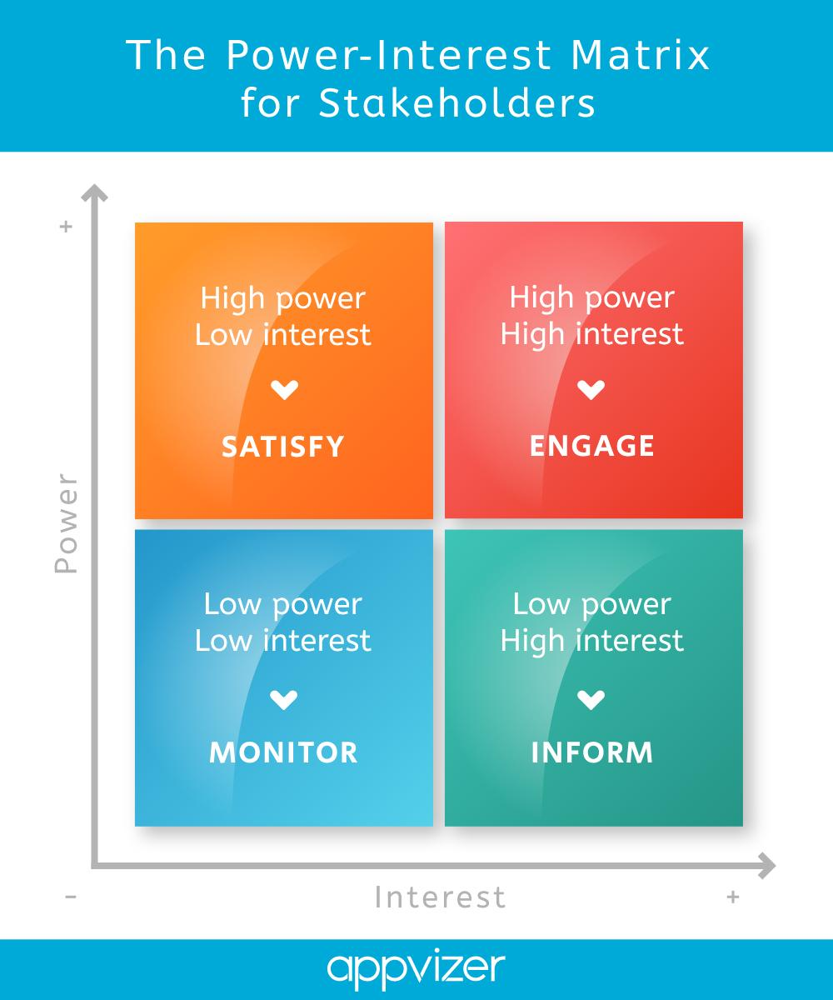
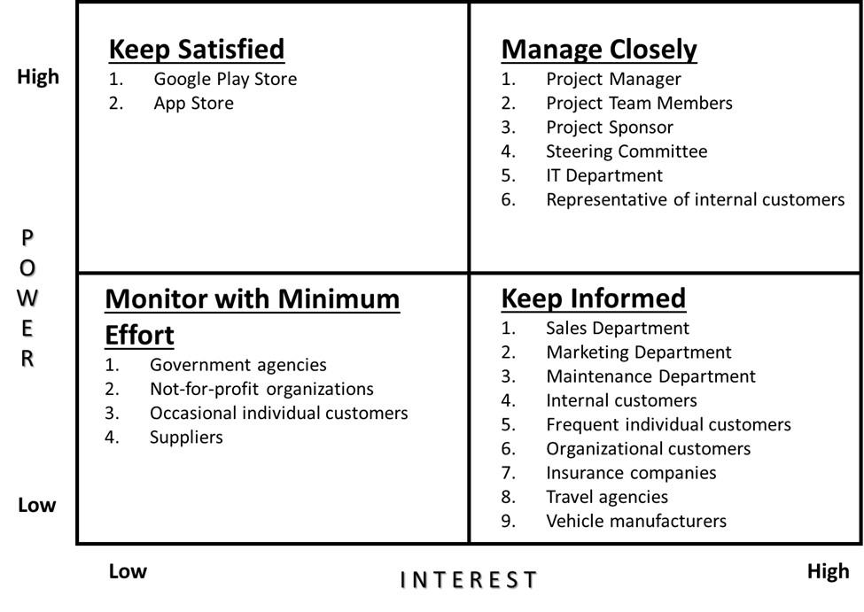
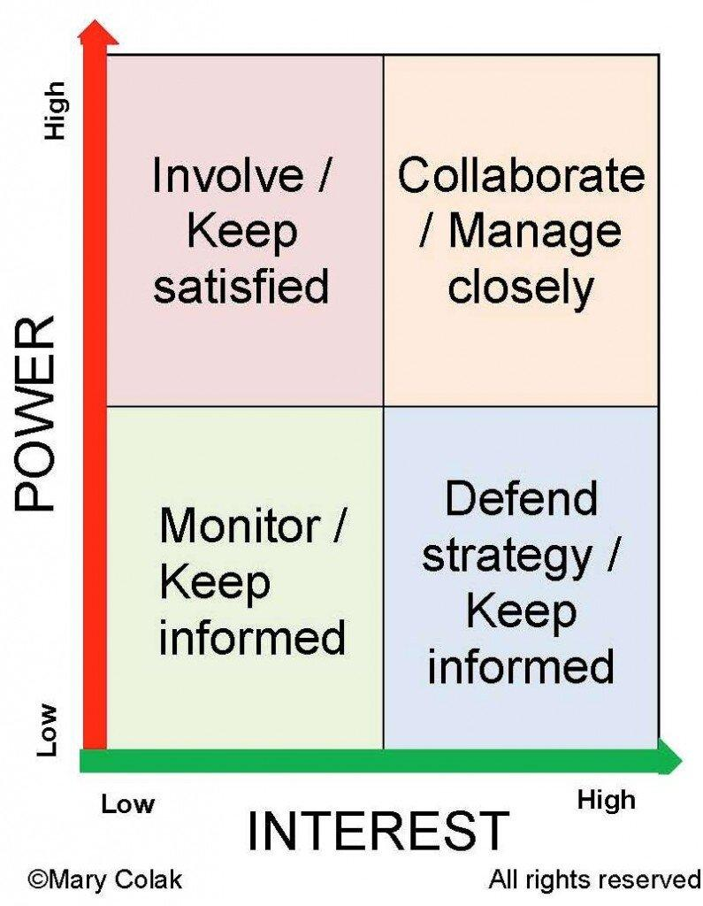

# Agile Masterclass_M4 (43-71)

Agile Masterclass -- Module 4

**Lesson 43: Agile Requirements Management -- User Story Mapping,
Personas, Customer Journey Maps, MVP & Idea-to-Product Process**

This lesson is highly important for your target path:

**Pharmacology Domain Expert → Healthcare Business Analyst → AI Product
Analyst → Product Manager**

Because Product Managers and BAs spend a lot of time converting:

**Business Problem → User Need → Product Solution → Agile Requirements**

**1. What is Agile Requirements Management?**

In traditional projects, requirements are collected once at the
beginning.

Example:

Requirement Document

↓

Development

↓

Testing

↓

Release

Problem:

By the time the product is delivered:

-   Customer needs may change

-   Market may change

-   Business priorities may change

Agile approach:

Requirements continuously evolve.

Idea

↓

User Research

↓

User Stories

↓

Backlog

↓

Sprint Development

↓

Feedback

↓

Improvement

**2. Understanding User Needs Before Building**

A Product Manager does not start with:

❌ \"What feature should we build?\"

Instead asks:

✅ \"What problem are users facing?\"

Example:

Healthcare Problem:

PV associates spend 5 hours manually extracting adverse events from
reports.

Wrong thinking:

\"Build AI extraction.\"

Better thinking:

\"How can we reduce manual case processing time?\"

Solution:

AI extraction feature.

**3. Personas**

**What is a Persona?**

A persona is a fictional representation of a real user group.

It helps teams understand:

-   Who is using the product?

-   What are their goals?

-   What problems do they face?

**Example: AI Pharmacovigilance Platform Personas**

**Persona 1: PV Associate**

Name:

\"Priya\"

Role:

Safety Case Processor

Goals:

-   Process cases faster

-   Reduce manual work

Pain Points:

-   Reading hundreds of PDFs

-   Manual data entry

-   Duplicate cases

Needs:

-   AI extraction

-   Case automation

**Persona 2: Safety Manager**

Goals:

-   Monitor compliance

-   Ensure quality

Pain Points:

-   Missing deadlines

-   Lack of visibility

Needs:

-   Compliance dashboard

-   Reports

**Persona 3: Regulatory Auditor**

Goals:

-   Verify compliance

Needs:

-   Complete audit trail

-   Historical records

**4. User Journey Map**

**What is a Customer Journey Map?**

It shows the user\'s experience step-by-step.

Example:

PV Case Processing Journey:

Receive Report

↓

Review Document

↓

Extract Data

↓

Code Events

↓

Medical Review

↓

Submit Report

**Pain Points**

  -----------------------------------------------------------------------
  **Stage**                           **Problem**
  ----------------------------------- -----------------------------------
  Receive Report                      Multiple sources

  Review Document                     Time consuming

  Extraction                          Manual entry

  Coding                              Requires expertise

  Submission                          Deadline pressure
  -----------------------------------------------------------------------

Product opportunities:

-   AI extraction

-   Automated coding

-   Compliance alerts

**5. User Story Mapping**

**What is User Story Mapping?**

A visual way to organize product features according to the user journey.

It answers:

\"What does the user do, and what features support each activity?\"

Example:

AI PV Platform Story Map:

**User Activity:**

Process Safety Case

↓

**Steps:**

  -----------------------------------------------------------------------
  **Activity**         **User Stories**
  -------------------- --------------------------------------------------
  Login                As a PV associate, I want secure login

  Upload Report        I want to upload documents

  Extract Data         I want AI extraction

  Review Case          I want to verify extracted data

  Code Event           I want MedDRA suggestions

  Submit Case          I want regulatory submission
  -----------------------------------------------------------------------

**6. Epic → Feature → User Story Mapping**

Hierarchy:

Product Goal

↓

Epic

↓

Feature

↓

User Story

↓

Task

Example:

**Product Goal:**

Reduce PV processing time by 50%

↓

**Epic:**

AI-Assisted Case Processing

↓

**Features:**

1.  Document Upload

2.  AI Extraction

3.  Duplicate Detection

↓

**User Story:**

\"As a PV associate, I want AI to extract adverse events so that I can
process cases faster.\"

↓

**Tasks:**

-   Build upload API

-   Train extraction model

-   Create validation screen

**7. MVP (Minimum Viable Product)**

**What is MVP?**

MVP is the smallest version of a product that solves a real user problem
and allows learning from users.

Important:

MVP is NOT:

❌ A poor-quality product

It is:

✅ Minimum features required to validate value

**Example: Healthcare AI Platform**

**Full Vision:**

Complete PV automation platform:

-   AI extraction

-   MedDRA coding

-   Signal detection

-   Literature screening

-   Compliance analytics

-   Regulatory submission

**MVP Version:**

Only:

1.  User login

2.  Upload safety report

3.  AI extract key fields

4.  Human review

Why?

Because the main hypothesis:

\"Can AI reduce manual case entry time?\"

**8. MVP vs Final Product**

  -----------------------------------------------------------------------
  **MVP**                          **Final Product**
  -------------------------------- --------------------------------------
  Validate idea                    Scale solution

  Few features                     Complete features

  Learn from users                 Optimize experience

  Fast launch                      Long-term roadmap
  -----------------------------------------------------------------------

**9. Product Discovery Process**

How Product Managers convert ideas into products:

**Step 1: Identify Problem**

Example:

\"PV teams spend too much time processing cases.\"

**Step 2: Understand Users**

Research:

-   Interviews

-   Surveys

-   Observation

**Step 3: Define Problem Statement**

Example:

\"PV associates need a faster way to extract safety data from reports.\"

**Step 4: Define Solution**

Possible solution:

AI-powered extraction.

**Step 5: Create MVP**

Build minimum version.

**Step 6: Measure Results**

Metrics:

-   Processing time reduced

-   User adoption

-   Accuracy

**Step 7: Improve Product**

Add:

-   Coding automation

-   Signal detection

-   Analytics

**10. Problem Statement Framework**

A good problem statement:

\[User\] needs a way to \[goal\] because \[problem\].

Example:

PV associates need a way to automatically extract adverse event
information because manual review of safety reports consumes significant
time.

**11. Feature Prioritization Using User Value**

Example:

User feedback:

\"Need AI chatbot.\"

Before building, ask:

Does it solve a major problem?

Compare:

Feature A:

AI extraction

Impact:

Save 5 hours/day

Feature B:

AI chatbot

Impact:

Answer basic questions

Priority:

AI extraction first.

**12. BA/Product Manager Role in Requirements**

A BA/Product Manager converts:

**Stakeholder Language:**

\"We need better pharmacovigilance automation.\"

↓

**Product Requirement:**

\"As a PV associate, I want AI-assisted case processing so that manual
workload decreases.\"

↓

**Acceptance Criteria:**

-   Extract patient details

-   Extract drug details

-   Identify adverse events

**13. Interview Questions**

**Q1. What is MVP?**

Answer:

\"MVP is the smallest version of a product that delivers enough value to
solve a user problem and helps validate assumptions through user
feedback.\"

**Q2. Difference between Epic and User Story?**

Answer:

\"An Epic is a large business capability, while a User Story is a small,
actionable requirement that can be completed within a sprint.\"

**Q3. Why create personas?**

Answer:

\"Personas help teams understand target users, their goals, pain points
and behaviors so that products are designed around real needs.\"

**Practical Exercise**

For your **AI Pharmacovigilance Platform**, create:

**Persona:**

PV Associate

Write:

1.  Goals:

2.  Pain Points:

3.  Needs:

**MVP:**

Choose only 4 features for first release.

**User Journey:**

Write steps from:

\"Receiving adverse event report\"

to

\"Final case submission\"

**Key Takeaways**

After Lesson 43:

✅ You can convert business problems into Agile requirements\
✅ You understand users before building features\
✅ You can create MVPs\
✅ You understand how Product Managers think

**Lesson 44: Agile Risk Management -- Risk Identification, Risk Matrix,
Mitigation Strategies, Dependencies & Managing Uncertainty**

Risk management is a very important skill for:

-   Business Analysts

-   Product Owners

-   Product Managers

-   Project Managers

A good Agile professional does not wait for problems to happen.

They continuously ask:

\"What can stop us from delivering value, and how can we reduce that
risk?\"

**1. What is Risk in Agile?**

**Definition:**

A **risk** is an uncertain event that may negatively impact:

-   Product delivery

-   Quality

-   Budget

-   Timeline

-   Customer satisfaction

Example:

AI Pharmacovigilance Platform:

Risk:

\"AI extraction accuracy may be below regulatory expectations.\"

Impact:

-   More manual review

-   Delayed case processing

-   Compliance issues

**2. Risk vs Issue**

Very common interview question.

**Risk**

Something that **may happen in future**.

Example:

\"The AI vendor API may become unavailable.\"

**Issue**

Something that **has already happened**.

Example:

\"The AI API is currently down.\"

Comparison:

  -----------------------------------------------------------------------
  **Risk**                            **Issue**
  ----------------------------------- -----------------------------------
  Future possibility                  Current problem

  Preventive action                   Corrective action

  Uncertain                           Known
  -----------------------------------------------------------------------

**3. Types of Risks in Product Development**

**1. Business Risk**

Risk affecting business goals.

Example:

-   Customers may not adopt product

-   Competitor launches similar product

**2. Technical Risk**

Risk related to technology.

Example:

-   AI model accuracy problems

-   Database performance issues

-   Integration failures

**3. Operational Risk**

Risk affecting daily operations.

Example:

-   Lack of trained users

-   Poor support process

**4. Compliance Risk**

Very important in healthcare.

Example:

-   Regulatory requirements not followed

-   Missing audit trail

-   Data privacy violation

**5. Resource Risk**

Risk due to people or capacity.

Example:

-   Developer shortage

-   Domain expert unavailable

**4. Agile Risk Management Process**

The cycle:

Identify Risk

↓

Analyze Risk

↓

Prioritize Risk

↓

Create Mitigation Plan

↓

Monitor Risk

**5. Risk Identification**

How do teams identify risks?

**1. Brainstorming**

Team discusses possible problems.

Example:

Before building AI extraction:

Questions:

-   Is training data available?

-   Is accuracy acceptable?

-   Can users trust AI output?

**2. Stakeholder Feedback**

Users highlight risks.

Example:

PV Manager:

\"Regulators require complete traceability.\"

Risk identified:

Need audit logs.

**3. Previous Experience**

Past project lessons.

Example:

Previous projects failed because:

-   Requirements changed frequently

Risk:

Unclear requirements.

**6. Risk Assessment: Probability and Impact**

Every risk has two dimensions:

**Probability**

How likely is it?

Scale:

1 = Very Low

5 = Very High

**Impact**

How serious if it happens?

Scale:

1 = Low

5 = Critical

**7. Risk Matrix**

Formula:

Risk Score = Probability × Impact

Example:

  --------------------------------------------------------------------------
  **Risk**                       **Probability**    **Impact**   **Score**
  ------------------------------ ------------------ ------------ -----------
  AI accuracy issue              4                  5            20

  UI delay                       3                  2            6

  User training issue            3                  3            9
  --------------------------------------------------------------------------

Priority:

Higher score = More attention

**8. Risk Categories**

**High Risk**

Score:

15-25

Action:

Immediate mitigation

Example:

AI accuracy below regulatory requirement

**Medium Risk**

Score:

6-14

Action:

Monitor and prepare plan

**Low Risk**

Score:

1-5

Action:

Accept and monitor

**9. Risk Mitigation Strategies**

There are four common strategies.

**1. Avoid**

Remove the cause of risk.

Example:

Risk:

New untested AI technology

Solution:

Use proven AI framework.

**2. Reduce / Mitigate**

Reduce probability or impact.

Example:

Risk:

AI extraction errors

Mitigation:

-   Add human review

-   Improve training data

-   Monitor accuracy

**3. Transfer**

Move responsibility to another party.

Example:

Risk:

Cloud infrastructure failure

Solution:

Use managed cloud provider SLA.

**4. Accept**

Accept risk when cost of prevention is higher.

Example:

Minor UI delay.

**10. Example: AI Pharmacovigilance Risk Register**

A risk register is a document tracking risks.

  -----------------------------------------------------------------------------------
  **Risk**                   **Probability**   **Impact**   **Mitigation**
  -------------------------- ----------------- ------------ -------------------------
  AI extraction inaccurate   High              High         Human validation workflow

  Regulatory changes         Medium            High         Compliance monitoring

  Database performance       Medium            Medium       Optimization and testing
  issues                                                    

  User adoption problems     Medium            Medium       Training program
  -----------------------------------------------------------------------------------

**11. Dependencies in Agile**

**What is Dependency?**

A dependency means:

One task or team relies on another task or team.

Example:

AI Extraction Feature:

Depends on:

-   Document upload module

-   OCR service

-   AI model availability

**Types of Dependencies**

**1. Technical Dependency**

Example:

Frontend depends on backend API.

**2. External Dependency**

Example:

AI model provider API.

**3. Team Dependency**

Example:

Development team needs regulatory expert input.

**4. Data Dependency**

Example:

AI model needs historical safety reports.

**12. Managing Dependencies**

Agile teams handle dependencies by:

**Early Identification**

Identify before sprint starts.

**Dependency Tracking**

Maintain list:

  ------------------------------------------------------------------------
  **Dependency**                  **Owner**           **Status**
  ------------------------------- ------------------- --------------------
  OCR API                         AI Team             Pending

  ------------------------------------------------------------------------

**Collaboration**

Frequent communication between teams.

**13. Managing Uncertainty in Agile**

Agile accepts that uncertainty exists.

Instead of trying to predict everything:

Agile uses:

-   Short sprints

-   Frequent feedback

-   Incremental delivery

Example:

Instead of spending 12 months building complete AI platform:

Build:

Sprint 1:

PDF upload

Sprint 2:

AI extraction

Sprint 3:

Validation

Sprint 4:

Automation

**14. Risk Management in Scrum Events**

**Sprint Planning**

Identify:

-   Technical risks

-   Dependencies

**Daily Scrum**

Discuss:

-   New blockers

-   Emerging risks

**Sprint Review**

Collect:

-   Customer risks

-   Business feedback

**Retrospective**

Improve:

-   Process risks

**15. Role of BA/Product Manager in Risk Management**

A BA/Product Manager should:

**Identify**

\"What can prevent success?\"

**Analyze**

\"How serious is it?\"

**Communicate**

\"Who needs to know?\"

**Mitigate**

\"What action reduces risk?\"

**16. Interview Questions**

**Q1. Difference between risk and issue?**

Answer:

\"A risk is a possible future event that may affect the project, while
an issue is a problem that has already occurred.\"

**Q2. How do you prioritize risks?**

Answer:

\"I evaluate risks based on probability and impact, calculate risk
priority, and focus first on high-impact risks.\"

**Q3. How does Agile handle uncertainty?**

Answer:

\"Agile manages uncertainty through iterative development, frequent
feedback, incremental delivery and continuous adaptation.\"

**Practical Exercise**

For your **AI Pharmacovigilance Platform**, create a risk register:

Identify 5 risks:

  ------------------------------------------------------------------------------
  **Risk**                       **Probability**   **Impact**   **Mitigation**
  ------------------------------ ----------------- ------------ ----------------
  AI accuracy                    ?                 ?            ?

  Data privacy                   ?                 ?            ?

  Regulatory compliance          ?                 ?            ?

  User adoption                  ?                 ?            ?

  System performance             ?                 ?            ?
  ------------------------------------------------------------------------------

**Key Takeaways**

After Lesson 44:

✅ You understand Agile risk management\
✅ You can create a risk register\
✅ You understand risk vs issue\
✅ You can handle uncertainty like a Product Manager\
✅ You can discuss risks confidently in interviews

**Lesson 45: Agile Product Roadmap -- Vision, Strategy, Themes, Release
Planning, OKRs & Product Direction**

This lesson is extremely important for your target path:

**Pharmacology Expert → Healthcare BA → AI Product Analyst → Product
Manager**

Because a Product Manager\'s main responsibility is not only managing
features.

A Product Manager answers:

\"Where are we going, why are we going there, and what should we build
first?\"

A **Product Roadmap** communicates that direction.

**1. What is a Product Roadmap?**

**Definition:**

A Product Roadmap is a high-level strategic plan that shows:

-   Product vision

-   Major goals

-   Key initiatives

-   Expected releases

-   Business priorities

It tells stakeholders:

\"What are we building and why?\"

Important:

A roadmap is **not a fixed project plan**.

It can change based on:

-   Customer feedback

-   Market changes

-   Technology changes

-   Business priorities

**2. Product Roadmap Hierarchy**

The structure:

Product Vision

↓

Product Strategy

↓

Product Roadmap

↓

Themes / Initiatives

↓

Features

↓

User Stories

↓

Tasks

**3. Product Vision**

**What is Product Vision?**

The long-term purpose of the product.

It answers:

\"What future are we trying to create?\"

Example:

**AI Pharmacovigilance Platform Vision:**

\"To create an intelligent safety platform that reduces drug safety
processing time and improves patient safety through AI automation.\"

A good vision is:

-   Long-term

-   Inspiring

-   User-focused

**4. Product Strategy**

Vision says:

**Where we want to go**

Strategy says:

**How we will get there**

Example:

Vision:

\"Improve pharmacovigilance using AI.\"

Strategy:

1.  Automate manual case processing

2.  Improve regulatory compliance

3.  Reduce safety review time

4.  Provide predictive insights

**5. Product Themes**

**What are Themes?**

Themes are large areas of investment.

They connect strategy with features.

Example:

AI PV Platform Themes:

**Theme 1:**

Automation

Features:

-   AI data extraction

-   Duplicate detection

-   Auto coding

**Theme 2:**

Compliance

Features:

-   Audit trail

-   Regulatory reports

-   Compliance dashboard

**Theme 3:**

Intelligence

Features:

-   Signal detection

-   Trend analysis

**6. Roadmap Example: AI Pharmacovigilance Platform**

**Phase 1: Foundation (0--3 Months)**

Goal:

Create basic case processing system.

Features:

✅ Login\
✅ User management\
✅ Case creation\
✅ Document upload

**Phase 2: AI Automation (3--6 Months)**

Goal:

Reduce manual processing.

Features:

✅ AI extraction\
✅ Duplicate detection\
✅ MedDRA suggestions

**Phase 3: Advanced Intelligence (6--12 Months)**

Goal:

Predictive safety analytics.

Features:

✅ Signal detection\
✅ Literature monitoring\
✅ AI safety assistant

**7. Roadmap vs Backlog**

Very common interview question.

**Product Roadmap**

High-level direction.

Example:

\"Build AI automation capabilities.\"

**Product Backlog**

Detailed work items.

Example:

-   Create upload API

-   Build extraction model

-   Add validation screen

Comparison:

  -----------------------------------------------------------------------
  **Roadmap**                    **Backlog**
  ------------------------------ ----------------------------------------
  Strategic                      Execution-focused

  Months/Years                   Sprint level

  High-level                     Detailed
  -----------------------------------------------------------------------

**8. Release Planning**

**What is Release Planning?**

Deciding:

-   What features go into a release?

-   When will users get them?

-   What business goal does it support?

Example:

**Release 1.0**

Goal:

\"Enable digital safety case management\"

Includes:

-   Login

-   Case creation

-   Document upload

**Release 2.0**

Goal:

\"Reduce manual processing\"

Includes:

-   AI extraction

-   Duplicate detection

**9. MVP Roadmap**

For startups, roadmap often begins with MVP.

Example:

**MVP (Month 1--3)**

Only critical value:

Upload Report

↓

AI Extraction

↓

Human Validation

↓

Create Case

Later:

Add:

-   Automation

-   Analytics

-   Integrations

**10. OKRs (Objectives and Key Results)**

Modern Product Managers use OKRs.

**Objective**

What do we want to achieve?

**Key Results**

How will we measure success?

Example:

**Objective:**

Improve pharmacovigilance processing efficiency.

Key Results:

KR1:

Reduce average case processing time by 40%

KR2:

Achieve 95% extraction accuracy

KR3:

Reduce manual data entry by 60%

**11. Roadmap Metrics**

A roadmap should be measured.

Examples:

**User Metrics**

-   Active users

-   Adoption rate

**Business Metrics**

-   Revenue

-   Cost reduction

**Product Metrics**

-   Feature usage

-   Conversion rate

**Quality Metrics**

-   Error rate

-   Customer complaints

**12. Communicating Roadmap to Stakeholders**

Different stakeholders need different views.

**Executives**

Need:

-   Business impact

-   Revenue

-   Strategy

**Developers**

Need:

-   Features

-   Dependencies

-   Technical planning

**Customers**

Need:

-   Benefits

-   Release expectations

**13. Roadmap Prioritization**

Before adding anything:

Ask:

**Customer Value**

Does it solve a real problem?

**Business Impact**

Does it support company goals?

**Effort**

Can we build it?

**Risk**

Is it feasible?

**14. Example Product Decision**

Request:

\"Add AI chatbot.\"

Should we immediately build?

Analyze:

Customer need:

Medium

Impact:

Medium

Effort:

High

Another request:

\"Automate adverse event extraction.\"

Customer need:

Very High

Impact:

High

Effort:

Medium

Priority:

AI extraction first.

**15. Role of BA/Product Manager in Roadmap**

A BA/Product Manager:

**Defines**

-   User problems

-   Requirements

**Analyzes**

-   Market needs

-   Customer feedback

**Prioritizes**

-   Features

-   Releases

**Communicates**

-   Product direction

**16. Interview Questions**

**Q1. What is a product roadmap?**

Answer:

\"A product roadmap is a strategic document that communicates product
vision, goals, initiatives and planned evolution of a product over
time.\"

**Q2. Difference between roadmap and backlog?**

Answer:

\"A roadmap provides strategic direction, while a backlog contains
detailed actionable items required to execute that strategy.\"

**Q3. How do you prioritize roadmap items?**

Answer:

\"I prioritize based on customer value, business impact, strategic
alignment, effort, risk and available resources.\"

**Practical Exercise**

Create a roadmap for your:

**AI Pharmacovigilance Platform**

Create:

**Vision:**

**3 Product Themes:**

1.  
2.  
3.  

**Phase 1 (MVP):**

Select 5 features.

**Phase 2:**

Select 5 advanced features.

**OKRs:**

Objective:

Key Results:

1.  
2.  
3.  

**Key Takeaways**

After Lesson 45:

✅ You understand product vision\
✅ You can create a roadmap\
✅ You understand strategy vs execution\
✅ You know OKRs\
✅ You can think like a Product Manager

**Lesson 46: Agile Stakeholder Management -- Stakeholder Identification,
Communication Strategy, Conflict Management & Business Collaboration**

This lesson is very important for:

-   Business Analysts

-   Product Managers

-   Product Owners

-   Project Managers

Because a product succeeds not only because of technology, but because
the right people are aligned.

A Product Manager spends a large amount of time communicating with:

-   Customers

-   Business teams

-   Developers

-   Designers

-   QA teams

-   Leadership

-   Compliance teams

**1. What is a Stakeholder?**

**Definition:**

A stakeholder is any person, group, or organization that:

-   Influences the product

-   Uses the product

-   Is affected by the product

Example:

AI Pharmacovigilance Platform stakeholders:

Patients

\|

Pharmacovigilance Team

\|

Safety Managers

\|

Regulatory Authorities

\|

IT Team

\|

Product Team

**2. Types of Stakeholders**

**Internal Stakeholders**

People inside the organization.

Examples:

**Product Team**

Needs:

-   Product direction

-   User feedback

**Developers**

Needs:

-   Clear requirements

-   Technical priorities

**QA Team**

Needs:

-   Acceptance criteria

-   Testing scenarios

**Leadership**

Needs:

-   Business impact

-   ROI

-   Progress

**External Stakeholders**

Outside the organization.

Examples:

**Customers**

Needs:

-   Product value

-   Problem solving

**Regulatory Bodies**

Healthcare example:

Need:

-   Compliance

-   Auditability

-   Safety standards

**Vendors**

Example:

AI service providers.

Need:

-   Integration requirements

**3. Stakeholder Analysis**

Not every stakeholder has equal influence.

A Product Manager analyzes:

1.  Power

2.  Interest

**Power-Interest Matrix**

{width="6.5in" height="7.8in"}

{width="6.5in" height="4.606944444444444in"}

{width="6.5in" height="8.370138888888889in"}

4

Four categories:

**1. High Power + High Interest**

**Manage Closely**

These are most important.

Example:

Product Owner

Healthcare Compliance Head

Actions:

-   Regular meetings

-   Frequent updates

**2. High Power + Low Interest**

**Keep Satisfied**

Example:

CEO

They may not want daily details.

Provide:

-   Monthly reports

-   Business updates

**3. Low Power + High Interest**

**Keep Informed**

Example:

End users

Provide:

-   Product updates

-   Feedback sessions

**4. Low Power + Low Interest**

**Monitor**

Example:

Occasional users

**4. Stakeholder Communication Strategy**

Different stakeholders need different information.

**Developers**

Need:

-   User stories

-   Acceptance criteria

-   Technical discussions

Communication:

Daily collaboration

**Executives**

Need:

-   Progress

-   Business outcomes

-   Risks

Communication:

Monthly roadmap updates

**Customers**

Need:

-   Feature updates

-   Issue resolution

Communication:

Feedback sessions

**Compliance Team**

Need:

-   Regulatory impact

-   Audit readiness

Communication:

Review meetings

**5. Communication Plan Example**

AI Pharmacovigilance Platform:

  ------------------------------------------------------------------------
  **Stakeholder**     **Information**              **Frequency**
  ------------------- ---------------------------- -----------------------
  Developers          Requirements                 Daily

  QA                  Testing criteria             Sprint meetings

  PV Managers         Feature feedback             Weekly

  Leadership          Roadmap progress             Monthly

  Compliance          Regulatory updates           Monthly
  ------------------------------------------------------------------------

**6. Managing Stakeholder Expectations**

A common Product Manager challenge:

Stakeholder says:

\"We need this feature immediately.\"

But:

-   Team capacity is limited

-   Other priorities exist

Wrong response:

❌ \"No, we cannot do it.\"

Better response:

✅ Understand the reason.

Ask:

-   What problem does this solve?

-   How many users need it?

-   What is the business impact?

-   What is the urgency?

Then prioritize.

**7. Handling Conflicts**

Conflict is normal in Agile.

Examples:

**Conflict 1:**

Business wants more features.

Developers say:

\"Too much workload.\"

Solution:

Use prioritization.

Discuss:

-   Value

-   Effort

-   Timeline

**Conflict 2:**

QA rejects feature.

Developer says:

\"It works.\"

Solution:

Refer to:

-   Acceptance criteria

-   Definition of Done

**Conflict 3:**

Compliance wants additional controls.

Business says:

\"It delays release.\"

Solution:

Balance:

-   Speed

-   Regulatory risk

**8. Conflict Resolution Techniques**

**1. Collaborate**

Find win-win solution.

Example:

Add compliance controls without delaying core release.

**2. Compromise**

Both sides adjust.

Example:

Release basic version now, advanced compliance later.

**3. Avoid**

Use when conflict is minor.

**4. Escalate**

Use when decision authority is required.

**9. Stakeholder Feedback Management**

Feedback is valuable, but not every request becomes a feature.

Process:

Feedback

↓

Understand Problem

↓

Analyze Impact

↓

Prioritize

↓

Add to Backlog (if valuable)

Example:

User request:

\"Add dark mode.\"

Ask:

Why?

Answer:

\"Users work at night.\"

Alternative solution:

Improve screen readability.

**10. Voice of Customer (VOC)**

Product Managers capture customer needs through:

-   Interviews

-   Surveys

-   Support tickets

-   Analytics

-   User testing

Example:

PV Associate feedback:

\"I spend most time correcting extracted data.\"

Insight:

AI accuracy improvement becomes priority.

**11. Stakeholder Management in Scrum Events**

**Sprint Planning**

Stakeholder input:

-   Business priorities

**Sprint Review**

Stakeholders provide:

-   Feedback

-   New requirements

**Retrospective**

Internal team improves:

-   Collaboration

**12. Role of Business Analyst in Stakeholder Management**

A BA acts as a bridge:

Business Team

\|

\|

Business Analyst

\|

\|

Development Team

BA responsibilities:

-   Understand business needs

-   Clarify requirements

-   Resolve ambiguity

-   Document decisions

-   Manage expectations

**13. Real Healthcare Example**

Stakeholder:

Regulatory team

Request:

\"Every case modification should be tracked.\"

Business impact:

Additional compliance requirement.

BA converts:

Business request:

\"Need tracking.\"

↓

User Story:

\"As a compliance reviewer, I want complete audit history so that all
case changes are traceable.\"

↓

Acceptance Criteria:

-   Store old value

-   Store new value

-   Record user and timestamp

**14. Interview Questions**

**Q1. How do you handle conflicting stakeholder requirements?**

Answer:

\"I understand the underlying business need, analyze impact, prioritize
based on value and constraints, and facilitate discussion to reach
alignment.\"

**Q2. How do you manage difficult stakeholders?**

Answer:

\"I maintain transparent communication, understand their concerns,
provide data-driven decisions and set clear expectations.\"

**Q3. What is the role of BA between business and development?**

Answer:

\"The BA acts as a bridge by translating business problems into clear
requirements that development teams can implement.\"

**Practical Exercise**

For your AI Pharmacovigilance Platform:

Identify 6 stakeholders.

Create:

  --------------------------------------------------------------------------------
  **Stakeholder**        **Power**   **Interest**   **Communication Approach**
  ---------------------- ----------- -------------- ------------------------------
  PV Associate           ?           ?              ?

  Safety Manager         ?           ?              ?

  Developer              ?           ?              ?

  Compliance Officer     ?           ?              ?

  CEO                    ?           ?              ?

  Patient/User           ?           ?              ?
  --------------------------------------------------------------------------------

**Key Takeaways**

After Lesson 46:

✅ You understand stakeholder analysis\
✅ You can manage expectations\
✅ You can handle conflicts\
✅ You understand BA/Product communication\
✅ You can work with healthcare business teams

**Lesson 47: Agile Change Management -- Handling Requirement Changes,
Change Requests, Scope Management & Embracing Change**

This lesson is critical because in real-world products:

Requirements will change. Customers will change their minds. Markets
will change.

Agile does not try to prevent change.

Agile creates a process to **manage change intelligently**.

**1. What is Change Management in Agile?**

**Definition:**

Agile Change Management is the process of handling changes to:

-   Product requirements

-   User stories

-   Priorities

-   Scope

-   Timeline

while continuing to deliver business value.

Traditional approach:

Requirement Fixed

↓

Development

↓

Testing

↓

Release

Change is expensive.

Agile approach:

Plan

↓

Build

↓

Feedback

↓

Adapt

↓

Improve

Change is expected.

**2. Why Do Requirements Change?**

Common reasons:

**1. Customer Feedback**

Example:

Users say:

\"AI extraction is useful, but we need confidence scores.\"

New requirement:

Add AI confidence percentage.

**2. Market Changes**

Example:

Competitor launches better automation.

Need:

Improve product capability.

**3. Regulatory Changes**

Very important in healthcare.

Example:

New pharmacovigilance reporting requirement.

Need:

Update compliance module.

**4. Business Priority Changes**

Example:

Company decides:

\"Mobile app is more important than analytics.\"

Roadmap changes.

**5. New Learning**

During development:

Team discovers:

Original solution is not optimal.

**3. Change Request Process in Agile**

A change should not directly enter development.

Process:

Change Request

↓

Understand Reason

↓

Analyze Impact

↓

Prioritize

↓

Update Backlog

↓

Schedule Sprint

**4. Example: AI Pharmacovigilance Change Request**

Original Requirement:

\"AI extracts adverse event information from PDF reports.\"

New Request:

\"AI should also classify seriousness criteria automatically.\"

Analysis:

**Business Value:**

High

Why?

Reduces reviewer effort.

**Impact:**

Requires:

-   AI model update

-   New validation rules

-   Additional testing

Decision:

Add to Product Backlog.

Priority:

High.

**5. Change Impact Analysis**

Before accepting change, analyze:

**1. Business Impact**

Question:

Will this improve customer value?

Example:

Reduce case processing time.

**2. Technical Impact**

Question:

How much development effort?

Example:

Requires new AI model.

**3. Timeline Impact**

Question:

Will release date change?

**4. Cost Impact**

Question:

Additional resources needed?

**5. Risk Impact**

Question:

Does it introduce new risks?

**6. Agile Scope Management**

**What is Scope?**

Scope defines:

\"What is included and excluded from the product.\"

Example:

AI PV MVP Scope:

Included:

✅ Document upload\
✅ AI extraction\
✅ Human validation

Not included:

❌ Automated regulatory submission\
❌ Predictive safety signals

**7. Scope Creep**

**Definition:**

Scope creep means uncontrolled addition of features without proper
evaluation.

Example:

Original:

\"Build appointment booking system.\"

Later:

Add:

-   Chat

-   Video consultation

-   Payment

-   Insurance integration

-   Medical records

Without changing timeline.

Problem:

Project becomes delayed.

**8. Agile Does Not Mean Unlimited Change**

Common misunderstanding:

❌ \"Agile accepts every change immediately.\"

Wrong.

Correct:

✅ Agile welcomes valuable changes but manages them through
prioritization.

**9. Managing Changes During Sprint**

Important Scrum rule:

Once sprint starts:

The Sprint Goal should remain stable.

Example:

Sprint Goal:

\"Build AI document upload workflow.\"

New request:

\"Add dashboard charts.\"

Should it enter current sprint?

Usually:

No.

Move to Product Backlog.

Why?

Because constant changes reduce focus.

**10. Product Backlog Reprioritization**

The Product Owner continuously adjusts backlog.

Example:

Before:

  -----------------------------------------------------------------------
  **Priority**                **Feature**
  --------------------------- -------------------------------------------
  1                           Dashboard

  2                           AI Extraction

  3                           Reports
  -----------------------------------------------------------------------

New customer feedback:

AI Extraction becomes more valuable.

After:

  -----------------------------------------------------------------------
  **Priority**                **Feature**
  --------------------------- -------------------------------------------
  1                           AI Extraction

  2                           Reports

  3                           Dashboard
  -----------------------------------------------------------------------

**11. Change Management Techniques**

**1. Data-Based Decision Making**

Use:

-   User feedback

-   Analytics

-   Market research

**2. Prioritization Frameworks**

Use:

-   MoSCoW

-   RICE

-   Value vs Effort

**3. Communication**

Inform:

-   Developers

-   Stakeholders

-   Customers

**4. Incremental Delivery**

Instead of big changes:

Deliver smaller improvements.

**12. Role of Business Analyst in Change Management**

A BA helps by:

**Understanding Change**

\"What problem is this solving?\"

**Impact Analysis**

\"What requirements are affected?\"

**Documentation**

Update:

-   User stories

-   Acceptance criteria

-   Process documents

**Communication**

Ensure everyone understands change.

**13. Real Healthcare Example**

Situation:

Regulatory authority introduces new adverse event reporting field.

Old system:

Fields:

-   Drug

-   Event

-   Patient

New requirement:

Add:

-   Reporter qualification

BA Action:

1.  Analyze regulatory impact

2.  Create user story

Example:

\"As a PV associate, I want to capture reporter qualification so that
regulatory submissions meet compliance requirements.\"

3.  Add acceptance criteria

4.  Prioritize in backlog

**14. Interview Questions**

**Q1. How does Agile handle changing requirements?**

Answer:

\"Agile welcomes changing requirements through continuous backlog
refinement, prioritization and iterative delivery. Changes are evaluated
based on value and impact before implementation.\"

**Q2. What is scope creep?**

Answer:

\"Scope creep is uncontrolled expansion of project scope without proper
evaluation of impact on timeline, resources and goals.\"

**Q3. Can requirements change during a sprint?**

Answer:

\"Minor clarifications can happen, but major changes are usually added
to the product backlog to protect the Sprint Goal.\"

**15. Practical Exercise**

Scenario:

Your AI Pharmacovigilance Platform MVP is being developed.

Original MVP:

1.  Login

2.  Case creation

3.  PDF upload

4.  AI extraction

Stakeholder requests:

1.  Add chatbot assistant

2.  Add audit trail

3.  Add voice-based reporting

4.  Add regulatory dashboard

Classify:

**Immediate MVP:**

**Future Backlog:**

**Questions you would ask before accepting:**

1.  
2.  
3.  

**Key Takeaways**

After Lesson 47:

✅ You understand Agile change management\
✅ You know how to handle changing requirements\
✅ You understand scope creep\
✅ You can perform impact analysis\
✅ You can manage stakeholder expectations

**Lesson 48: Agile Quality Management -- QA in Agile, Testing Strategy,
TDD, Continuous Integration, Automation Testing & Quality Metrics**

Quality management is a critical Agile skill because Agile is not only
about **delivering faster**.

The real goal is:

\"Deliver valuable software quickly without compromising quality.\"

For Product Managers and Business Analysts, understanding quality helps
you write better requirements, define acceptance criteria and
communicate with QA/development teams.

**1. What is Agile Quality Management?**

Agile Quality Management is the continuous process of ensuring that:

-   Requirements are correctly implemented

-   Product works as expected

-   Bugs are minimized

-   Customer expectations are satisfied

Traditional approach:

Development

↓

Testing (End)

↓

Bug Fixing

↓

Release

Problem:

Bugs are discovered late.

Agile approach:

Requirement

↓

Development

↓

Testing

↓

Feedback

↓

Improvement

Quality is continuous.

**2. Quality is Everyone\'s Responsibility**

In Agile:

Quality is NOT only QA team\'s job.

Everyone contributes.

**Product Owner**

Ensures:

-   Correct business requirements

-   Clear acceptance criteria

**Business Analyst**

Ensures:

-   User stories are clear

-   Business rules are defined

**Developers**

Ensure:

-   Clean code

-   Unit testing

-   Technical quality

**QA Team**

Ensures:

-   Testing

-   Defect identification

-   Product validation

**3. Agile Testing Principles**

**Principle 1: Test Early**

Do not wait until the end.

Example:

Bad:

Build complete AI platform → Test after 6 months

Better:

Sprint 1:

Build login → Test login

Sprint 2:

Build upload → Test upload

**Principle 2: Continuous Testing**

Testing happens throughout development.

**Principle 3: Automation Where Useful**

Automate repetitive tests.

Example:

Login testing:

Manual:

100 times/day ❌

Automation:

Run automatically ✅

**4. Types of Testing in Agile**

**1. Unit Testing**

Testing individual components.

Usually done by developers.

Example:

Testing password validation function.

**2. Integration Testing**

Testing connection between components.

Example:

Frontend + Backend + Database

**3. System Testing**

Testing complete application.

Example:

Complete PV case processing workflow.

**4. User Acceptance Testing (UAT)**

Testing by business users.

Question:

\"Does this solve the real business problem?\"

Example:

PV Manager tests:

-   Case creation

-   Review workflow

-   Approval process

**5. Acceptance Criteria as Testing Guide**

Example User Story:

As a PV associate, I want AI to extract adverse events so that I can
process cases faster.

Acceptance Criteria:

1.  System extracts drug name

2.  System extracts event description

3.  System displays confidence score

QA converts these into test cases.

**6. Test-Driven Development (TDD)**

**What is TDD?**

Test-Driven Development means:

Write tests before writing code.

The cycle:

RED

↓

Write failing test

GREEN

↓

Write code to pass test

REFACTOR

↓

Improve code quality

Example:

Requirement:

\"Password must contain minimum 8 characters.\"

Developer first writes test:

Expected:

Password \< 8 characters → Error

Then writes code.

Benefits:

-   Better quality

-   Fewer defects

-   Clear requirements

**7. Behavior-Driven Development (BDD)**

BDD focuses on business behavior.

It uses:

Given -- When -- Then

Example:

Feature:

User Login

Scenario:

Given user has a valid account

When user enters correct password

Then user should access dashboard

BDD is useful for:

-   Product Owners

-   BAs

-   QA teams

because it connects business and technology.

**8. Continuous Integration (CI)**

**What is CI?**

Continuous Integration means developers frequently merge code changes
into a shared repository.

Without CI:

Developer A works for 3 months.

Problems:

-   Merge conflicts

-   Integration issues

With CI:

Small changes are continuously checked.

CI Process:

Developer Code

↓

Repository

↓

Automatic Build

↓

Automated Tests

↓

Feedback

**9. Continuous Delivery / Deployment**

**Continuous Delivery**

Software is always ready for release.

**Continuous Deployment**

Software automatically goes live after passing checks.

Example:

A web application:

Developer commits code

↓

Tests pass

↓

Automatically deployed

**10. Automation Testing**

Automation is useful for:

-   Repetitive tests

-   Regression testing

-   Performance testing

Example:

AI PV Platform:

Automated tests:

✅ User login\
✅ File upload\
✅ Case creation\
✅ Report generation

Manual testing remains useful for:

-   Exploratory testing

-   User experience testing

**11. Quality Metrics**

Agile teams track quality using metrics.

**1. Defect Density**

Measures:

Number of defects compared to product size.

Example:

1000 lines code

10 defects

**2. Defect Leakage**

Defects found after release.

Example:

A bug discovered by customer.

Goal:

Reduce leakage.

**3. Test Coverage**

Percentage of code tested.

Example:

80% code coverage.

**4. Escaped Defects**

Bugs reaching production.

Lower is better.

**5. Customer Satisfaction**

Measures:

-   User feedback

-   Ratings

-   Support issues

**12. Quality Management Example: AI Pharmacovigilance Platform**

Feature:

AI Duplicate Detection

**Development Quality Checks:**

Developer:

-   Algorithm works

**QA Testing:**

Check:

-   Duplicate identification accuracy

-   False positives

-   Performance

**Business Validation:**

PV Manager checks:

\"Does this reduce duplicate case processing?\"

**Release Criteria:**

Must pass:

✅ Functional testing\
✅ Security testing\
✅ Compliance validation\
✅ User acceptance testing

**13. Common Agile Quality Problems**

**Problem 1:**

Testing happens only at end.

Solution:

Continuous testing.

**Problem 2:**

Requirements unclear.

Solution:

Better user stories + acceptance criteria.

**Problem 3:**

Too many bugs.

Solution:

-   Automation

-   Code reviews

-   Better Definition of Done

**14. Role of BA/Product Manager in Quality**

A BA/Product Manager should:

**Before Development**

Create:

-   Clear user stories

-   Acceptance criteria

**During Development**

Clarify:

-   Business rules

-   Expected behavior

**During Testing**

Validate:

-   Does it solve user problem?

**Before Release**

Confirm:

-   Business acceptance

**15. Interview Questions**

**Q1. Who is responsible for quality in Agile?**

Answer:

\"Quality is the responsibility of the entire Scrum team. Developers,
QA, Product Owner and BA all contribute to delivering a quality
product.\"

**Q2. Difference between TDD and BDD?**

Answer:

\"TDD focuses on writing technical tests before code, while BDD focuses
on defining expected business behavior using scenarios understandable by
business and technical teams.\"

**Q3. What is Continuous Integration?**

Answer:

\"Continuous Integration is the practice of frequently integrating code
changes into a shared repository with automated builds and tests.\"

**Practical Exercise**

For your **AI Pharmacovigilance Platform**, create testing scenarios.

Feature:

\"AI extracts adverse event information from PDF.\"

Write:

**Acceptance Criteria:**

1.  
2.  
3.  

**Test Cases:**

1.  
2.  
3.  

**Quality Metrics:**

1.  
2.  
3.  

**Key Takeaways**

After Lesson 48:

✅ You understand Agile QA process\
✅ You know testing types\
✅ You understand TDD, BDD and CI/CD\
✅ You can work effectively with QA teams\
✅ You can define quality requirements as a BA/Product Manager

**Lesson 49: Agile Tools & Documentation -- Jira, Confluence, Backlog
Management, Sprint Boards & User Story Tracking**

Agile teams need tools to manage requirements, track progress,
collaborate and maintain transparency. In modern product teams, tools
like Jira and Confluence are commonly used for these purposes.

For a Business Analyst or Product Manager, understanding these tools is
essential because you will often create user stories, prioritize
backlogs, track sprint progress and document product knowledge.

**1. Why Agile Teams Need Tools**

Without proper tools, Agile teams may face:

-   Unclear requirements

-   Lost user stories

-   Poor visibility into progress

-   Difficulty tracking bugs and tasks

-   Communication gaps between business and technical teams

Agile tools help teams:

-   Maintain a transparent backlog

-   Track sprint work

-   Collaborate in real time

-   Store project knowledge

-   Generate reports and metrics

**2. Jira -- The Most Popular Agile Tool**

Jira is an Agile project management tool widely used by Scrum and Kanban
teams.

**What Jira Helps Teams Manage**

-   Epics -- large business objectives

-   User Stories -- small user requirements

-   Tasks -- development or QA activities

-   Bugs -- defects or issues

-   Sprints -- time-boxed development cycles

-   Backlogs -- prioritized work items

**Jira Hierarchy**

Example hierarchy

Epic: AI Pharmacovigilance Automation

↓

User Story: Upload safety report

↓

Task: Create file upload API

↓

Sub-task: Validate file format

**Common Jira Issue Types**

  -----------------------------------------------------------------------
  **Issue Type**      **Purpose**
  ------------------- ---------------------------------------------------
  Epic                Large business objective

  User Story          Feature from user perspective

  Task                Technical or support activity

  Bug                 Defect that needs fixing

  Sub-task            Smaller activity under a task
  -----------------------------------------------------------------------

**3. Creating a User Story in Jira**

A Product Owner or BA typically creates a user story with:

**Example user story**

Summary: Upload adverse event report

Description: As a PV associate, I want to upload a safety report so that
the system can process the case.

Acceptance Criteria:

-   User can upload PDF files.

-   File size limit is 10 MB.

-   System displays a success message after upload.

Story Points: 3

Priority: High

**4. Product Backlog Management in Jira**

The Product Backlog is a prioritized list of work items that may be
developed in future sprints.

**Backlog example**

  -----------------------------------------------------------------------
  **Priority**        **Backlog Item**
  ------------------- ---------------------------------------------------
  High                AI data extraction

  High                Duplicate detection

  Medium              Compliance dashboard

  Medium              Automated reports

  Low                 Dark mode
  -----------------------------------------------------------------------

**Backlog activities**

-   Add new user stories.

-   Prioritize items based on business value.

-   Refine stories with acceptance criteria.

-   Estimate effort using story points.

-   Select stories for upcoming sprints.

**5. Sprint Board in Jira**

A Sprint Board shows the status of work during a sprint.

**Typical Scrum board**

  -----------------------------------------------------------------------
  **To Do**           **In Progress**             **Done**
  ------------------- --------------------------- -----------------------
  Login feature       PDF upload API              User registration

  Case creation       AI extraction               Profile page

  Reports             Duplicate detection         Audit trail
  -----------------------------------------------------------------------

**Board statuses**

  -----------------------------------------------------------------------
  **Status**          **Meaning**
  ------------------- ---------------------------------------------------
  To Do               Work has not started

  In Progress         Work is being developed

  In Review           Work is under review or testing

  Done                Work meets Definition of Done
  -----------------------------------------------------------------------

**6. Confluence -- Documentation & Knowledge Sharing**

Confluence is a collaboration and documentation tool used to store
project knowledge.

**What is stored in Confluence?**

-   Business requirements

-   User personas

-   User story details

-   Meeting notes

-   Product roadmaps

-   Release notes

-   Process documents

-   Technical documentation

**Example Confluence page structure**

**AI Pharmacovigilance Platform**

-   Project Overview

-   Business Requirements

-   User Personas

-   User Stories

-   Acceptance Criteria

-   Sprint Notes

-   Release Documentation

**7. Jira and Confluence Together**

Jira and Confluence are often integrated.

  -----------------------------------------------------------------------
  **Jira**                      **Confluence**
  ----------------------------- -----------------------------------------
  Tracks work items             Stores detailed knowledge

  Manages sprints               Documents requirements

  Shows progress                Provides context and explanations

  Used by developers, QA and    Used by business, product and technical
  PMs                           teams
  -----------------------------------------------------------------------

**Example workflow**

Requirement documented in Confluence

↓

User story created in Jira

↓

Story linked to requirement page

↓

Development and testing tracked in Jira

**8. User Story Tracking Workflow**

Backlog

↓

Selected for Sprint

↓

In Development

↓

Testing

↓

Done

**Tracking fields in Jira**

  -----------------------------------------------------------------------
  **Field**           **Purpose**
  ------------------- ---------------------------------------------------
  Status              Current progress of the story

  Assignee            Person responsible for the work

  Priority            Business importance

  Story Points        Effort estimation

  Labels              Category or feature grouping

  Comments            Discussion and updates
  -----------------------------------------------------------------------

**9. Agile Reports in Jira**

Jira provides reports that help teams monitor progress.

  -----------------------------------------------------------------------
  **Report**                  **Use**
  --------------------------- -------------------------------------------
  Burndown Chart              Track remaining sprint work

  Velocity Chart              Measure completed story points

  Cumulative Flow Diagram     Identify workflow bottlenecks

  Sprint Report               Review completed and incomplete work

  Control Chart               Measure cycle time
  -----------------------------------------------------------------------

**10. Role of BA/Product Manager in Agile Tools**

**In Jira**

-   Create and refine user stories.

-   Prioritize backlog items.

-   Add acceptance criteria.

-   Estimate and plan sprint work.

-   Track progress and remove blockers.

**In Confluence**

-   Document business requirements.

-   Maintain product knowledge.

-   Share meeting notes and decisions.

-   Provide context for development teams.

**11. Real Product Team Workflow**

**Example: AI Pharmacovigilance Platform**

Business need: Reduce manual adverse event case processing time.

Confluence: BA documents the requirement and user workflow.

Jira: Product Owner creates an epic: AI-Assisted Case Processing.

User stories:

-   Upload safety report.

-   Extract patient information.

-   Extract drug and event details.

-   Review extracted data.

Sprint planning: Team selects stories for the sprint.

Development: Developers update Jira status from To Do to In Progress.

Testing: QA verifies acceptance criteria.

Completion: Story is moved to Done.

**12. Best Practices for Agile Documentation**

-   Keep documentation concise but clear.

-   Link Jira stories to Confluence requirement pages.

-   Use templates for consistency.

-   Update documents when requirements change.

-   Avoid duplicate information across tools.

**13. Common Agile Tool Mistakes**

  -----------------------------------------------------------------------
  **Mistake**                     **Better Approach**
  ------------------------------- ---------------------------------------
  Creating vague user stories     Add clear description and acceptance
                                  criteria

  Not updating Jira status        Maintain real-time progress tracking

  Over-documenting every detail   Document only valuable information

  Keeping requirements only in    Store knowledge in Confluence
  email                           
  -----------------------------------------------------------------------

**14. Interview Questions**

**Q1. What is Jira used for?**

Jira is used for Agile project management, including backlog management,
sprint planning, issue tracking, workflow management and progress
reporting.

**Q2. What is the difference between Jira and Confluence?**

Jira is primarily used for tracking work items such as user stories,
tasks and bugs, while Confluence is used for documentation, knowledge
sharing and collaboration.

**Q3. How does a BA use Jira?**

A BA uses Jira to create and refine user stories, add acceptance
criteria, prioritize backlog items, track story progress and collaborate
with development and QA teams.

**15. Practical Exercise**

For your AI Pharmacovigilance Platform, create:

**Jira epic**

Epic: AI-Assisted Case Processing

**Three user stories**

-   Upload safety report

-   Extract adverse event details

-   Review extracted information

**One user story with acceptance criteria**

As a PV associate, I want the system to extract patient and drug
information from uploaded PDF reports so that I can reduce manual data
entry.

Acceptance Criteria:

-   System extracts patient name.

-   System extracts drug name.

-   System displays extracted data for review.

**Confluence page outline**

-   Project Overview

-   Business Problem

-   User Personas

-   Requirements

-   User Stories

-   Acceptance Criteria

**Key Takeaways**

-   Jira is used for backlog management, sprint tracking and issue
    tracking.

-   Confluence is used for documentation and knowledge sharing.

-   Jira and Confluence together provide a complete Agile workflow.

-   Product Managers and BAs use these tools to manage requirements,
    communicate with teams and track delivery progress.

**Lesson 50: Agile Scaling Frameworks -- SAFe, LeSS, Scrum@Scale, Nexus
& Agile in Large Organizations**

Agile works very well with a small Scrum team. But what happens when a
large organization has many teams working on the same product?

Example:

-   A healthcare company may have separate teams for AI extraction,
    compliance, reporting, security and user interface.

-   A banking app may have teams for payments, loans, customer support
    and mobile development.

If each team works independently without coordination, problems can
occur:

-   Duplicate work

-   Conflicting priorities

-   Integration issues

-   Delayed releases

-   Unclear product direction

Agile Scaling Frameworks provide structure to coordinate multiple Agile
teams while maintaining Agile values.

**1. Why Agile Scaling is Needed**

**Single Scrum Team**

Scrum Team (5--9 members)

Manages one backlog and delivers one product increment.

**Large Organization**

Team A

Team B

Team C

↓ Coordination Needed ↓

Shared Product Goal

Scaling frameworks help organizations:

-   Align teams to common goals.

-   Manage dependencies between teams.

-   Plan large releases.

-   Maintain transparency across the organization.

-   Deliver integrated product increments.

**2. SAFe (Scaled Agile Framework)**

Scaled Agile Framework is one of the most widely used frameworks for
scaling Agile in large enterprises.

**Key characteristics**

-   Designed for large organizations.

-   Aligns business strategy with Agile execution.

-   Uses Agile Release Trains (ARTs) to coordinate multiple teams.

-   Includes roles such as Release Train Engineer (RTE) and Product
    Management.

**SAFe structure**

Portfolio Level

↓

Large Solution Level

↓

Program Level (Agile Release Train)

↓

Team Level (Scrum Teams)

**Agile Release Train (ART)**

An ART is a group of Agile teams (usually 5--12 teams) that work
together toward a common product goal.

Example:

-   Team A builds AI extraction.

-   Team B builds compliance features.

-   Team C builds reporting dashboards.

-   All teams release together as one integrated solution.

**Program Increment (PI) Planning**

A major SAFe event where all teams plan work together for the next 8--12
weeks.

**PI Planning outcomes**

-   Shared understanding of objectives.

-   Team commitments.

-   Dependency identification.

-   Risk assessment.

-   Program roadmap alignment.

**When SAFe is suitable**

-   Large enterprises with many Agile teams.

-   Organizations needing strong governance.

-   Industries with regulatory requirements, such as healthcare and
    banking.

-   Products requiring coordination across departments.

**3. LeSS (Large-Scale Scrum)**

Large-Scale Scrum extends Scrum to multiple teams while keeping the
framework as simple as possible.

**Key characteristics**

-   Uses one Product Backlog for all teams.

-   Maintains Scrum principles with minimal additional roles.

-   Encourages feature teams instead of specialized component teams.

**LeSS structure**

One Product Owner

↓

One Product Backlog

↓

Scrum Team 1

Scrum Team 2

Scrum Team 3

**When LeSS is suitable**

-   Organizations wanting to keep Scrum simple.

-   Products with a single shared backlog.

-   Teams that can collaborate closely.

**4. Scrum@Scale**

Scrum@Scale was created by Jeff Sutherland, one of the creators of
Scrum.

**Key characteristics**

-   Scales Scrum through networks of teams.

-   Uses Scrum of Scrums for team coordination.

-   Uses MetaScrum for product and stakeholder alignment.

**Scrum@Scale structure**

Scrum Team A

Scrum Team B

Scrum Team C

↓

Scrum of Scrums

↓

MetaScrum

**Scrum of Scrums**

A meeting where representatives from multiple Scrum teams discuss:

-   Dependencies.

-   Blockers.

-   Integration issues.

-   Cross-team coordination.

**When Scrum@Scale is suitable**

-   Organizations already familiar with Scrum.

-   Teams needing lightweight scaling.

-   Companies wanting flexible scaling without heavy governance.

**5. Nexus**

Nexus is a framework developed by Scrum.org for scaling Scrum to 3--9
teams working on the same product.

**Key characteristics**

-   Focuses on integration and dependency management.

-   Uses one Product Backlog.

-   Adds a Nexus Integration Team to coordinate integration work.

**Nexus structure**

One Product Backlog

↓

Nexus Integration Team

↓

Scrum Team 1

Scrum Team 2

Scrum Team 3

**When Nexus is suitable**

-   Multiple Scrum teams working on the same product.

-   Organizations needing stronger integration focus.

-   Teams wanting to remain close to standard Scrum.

**6. Comparison of Scaling Frameworks**

  ---------------------------------------------------------------------------
  **Framework**   **Best For**                **Key Feature**
  --------------- --------------------------- -------------------------------
  SAFe            Large enterprises           Agile Release Trains and
                                              governance

  LeSS            Organizations wanting       One Product Backlog
                  simplicity                  

  Scrum@Scale     Flexible Scrum scaling      Scrum of Scrums

  Nexus           3--9 Scrum teams            Integration-focused scaling
  ---------------------------------------------------------------------------

**7. Agile in Large Healthcare Organizations**

In a healthcare product such as an AI Pharmacovigilance Platform,
scaling Agile may involve several specialized teams.

**Example team structure**

  -----------------------------------------------------------------------
  **Team**              **Responsibility**
  --------------------- -------------------------------------------------
  AI Team               Data extraction and model training

  Platform Team         Case management and workflows

  Compliance Team       Regulatory requirements and audit trails

  Reporting Team        Dashboards and analytics

  Security Team         Data privacy and access control
  -----------------------------------------------------------------------

**Coordination needs**

-   Shared product vision.

-   Common release schedule.

-   Dependency management.

-   Integration testing.

-   Regulatory compliance alignment.

**8. Challenges in Agile Scaling**

  -----------------------------------------------------------------------
  **Challenge**         **Example**
  --------------------- -------------------------------------------------
  Communication         Many teams need frequent coordination.
  overhead              

  Dependencies          One team waits for another team's API.

  Integration           Features from different teams must work together.
  complexity            

  Alignment             Teams may prioritize conflicting objectives.

  Governance            Large organizations require reporting and
                        compliance controls.
  -----------------------------------------------------------------------

**9. Benefits of Agile Scaling**

-   Faster delivery of large products.

-   Better alignment between business and development teams.

-   Improved transparency across departments.

-   More predictable release planning.

-   Higher ability to respond to changing customer needs.

**10. Role of Product Manager / BA in Scaled Agile**

**Product Manager**

-   Defines product vision and strategy.

-   Prioritizes features across teams.

-   Aligns roadmap with business objectives.

-   Communicates with stakeholders and leadership.

**Business Analyst**

-   Clarifies requirements for multiple teams.

-   Documents business rules and workflows.

-   Helps manage dependencies.

-   Supports cross-team communication.

**11. Interview Questions**

**Q1. Why is Agile scaling needed?**

Agile scaling is needed when multiple teams work on the same product and
require coordination, dependency management and alignment toward common
business goals.

**Q2. What is SAFe?**

SAFe (Scaled Agile Framework) is a framework for applying Agile
practices across large enterprises by aligning teams, programs and
portfolios with business strategy.

**Q3. Difference between LeSS and SAFe?**

LeSS focuses on simplicity and extending Scrum with one Product Backlog,
while SAFe provides a more comprehensive framework with governance,
portfolio management and Agile Release Trains.

**12. Practical Exercise**

Imagine your AI Pharmacovigilance Platform has 5 Scrum teams.

**Identify the teams**

-   AI extraction team

-   Case management team

-   Compliance team

-   Reporting team

-   Security team

**Answer the following**

-   Which scaling framework would be suitable: SAFe, LeSS, Scrum@Scale
    or Nexus?

-   What dependencies might exist between the teams?

-   How would you coordinate releases?

-   What role would a Product Manager play in this setup?

**Key Takeaways**

-   Agile scaling frameworks help coordinate multiple teams working on
    the same product.

-   Scaled Agile Framework is best suited for large enterprises with
    governance needs.

-   Large-Scale Scrum keeps Scrum simple with one Product Backlog.

-   Scrum@Scale uses Scrum of Scrums for coordination.

-   Nexus focuses on integration for 3--9 Scrum teams.

-   Product Managers and BAs play a key role in aligning teams, managing
    dependencies and communicating priorities.

**Lesson 51: Agile Product Ownership -- Product Owner Responsibilities,
Backlog Ownership, Value Prioritization & Working with Scrum Teams**

The Product Owner (PO) is one of the most important roles in Scrum. The
Product Owner ensures that the development team works on the
highest-value features and that the product continuously delivers value
to customers and the business.

For your career path toward Business Analyst → Product Analyst → Product
Manager, understanding Product Ownership is essential because many
responsibilities overlap with these roles.

**1. Who is a Product Owner?**

A Product Owner is the person responsible for maximizing the value of
the product resulting from the work of the Scrum Team.

**Core responsibility**

The Product Owner decides what should be built, why it should be built
and in what order it should be developed.

**Simple Scrum relationship**

Stakeholders

↓

Product Owner

↓

Product Backlog

↓

Scrum Team

**2. Product Owner Responsibilities**

**a. Product Backlog Management**

The Product Owner owns and manages the Product Backlog.

**Backlog activities**

-   Create and refine backlog items.

-   Prioritize user stories and features.

-   Ensure backlog items are clear and actionable.

-   Remove outdated or low-value items.

**Example backlog**

  -----------------------------------------------------------------------
  **Priority**      **Backlog Item**
  ----------------- -----------------------------------------------------
  High              AI adverse event extraction

  High              Duplicate case detection

  Medium            Compliance dashboard

  Low               Dark mode
  -----------------------------------------------------------------------

**b. Value Prioritization**

The Product Owner decides which features provide the greatest value.

**Prioritization factors**

-   Customer impact.

-   Business value.

-   Regulatory requirements.

-   Technical feasibility.

-   Risk reduction.

**Example**

  ---------------------------------------------------------------------------
  **Feature**                  **Priority**   **Reason**
  ---------------------------- -------------- -------------------------------
  AI extraction                High           Reduces manual work

  Audit trail                  High           Regulatory requirement

  Chatbot assistant            Medium         Improves support

  Theme customization          Low            Low business value
  ---------------------------------------------------------------------------

**c. Defining Requirements**

The Product Owner works with BAs, stakeholders and the Scrum Team to
define:

-   User stories.

-   Acceptance criteria.

-   Business rules.

-   Product goals.

**Example user story**

As a PV associate, I want the system to automatically extract adverse
event details from uploaded reports so that I can reduce manual case
processing time.

**d. Stakeholder Communication**

The Product Owner acts as a bridge between stakeholders and the
development team.

**Stakeholders may include**

-   Customers.

-   Business leaders.

-   Compliance teams.

-   Developers.

-   QA teams.

**e. Accepting or Rejecting Work**

At the end of a sprint, the Product Owner reviews completed work and
confirms whether it meets the acceptance criteria.

**Example acceptance criteria**

-   System extracts patient information.

-   System extracts drug name.

-   System extracts adverse event description.

-   System displays extracted data for review.

**3. Product Owner vs Product Manager**

These roles are related but not always the same.

  -----------------------------------------------------------------------
  **Product Owner**               **Product Manager**
  ------------------------------- ---------------------------------------
  Focuses on the Scrum Team and   Focuses on product strategy and market
  backlog.                        success.

  Prioritizes sprint work.        Defines long-term product vision.

  Works closely with developers.  Works closely with customers and
                                  business leaders.

  Ensures delivery of valuable    Ensures overall product success.
  increments.                     
  -----------------------------------------------------------------------

In smaller organizations, one person may perform both Product Owner and
Product Manager responsibilities.

**4. Product Owner vs Business Analyst**

  -----------------------------------------------------------------------
  **Product Owner**              **Business Analyst**
  ------------------------------ ----------------------------------------
  Decides what should be built.  Analyzes and documents requirements.

  Owns backlog prioritization.   Clarifies business needs.

  Represents product value.      Represents detailed business processes.

  Accepts completed work.        Supports requirement validation.
  -----------------------------------------------------------------------

**5. Product Backlog Ownership**

The Product Backlog is a living list of all work that may be needed for
the product.

**Backlog hierarchy**

Epic

↓

Feature

↓

User Story

↓

Task

**Backlog refinement**

The Product Owner continuously refines the backlog by:

-   Adding new requirements.

-   Breaking large epics into smaller stories.

-   Clarifying acceptance criteria.

-   Reprioritizing items based on feedback.

**6. Value Prioritization Techniques**

**MoSCoW prioritization**

  -----------------------------------------------------------------------
  **Category**         **Example**
  -------------------- --------------------------------------------------
  Must Have            Case creation and AI extraction

  Should Have          Duplicate detection

  Could Have           Chatbot assistant

  Won't Have           Advanced AI predictions in MVP
  -----------------------------------------------------------------------

**Value vs effort matrix**

  ------------------------------------------------------------------------
  **Value**         **Effort**       **Decision**
  ----------------- ---------------- -------------------------------------
  High              Low              Build first

  High              High             Plan carefully

  Low               Low              Optional

  Low               High             Avoid
  ------------------------------------------------------------------------

**7. Working with Scrum Teams**

**During sprint planning**

-   Explain the highest-priority backlog items.

-   Clarify business value and requirements.

-   Answer questions from the development team.

-   Help define the Sprint Goal.

**During the sprint**

-   Provide requirement clarification.

-   Review progress and answer questions.

-   Collaborate with developers and QA.

**During sprint review**

-   Inspect the completed product increment.

-   Verify acceptance criteria.

-   Gather stakeholder feedback.

-   Update the backlog based on feedback.

**8. Product Owner in a Healthcare Product**

**Example: AI Pharmacovigilance Platform**

**Product Owner priorities**

-   Reduce manual adverse event processing time.

-   Ensure regulatory compliance.

-   Improve AI extraction accuracy.

-   Provide audit trail functionality.

**Example backlog prioritization**

  --------------------------------------------------------------------------
  **Priority**   **Feature**                 **Reason**
  -------------- --------------------------- -------------------------------
  High           Upload safety report        Core workflow

  High           AI extraction               Primary business value

  High           Audit trail                 Regulatory requirement

  Medium         Duplicate detection         Efficiency improvement

  Low            Theme customization         Low business impact
  --------------------------------------------------------------------------

**9. Skills of an Effective Product Owner**

-   Business understanding -- Understands customer needs and business
    goals.

-   Prioritization -- Chooses the most valuable work.

-   Communication -- Explains requirements clearly.

-   Decision-making -- Makes timely product decisions.

-   Stakeholder management -- Balances different expectations.

-   Agile knowledge -- Understands Scrum principles and ceremonies.

**10. Common Product Owner Challenges**

  -----------------------------------------------------------------------
  **Challenge**          **Example**
  ---------------------- ------------------------------------------------
  Conflicting            Business wants new features while compliance
  stakeholder requests   requires audit controls.

  Unclear requirements   Developers need more detailed acceptance
                         criteria.

  Backlog overload       Too many ideas compete for priority.

  Changing priorities    Market or regulatory changes require
                         reprioritization.
  -----------------------------------------------------------------------

**11. Interview Questions**

**Q1. What is the main responsibility of a Product Owner?**

The main responsibility of a Product Owner is to maximize the value of
the product by managing and prioritizing the Product Backlog.

**Q2. How does a Product Owner prioritize backlog items?**

A Product Owner prioritizes backlog items based on customer value,
business impact, regulatory requirements, technical feasibility and
strategic goals.

**Q3. Difference between Product Owner and Scrum Master?**

The Product Owner focuses on what should be built and backlog
prioritization, while the Scrum Master focuses on facilitating Scrum
processes and helping the team work effectively.

**12. Practical Exercise**

For your AI Pharmacovigilance Platform, imagine you are the Product
Owner.

**Prioritize these features**

-   User login.

-   Upload safety report.

-   AI adverse event extraction.

-   Audit trail.

-   Duplicate detection.

-   Chatbot assistant.

-   Dark mode.

**Answer the following**

-   Which features are highest priority?

-   Which features can be scheduled for later releases?

-   How would you explain the business value of AI extraction to
    stakeholders?

-   What acceptance criteria would you define for the upload safety
    report feature?

**Key Takeaways**

-   The Product Owner is responsible for maximizing product value.

-   The Product Owner owns and prioritizes the Product Backlog.

-   Effective Product Owners balance customer needs, business goals,
    regulatory requirements and technical feasibility.

-   The Product Owner works closely with stakeholders, developers, QA
    teams and Scrum teams.

-   Product Ownership is closely related to Business Analysis and
    Product Management, making it a valuable skill for your career path.

**Lesson 52: Agile Leadership & Servant Leadership -- Leading Agile
Teams, Coaching, Empowerment & Building High-Performing Teams**

Agile is not only a process or framework. It is also a leadership
mindset.

Traditional leadership often focuses on command and control, where
managers direct the team and make most decisions.

Agile leadership focuses on serving the team, enabling collaboration and
creating an environment where people can perform at their best.

This concept is called Servant Leadership and is especially important
for:

-   Scrum Masters

-   Product Owners

-   Product Managers

-   Business Analysts working with cross-functional teams

-   Anyone leading Agile initiatives

**1. What is Agile Leadership?**

**Definition**

Agile leadership is a leadership approach that emphasizes collaboration,
adaptability, continuous learning and empowering teams to deliver value.

Agile leaders do not simply tell teams what to do. They:

-   Provide a clear vision and goals.

-   Support and coach the team.

-   Remove obstacles and blockers.

-   Encourage experimentation and learning.

-   Create a culture of trust and accountability.

**2. Traditional Leadership vs Agile Leadership**

  -----------------------------------------------------------------------
  **Traditional Leadership**      **Agile Leadership**
  ------------------------------- ---------------------------------------
  Command and control             Collaboration and empowerment

  Decisions made by managers      Decisions made with team input

  Focus on hierarchy              Focus on self-organizing teams

  Success measured by compliance  Success measured by value delivery

  Information flows top-down      Information flows openly across the
                                  team
  -----------------------------------------------------------------------

**3. What is Servant Leadership?**

**Definition**

Servant leadership is a leadership philosophy in which the leader's
primary role is to serve the team by supporting, guiding and enabling
them to succeed.

Instead of asking:

"How can the team help me achieve my goals?"

A servant leader asks:

"How can I help the team achieve its goals?"

**Servant leader mindset**

Support Team → Remove Obstacles → Empower People → Enable Success

**4. Characteristics of a Servant Leader**

**a. Empathy**

Understands team members' perspectives, challenges and needs.

**Example**

A developer is struggling with a complex AI integration. The servant
leader listens, understands the challenge and helps arrange support or
resources.

**b. Listening**

Actively listens to team concerns and feedback.

**Example**

During a retrospective, the leader listens carefully to team members
discussing process issues and encourages open discussion.

**c. Support**

Provides resources, guidance and encouragement.

**Example**

The team needs access to a regulatory database. The leader works with
management to obtain the required access.

**d. Empowerment**

Trusts the team to make decisions and take ownership.

**Example**

The leader allows the Scrum Team to decide the best technical approach
for implementing duplicate detection.

**e. Coaching**

Helps individuals and teams improve their skills and performance.

**Example**

The leader coaches a BA on writing clearer acceptance criteria and
improving stakeholder communication.

**5. Role of Servant Leadership in Scrum**

The Scrum Master is the primary servant leader in Scrum.

**Scrum Master as servant leader**

Scrum Master

↓

Removes blockers

Facilitates Scrum events

Coaches the team

↓

High-performing Scrum Team

**Scrum Master responsibilities**

-   Facilitate Scrum ceremonies.

-   Remove impediments.

-   Coach the team on Agile practices.

-   Protect the team from unnecessary distractions.

-   Promote continuous improvement.

**6. Building High-Performing Agile Teams**

A high-performing Agile team is one that consistently delivers value,
collaborates effectively and continuously improves.

**Characteristics**

-   Clear goals -- Team understands the Sprint Goal and product vision.

-   Trust -- Team members trust each other and feel safe sharing ideas.

-   Collaboration -- Developers, QA, BAs and Product Owners work
    together.

-   Ownership -- Team members take responsibility for outcomes.

-   Continuous improvement -- Team learns from retrospectives and
    feedback.

**Tuckman's team development stages**

  -----------------------------------------------------------------------
  **Stage**    **Description**
  ------------ ----------------------------------------------------------
  Forming      Team members get to know each other.

  Storming     Conflicts and disagreements may occur.

  Norming      Team establishes norms and collaboration improves.

  Performing   Team works effectively toward shared goals.

  Adjourning   Team completes its work and disbands or transitions.
  -----------------------------------------------------------------------

**7. Empowering Agile Teams**

**Empowerment means**

-   Giving the team authority to make decisions.

-   Trusting the team to organize its work.

-   Encouraging experimentation and innovation.

-   Allowing the team to choose the best technical solutions.

**Example in AI Pharmacovigilance Platform**

The Product Owner defines the requirement: "Improve duplicate case
detection." The Agile team decides the best algorithm, testing approach
and implementation strategy.

**Benefits of empowerment**

-   Higher motivation.

-   Faster decision-making.

-   Better problem-solving.

-   Greater innovation.

-   Stronger ownership of outcomes.

**8. Coaching in Agile Leadership**

Agile leaders act as coaches, helping team members and teams improve.

**Coaching activities**

-   Teaching Agile principles and practices.

-   Helping teams improve collaboration.

-   Guiding conflict resolution.

-   Encouraging self-reflection.

-   Supporting skill development.

**Example coaching conversation**

Team member: "We are having difficulty completing stories within the
sprint."

Agile leader: "What do you think is causing the delay? How can we break
stories into smaller, more manageable pieces?"

Instead of giving a direct command, the leader guides the team to
discover its own solution.

**9. Creating a Culture of Continuous Improvement**

Agile leaders encourage teams to learn and improve continuously.

**Continuous improvement cycle**

Plan

↓

Do

↓

Review

↓

Improve

**Retrospective questions**

-   What went well?

-   What did not go well?

-   What can we improve in the next sprint?

-   What action items should we implement?

**10. Agile Leadership in a Healthcare Product**

**Example: AI Pharmacovigilance Platform**

A servant leader in this project might:

-   Help the team understand the importance of patient safety and
    regulatory compliance.

-   Remove blockers related to access to safety data.

-   Encourage collaboration between AI developers, PV experts and
    compliance specialists.

-   Support the team in improving AI extraction accuracy.

-   Facilitate retrospectives to improve the case processing workflow.

**11. Common Leadership Challenges in Agile**

  -----------------------------------------------------------------------
  **Challenge**     **Servant Leadership Response**
  ----------------- -----------------------------------------------------
  Team conflict     Facilitate open discussion and help the team resolve
                    issues.

  Low motivation    Understand team concerns and provide support.

  Unclear goals     Clarify the product vision and Sprint Goal.

  External pressure Protect the team from unnecessary distractions.

  Resistance to     Coach stakeholders and team members on Agile
  Agile             benefits.
  -----------------------------------------------------------------------

**12. Interview Questions**

**Q1. What is servant leadership in Agile?**

Servant leadership in Agile is a leadership approach where the leader
serves the team by supporting, coaching and removing obstacles so the
team can perform effectively.

**Q2. How does a servant leader differ from a traditional manager?**

A servant leader focuses on empowering and supporting the team, while a
traditional manager often focuses on directing and controlling the
team's work.

**Q3. How can an Agile leader build a high-performing team?**

An Agile leader can build a high-performing team by creating trust,
encouraging collaboration, empowering team members, providing coaching
and fostering continuous improvement.

**13. Practical Exercise**

Imagine you are leading a Scrum team building an AI Pharmacovigilance
Platform.

**Scenario**

The team is struggling with:

-   Unclear requirements.

-   Frequent blockers from external dependencies.

-   Low confidence in delivering the sprint goal.

**As a servant leader, how would you respond?**

-   What questions would you ask the team?

-   How would you remove blockers?

-   How would you improve team confidence?

-   What actions would you take to improve collaboration?

**Key Takeaways**

-   Agile leadership emphasizes collaboration, adaptability and
    continuous learning.

-   Servant leadership focuses on supporting and empowering the team.

-   Servant leaders listen, coach, remove obstacles and create an
    environment where teams can succeed.

-   High-performing Agile teams are built on trust, collaboration,
    ownership and continuous improvement.

-   Agile leaders help teams become self-organizing and capable of
    delivering greater value.

**Lesson 53: Agile Product Metrics & KPIs -- Measuring Product Success,
Customer Value, Adoption, Retention & Business Impact**

Building a product is only the first step. A successful Product Manager
or Business Analyst must also answer:

"How do we know whether the product is delivering real value?"

This is where Product Metrics and Key Performance Indicators (KPIs)
become essential.

Agile teams use metrics to:

-   Measure customer value.

-   Track product adoption.

-   Monitor user engagement.

-   Evaluate business impact.

-   Identify areas for improvement.

**1. What are Product Metrics?**

**Definition**

Product metrics are measurable indicators that help teams evaluate how
well a product is performing and whether it is achieving its goals.

**Examples of product metrics**

  -----------------------------------------------------------------------
  **Metric**              **What it Measures**
  ----------------------- -----------------------------------------------
  Active users            How many users are using the product

  Feature adoption        How many users are using a specific feature

  Retention rate          How many users continue using the product

  Customer satisfaction   How happy users are with the product

  Revenue impact          Business value generated by the product
  -----------------------------------------------------------------------

**2. What are KPIs?**

**Definition**

KPIs are specific, measurable metrics that indicate whether a product or
business objective is being achieved.

**Difference between metrics and KPIs**

  -----------------------------------------------------------------------
  **Metrics**                **KPIs**
  -------------------------- --------------------------------------------
  Measure product activity.  Measure progress toward a specific goal.

  Can be descriptive.        Must be tied to business objectives.

  Example: number of logins. Example: increase monthly active users by
                             20%.
  -----------------------------------------------------------------------

**3. Customer Value Metrics**

Customer value metrics show whether the product is solving real user
problems.

**a. Customer Satisfaction (CSAT)**

Measures how satisfied users are with the product or a specific
interaction.

**Formula**

CSAT = (Satisfied Responses / Total Responses) × 100

**Example**

If 90 out of 100 PV associates say they are satisfied with the AI
extraction feature, the CSAT score is 90%.

**b. Net Promoter Score (NPS)**

Measures customer loyalty by asking:

"How likely are you to recommend this product to others?"

NPS is calculated as:

NPS = % Promoters − % Detractors

**c. Customer Effort Score (CES)**

Measures how easy it is for users to complete a task.

**Example**

For an AI Pharmacovigilance Platform, CES could measure how easy it is
for a PV associate to upload and process a safety report.

**4. Product Adoption Metrics**

Adoption metrics measure whether users are actually using the product or
feature.

**a. Active Users**

  -----------------------------------------------------------------------
  **Metric**         **Meaning**
  ------------------ ----------------------------------------------------
  DAU                Daily Active Users

  WAU                Weekly Active Users

  MAU                Monthly Active Users
  -----------------------------------------------------------------------

**b. Feature Adoption Rate**

Measures how many users are using a specific feature.

**Formula**

Feature Adoption Rate = (Users Using Feature / Total Users) × 100

**Example**

If 700 out of 1,000 users use the duplicate detection feature, the
adoption rate is 70%.

**5. Retention Metrics**

Retention metrics measure whether users continue using the product over
time.

**Retention rate formula**

Retention Rate = (Users Remaining / Users at Start) × 100

**Example**

If 500 users start using the product and 400 continue using it after 30
days, the retention rate is 80%.

**Why retention matters**

-   Shows whether the product provides ongoing value.

-   Indicates customer loyalty.

-   Helps identify usability or value problems.

**6. Engagement Metrics**

Engagement metrics measure how actively users interact with the product.

**Examples**

  -----------------------------------------------------------------------
  **Metric**             **Example for AI PV Platform**
  ---------------------- ------------------------------------------------
  Session frequency      How often PV associates log in

  Feature usage          How often AI extraction is used
  frequency              

  Time spent on task     Time taken to process a case

  Task completion rate   Percentage of uploaded reports successfully
                         processed
  -----------------------------------------------------------------------

**7. Business Impact Metrics**

Business impact metrics connect product performance to organizational
goals.

**Examples**

  -----------------------------------------------------------------------
  **Metric**                    **Business Impact**
  ----------------------------- -----------------------------------------
  Revenue growth                Increase in product-related revenue

  Cost reduction                Reduction in manual processing cost

  Operational efficiency        Faster case processing time

  Compliance improvement        Reduction in regulatory errors
  -----------------------------------------------------------------------

**Healthcare product example**

For an AI Pharmacovigilance Platform, a key business metric could be:
Reduce average adverse event case processing time from 5 hours to 2
hours.

**8. Agile Delivery Metrics vs Product Metrics**

  -----------------------------------------------------------------------
  **Agile Delivery Metrics**           **Product Metrics**
  ------------------------------------ ----------------------------------
  Velocity                             Customer satisfaction

  Burndown rate                        Feature adoption

  Lead time                            Retention rate

  Cycle time                           Revenue impact

  Defect rate                          Business outcomes
  -----------------------------------------------------------------------

Important: Agile delivery metrics measure how efficiently the team
works, while product metrics measure whether the product creates value.

**9. North Star Metric**

A North Star Metric is the single most important metric that reflects
the core value delivered by the product.

**Example for AI Pharmacovigilance Platform**

North Star Metric: Number of safety cases successfully processed using
AI assistance.

This metric reflects:

-   User adoption.

-   Product value.

-   Business impact.

-   Operational efficiency.

**10. Setting Effective KPIs**

Good KPIs should be SMART:

  -----------------------------------------------------------------------
  **SMART Element**        **Example KPI**
  ------------------------ ----------------------------------------------
  Specific                 Increase AI extraction adoption

  Measurable               From 50% to 75%

  Achievable               Based on available resources

  Relevant                 Supports efficiency goals

  Time-bound               Within 6 months
  -----------------------------------------------------------------------

**Example KPI**

Increase AI extraction feature adoption from 50% to 75% within 6 months.

**11. Product Metrics Dashboard**

**Example dashboard for AI Pharmacovigilance Platform**

  -------------------------------------------------------------------------
  **Metric**                               **Current Value**   **Target**
  ---------------------------------------- ------------------- ------------
  Monthly active users                     2,500               3,000

  AI extraction adoption                   68%                 80%

  Customer satisfaction                    88%                 90%

  Retention rate                           82%                 85%

  Average case processing time             2.5 hours           2 hours
  -------------------------------------------------------------------------

**12. Using Metrics for Product Decisions**

Metrics help Product Managers decide:

-   Which features need improvement.

-   Which features are highly valuable.

-   Where users are struggling.

-   Whether product goals are being achieved.

**Example decision**

If feature adoption for duplicate detection is only 20%, the Product
Manager may investigate whether the feature is difficult to use, poorly
communicated or not valuable enough.

**13. Common Mistakes in Using Metrics**

  -----------------------------------------------------------------------
  **Mistake**                    **Better Approach**
  ------------------------------ ----------------------------------------
  Tracking too many metrics      Focus on a few meaningful KPIs.

  Ignoring customer value        Include satisfaction and retention
                                 metrics.

  Using metrics without context  Analyze trends and business impact.

  Focusing only on delivery      Measure actual product outcomes.
  speed                          
  -----------------------------------------------------------------------

**14. Interview Questions**

**Q1. What is the difference between a metric and a KPI?**

A metric is a measurable indicator of product activity, while a KPI is a
specific metric tied to a strategic business objective.

**Q2. What product metrics would you track for a healthcare AI
platform?**

I would track active users, feature adoption, retention rate, customer
satisfaction, AI extraction accuracy and average case processing time.

**Q3. Why is retention rate important?**

Retention rate is important because it shows whether users continue to
find value in the product over time.

**15. Practical Exercise**

For your AI Pharmacovigilance Platform, define:

**Three product KPIs**

-   
-   
-   

**One North Star Metric**

\_\_\_\_\_\_\_\_\_\_\_\_\_\_\_\_\_\_\_\_\_\_\_\_\_\_\_\_\_\_\_\_

**Metrics to track for AI extraction feature**

-   
-   
-   

**Business impact metric**

\_\_\_\_\_\_\_\_\_\_\_\_\_\_\_\_\_\_\_\_\_\_\_\_\_\_\_\_\_\_\_\_

**Key Takeaways**

-   Product metrics measure how well a product is performing.

-   KPIs are specific metrics tied to business goals.

-   Important product metrics include adoption, retention, engagement,
    customer satisfaction and business impact.

-   North Star Metrics represent the core value delivered by the
    product.

-   Metrics should guide product decisions and continuous improvement.

**Lesson 54: Agile Product Discovery -- Identifying Customer Problems,
Research Methods, Hypothesis Validation & Experimentation**

Before building a product or feature, Agile Product Managers and
Business Analysts must ensure they are solving the right problem.

Building a feature quickly is valuable only if that feature addresses a
real customer need.

**Product discovery helps answer**

-   Who are our customers?

-   What problems are they facing?

-   Which problems are most important?

-   What solution might solve the problem?

-   Will customers actually use and value the solution?

**1. What is Product Discovery?**

**Definition**

Product discovery is the process of understanding customer needs,
validating assumptions and identifying the most valuable product
solutions before development begins.

**Discovery vs delivery**

  -----------------------------------------------------------------------
  **Product Discovery**               **Product Delivery**
  ----------------------------------- -----------------------------------
  Identifies problems and             Builds and releases solutions.
  opportunities.                      

  Focuses on customer needs.          Focuses on execution.

  Validates assumptions.              Implements features.

  Reduces the risk of building the    Ensures the product increment is
  wrong thing.                        delivered.
  -----------------------------------------------------------------------

**2. The Product Discovery Process**

Identify Customer Problem

↓

Research Customer Needs

↓

Generate Solution Ideas

↓

Validate Assumptions

↓

Build MVP or Experiment

↓

Measure Results

**3. Identifying Customer Problems**

A Product Manager should focus on the problem, not just the requested
feature.

**Feature request example**

"We need an AI chatbot in the pharmacovigilance platform."

**Problem-focused approach**

"What problem are users trying to solve by requesting a chatbot?"

**Possible underlying problems**

-   Users need quick answers to workflow questions.

-   Users struggle to find guidance in the system.

-   Users want faster support during case processing.

The real problem may not require a full chatbot. A better help center or
contextual guidance might solve the need more effectively.

**4. Customer Research Methods**

**a. Customer Interviews**

Direct conversations with users to understand their needs, behaviors and
pain points.

**Example questions**

-   What is the most time-consuming part of your workflow?

-   What challenges do you face when processing adverse event reports?

-   What features would make your work easier?

**b. Surveys**

Collect quantitative feedback from a larger group of users.

**Example survey question**

"How satisfied are you with the current adverse event case processing
workflow?"

**c. Observation and shadowing**

Observe users performing their actual tasks to identify inefficiencies.

**Example**

Watching a PV associate manually extract adverse event details from PDF
reports may reveal opportunities for AI automation.

**d. Analytics and usage data**

Analyze product data to understand user behavior.

**Example metrics**

-   Feature usage frequency.

-   Task completion rates.

-   Time spent on specific workflows.

-   Error rates.

**e. Support tickets and feedback**

Review customer support requests and feedback to identify recurring
issues.

**Example insight**

Many support tickets about duplicate case handling may indicate a need
for improved duplicate detection.

**5. Creating Problem Statements**

A good problem statement clearly defines:

-   User -- Who is affected?

-   Problem -- What challenge are they facing?

-   Impact -- Why does it matter?

**Problem statement template**

\[User\] needs a way to \[achieve goal\] because \[problem\], resulting
in \[negative impact\].

**Example for AI Pharmacovigilance Platform**

PV associates need a way to automatically extract adverse event
information from safety reports because manual extraction is
time-consuming, resulting in delayed case processing and increased
workload.

**6. Hypothesis Validation**

Before building a solution, Product Managers should validate assumptions
through hypotheses.

**Hypothesis format**

We believe that \[building this feature\] for \[target users\] will
result in \[desired outcome\].

**Example hypothesis**

We believe that implementing AI-based adverse event extraction for PV
associates will reduce average case processing time by 40%.

**Validation questions**

-   Do users actually have this problem?

-   Is the problem important enough to solve?

-   Will the proposed solution address the problem?

-   Will users adopt the solution?

**7. Experimentation in Product Discovery**

Experiments help test assumptions before investing heavily in
development.

**Common experiments**

  -----------------------------------------------------------------------
  **Experiment**    **Purpose**
  ----------------- -----------------------------------------------------
  Prototype testing Test usability and user reactions.

  Fake door test    Measure interest in a feature before building it.

  Pilot release     Test a feature with a small group of users.

  A/B testing       Compare two versions of a feature.

  MVP               Test the core value proposition with minimal
                    features.
  -----------------------------------------------------------------------

**Example experiment**

Before building a full AI extraction engine, create a prototype that
extracts a few key fields from safety reports and test it with a small
group of PV associates.

**8. Minimum Viable Product (MVP) in Discovery**

An MVP is the smallest version of a product that allows the team to test
a key assumption with real users.

**AI Pharmacovigilance Platform MVP**

-   User login.

-   Upload safety report.

-   Extract patient and drug information.

-   Human review of extracted data.

**MVP purpose**

-   Validate whether AI extraction is valuable.

-   Measure reduction in manual processing time.

-   Gather user feedback.

-   Identify improvements before full-scale development.

**9. Measuring Experiment Results**

After running an experiment, evaluate whether the hypothesis was
validated.

**Example success metrics**

  -------------------------------------------------------------------------
  **Metric**                                                   **Target**
  ------------------------------------------------------------ ------------
  Reduction in processing time                                 40%

  AI extraction accuracy                                       95%

  User satisfaction with extraction feature                    90%

  Feature adoption among pilot users                           80%
  -------------------------------------------------------------------------

**Decision outcomes**

  -----------------------------------------------------------------------
  **Result**                  **Action**
  --------------------------- -------------------------------------------
  Hypothesis validated        Proceed with development.

  Partially validated         Refine the solution and test again.

  Hypothesis invalidated      Reconsider the problem or solution.
  -----------------------------------------------------------------------

**10. Role of Business Analyst in Product Discovery**

A Business Analyst contributes significantly to product discovery by:

-   Gathering and analyzing customer requirements.

-   Conducting stakeholder interviews.

-   Documenting current workflows and pain points.

-   Creating user personas and journey maps.

-   Defining business problems and requirements.

-   Supporting hypothesis validation with data and insights.

**11. Product Discovery Example**

**Scenario: AI Pharmacovigilance Platform**

**Problem identified**

PV associates spend an average of 5 hours manually processing each
adverse event case.

**Research findings**

-   Most time is spent extracting data from PDF reports.

-   Users frequently make manual entry errors.

-   Duplicate case identification is difficult.

**Hypothesis**

AI-assisted data extraction will reduce average case processing time by
40%.

**Experiment**

-   Build a prototype that extracts patient, drug and event information.

-   Test the prototype with 20 PV associates.

-   Measure processing time and accuracy.

**Result**

Processing time reduced from 5 hours to 2.8 hours, validating the
hypothesis and justifying further investment in AI extraction.

**12. Common Product Discovery Mistakes**

  -----------------------------------------------------------------------
  **Mistake**                     **Better Approach**
  ------------------------------- ---------------------------------------
  Building features without       Conduct customer research first.
  research                        

  Focusing on solutions too early Focus on understanding the problem.

  Ignoring user feedback          Continuously gather and analyze
                                  feedback.

  Testing with too many features  Use an MVP to test the core assumption.
  -----------------------------------------------------------------------

**13. Interview Questions**

**Q1. What is product discovery?**

Product discovery is the process of understanding customer needs,
validating assumptions and identifying the most valuable product
solutions before development begins.

**Q2. Why is hypothesis validation important?**

Hypothesis validation is important because it reduces the risk of
building features that customers do not need or value.

**Q3. What research methods can be used in product discovery?**

Common research methods include customer interviews, surveys,
observation, analytics analysis, support ticket review and usability
testing.

**14. Practical Exercise**

For your AI Pharmacovigilance Platform, create:

**Problem statement**

\_\_\_\_\_\_\_\_\_\_\_\_\_\_\_\_\_\_\_\_\_\_\_\_\_\_\_\_\_\_\_\_

**Research methods**

-   
-   
-   

**Hypothesis**

\_\_\_\_\_\_\_\_\_\_\_\_\_\_\_\_\_\_\_\_\_\_\_\_\_\_\_\_\_\_\_\_

**Experiment to validate the hypothesis**

\_\_\_\_\_\_\_\_\_\_\_\_\_\_\_\_\_\_\_\_\_\_\_\_\_\_\_\_\_\_\_\_

**Success metrics**

-   
-   
-   

**Key Takeaways**

-   Product discovery ensures that teams solve the right customer
    problems before building solutions.

-   Customer research methods include interviews, surveys, observation,
    analytics and support feedback.

-   Problem statements help clearly define the user, problem and impact.

-   Hypothesis validation reduces the risk of building unnecessary
    features.

-   Experimentation and MVPs allow teams to test assumptions with
    minimal investment.

**Lesson 55: Backlog Item Types -- Theme, Capability, Epic, Feature,
User Story, Task & Subtask**

A Product Backlog contains work items of different sizes and levels of
detail. Understanding these item types helps Product Owners, Business
Analysts and Scrum Teams organize work clearly and communicate
requirements effectively.

**1. Why Backlog Item Types Matter**

Different backlog items represent different levels of planning:

-   Strategic level -- long-term business direction.

-   Capability level -- broad business abilities the product must
    provide.

-   Feature level -- functional areas delivered to users.

-   Execution level -- specific user stories, tasks and subtasks
    completed by the team.

**2. Backlog Hierarchy**

Theme

↓

Capability

↓

Epic

↓

Feature

↓

User Story

↓

Task

↓

Subtask

**3. Theme**

**Definition**

A Theme is a high-level strategic focus area that groups related
initiatives and backlog items.

**Characteristics**

-   Represents a broad business objective.

-   Provides strategic direction.

-   Can contain multiple capabilities, epics and features.

**Example for AI Pharmacovigilance Platform**

Theme: Improve Pharmacovigilance Automation

Purpose: Reduce manual effort in adverse event case processing.

**4. Capability**

**Definition**

A Capability is a broad business ability that the product must provide
to support a theme.

**Characteristics**

-   Represents a large functional area.

-   Usually spans multiple teams or releases.

-   Can be broken down into epics.

**Example**

Capability: Automated Safety Case Processing

Supports Theme: Improve Pharmacovigilance Automation.

**5. Epic**

**Definition**

An Epic is a large body of work that can be broken down into smaller
features and user stories.

**Characteristics**

-   Too large to complete in one sprint.

-   Represents a major initiative.

-   Contains multiple features or user stories.

**Example**

Epic: AI-Assisted Case Processing

Goal: Use AI to extract and validate adverse event information from
safety reports.

**6. Feature**

**Definition**

A Feature is a specific product functionality that delivers value to the
user or business.

**Characteristics**

-   Represents a functional capability.

-   Can usually be delivered within a few sprints or a release.

-   Can be broken down into user stories.

**Example**

  -----------------------------------------------------------------------
  **Feature**              **Value Delivered**
  ------------------------ ----------------------------------------------
  Upload safety report     Allows users to submit case documents.

  AI data extraction       Reduces manual data entry.

  Duplicate detection      Prevents duplicate case processing.
  -----------------------------------------------------------------------

**7. User Story**

**Definition**

A User Story is a small, user-focused requirement that describes what a
user wants to achieve and why.

**Format**

As a \[user\], I want \[goal\] so that \[benefit\].

**Example**

As a PV associate, I want the system to extract adverse event details
from uploaded PDF reports so that I can reduce manual case processing
time.

**Characteristics**

-   Focused on user value.

-   Small enough to complete in a sprint.

-   Includes acceptance criteria.

**8. Task**

**Definition**

A Task is a specific piece of work required to implement a user story or
feature.

**Example tasks for AI extraction story**

-   Create PDF upload API.

-   Integrate OCR service.

-   Build AI extraction model.

-   Create validation screen.

-   Write unit tests.

**Characteristics**

-   Technical or operational activity.

-   Assigned to team members.

-   Usually smaller than a user story.

**9. Subtask**

**Definition**

A Subtask is a smaller activity that supports the completion of a task.

**Example**

  -----------------------------------------------------------------------
  **Task**               **Subtasks**
  ---------------------- ------------------------------------------------
  Create PDF upload API  Design endpoint, validate file type, store file
                         metadata

  Build AI extraction    Prepare training data, train model, evaluate
  model                  accuracy
  -----------------------------------------------------------------------

**Characteristics**

-   Very detailed work item.

-   Helps track progress at a granular level.

-   Usually completed within a short time.

**10. Real Example: AI Pharmacovigilance Platform**

  -------------------------------------------------------------------------
  **Hierarchy   **Example**
  Level**       
  ------------- -----------------------------------------------------------
  Theme         Improve Pharmacovigilance Automation

  Capability    Automated Safety Case Processing

  Epic          AI-Assisted Case Processing

  Feature       AI Data Extraction

  User Story    As a PV associate, I want AI to extract adverse event
                details so that I can process cases faster.

  Task          Build AI extraction service.

  Subtask       Create extraction endpoint.
  -------------------------------------------------------------------------

**11. Difference Between Item Types**

  ------------------------------------------------------------------------
  **Item       **Scope**                 **Example**
  Type**                                 
  ------------ ------------------------- ---------------------------------
  Theme        Strategic                 Improve automation

  Capability   Broad business ability    Automated case processing

  Epic         Large initiative          AI-assisted processing

  Feature      Product functionality     AI data extraction

  User Story   User requirement          Extract adverse event details

  Task         Implementation work       Build extraction API

  Subtask      Detailed activity         Validate file format
  ------------------------------------------------------------------------

**12. How Product Owners and BAs Use These Items**

  -----------------------------------------------------------------------
  **Role**         **Usage**
  ---------------- ------------------------------------------------------
  Product Owner    Defines themes, capabilities, epics and backlog
                   priorities.

  Business Analyst Refines features, user stories and acceptance
                   criteria.

  Scrum Team       Breaks stories into tasks and subtasks for
                   implementation.
  -----------------------------------------------------------------------

**13. Common Mistakes**

  -----------------------------------------------------------------------
  **Mistake**                         **Better Approach**
  ----------------------------------- -----------------------------------
  Writing an epic as a user story     Break the epic into smaller
                                      features and stories.

  Creating tasks without a related    Ensure tasks support a user story
  story                               or feature.

  Using themes for detailed           Use themes only for high-level
  implementation work                 strategic grouping.
  -----------------------------------------------------------------------

**14. Interview Questions**

**Q1. What is the difference between an epic and a user story?**

An epic is a large body of work that can be broken down into smaller
features and user stories, while a user story is a small, user-focused
requirement that can typically be completed within a sprint.

**Q2. What is a feature in Agile?**

A feature is a specific product functionality that delivers value to the
user or business and can be further broken down into user stories.

**Q3. Why are tasks and subtasks useful?**

Tasks and subtasks help the development team break down user stories
into actionable implementation work and track progress at a detailed
level.

**15. Practical Exercise**

For your AI Pharmacovigilance Platform, create:

**One theme**

\_\_\_\_\_\_\_\_\_\_\_\_\_\_\_\_\_\_\_\_\_\_\_\_\_\_\_\_\_\_\_\_

**One capability under that theme**

\_\_\_\_\_\_\_\_\_\_\_\_\_\_\_\_\_\_\_\_\_\_\_\_\_\_\_\_\_\_\_\_

**One epic under that capability**

\_\_\_\_\_\_\_\_\_\_\_\_\_\_\_\_\_\_\_\_\_\_\_\_\_\_\_\_\_\_\_\_

**Two features under that epic**

-   
-   

**One user story for a feature**

\_\_\_\_\_\_\_\_\_\_\_\_\_\_\_\_\_\_\_\_\_\_\_\_\_\_\_\_\_\_\_\_

**Two tasks for that story**

-   
-   

**Key Takeaways**

-   Themes provide strategic direction.

-   Capabilities represent broad business abilities.

-   Epics are large initiatives that need further breakdown.

-   Features deliver specific product functionality.

-   User stories capture user-focused requirements.

-   Tasks and subtasks support implementation and detailed tracking.

**Lesson 56: Special Backlog Items -- Bug, Spike & Technical Debt**

In addition to themes, epics, features and user stories, Agile backlogs
also contain special work items that help teams maintain product
quality, reduce uncertainty and improve the technical foundation of the
product.

The three important special backlog items are:

-   Bug -- fixes defects in the product.

-   Spike -- investigates unknowns or research questions.

-   Technical Debt -- improves or refactors existing technical work.

**1. Bug**

**Definition**

A bug is a defect or error in the software that causes the product to
behave differently from the expected result.

**Characteristics of a bug**

-   Represents a problem in existing functionality.

-   Usually discovered during testing, production use or user feedback.

-   Requires correction to restore expected behavior.

**Bug example in AI Pharmacovigilance Platform**

Bug title: PDF upload fails for files larger than 5 MB

Expected result: Users should be able to upload PDF files up to 10 MB.

Actual result: The system shows an error for files larger than 5 MB.

**Typical bug fields**

  -----------------------------------------------------------------------
  **Field**             **Example**
  --------------------- -------------------------------------------------
  Title                 Duplicate detection returns false positives

  Description           System marks unrelated cases as duplicates.

  Severity              High

  Priority              Critical

  Steps to reproduce    Upload two different safety reports.

  Expected result       Cases should not be marked as duplicates.
  -----------------------------------------------------------------------

**When to create a bug**

-   Functionality does not work as expected.

-   System produces incorrect results.

-   Application crashes or shows errors.

-   User interface behaves incorrectly.

**2. Spike**

**Definition**

A spike is a time-boxed research or investigation activity used when the
team needs more information before implementing a solution.

**Purpose of a spike**

-   Reduce uncertainty.

-   Explore technical approaches.

-   Research business or regulatory requirements.

-   Estimate work more accurately.

**Spike example in AI Pharmacovigilance Platform**

Spike title: Investigate OCR tools for adverse event extraction

Objective: Compare OCR libraries and services to determine the best
option for extracting text from scanned safety reports.

Time-box: 3 days

Expected outcome: Recommendation document with comparison of accuracy,
cost and integration effort.

**Characteristics of a spike**

-   Time-boxed investigation.

-   Produces knowledge, not necessarily production code.

-   Helps clarify requirements or technical feasibility.

**When to use a spike**

-   Team does not know how to implement a feature.

-   Technology or integration is uncertain.

-   Requirements are unclear.

-   More information is needed for estimation.

**3. Technical Debt**

**Definition**

Technical debt refers to the future cost of additional work caused by
choosing a quick or suboptimal technical solution instead of a better
long-term solution.

**Simple explanation**

Technical debt is like borrowing time now and paying for it later
through maintenance, refactoring or performance issues.

**Technical debt example in AI Pharmacovigilance Platform**

Technical debt item: Refactor duplicate detection algorithm

Current issue: The algorithm was implemented quickly and has poor
performance with large datasets.

Impact: Slow case processing and higher server resource usage.

Improvement needed: Optimize algorithm and improve database indexing.

**Sources of technical debt**

-   Quick fixes.

-   Temporary workarounds.

-   Poor code structure.

-   Outdated libraries or frameworks.

-   Missing automated tests.

**Why technical debt matters**

-   Slows down future development.

-   Increases maintenance cost.

-   Raises risk of defects.

-   Makes the system harder to understand and modify.

**4. Comparison of Bug, Spike & Technical Debt**

  -----------------------------------------------------------------------
  **Item Type** **Purpose**            **Example**
  ------------- ---------------------- ----------------------------------
  Bug           Fix a defect           PDF upload fails

  Spike         Research or            Investigate OCR tools
                investigate            

  Technical     Improve technical      Refactor duplicate detection
  Debt          quality                algorithm
  -----------------------------------------------------------------------

**5. Managing Bugs in the Product Backlog**

**Bug prioritization**

  -------------------------------------------------------------------------
  **Priority**   **Example**
  -------------- ----------------------------------------------------------
  Critical       System crashes during case submission

  High           AI extraction returns incorrect patient data

  Medium         Search results load slowly

  Low            Minor UI alignment issue
  -------------------------------------------------------------------------

**Best practices for bug management**

-   Write clear steps to reproduce.

-   Specify expected and actual results.

-   Assign severity and priority.

-   Link the bug to related user stories or features.

**6. Managing Spikes in the Product Backlog**

**Spike structure**

  -----------------------------------------------------------------------
  **Element**           **Example**
  --------------------- -------------------------------------------------
  Research question     Which OCR tool provides the best accuracy?

  Time-box              3 days

  Activities            Test OCR tools and compare results.

  Deliverable           Recommendation report
  -----------------------------------------------------------------------

**Best practices for spikes**

-   Keep the spike time-boxed.

-   Define a clear research question.

-   Specify expected deliverables.

-   Use the findings to create or refine backlog items.

**7. Managing Technical Debt in the Product Backlog**

**Examples of technical debt items**

-   Refactor legacy code.

-   Improve database performance.

-   Add automated test coverage.

-   Upgrade outdated libraries.

-   Optimize API response time.

**Balancing technical debt and new features**

  -----------------------------------------------------------------------
  **Focus**                  **Benefit**
  -------------------------- --------------------------------------------
  New features               Delivers customer value.

  Technical debt reduction   Improves maintainability and future speed.

  Balanced approach          Ensures sustainable product development.
  -----------------------------------------------------------------------

**Example backlog allocation**

-   70% new features.

-   20% bug fixes.

-   10% technical debt reduction.

The exact ratio depends on product maturity, quality issues and business
priorities.

**8. Real Example: AI Pharmacovigilance Platform**

  -----------------------------------------------------------------------
  **Item Type**   **Backlog Item**
  --------------- -------------------------------------------------------
  Bug             Duplicate detection marks unrelated cases as
                  duplicates.

  Spike           Research NLP models for adverse event extraction.

  Technical Debt  Refactor case processing workflow service.
  -----------------------------------------------------------------------

**9. Role of Product Owner and BA**

  -----------------------------------------------------------------------
  **Role**       **Responsibility**
  -------------- --------------------------------------------------------
  Product Owner  Prioritizes bugs, spikes and technical debt against
                 business value.

  Business       Clarifies bug impact, documents research needs and
  Analyst        supports backlog refinement.

  Development    Estimates effort and implements fixes, research outcomes
  Team           or technical improvements.
  -----------------------------------------------------------------------

**10. Common Mistakes**

  -----------------------------------------------------------------------
  **Mistake**            **Better Approach**
  ---------------------- ------------------------------------------------
  Treating every issue   Use spikes for research and technical debt for
  as a bug               improvements.

  Creating open-ended    Define a time-box and expected outcome.
  spikes                 

  Ignoring technical     Regularly allocate capacity for technical
  debt                   improvements.

  Writing vague bug      Include clear reproduction steps and expected
  reports                results.
  -----------------------------------------------------------------------

**11. Interview Questions**

**Q1. What is the difference between a bug and a user story?**

A user story describes a new requirement or feature from the user's
perspective, while a bug represents a defect in existing functionality
that needs to be fixed.

**Q2. What is a spike in Agile?**

A spike is a time-boxed research or investigation activity used to
reduce uncertainty and gather information before implementing a
solution.

**Q3. Why is technical debt important?**

Technical debt is important because if it is ignored, it can slow down
development, increase maintenance costs and reduce product quality over
time.

**12. Practical Exercise**

For your AI Pharmacovigilance Platform, create:

**One bug backlog item**

\_\_\_\_\_\_\_\_\_\_\_\_\_\_\_\_\_\_\_\_\_\_\_\_\_\_\_\_\_\_\_\_

**One spike backlog item**

\_\_\_\_\_\_\_\_\_\_\_\_\_\_\_\_\_\_\_\_\_\_\_\_\_\_\_\_\_\_\_\_

**One technical debt backlog item**

\_\_\_\_\_\_\_\_\_\_\_\_\_\_\_\_\_\_\_\_\_\_\_\_\_\_\_\_\_\_\_\_

**For each item, specify**

-   Why it belongs in that category.

-   What outcome is expected.

-   How it should be prioritized.

**Key Takeaways**

-   Bugs fix defects in existing functionality.

-   Spikes reduce uncertainty through time-boxed research.

-   Technical debt improves the long-term maintainability and quality of
    the product.

-   All three item types should be visible and managed in the Product
    Backlog.

-   Product Owners must balance new features, bug fixes and technical
    debt to ensure sustainable product development.

**Lesson 57: Writing High-Quality User Stories & Acceptance Criteria**

A user story is a simple, user-focused requirement that describes who
needs something, what they need and why it is valuable.

Well-written user stories help Product Owners, Business Analysts,
developers and testers understand the requirement clearly and build the
right solution.

**1. What is a User Story?**

**Definition**

A user story is a short description of a product requirement written
from the perspective of an end user.

**Standard format**

As a \[type of user\], I want \[goal or action\] so that \[benefit or
value\].

**Example for AI Pharmacovigilance Platform**

As a PV associate, I want to upload a safety report so that the system
can process the adverse event case.

**Components of the story**

  -----------------------------------------------------------------------
  **Component**         **Example**
  --------------------- -------------------------------------------------
  User                  PV associate

  Goal                  Upload a safety report

  Benefit               System can process the case
  -----------------------------------------------------------------------

**2. Characteristics of a Good User Story**

A good user story should:

-   Focus on user value, not technical implementation.

-   Be clear and concise.

-   Be small enough to complete in a sprint.

-   Be testable through acceptance criteria.

-   Be understandable by all team members.

**Poor vs improved story**

  -----------------------------------------------------------------------
  **Poor Story**  **Improved Story**
  --------------- -------------------------------------------------------
  Create PDF      As a PV associate, I want to upload a safety report so
  upload API.     that the system can process the case.

  -----------------------------------------------------------------------

**3. Acceptance Criteria**

**Definition**

Acceptance criteria are specific conditions that must be met for a user
story to be considered complete and acceptable.

**Purpose**

-   Clarify the requirement.

-   Define the expected behavior.

-   Provide a basis for testing.

-   Reduce misunderstandings between business and development teams.

**Example acceptance criteria**

User Story: As a PV associate, I want to upload a safety report so that
the system can process the adverse event case.

Acceptance Criteria:

-   User can upload PDF files.

-   Maximum file size is 10 MB.

-   System displays a success message after upload.

-   Uploaded file is stored securely.

-   System creates a new case record after successful upload.

**4. INVEST Principle**

The INVEST principle helps evaluate whether a user story is
well-written.

  ---------------------------------------------------------------------------------
  **Letter**   **Meaning**   **Explanation**
  ------------ ------------- ------------------------------------------------------
  I            Independent   The story should be as independent as possible from
                             other stories.

  N            Negotiable    The story is not a fixed contract; details can be
                             discussed.

  V            Valuable      The story should provide value to the user or
                             business.

  E            Estimable     The team should be able to estimate the effort
                             required.

  S            Small         The story should be small enough to complete in a
                             sprint.

  T            Testable      The story should have clear acceptance criteria.
  ---------------------------------------------------------------------------------

**Applying INVEST to the upload story**

  -----------------------------------------------------------------------
  **INVEST           **How It Applies**
  Criterion**        
  ------------------ ----------------------------------------------------
  Independent        Upload functionality can be developed separately.

  Negotiable         File size limit can be discussed.

  Valuable           Allows users to submit safety reports.

  Estimable          Team can estimate upload and storage effort.

  Small              Focused only on uploading a report.

  Testable           Acceptance criteria define expected behavior.
  -----------------------------------------------------------------------

**5. Writing Effective Acceptance Criteria**

**Characteristics of good acceptance criteria**

-   Clear -- easy to understand.

-   Specific -- avoids vague statements.

-   Measurable -- can be verified through testing.

-   Testable -- QA can confirm whether the criteria are met.

**Poor vs improved acceptance criteria**

  -----------------------------------------------------------------------
  **Poor Criteria**   **Improved Criteria**
  ------------------- ---------------------------------------------------
  System should work  System accepts PDF files up to 10 MB and displays a
  properly.           success message after upload.

  Data should be      System extracts patient name, drug name and adverse
  extracted           event description from the uploaded report.
  correctly.          
  -----------------------------------------------------------------------

**6. Given-When-Then Format**

Acceptance criteria can also be written in Given-When-Then format.

**Example**

Given the user is on the upload page,

When the user uploads a valid PDF file smaller than 10 MB,

Then the system should store the file and display a success message.

**Benefits**

-   Provides a clear test scenario.

-   Defines the initial condition, action and expected result.

-   Improves collaboration between BAs, developers and testers.

**7. Example: Complete User Story**

Title: Upload Safety Report

User Story: As a PV associate, I want to upload a safety report so that
the system can process the adverse event case.

Acceptance Criteria:

-   User can upload PDF files.

-   Maximum file size is 10 MB.

-   System validates the file type before upload.

-   System displays a success message after successful upload.

-   System creates a new case record linked to the uploaded file.

Story Points: 3

Priority: High

**8. Common Mistakes**

  -----------------------------------------------------------------------
  **Mistake**                     **Better Approach**
  ------------------------------- ---------------------------------------
  Writing technical tasks as user Focus on user value and benefit.
  stories                         

  Creating stories that are too   Split the story into smaller,
  large                           manageable stories.

  Using vague acceptance criteria Write specific and measurable
                                  conditions.

  Missing the benefit in the      Include the "so that" value statement.
  story                           
  -----------------------------------------------------------------------

**9. Role of BA and Product Owner**

  -----------------------------------------------------------------------
  **Role**           **Responsibility**
  ------------------ ----------------------------------------------------
  Business Analyst   Refines requirements and drafts clear user stories.

  Product Owner      Ensures stories align with product value and
                     priorities.

  Development Team   Uses stories and acceptance criteria to build the
                     feature.

  QA Team            Uses acceptance criteria to create test cases.
  -----------------------------------------------------------------------

**10. Interview Questions**

**Q1. What is a user story?**

A user story is a short description of a product requirement written
from the perspective of an end user, describing who needs something,
what they need and why it is valuable.

**Q2. What are acceptance criteria?**

Acceptance criteria are specific conditions that must be met for a user
story to be considered complete and acceptable.

**Q3. What does INVEST stand for?**

INVEST stands for Independent, Negotiable, Valuable, Estimable, Small
and Testable.

**11. Practical Exercise**

For your AI Pharmacovigilance Platform, write:

**One user story for duplicate detection**

\_\_\_\_\_\_\_\_\_\_\_\_\_\_\_\_\_\_\_\_\_\_\_\_\_\_\_\_\_\_\_\_

**Acceptance criteria**

-   
-   
-   

**INVEST check**

-   Is the story independent?

-   Does it provide value to the user?

-   Is it small enough for a sprint?

-   Is it testable through acceptance criteria?

**Key Takeaways**

-   User stories describe requirements from the user's perspective.

-   A good user story includes the user, goal and benefit.

-   Acceptance criteria define the conditions for completion.

-   The INVEST principle helps ensure stories are high quality.

-   Clear, testable stories improve collaboration between Product
    Owners, BAs, developers and testers.

**Lesson 58: Definition of Ready (DoR) & Definition of Done (DoD)**

One of the biggest reasons Agile projects fail is **unclear
expectations**.

Developers start coding before requirements are clear.

OR

The Product Owner thinks a feature is finished, while QA finds many
bugs.

To solve this, Scrum teams use two important checklists:

-   ✅ Definition of Ready (DoR)

-   ✅ Definition of Done (DoD)

These create a shared understanding between the Product Owner, Business
Analyst, Developers and QA.

**1. What is Definition of Ready (DoR)?**

**Definition**

Definition of Ready is a **checklist that determines whether a Product
Backlog Item is ready to enter Sprint Planning and begin development.**

Simply put:

**Ready = The team understands exactly what needs to be built.**

**Why Do We Need DoR?**

Imagine this Sprint Planning conversation:

Developer:

\"How many file types should be accepted?\"

BA:

\"I\'m not sure.\"

Developer:

\"What\'s the maximum file size?\"

PO:

\"We\'ll decide later.\"

Developer:

\"Should we create a new case after upload?\"

PO:

\"Maybe.\"

Can development start?

**No.**

The story is **NOT Ready**.

**2. Definition of Ready Checklist**

A story is usually considered Ready if:

✅ Business value is understood

✅ User Story is written

✅ Acceptance Criteria exist

✅ Dependencies identified

✅ UX/UI available (if required)

✅ Questions answered

✅ Story estimated

✅ Story is small enough

✅ Team understands it

Example:

Story:

Upload Safety Report

Ready Checklist

  -----------------------------------------------------------------------
  **Item**                                                **Status**
  ------------------------------------------------------- ---------------
  User Story written                                      ✅

  Acceptance Criteria                                     ✅

  Story Points assigned                                   ✅

  Business Value clear                                    ✅

  API dependencies known                                  ✅

  UX design available                                     ✅

  Team understands story                                  ✅
  -----------------------------------------------------------------------

Result:

✅ Story is Ready

**3. Example of Story NOT Ready**

Story:

\"Improve Dashboard\"

Problems:

❌ Improve what?

❌ Which dashboard?

❌ For whom?

❌ Why?

❌ How do we know it\'s complete?

Result:

Not Ready.

**4. Definition of Done (DoD)**

Definition of Done is a **shared checklist that determines whether a
Product Backlog Item is truly complete.**

Simply put:

**Done = Work is finished, tested and potentially releasable.**

**5. Why Do We Need DoD?**

Without DoD:

Developer:

\"Code completed.\"

QA:

\"Not tested.\"

PO:

\"Acceptance Criteria not met.\"

Security Team:

\"No vulnerability scan.\"

Customer:

\"Feature doesn\'t work.\"

Developer:

\"But coding is finished.\"

Coding finished ≠ Story Done

**6. Definition of Done Checklist**

Typical DoD

✅ Code completed

✅ Peer review completed

✅ Unit tests passed

✅ Integration tests passed

✅ Acceptance Criteria satisfied

✅ QA testing passed

✅ Bugs fixed

✅ Documentation updated

✅ Security checks completed

✅ Product Owner accepted

Only then:

Story = Done

**7. Example**

User Story

Upload Safety Report

Acceptance Criteria

-   Upload PDF

-   Max 10MB

-   Success message

-   Case created

Definition of Done

Developer

✅ Upload API built

QA

✅ Tested upload

QA

✅ Invalid file rejected

Security

✅ Virus scan completed

PO

✅ Accepted feature

Now story becomes:

DONE

**8. Difference Between Acceptance Criteria and DoD**

Many beginners confuse these.

Acceptance Criteria answer:

\"What should this feature do?\"

Definition of Done answers:

\"What activities must happen before we call it complete?\"

Example

Acceptance Criteria

-   Upload PDF

-   Max 10MB

Definition of Done

-   Code reviewed

-   Unit tested

-   QA tested

-   Documentation updated

-   PO approved

Acceptance Criteria = Feature behavior

Definition of Done = Completion quality

**9. Difference Between DoR and DoD**

  -----------------------------------------------------------------------
  **Definition of Ready**           **Definition of Done**
  --------------------------------- -------------------------------------
  Before development                After development

  Story is ready to start           Story is complete

  Owned by Scrum Team               Owned by Scrum Team

  Focus on clarity                  Focus on quality

  Prevents confusion                Prevents incomplete work
  -----------------------------------------------------------------------

Easy way to remember:

DoR

\"Can we START?\"

DoD

\"Can we FINISH?\"

**10. Real Example**

AI Pharmacovigilance Platform

Feature

AI Data Extraction

Definition of Ready

✅ OCR requirement finalized

✅ Sample PDFs available

✅ Acceptance Criteria written

✅ AI model selected

✅ Story estimated

Development starts

Definition of Done

✅ AI extracts patient name

✅ AI extracts drug name

✅ AI extracts event

✅ Accuracy \>95%

✅ QA passed

✅ Security passed

✅ Documentation completed

✅ Product Owner approved

Story Done

**11. Creating Good Definition of Ready**

Avoid writing

❌ Requirement understood

Instead write

✅ Business rules documented

Avoid

❌ UI completed

Instead

✅ Approved Figma design attached

Avoid

❌ Story estimated

Instead

✅ Story estimated at 5 Story Points

Be measurable.

**12. Creating Good Definition of Done**

Avoid

❌ Testing completed

Instead

✅ All automated tests passed

Avoid

❌ Documentation done

Instead

✅ API documentation updated

Avoid

❌ Code reviewed

Instead

✅ At least one peer review approved

Specific is always better.

**13. Who Creates DoR & DoD?**

Definition of Ready

Usually created by

-   Product Owner

-   Business Analyst

-   Developers

-   Scrum Master

Definition of Done

Created by entire Scrum Team

-   Developers

-   QA

-   Scrum Master

-   Product Owner

Important:

It is a **team agreement**, not a manager\'s rule.

**14. Common Mistakes**

**Mistake 1**

Starting stories without acceptance criteria.

Result

Developers make assumptions.

**Mistake 2**

Calling coding \"Done\".

Reality

Testing still pending.

**Mistake 3**

Different developers use different standards.

Solution

One common DoD.

**Mistake 4**

Changing DoD every sprint.

DoD should remain stable and evolve only when the team agrees.

**15. Interview Questions**

**Q1. What is Definition of Ready?**

**Answer:**

Definition of Ready is a checklist used to ensure a Product Backlog Item
has enough information and clarity before development begins.

**Q2. What is Definition of Done?**

**Answer:**

Definition of Done is a shared quality checklist that defines when a
Product Backlog Item is completely finished, tested and ready for
release.

**Q3. Difference between Acceptance Criteria and DoD?**

**Answer:**

Acceptance Criteria define the expected behavior of a feature, while the
Definition of Done defines the quality standards and completion
activities required before the feature can be considered complete.

**Q4. Is DoR mandatory in Scrum?**

**Answer:**

No. The Scrum Guide formally defines the **Definition of Done** but does
**not** require a Definition of Ready. Many Scrum teams choose to use a
DoR because it improves backlog quality and reduces misunderstandings.

**16. Practical Exercise**

You are the Product Owner for your **AI Pharmacovigilance Platform**.

Create a **Definition of Ready** for this story:

**As a PV associate, I want to upload a safety report so that the system
can process the case.**

Write at least **6 DoR checklist items**.

Then create a **Definition of Done** with at least **8 checklist items**
that include:

-   Development

-   Testing

-   Documentation

-   Security

-   Product Owner approval

**Key Takeaways**

-   **Definition of Ready (DoR)** determines whether a story is ready to
    start development.

-   **Definition of Done (DoD)** determines whether a story is truly
    complete.

-   **Acceptance Criteria** describe what the feature should do, while
    **DoD** defines the quality standard required before completion.

-   A strong DoR reduces confusion before development, and a strong DoD
    improves product quality and consistency.

-   Mature Agile teams treat both DoR and DoD as **shared agreements**
    that evolve through collaboration.

**Lesson 59: Story Splitting Techniques -- Breaking Large User Stories
into Sprint-Sized Stories**

One of the biggest mistakes new Product Owners and Business Analysts
make is writing stories that are **too large**.

Example:

\"Build AI Pharmacovigilance Platform\"

Can one Scrum team finish this in one sprint?

**No.**

That is not a User Story.

That is an **Epic**.

Agile prefers **small, valuable, independently deliverable stories**.

**1. Why Story Splitting is Important**

Large stories create problems:

❌ Difficult to estimate

❌ Difficult to test

❌ High risk

❌ Hard to complete within one sprint

❌ Progress becomes invisible

Small stories provide:

✅ Faster delivery

✅ Easier estimation

✅ Better testing

✅ Faster feedback

✅ Lower risk

**2. Epic → Stories**

Example

Epic

AI Case Processing

↓

Story 1

Upload PDF

↓

Story 2

Extract Patient Information

↓

Story 3

Extract Drug Information

↓

Story 4

Extract Adverse Event

↓

Story 5

Review Extracted Data

Each story delivers value and can usually fit within a sprint.

**3. The Goal of Story Splitting**

Story splitting is **not** about dividing work among developers.

It is about dividing **customer value** into smaller increments.

Bad split:

Story A

Frontend

Story B

Backend

Story C

Database

This creates technical dependencies and no user value until everything
is finished.

Better split:

Story A

Upload report

Story B

View uploaded report

Story C

Extract patient name

Each story delivers something usable.

**4. Story Splitting by Workflow**

Break the process into steps.

Example:

Case Processing Workflow

1.  Login

2.  Upload PDF

3.  AI Extraction

4.  Manual Review

5.  Submit Case

Each becomes its own story.

**5. Story Splitting by Business Rules**

Original Story

Calculate safety report priority.

Business rules:

-   Serious cases

-   Non-serious cases

-   Pediatric cases

-   Pregnancy cases

Split into separate stories.

Example

Story 1

Prioritize serious cases.

Story 2

Prioritize non-serious cases.

Story 3

Prioritize pediatric cases.

**6. Story Splitting by Data**

Example

Story

Search Safety Reports

Split

Search by

-   Patient Name

-   Drug Name

-   Case Number

-   Date

-   Country

Each search option can be delivered separately.

**7. Story Splitting by Operations (CRUD)**

A common technique is to split based on operations.

CRUD stands for:

-   **Create**

-   **Read**

-   **Update**

-   **Delete**

Example

Feature

Case Management

Stories

Create Case

↓

View Case

↓

Update Case

↓

Delete Case

Each operation provides independent value.

**8. Story Splitting by User Role**

Different users often need different functionality.

Example

System Users

PV Associate

Medical Reviewer

Administrator

Stories

PV Associate uploads report.

Medical Reviewer approves report.

Administrator manages users.

**9. Story Splitting by Complexity**

Instead of building the most advanced solution immediately, start with a
simpler version.

Example

Epic

AI Duplicate Detection

Story 1

Exact duplicate detection

↓

Story 2

Near duplicate detection

↓

Story 3

AI similarity scoring

↓

Story 4

Machine learning improvements

Deliver value early and improve incrementally.

**10. Story Splitting by Happy Path vs Edge Cases**

Start with the normal scenario first.

Example

Story

Upload Safety Report

Sprint 1

Upload valid PDF.

Sprint 2

Handle corrupted files.

Sprint 3

Handle password-protected PDFs.

Sprint 4

Handle scanned images.

This delivers usable functionality sooner.

**11. Story Splitting by Performance**

Example

Story

Generate Compliance Report

Split

Version 1

Generate report within 30 seconds.

Version 2

Generate report within 10 seconds.

Version 3

Generate report within 3 seconds.

**12. Story Splitting by Platform**

Sometimes different platforms can be delivered independently.

Example

Story

View Dashboard

Split

Desktop Dashboard

↓

Tablet Dashboard

↓

Mobile Dashboard

**13. Story Splitting by Acceptance Criteria**

Large acceptance criteria often indicate a story should be split.

Example

Original Story

Manage User Profile

Acceptance Criteria

-   Update email

-   Change password

-   Upload photo

-   Change language

-   Enable MFA

-   Manage notifications

Better

Separate stories

Story 1

Update email

Story 2

Change password

Story 3

Upload profile picture

Story 4

Manage notification preferences

**14. Story Splitting Anti-Patterns**

**Anti-pattern 1**

Split by technical layers

❌ Frontend story

❌ Backend story

❌ Database story

Better

Split by business value.

**Anti-pattern 2**

One giant story

\"As a user, I want complete Pharmacovigilance System.\"

Impossible to estimate.

**Anti-pattern 3**

Story depends on five other stories.

Good stories should be as **independent** as possible.

**15. Story Splitting Example**

Epic

AI Literature Screening

Bad Story

\"As a PV Associate, I want AI Literature Screening.\"

Huge story.

Better Stories

Story 1

Upload literature PDF.

Story 2

Extract title.

Story 3

Extract authors.

Story 4

Extract abstract.

Story 5

Detect adverse event mentions.

Story 6

Generate literature summary.

Now every sprint delivers visible progress.

**16. Story Splitting Checklist**

Before Sprint Planning, ask:

-   Can this story be completed in one sprint?

-   Does it deliver customer value?

-   Can QA test it independently?

-   Can it be estimated confidently?

-   Is it independent from other stories?

-   Can stakeholders review it at Sprint Review?

If you answer \"No\" to several of these questions, the story probably
needs to be split.

**17. Real-World Example**

**Epic**

AI Pharmacovigilance Case Processing

**Feature**

AI Data Extraction

**Initial Story (Too Large)**

As a PV associate, I want AI to extract all information from safety
reports so that I can process cases faster.

**Refined Stories**

1.  Upload PDF report.

2.  Extract patient information.

3.  Extract reporter information.

4.  Extract suspect drug details.

5.  Extract adverse event information.

6.  Display extracted data.

7.  Allow manual correction.

8.  Save validated case.

9.  Generate audit trail.

Each of these stories is independently valuable and much easier to
estimate and test.

**18. Interview Questions**

**Q1. Why do Agile teams split user stories?**

**Answer:**

To make work small enough to fit within a sprint, reduce risk, improve
estimation, simplify testing and deliver customer value incrementally.

**Q2. Name some common story splitting techniques.**

**Answer:**

-   Workflow steps

-   Business rules

-   CRUD operations

-   User roles

-   Data variations

-   Happy path vs edge cases

-   Complexity levels

-   Platforms

-   Acceptance criteria

**Q3. Why is splitting by frontend and backend considered a poor
practice?**

**Answer:**

Because it divides work by technical implementation rather than user
value. Agile user stories should represent valuable functionality that
users can understand and stakeholders can review.

**19. Practical Exercise**

Using your **AI Pharmacovigilance Platform**, take this epic:

**AI-Assisted Case Processing**

Break it into:

-   **3 Features**

-   **8 User Stories**

-   For each story, identify one appropriate **story splitting
    technique** (workflow, CRUD, business rule, etc.).

**Key Takeaways**

-   **Story splitting** breaks large work into sprint-sized,
    value-delivering user stories.

-   Split stories based on **customer value**, not technical layers.

-   Common techniques include **workflow**, **CRUD**, **business
    rules**, **data**, **roles**, **complexity**, **happy path vs edge
    cases** and **platforms**.

-   Good story splitting improves estimation, testing, planning and
    continuous delivery.

**📌 Progress Check -- Module 4**

You have now completed:

-   ✅ Backlog hierarchy (Theme, Capability, Epic, Feature, Story, Task,
    Subtask)

-   ✅ Bugs, Spikes and Technical Debt

-   ✅ Writing User Stories

-   ✅ Acceptance Criteria

-   ✅ INVEST

-   ✅ Definition of Ready

-   ✅ Definition of Done

-   ✅ Story Splitting

The remaining major topics from your original Module 4 outline are:

1.  **Story Mapping**

2.  **Backlog Grooming (Backlog Refinement)**

3.  **Prioritization Methods**

    -   MoSCoW

    -   RICE

    -   WSJF

    -   Kano Model

    -   Value vs Effort Matrix

    -   Cost of Delay

4.  **Comprehensive Real-World Backlog Workshop**

These will complete your **Product Backlog Mastery** module exactly as
planned.

**Lesson 60: Story Mapping -- Organizing User Journeys into a Product
Backlog**

**Learning Objectives**

By the end of this lesson, you will be able to:

-   Understand what Story Mapping is.

-   Create a Story Map from a user journey.

-   Identify MVP vs future releases.

-   Prioritize stories visually.

-   Use Story Mapping in backlog refinement.

-   Apply Story Mapping to your AI Pharmacovigilance Platform.

**1. What is Story Mapping?**

**Definition**

**Story Mapping** is a visual technique used to organize user stories
based on how users interact with a product.

Instead of looking at a long backlog list, Story Mapping organizes work
according to the **user\'s journey**.

Think of it as answering:

\"What steps does the user take to achieve their goal?\"

**2. Why Story Mapping?**

Imagine a backlog with 500 user stories.

Example:

-   Login

-   Upload PDF

-   Reset Password

-   Dashboard

-   Search

-   Reports

-   Notifications

-   AI Extraction

-   User Settings

-   Duplicate Detection

This list tells you **what** needs to be built, but not **how the user
experiences the product**.

Story Mapping solves this problem by arranging stories in the order
users perform them.

**3. Story Map Structure**

A Story Map has two dimensions:

**Horizontal (User Activities)**

Represents the user journey.

Example:

Login → Upload → AI Extraction → Review → Submit → Reports

**Vertical (Priority)**

Represents importance.

Top = MVP (Must Have)

Middle = Next Release

Bottom = Future Improvements

**Visual Example**

Activities

\-\-\-\-\-\-\-\-\-\-\-\-\-\-\-\-\-\-\-\-\-\-\-\-\-\-\-\-\-\-\-\-\-\-\-\-\-\-\-\-\-\-\-\-\-\-\-\-\-\-\-\-\-\-\-\-\-\-\-\-\-\-\-\-\-\-\--

Login \| Upload \| Extract \| Review \| Submit \| Reports

\-\-\-\-\-\-\-\-\-\-\-\-\-\-\-\-\-\-\-\-\-\-\-\-\-\-\-\-\-\-\-\-\-\-\-\-\-\-\-\-\-\-\-\-\-\-\-\-\-\-\-\-\-\-\-\-\-\-\-\-\-\-\-\-\-\-\--

Basic Login \| PDF Upload \| Patient Name \| Review Data \| Save Case \|
Basic Report

\-\-\-\-\-\-\-\-\-\-\-\-\-\-\-\-\-\-\-\-\-\-\-\-\-\-\-\-\-\-\-\-\-\-\-\-\-\-\-\-\-\-\-\-\-\-\-\-\-\-\-\-\-\-\-\-\-\-\-\-\-\-\-\-\-\-\--

MFA Login \| Drag & Drop \| Drug Name \| Edit Data \| Audit Log \|
Export PDF

\-\-\-\-\-\-\-\-\-\-\-\-\-\-\-\-\-\-\-\-\-\-\-\-\-\-\-\-\-\-\-\-\-\-\-\-\-\-\-\-\-\-\-\-\-\-\-\-\-\-\-\-\-\-\-\-\-\-\-\-\-\-\-\-\-\-\--

SSO Login \| Bulk Upload \| AI Summary \| Workflow \| Analytics \|
Dashboard

The **top row** under each activity forms the MVP.

**4. Components of a Story Map**

**User Activities**

High-level actions users perform.

Example:

-   Login

-   Upload Report

-   Process Case

-   Review

-   Submit

-   Generate Reports

These become the backbone of the Story Map.

**User Tasks**

Each activity contains smaller tasks.

Example

Activity

Upload Report

Tasks

-   Upload PDF

-   Upload Image

-   Upload ZIP

-   Upload Email

**User Stories**

Each task is broken into User Stories.

Example

Task

Upload PDF

Story

As a PV Associate,

I want to upload a PDF safety report

so that the system can process it.

**5. Creating a Story Map**

Step 1

Identify the user.

Example

PV Associate

Step 2

Write the user\'s journey.

Example

Login

↓

Upload Report

↓

AI Extraction

↓

Review

↓

Submit

↓

Track Status

Step 3

Break activities into tasks.

Upload Report

↓

Upload PDF

↓

Validate File

↓

Store File

Step 4

Convert tasks into User Stories.

Story

\"As a PV Associate,

I want to upload a PDF

so that I can create a safety case.\"

**6. Story Mapping Example**

**Product**

AI Pharmacovigilance Platform

**User Journey**

Login

↓

Upload Report

↓

AI Extraction

↓

Review

↓

Submit Case

↓

Reports

**Story Map**

  -------------------------------------------------------------------------
  **Activity**   **MVP Stories**          **Future Stories**
  -------------- ------------------------ ---------------------------------
  Login          Username/password login  SSO, MFA

  Upload         Upload PDF               Drag & drop, bulk upload

  AI Extraction  Extract patient name     AI confidence scoring

  Review         Edit extracted fields    Side-by-side document comparison

  Submit         Save case                Auto submission to regulator

  Reports        Basic report             Analytics dashboard
  -------------------------------------------------------------------------

**7. MVP Using Story Mapping**

One of the biggest uses of Story Mapping is deciding what belongs in the
**Minimum Viable Product (MVP).**

Imagine you have 120 stories.

Do all 120 go into Release 1?

No.

Story Mapping helps select only the stories needed for users to complete
the core workflow.

**MVP for AI Pharmacovigilance Platform**

-   Login

-   Upload PDF

-   AI Extract Patient Name

-   AI Extract Drug Name

-   Review Data

-   Save Case

Everything else can wait for future releases.

**8. Story Mapping vs Product Backlog**

**Product Backlog**

A prioritized list.

1 Login

2 Upload

3 Search

4 Dashboard

5 Reports

6 Notifications

Easy to prioritize, but hard to visualize the user flow.

**Story Map**

Login → Upload → Review → Submit → Reports

Shows the complete user journey.

**9. Story Mapping vs User Story Mapping**

These terms are often used interchangeably.

However:

**Story Mapping** refers to the overall visual organization of the user
journey.

**User Story Mapping** emphasizes organizing individual user stories
within that map.

In practice, most Agile teams mean the same thing.

**10. Benefits of Story Mapping**

-   Visualizes the user\'s experience.

-   Helps identify missing functionality.

-   Simplifies MVP planning.

-   Makes release planning easier.

-   Improves stakeholder communication.

-   Encourages cross-functional collaboration.

-   Reduces duplicate work.

**11. Common Mistakes**

**Mistake 1**

Organizing by technical components.

❌ Frontend

❌ Backend

❌ Database

Instead, organize by user activities.

**Mistake 2**

Making the MVP too large.

An MVP should include only the minimum functionality needed to deliver
value.

**Mistake 3**

Skipping the user journey.

Always start with what the user is trying to accomplish.

**Mistake 4**

Treating the Story Map as static.

As you learn more about users and priorities, update the Story Map.

**12. Story Mapping Workshop**

Suppose your team is building the **AI Pharmacovigilance Platform**.

**Step 1 -- Identify the primary user**

PV Associate

**Step 2 -- Write the user journey**

1.  Log in.

2.  Upload a safety report.

3.  Review extracted information.

4.  Edit incorrect fields.

5.  Save the case.

6.  Track case status.

**Step 3 -- Add stories under each activity**

**Login**

-   Log in with username/password.

-   Reset password.

**Upload**

-   Upload PDF.

-   Validate file type.

-   Validate file size.

**Review**

-   View extracted patient information.

-   View extracted drug information.

-   View adverse event details.

**Save**

-   Save case.

-   Confirm successful save.

**Track**

-   View case status.

-   Search by case ID.

Now you can clearly identify which stories belong in Release 1 and which
can wait.

**13. Story Mapping in Jira**

Jira stores stories in the Product Backlog.

Some organizations use Jira apps or external tools to create Story Maps
that synchronize with Jira.

A common workflow is:

Story Mapping Workshop

↓

Create Epics

↓

Create Features

↓

Create User Stories

↓

Import into Jira

↓

Prioritize Backlog

↓

Sprint Planning

**14. Interview Questions**

**Q1. What is Story Mapping?**

**Answer:**

Story Mapping is a visual technique that organizes user stories
according to the user\'s journey, helping teams understand workflows,
identify MVPs and prioritize releases.

**Q2. What are the benefits of Story Mapping?**

**Answer:**

It helps visualize the user journey, identify missing functionality,
prioritize MVP features, improve stakeholder collaboration and organize
the Product Backlog more effectively.

**Q3. How is Story Mapping different from a Product Backlog?**

**Answer:**

A Product Backlog is a prioritized list of work items, while Story
Mapping organizes those items visually according to the user\'s workflow
and experience.

**15. Practical Exercise**

Create a Story Map for your **AI Pharmacovigilance Platform**.

**User**

PV Associate

**Activities**

-   Login

-   Upload Report

-   AI Extraction

-   Review

-   Save

-   Reports

For each activity:

1.  List **2--3 user tasks**.

2.  Convert each task into a **User Story**.

3.  Decide whether it belongs in:

    -   MVP

    -   Release 2

    -   Future Release

**Key Takeaways**

-   **Story Mapping** organizes work around the **user journey**, not
    technical components.

-   It helps identify the **Minimum Viable Product (MVP)** and plan
    future releases.

-   Story Maps improve communication, backlog refinement and release
    planning.

-   Start with **user activities**, break them into **tasks**, and then
    write **user stories**.

-   Story Mapping complements the Product Backlog by adding a visual
    view of how users interact with the product.

**Lesson 61: Backlog Grooming (Backlog Refinement)**

**Learning Objectives**

By the end of this lesson, you will be able to:

-   Understand what Backlog Grooming (Backlog Refinement) is.

-   Explain why it is important.

-   Conduct an effective refinement session.

-   Prepare stories for Sprint Planning.

-   Estimate and split stories during refinement.

-   Apply backlog refinement to your AI Pharmacovigilance Platform.

**1. What is Backlog Grooming?**

**Definition**

**Backlog Grooming**, now more commonly called **Backlog Refinement**,
is the ongoing process of reviewing, updating and improving Product
Backlog Items (PBIs) so they are ready for future sprints.

Think of it like maintaining a garden:

-   Remove weeds → Delete outdated items.

-   Trim plants → Split large stories.

-   Add fertilizer → Clarify requirements.

-   Organize rows → Reprioritize work.

The Product Backlog is a **living artifact**. It changes continuously as
business priorities, customer feedback and technical knowledge evolve.

**2. Grooming vs Refinement**

Historically, Scrum teams used the term **Backlog Grooming**.

The Scrum Guide now uses **Backlog Refinement** because it better
reflects improving and clarifying work rather than \"cleaning it up.\"

Today, many organizations still use both terms interchangeably.

For interviews, it\'s good to know both:

-   **Modern term:** Backlog Refinement

-   **Older/common term:** Backlog Grooming

**3. Why Backlog Refinement is Important**

Without refinement:

-   Stories are unclear.

-   Sprint Planning takes too long.

-   Developers ask many questions.

-   Estimates are inaccurate.

-   Dependencies are missed.

-   Sprint goals become difficult to achieve.

With refinement:

-   Stories are well understood.

-   Acceptance criteria are complete.

-   Priorities are clear.

-   Estimates are more reliable.

-   Sprint Planning becomes much smoother.

**4. Goals of Backlog Refinement**

During refinement, the team aims to:

-   Clarify requirements.

-   Add or improve acceptance criteria.

-   Split large stories.

-   Remove obsolete backlog items.

-   Estimate effort.

-   Reprioritize based on current business needs.

-   Identify dependencies and risks.

-   Ensure stories meet the Definition of Ready.

The goal is **not** to complete development---it is to prepare work for
future sprints.

**5. Who Participates?**

  -----------------------------------------------------------------------
  **Role**      **Responsibility**
  ------------- ---------------------------------------------------------
  Product Owner Explains business value, answers questions, sets
                priorities.

  Business      Clarifies requirements, updates stories and acceptance
  Analyst       criteria.

  Developers    Assess technical feasibility, identify dependencies and
                estimate effort.

  QA/Testers    Identify test scenarios, clarify acceptance criteria and
                edge cases.

  Scrum Master  Facilitates the discussion and keeps it focused (optional
                but common).
  -----------------------------------------------------------------------

Backlog refinement is a **collaborative activity**.

**6. Inputs to Backlog Refinement**

Teams may bring:

-   New customer feedback.

-   Stakeholder requests.

-   Market changes.

-   Production bugs.

-   Technical debt items.

-   Analytics and usage data.

-   Regulatory changes.

-   Sprint Review feedback.

Example:

A regulator introduces a new pharmacovigilance reporting rule.

The Product Owner adds a new backlog item, and the team discusses how it
affects existing stories.

**7. Activities During Refinement**

Typical agenda:

1.  Review the highest-priority backlog items.

2.  Clarify the business objective.

3.  Ask questions.

4.  Split large stories if necessary.

5.  Improve acceptance criteria.

6.  Identify dependencies.

7.  Estimate effort (Story Points, T-shirt sizing, etc.).

8.  Reorder priorities.

9.  Check against the Definition of Ready.

**8. Example Refinement Session**

**Initial Story**

As a PV Associate, I want AI to process safety reports automatically.

Problems:

-   Too large.

-   No acceptance criteria.

-   No estimate.

-   No defined scope.

**During Refinement**

Questions:

-   Which file types?

-   OCR required?

-   What fields should AI extract?

-   What accuracy is expected?

-   Should users edit extracted data?

The team decides to split the work into:

1.  Upload PDF.

2.  Extract patient information.

3.  Extract drug information.

4.  Display extracted fields.

5.  Allow manual edits.

Now the work is much clearer.

**9. Story Refinement Example**

**Before**

Story:

Improve Dashboard

**After**

**User Story**

As a Safety Manager,

I want to see the number of pending safety cases on the dashboard,

so that I can monitor workload efficiently.

**Acceptance Criteria**

-   Display pending case count.

-   Refresh every 5 minutes.

-   Show today\'s total.

-   Show overdue cases separately.

**Story Points**

5

**Priority**

High

This story is now much easier to develop and test.

**10. Common Outputs**

A successful refinement session produces:

-   Clear user stories.

-   Updated acceptance criteria.

-   Smaller stories.

-   Estimates.

-   Updated priorities.

-   Identified risks and dependencies.

-   Stories that satisfy the Definition of Ready.

These outputs feed directly into Sprint Planning.

**11. Best Practices**

**Refine Continuously**

Don\'t wait until Sprint Planning.

Many teams refine once or twice each sprint.

**Focus on the Top of the Backlog**

Prioritize refining items that are likely to be developed in the next
1--3 sprints.

Avoid spending time refining low-priority items that may never be
implemented.

**Encourage Questions**

Developers and testers should challenge unclear requirements.

Good questions during refinement prevent costly misunderstandings later.

**Keep Stories Small**

Large stories should be split before Sprint Planning.

**Keep Acceptance Criteria Updated**

Acceptance criteria often evolve as the team learns more about the
problem.

**12. Common Mistakes**

**Mistake 1**

Writing stories during Sprint Planning.

Stories should already be refined before Sprint Planning begins.

**Mistake 2**

Only the Product Owner participates.

Refinement requires collaboration across the Scrum Team.

**Mistake 3**

Ignoring technical debt.

Technical debt should remain visible and be prioritized alongside new
features.

**Mistake 4**

Refining the entire backlog.

Focus on the highest-priority backlog items.

**Mistake 5**

Not updating estimates after major changes.

If a story changes significantly, it should be re-estimated.

**13. Real-World Example**

**AI Pharmacovigilance Platform**

Upcoming Epic:

Duplicate Detection

During refinement:

Questions raised:

-   Should exact matches be detected?

-   Should near matches be detected?

-   Which fields are compared?

-   Should users override duplicate warnings?

-   What confidence threshold defines a duplicate?

The team decides:

**Sprint 1**

-   Exact duplicate detection.

-   Confidence score.

-   Warning message.

**Future Sprint**

-   AI similarity matching.

-   Manual merge recommendations.

This refinement reduces risk and improves planning.

**14. Interview Questions**

**Q1. What is Backlog Refinement?**

**Answer:**

Backlog Refinement is the ongoing process of reviewing, clarifying,
estimating, splitting and prioritizing Product Backlog Items so they are
ready for future sprints.

**Q2. Is Backlog Refinement an official Scrum event?**

**Answer:**

No.

The Scrum Guide does **not** define Backlog Refinement as one of the
five official Scrum events.

However, it states that refinement is an **ongoing activity** where
Product Backlog Items are broken down and further defined.

**Official Scrum events are:**

-   Sprint

-   Sprint Planning

-   Daily Scrum

-   Sprint Review

-   Sprint Retrospective

**Q3. Who owns the Product Backlog?**

**Answer:**

The **Product Owner** is accountable for the Product Backlog, but
backlog refinement is a collaborative activity involving the Scrum Team.

**Q4. What happens during Backlog Refinement?**

**Answer:**

The team clarifies requirements, updates acceptance criteria, estimates
stories, splits large stories, identifies dependencies, reprioritizes
work and prepares stories to meet the Definition of Ready.

**15. Practical Exercise**

Your **AI Pharmacovigilance Platform** has this backlog item:

\"Implement AI Duplicate Detection\"

Conduct a refinement exercise:

1.  Write **5 clarification questions**.

2.  Split the item into **4--6 user stories**.

3.  Add acceptance criteria for one story.

4.  Estimate each story.

5.  Identify one dependency and one technical risk.

6.  Decide whether each story is **Ready** or **Not Ready**.

**Key Takeaways**

-   **Backlog Refinement** is an ongoing process, not an official Scrum
    event.

-   The purpose is to prepare backlog items for future sprints by
    improving clarity, estimates and priorities.

-   Refinement includes clarifying requirements, splitting stories,
    updating acceptance criteria and ensuring items meet the
    **Definition of Ready**.

-   It is a collaborative activity involving the Product Owner, Business
    Analyst, Developers, QA and often the Scrum Master.

-   Effective refinement leads to smoother Sprint Planning and more
    predictable sprint outcomes.

**Lesson 62: MoSCoW Prioritization -- Deciding What Gets Built First**

**Learning Objectives**

By the end of this lesson, you will be able to:

-   Understand the MoSCoW prioritization framework.

-   Classify backlog items into Must Have, Should Have, Could Have and
    Won\'t Have.

-   Use MoSCoW during backlog refinement and release planning.

-   Avoid common mistakes when prioritizing.

-   Apply MoSCoW to your AI Pharmacovigilance Platform.

**1. Why Prioritization Matters**

Imagine your Product Backlog has **300 user stories**, but your team can
complete only **25 stories** in the next release.

Questions:

-   Which stories should be developed first?

-   Which can wait?

-   Which are optional?

-   Which should not be built now?

Without prioritization:

-   Teams work on low-value features.

-   Stakeholders disagree.

-   Deadlines slip.

-   Customer value is delayed.

Prioritization ensures the team delivers the **highest business value
first**.

**2. What is MoSCoW?**

**Definition**

**MoSCoW** is a prioritization technique that categorizes requirements
into four groups:

-   **M -- Must Have**

-   **S -- Should Have**

-   **C -- Could Have**

-   **W -- Won\'t Have (this time)**

**Note:** The lowercase \"o\"s in MoSCoW are just there to make the
acronym pronounceable. They do **not** stand for additional words.

**3. Must Have (M)**

**Definition**

These are **critical requirements** without which the product or release
would fail.

If a Must Have item is missing:

-   The product may not function correctly.

-   Users cannot complete essential tasks.

-   Regulatory or legal obligations may not be met.

**Characteristics**

-   Essential for business.

-   Required for MVP.

-   High business impact.

-   Cannot be postponed.

**AI Pharmacovigilance Examples**

  -----------------------------------------------------------------------
  **Story**           **Must      **Why**
                      Have?**     
  ------------------- ----------- ---------------------------------------
  User Login          ✅          Users cannot access the platform
                                  without it.

  Upload Safety       ✅          Core product functionality.
  Report                          

  Save Case           ✅          Cases cannot be processed otherwise.

  User Authentication ✅          Required for security and compliance.
  -----------------------------------------------------------------------

**4. Should Have (S)**

**Definition**

Important requirements that add significant value but are **not
critical** for the initial release.

If delayed:

-   The product still works.

-   Users can still complete core tasks.

-   The business impact is manageable.

**Examples**

  ------------------------------------------------------------------------
  **Story**                  **Should Have?** **Reason**
  -------------------------- ---------------- ----------------------------
  Email notifications        ✅               Helpful but not essential.

  Advanced search filters    ✅               Improves usability.

  Export to Excel            ✅               Valuable for reporting.
  ------------------------------------------------------------------------

**5. Could Have (C)**

**Definition**

Desirable features that improve the user experience but are optional.

If omitted:

-   The product still delivers its primary value.

**Examples**

  ------------------------------------------------------------------------
  **Story**                 **Could      **Reason**
                            Have?**      
  ------------------------- ------------ ---------------------------------
  Dark mode                 ✅           Nice user experience improvement.

  Custom dashboard themes   ✅           Cosmetic enhancement.

  Keyboard shortcuts        ✅           Productivity improvement.
  ------------------------------------------------------------------------

**6. Won\'t Have (W)**

**Definition**

Requirements that are intentionally **excluded from the current
release**, but may be considered in the future.

This category helps manage expectations.

**Examples**

  -----------------------------------------------------------------------
  **Story**                **Won\'t    **Reason**
                           Have?**     
  ------------------------ ----------- ----------------------------------
  Voice-controlled         ✅          Low business priority.
  navigation                           

  VR interface             ✅          Not aligned with current product
                                       goals.

  Blockchain audit trail   ✅          Future exploration only.
  -----------------------------------------------------------------------

**7. MoSCoW Decision Flow**

Ask these questions:

**Is the feature essential for the product to work?**

→ Yes → **Must Have**

↓

If No:

**Does it provide major business value?**

→ Yes → **Should Have**

↓

If No:

**Is it mainly an enhancement?**

→ Yes → **Could Have**

↓

Otherwise:

→ **Won\'t Have (this release)**

**8. Example: AI Pharmacovigilance Platform**

  -----------------------------------------------------------------------
  **Requirement**                                 **Priority**
  ----------------------------------------------- -----------------------
  Login                                           Must Have

  Upload PDF                                      Must Have

  AI Data Extraction                              Must Have

  Duplicate Detection                             Should Have

  Email Notifications                             Should Have

  Dashboard Personalization                       Could Have

  Dark Mode                                       Could Have

  Voice Assistant                                 Won\'t Have
  -----------------------------------------------------------------------

**9. MoSCoW for MVP Planning**

Suppose your team has time to build only six features.

**Candidate Features**

-   Login

-   Upload PDF

-   AI Extraction

-   Duplicate Detection

-   Reports

-   Notifications

-   Dashboard Themes

-   Voice Assistant

**MoSCoW Classification**

**Must Have**

-   Login

-   Upload PDF

-   AI Extraction

-   Save Case

**Should Have**

-   Duplicate Detection

-   Reports

**Could Have**

-   Notifications

-   Dashboard Themes

**Won\'t Have**

-   Voice Assistant

The MVP consists primarily of the **Must Have** features.

**10. Benefits of MoSCoW**

-   Easy to understand.

-   Fast to apply.

-   Encourages stakeholder discussions.

-   Supports MVP planning.

-   Helps manage scope.

-   Reduces unnecessary features.

-   Keeps the team focused on delivering business value.

**11. Limitations of MoSCoW**

-   It does **not** rank items **within** a category.

For example:

Must Have:

-   Login

-   Upload

-   Save Case

Which of these is most important?

MoSCoW does not answer that.

Other methods like **RICE** or **WSJF** can provide finer-grained
prioritization.

-   Stakeholders may classify everything as \"Must Have.\"

-   Requires strong Product Owner facilitation.

**12. Common Mistakes**

**Mistake 1**

Everything is a Must Have.

**Better Approach:** Reserve \"Must Have\" for truly essential
functionality.

**Mistake 2**

No Won\'t Have category.

If everything stays in scope, nothing is truly prioritized.

**Mistake 3**

Ignoring business goals.

Prioritization should align with customer value and business objectives.

**Mistake 4**

Never revisiting priorities.

Business priorities change over time. Review MoSCoW classifications
regularly.

**13. Real-World Scenario**

A healthcare company wants to launch an AI Pharmacovigilance Platform in
three months.

The backlog contains:

-   Login

-   AI Extraction

-   Duplicate Detection

-   Signal Detection

-   Mobile App

-   Voice Commands

-   Audit Trail

-   Regulatory Reports

Using MoSCoW:

**Must Have**

-   Login

-   AI Extraction

-   Audit Trail

-   Regulatory Reports

**Should Have**

-   Duplicate Detection

-   Signal Detection

**Could Have**

-   Mobile App

**Won\'t Have**

-   Voice Commands

This approach helps the team deliver a compliant and usable product
within the deadline.

**14. Interview Questions**

**Q1. What is the MoSCoW prioritization technique?**

**Answer:**

MoSCoW is a prioritization framework that classifies requirements into
Must Have, Should Have, Could Have and Won\'t Have (this time) to help
teams focus on delivering the most valuable functionality first.

**Q2. What is the difference between Must Have and Should Have?**

**Answer:**

A Must Have is essential for the product or release to succeed. Without
it, the product may fail. A Should Have is important but can be
postponed without making the product unusable.

**Q3. Why is the Won\'t Have category useful?**

**Answer:**

It clearly communicates that certain features are intentionally excluded
from the current release, helping manage stakeholder expectations and
prevent scope creep.

**Q4. Is MoSCoW enough for all prioritization decisions?**

**Answer:**

No. MoSCoW is excellent for broad categorization, but it does not
prioritize items within each category. Teams often combine it with
methods such as **RICE**, **WSJF** or **Value vs Effort** for more
detailed prioritization.

**15. Practical Exercise**

For your **AI Pharmacovigilance Platform**, classify the following
backlog items using MoSCoW:

-   Login

-   Multi-Factor Authentication

-   AI Data Extraction

-   Duplicate Detection

-   Signal Detection

-   WHO Drug Coding

-   MedDRA Coding

-   Dashboard Themes

-   Mobile App

-   Voice Assistant

-   Audit Trail

-   Regulatory Reports

For each item, explain **why** you placed it in that category.

**Key Takeaways**

-   **MoSCoW** is a simple and widely used prioritization framework.

-   The categories are **Must Have**, **Should Have**, **Could Have**
    and **Won\'t Have (this time)**.

-   Use MoSCoW for **MVP planning**, **release planning** and **backlog
    refinement**.

-   Avoid labeling everything as a **Must Have**.

-   Combine MoSCoW with quantitative methods like **RICE** or **WSJF**
    when you need more detailed prioritization.

**Lesson 63: RICE Prioritization -- Data-Driven Feature Prioritization**

**Learning Objectives**

By the end of this lesson, you will be able to:

-   Understand the RICE framework.

-   Calculate a RICE score.

-   Compare multiple backlog items objectively.

-   Use RICE for roadmap and release planning.

-   Apply RICE to your AI Pharmacovigilance Platform.

**1. Why Another Prioritization Method?**

MoSCoW tells us:

-   Must Have

-   Should Have

-   Could Have

-   Won\'t Have

But suppose you have **five \"Must Have\" features**.

Which one should be built first?

MoSCoW doesn\'t tell us.

RICE helps answer that question using data.

**2. What is RICE?**

RICE is a scoring model based on four factors:

-   **R -- Reach**

-   **I -- Impact**

-   **C -- Confidence**

-   **E -- Effort**

**Formula**

$$\text{RICE}\ \text{Score} = \frac{\text{Reach}\ \text{×}\ \text{Impact}\ \text{×}\ \text{Confidence}}{\text{Effort}}
$$

Higher score = Higher priority

**3. Reach**

**Definition**

Reach estimates **how many users or customers will benefit** from the
feature during a specific period.

Examples:

-   Users per month

-   Cases processed per week

-   Hospitals using the feature

-   Reports analyzed each day

**AI Pharmacovigilance Example**

Feature:

AI Data Extraction

Reach:

5,000 safety cases per month

**4. Impact**

**Definition**

Impact measures **how much value** the feature provides to each affected
user.

Many teams use a simple scale:

  -----------------------------------------------------------------------
  **Impact**                                **Score**
  ----------------------------------------- -----------------------------
  Massive                                   3.0

  High                                      2.0

  Medium                                    1.0

  Low                                       0.5

  Minimal                                   0.25
  -----------------------------------------------------------------------

Example:

Duplicate Detection significantly reduces manual review effort.

Impact = **2.0 (High)**

**5. Confidence**

**Definition**

Confidence reflects **how certain you are** about your estimates.

Typical scale:

  -----------------------------------------------------------------------
  **Confidence**                                 **Score**
  ---------------------------------------------- ------------------------
  High                                           100%

  Medium                                         80%

  Low                                            50%
  -----------------------------------------------------------------------

Ask yourself:

-   Do we have user research?

-   Do we have analytics?

-   Is this assumption validated?

-   Are the estimates reliable?

Example:

If multiple customer interviews support the need for AI extraction:

Confidence = **100%**

**6. Effort**

**Definition**

Effort estimates the total work required.

Common units:

-   Person-weeks

-   Person-months

-   Story Points (if used consistently)

Example:

Feature:

AI Extraction

Effort:

10 person-weeks

**7. RICE Calculation Example**

Feature:

AI Data Extraction

Reach = **5,000 users/month**

Impact = **3**

Confidence = **100% (1.0)**

Effort = **10**

Calculation:

$$\frac{5000 \times 3 \times 1.0}{10} = 1500
$$

**RICE Score = 1500**

**8. Comparing Features**

  ------------------------------------------------------------------------------------------
  **Feature**              **Reach**   **Impact**   **Confidence**   **Effort**   **RICE**
  ------------------------ ----------- ------------ ---------------- ------------ ----------
  AI Extraction            5000        3            1.0              10           **1500**

  Duplicate Detection      3000        2            0.8              5            **960**

  Dashboard Themes         1000        0.5          1.0              3            **167**

  Voice Assistant          500         1            0.5              12           **21**
  ------------------------------------------------------------------------------------------

Priority:

1.  AI Extraction

2.  Duplicate Detection

3.  Dashboard Themes

4.  Voice Assistant

Notice that a feature with a lower effort but low impact can still rank
below a feature with a much higher business value.

**9. Real Example**

You have four backlog items:

-   AI Data Extraction

-   WHO Drug Coding

-   Dashboard Themes

-   Signal Detection

**Estimated Values**

  ---------------------------------------------------------------------------------
  **Feature**                **Reach**   **Impact**   **Confidence**   **Effort**
  -------------------------- ----------- ------------ ---------------- ------------
  AI Extraction              5000        3            100%             8

  WHO Drug Coding            3500        2            90%              5

  Dashboard Themes           800         0.5          100%             2

  Signal Detection           2000        3            70%              12
  ---------------------------------------------------------------------------------

**Calculated Scores**

  -----------------------------------------------------------------------
  **Feature**                                   **RICE Score**
  --------------------------------------------- -------------------------
  AI Extraction                                 1875

  WHO Drug Coding                               1260

  Signal Detection                              350

  Dashboard Themes                              200
  -----------------------------------------------------------------------

This provides an objective basis for prioritization.

**10. Benefits of RICE**

-   Data-driven.

-   Easy to compare features.

-   Encourages evidence-based discussions.

-   Balances value and effort.

-   Helps avoid decisions based solely on opinions.

-   Useful for roadmap planning and release prioritization.

**11. Limitations of RICE**

-   Estimates may be inaccurate.

-   Impact scoring is somewhat subjective.

-   Requires data for best results.

-   Less useful for mandatory regulatory or legal requirements.

Example:

A security patch may have a low RICE score but still must be implemented
immediately.

Business judgment always matters.

**12. RICE vs MoSCoW**

  -----------------------------------------------------------------------
  **MoSCoW**                   **RICE**
  ---------------------------- ------------------------------------------
  Categories                   Numerical score

  Simple                       More analytical

  Good for release scope       Good for ranking features

  Based on business importance Based on reach, impact, confidence and
                               effort

  No ranking inside categories Produces a ranked list
  -----------------------------------------------------------------------

Many organizations use both:

1.  First classify using **MoSCoW**.

2.  Then rank the \"Must Have\" and \"Should Have\" items using
    **RICE**.

**13. Common Mistakes**

**Mistake 1**

Guessing numbers without evidence.

Use analytics, customer interviews or usage data whenever possible.

**Mistake 2**

Ignoring confidence.

If you\'re uncertain about the estimates, lower the confidence score.

**Mistake 3**

Treating RICE as the only decision-maker.

Consider:

-   Regulatory requirements

-   Security

-   Compliance

-   Strategic initiatives

-   Customer commitments

**Mistake 4**

Using different effort units inconsistently.

Stick to one effort scale throughout the comparison.

**14. Real-World Scenario**

A Product Manager at a HealthTech company has limited development
capacity for the next quarter.

The team calculates RICE scores for ten proposed features.

The roadmap is created by selecting the highest-scoring features while
ensuring mandatory compliance items are also included.

This balances customer value with business obligations.

**15. Interview Questions**

**Q1. What does RICE stand for?**

**Answer:**

Reach, Impact, Confidence and Effort.

**Q2. What is the RICE formula?**

**Answer:**

RICE Score = (Reach × Impact × Confidence) ÷ Effort

**Q3. Why is confidence included?**

**Answer:**

Confidence accounts for uncertainty. If the data supporting a feature\'s
expected value is weak, the confidence score reduces its overall
priority.

**Q4. Can a low-effort feature have a lower priority than a high-effort
feature?**

**Answer:**

Yes. If the high-effort feature reaches many more users and has much
greater impact, it may achieve a higher RICE score despite requiring
more effort.

**16. Practical Exercise**

For your **AI Pharmacovigilance Platform**, calculate RICE scores for
these features:

  -----------------------------------------------------------------------
  **Feature**
  -----------------------------------------------------------------------
  AI Data Extraction

  WHO Drug Coding

  MedDRA Coding

  Duplicate Detection

  Signal Detection

  Literature Screening

  Dashboard Themes

  Mobile App
  -----------------------------------------------------------------------

For each feature:

1.  Estimate Reach.

2.  Assign an Impact score.

3.  Estimate Confidence.

4.  Estimate Effort.

5.  Calculate the RICE score.

6.  Rank the features from highest to lowest priority.

**Key Takeaways**

-   **RICE** is a quantitative prioritization framework.

-   It evaluates features based on **Reach, Impact, Confidence and
    Effort**.

-   The formula is: **(Reach × Impact × Confidence) ÷ Effort**.

-   Higher scores indicate higher relative priority.

-   RICE works best when combined with business judgment and strategic
    considerations, especially for compliance, security and regulatory
    work.

**Lesson 64: WSJF (Weighted Shortest Job First) -- Prioritizing Work for
Maximum Economic Value**

**Learning Objectives**

By the end of this lesson, you will be able to:

-   Understand what WSJF is and why it is used.

-   Calculate a WSJF score.

-   Explain the components of Cost of Delay.

-   Compare WSJF with RICE and MoSCoW.

-   Use WSJF to prioritize backlog items in large Agile programs.

-   Apply WSJF to your AI Pharmacovigilance Platform.

**1. Why Do We Need WSJF?**

Imagine you have these four backlog items:

-   AI Data Extraction

-   Signal Detection

-   Mobile App

-   Dashboard Redesign

You only have one team and enough capacity for **one feature**.

How do you decide?

-   Highest revenue?

-   Loudest stakeholder?

-   Biggest customer?

-   CEO\'s favorite idea?

WSJF provides a structured way to prioritize work based on **economic
value** and **delivery speed**.

**2. What is WSJF?**

**Definition**

**Weighted Shortest Job First (WSJF)** is a prioritization method that
helps teams maximize business value by delivering the highest-value work
in the shortest reasonable time.

It is a key technique in the **Scaled Agile Framework (SAFe)**.

**3. WSJF Formula**

$$\text{WSJF} = \frac{\text{Cost}\ \text{of}\ \text{Delay}}{\text{Job}\ \text{Size}}
$$

Higher WSJF = Higher priority.

The idea is simple:

-   High value

-   Small effort

should generally be done before

-   Low value

-   Large effort

**4. What is Cost of Delay (CoD)?**

**Cost of Delay** measures the economic impact of postponing a feature.

Every week or month that a valuable feature is delayed, the organization
may lose:

-   Revenue

-   Customers

-   Productivity

-   Competitive advantage

-   Regulatory compliance

-   Customer satisfaction

**5. Components of Cost of Delay**

In SAFe, Cost of Delay is estimated using three factors:

**A. User--Business Value (BV)**

How valuable is the feature?

Questions:

-   Does it solve an important customer problem?

-   Does it generate revenue?

-   Does it reduce costs?

-   Does it improve compliance?

Typical scale:

1--20

Example:

AI Data Extraction

Business Value = **18**

**B. Time Criticality (TC)**

How urgent is the feature?

Questions:

-   Is there a regulatory deadline?

-   Is a competitor launching something similar?

-   Will delaying reduce the benefit?

Example:

New pharmacovigilance regulation starts next month.

Time Criticality = **20**

**C. Risk Reduction / Opportunity Enablement (RR/OE)**

Does the feature reduce future risks or enable future work?

Examples:

-   Improve platform security.

-   Upgrade infrastructure.

-   Introduce an API required for future features.

-   Reduce technical uncertainty.

Example:

Implementing a new OCR engine enables future AI capabilities.

Risk Reduction = **12**

**6. Job Size**

Job Size estimates the effort required.

Common units:

-   Story Points

-   Team weeks

-   Person months

The important thing is to use the **same scale** for all items being
compared.

**7. Complete WSJF Formula**

$$\text{WSJF} = \frac{\text{Business}\ \text{Value}\ \text{+}\ \text{Time}\ \text{Criticality}\ \text{+}\ \text{Risk}\ \text{Reduction}}{\text{Job}\ \text{Size}}
$$

**8. Example Calculation**

**Feature**

AI Data Extraction

Business Value = **18**

Time Criticality = **15**

Risk Reduction = **12**

Job Size = **9**

Calculation:

$$WSJF = \frac{18 + 15 + 12}{9} = \frac{45}{9} = 5
$$

**WSJF Score = 5**

**9. Compare Multiple Features**

  -----------------------------------------------------------------------------------
  **Feature**                   **BV**   **TC**   **RR/OE**   **Job Size** **WSJF**
  ----------------------------- -------- -------- ----------- ------------ ----------
  AI Data Extraction            18       15       12          9            **5.0**

  Duplicate Detection           14       10       8           4            **8.0**

  Dashboard Themes              4        2        1           3            **2.3**

  Mobile App                    16       8        5           15           **1.9**
  -----------------------------------------------------------------------------------

**Priority**

1.  Duplicate Detection

2.  AI Data Extraction

3.  Dashboard Themes

4.  Mobile App

Notice that although the Mobile App has a relatively high business
value, its large job size lowers its WSJF score.

**10. Real Example**

Your AI Pharmacovigilance Platform has these features:

-   AI Extraction

-   MedDRA Coding

-   WHO Drug Coding

-   Signal Detection

-   Audit Trail

Estimated values:

  ----------------------------------------------------------------------------------
  **Feature**                    **BV**   **TC**   **RR/OE**   **Size**   **WSJF**
  ------------------------------ -------- -------- ----------- ---------- ----------
  Audit Trail                    20       20       15          8          **6.9**

  AI Extraction                  18       14       12          9          **4.9**

  MedDRA Coding                  16       10       8           8          **4.3**

  WHO Drug Coding                14       8        7           7          **4.1**

  Signal Detection               15       7        10          12         **2.7**
  ----------------------------------------------------------------------------------

Audit Trail ranks highest because it has very high business value and
urgency due to compliance requirements.

**11. Benefits of WSJF**

-   Prioritizes work based on economic value.

-   Encourages smaller, deliverable work items.

-   Considers urgency.

-   Accounts for risk reduction.

-   Useful for large Agile programs.

-   Supports objective decision-making.

**12. Limitations**

-   Scoring is still based on estimates.

-   Business value can be subjective.

-   Requires stakeholder collaboration.

-   Less practical for very small projects.

**13. WSJF vs RICE**

  -----------------------------------------------------------------------
  **RICE**                      **WSJF**
  ----------------------------- -----------------------------------------
  Reach, Impact, Confidence,    Business Value, Time Criticality, Risk
  Effort                        Reduction, Job Size

  Popular in Product Management Popular in SAFe and enterprise Agile

  Focuses on customer impact    Focuses on economic value

  Uses confidence to handle     Uses urgency and risk reduction
  uncertainty                   

  Good for product roadmaps     Good for portfolio and program
                                prioritization
  -----------------------------------------------------------------------

**14. WSJF vs MoSCoW**

  -----------------------------------------------------------------------
  **MoSCoW**                    **WSJF**
  ----------------------------- -----------------------------------------
  Categorizes work              Produces numerical rankings

  Simple to understand          More analytical

  Best for release planning     Best for prioritizing multiple valuable
                                items

  Doesn\'t rank within          Ranks all items by score
  categories                    
  -----------------------------------------------------------------------

**15. Common Mistakes**

**Mistake 1**

Ignoring Job Size.

A huge feature with high value is not always the best first choice.

**Mistake 2**

Confusing Business Value with Time Criticality.

A feature can be valuable but not urgent.

Example:

Dark Mode

High customer interest.

Low urgency.

**Mistake 3**

Giving every feature maximum Business Value.

Reserve high scores for work that truly drives strategic or customer
value.

**Mistake 4**

Ignoring Risk Reduction.

Infrastructure, security and architectural improvements often enable
future work and deserve consideration.

**16. Interview Questions**

**Q1. What is WSJF?**

**Answer:**

WSJF (Weighted Shortest Job First) is a prioritization technique that
ranks work based on its Cost of Delay relative to Job Size, helping
teams maximize economic value.

**Q2. What is the WSJF formula?**

**Answer:**

WSJF = (Business Value + Time Criticality + Risk Reduction/Opportunity
Enablement) ÷ Job Size

**Q3. Why does Job Size appear in the denominator?**

**Answer:**

Because, all else being equal, smaller jobs can deliver value sooner.
Dividing by Job Size favors work that provides high value relative to
the effort required.

**Q4. What is Time Criticality?**

**Answer:**

Time Criticality measures how urgently a feature needs to be delivered.
Delays may reduce its value due to deadlines, competition or regulatory
requirements.

**17. Practical Exercise**

For your **AI Pharmacovigilance Platform**, estimate WSJF scores for
these features:

  -----------------------------------------------------------------------
  **Feature**
  -----------------------------------------------------------------------
  AI Data Extraction

  MedDRA Coding

  WHO Drug Coding

  Duplicate Detection

  Signal Detection

  Literature Screening

  Audit Trail

  Compliance Dashboard
  -----------------------------------------------------------------------

For each feature:

1.  Estimate **Business Value (1--20)**.

2.  Estimate **Time Criticality (1--20)**.

3.  Estimate **Risk Reduction / Opportunity Enablement (1--20)**.

4.  Estimate **Job Size**.

5.  Calculate the **WSJF score**.

6.  Rank the features from highest to lowest priority.

7.  Compare your ranking with the one you would get using **RICE**. Note
    where the two methods produce different priorities and explain why.

**Key Takeaways**

-   **WSJF** helps prioritize work based on **economic value divided by
    effort**.

-   It is widely used in **SAFe** and large enterprise Agile
    environments.

-   **Cost of Delay** combines:

    -   Business Value

    -   Time Criticality

    -   Risk Reduction / Opportunity Enablement

-   Smaller, high-value, urgent work tends to receive the highest WSJF
    scores.

-   WSJF complements other frameworks like **MoSCoW** and **RICE**,
    rather than replacing them.

**Lesson 65: Kano Model -- Prioritizing Features Based on Customer
Satisfaction**

the **Kano Model**, a prioritization technique that is fundamentally
different from MoSCoW, RICE, and WSJF.

Those methods primarily ask:

**\"Which feature should we build first?\"**

The Kano Model asks a different question:

**\"How will this feature affect customer satisfaction?\"**

This is why Product Managers at companies like Google, Microsoft,
Amazon, and many HealthTech organizations use Kano during product
strategy and roadmap planning.

**Learning Objectives**

By the end of this lesson, you will be able to:

-   Understand the Kano Model.

-   Explain the five Kano categories.

-   Classify product features using Kano.

-   Understand how customer expectations change over time.

-   Combine Kano with MoSCoW, RICE and WSJF.

-   Apply the Kano Model to your AI Pharmacovigilance Platform.

**1. Why the Kano Model?**

Imagine you\'re buying a smartphone.

Features include:

-   Camera

-   Face Unlock

-   Dark Mode

-   Wireless Charging

-   Foldable Screen

Do all features increase customer happiness equally?

No.

Some are expected.

Some delight customers.

Some don\'t matter.

The Kano Model helps us understand this difference.

**2. What is the Kano Model?**

**Definition**

The **Kano Model**, developed by Professor **Noriaki Kano**, classifies
product features based on how they influence customer satisfaction.

Unlike effort-based frameworks, Kano focuses on **customer perception**.

**3. The Kano Graph**

Imagine a graph:

Vertical Axis

Customer Satisfaction

↑

Delighted

\|

\|

Neutral

\|

\|

Frustrated

↓

Horizontal Axis

Feature Implementation

None → Partial → Complete

Different feature types create different satisfaction curves.

**4. The Five Kano Categories**

The Kano Model classifies features into:

1.  Must-be (Basic)

2.  Performance

3.  Excitement (Delighters)

4.  Indifferent

5.  Reverse

Let\'s examine each.

**5. Must-Be Features (Basic Needs)**

**Definition**

Customers expect these features.

If missing:

Customer becomes very unhappy.

If present:

Customer is **not especially impressed** because they expected them
anyway.

Example

ATM Machine

Customers expect:

-   Cash withdrawal

-   PIN security

Nobody says:

\"Wow! This ATM requires a PIN!\"

It\'s simply expected.

**AI Pharmacovigilance Examples**

Must-Be

-   Login

-   Save Case

-   Audit Trail

-   User Authentication

-   Data Security

Without these:

Customers won\'t use the system.

**6. Performance Features**

**Definition**

The better these features perform, the happier customers become.

Performance has a roughly linear relationship with satisfaction.

Examples

Internet Speed

100 Mbps

↓

Good

500 Mbps

↓

Better

1 Gbps

↓

Excellent

More performance = More satisfaction.

**AI Pharmacovigilance Examples**

-   Faster AI extraction

-   Better duplicate detection accuracy

-   Faster report generation

-   Better search performance

Improving these features usually increases customer satisfaction.

**7. Excitement Features (Delighters)**

**Definition**

Customers don\'t expect these features.

If absent:

They are not disappointed.

If present:

They are delighted.

Examples

Phone automatically removing unwanted objects from photos.

Customers didn\'t expect it.

When they discover it:

\"Wow!\"

**AI Pharmacovigilance Examples**

-   AI-generated case summaries

-   Predictive signal detection suggestions

-   Natural language search (\"Show serious liver cases from last
    month\")

-   One-click regulatory submission recommendations

These features differentiate your product.

**8. Indifferent Features**

**Definition**

Customers don\'t really care whether these features exist.

Examples

Changing the dashboard background color.

Fancy animations.

Animated loading icons.

They rarely influence buying decisions.

**AI Pharmacovigilance Examples**

-   Animated transitions

-   Extra dashboard themes

-   Custom icon colors

Nice to have, but often low value.

**9. Reverse Features**

**Definition**

Some customers dislike features that others might enjoy.

Example

Auto-playing videos on websites.

Some users like them.

Many find them annoying.

**AI Pharmacovigilance Example**

Suppose the system automatically edits extracted AI data without asking.

Some users appreciate the automation.

Others prefer full manual control.

The same feature may reduce satisfaction for certain users.

**10. Kano Categories Summary**

  ---------------------------------------------------------------------------
  **Category**   **If Missing**              **If Present**
  -------------- --------------------------- --------------------------------
  Must-Be        Customers are dissatisfied  Customers simply expect it

  Performance    Lower satisfaction          Higher satisfaction as quality
                                             improves

  Excitement     No disappointment           Customers are delighted

  Indifferent    No real impact              No real impact

  Reverse        Some customers prefer it    May reduce satisfaction for some
                 absent                      users
  ---------------------------------------------------------------------------

**11. Product Evolution**

An important concept:

Today\'s **Excitement Feature** can become tomorrow\'s **Must-Be
Feature**.

Example

**2008**

Fingerprint unlock

\"Wow!\"

**2015**

Expected on premium phones.

**Today**

Most users expect biometric authentication.

The same transition happens in enterprise software.

**12. Kano Analysis Example**

Suppose your AI Pharmacovigilance Platform has these features:

  -----------------------------------------------------------------------
  **Feature**                             **Kano Category**
  --------------------------------------- -------------------------------
  Login                                   Must-Be

  Audit Trail                             Must-Be

  AI Extraction                           Performance

  Duplicate Detection                     Performance

  AI Summary                              Excitement

  Dark Mode                               Indifferent

  Auto-edit without confirmation          Reverse (for many users)
  -----------------------------------------------------------------------

This helps guide investment decisions.

**13. How Teams Use Kano**

**Step 1**

Collect customer feedback.

**Step 2**

Ask two questions for each feature.

**Functional Question**

How would you feel if this feature existed?

**Dysfunctional Question**

How would you feel if this feature did not exist?

**Step 3**

Analyze responses.

**Step 4**

Assign the Kano category.

**Step 5**

Use the results during roadmap planning.

**14. Kano vs MoSCoW**

  -----------------------------------------------------------------------
  **MoSCoW**                       **Kano**
  -------------------------------- --------------------------------------
  Business priority                Customer satisfaction

  Used for release planning        Used for product strategy

  Four categories                  Five categories

  Focus on delivery                Focus on customer perception
  -----------------------------------------------------------------------

**15. Kano vs RICE**

  -----------------------------------------------------------------------
  **RICE**                         **Kano**
  -------------------------------- --------------------------------------
  Quantitative scoring             Qualitative categorization

  Reach, Impact, Confidence,       Customer expectations
  Effort                           

  Good for ranking                 Good for understanding customer value
  -----------------------------------------------------------------------

Many Product Managers use Kano to identify valuable ideas and then use
RICE or WSJF to decide implementation order.

**16. Kano + RICE + MoSCoW Together**

Imagine this workflow:

1.  Brainstorm features.

2.  Use **Kano** to understand customer satisfaction.

3.  Use **MoSCoW** to classify release scope.

4.  Use **RICE** or **WSJF** to rank implementation priority.

This layered approach is common in mature product organizations.

**17. Common Mistakes**

**Mistake 1**

Treating every new feature as a Delighter.

Many ideas are actually basic expectations.

**Mistake 2**

Ignoring customer research.

Kano classifications should come from customer feedback, not
assumptions.

**Mistake 3**

Never revisiting Kano categories.

Customer expectations evolve.

Review them periodically.

**Mistake 4**

Building only Excitement features.

Delighters cannot compensate for missing basic functionality.

A product must first satisfy **Must-Be** requirements.

**18. Real-World Example**

A HealthTech company plans the next release.

Potential features:

-   AI Summary

-   Better Search

-   Audit Trail

-   Voice Assistant

-   Dark Mode

Kano analysis shows:

-   Audit Trail → Must-Be

-   Better Search → Performance

-   AI Summary → Excitement

-   Dark Mode → Indifferent

-   Voice Assistant → Indifferent for most enterprise users

The roadmap prioritizes:

1.  Audit Trail

2.  Better Search

3.  AI Summary

Dark Mode is postponed.

**19. Interview Questions**

**Q1. What is the Kano Model?**

**Answer:**

The Kano Model is a product prioritization framework that classifies
features based on how they affect customer satisfaction.

**Q2. What are the five Kano categories?**

**Answer:**

-   Must-Be

-   Performance

-   Excitement

-   Indifferent

-   Reverse

**Q3. Can a Delighter become a Must-Be feature?**

**Answer:**

Yes. As customer expectations evolve, features that once delighted users
often become standard expectations.

**Q4. Does Kano replace RICE or WSJF?**

**Answer:**

No. Kano helps understand customer satisfaction, while RICE and WSJF
help prioritize implementation order. They complement each other.

**20. Practical Exercise**

For your **AI Pharmacovigilance Platform**, classify these features
using the Kano Model:

  -----------------------------------------------------------------------
  **Feature**
  -----------------------------------------------------------------------
  Login

  Audit Trail

  AI Data Extraction

  MedDRA Coding

  WHO Drug Coding

  Duplicate Detection

  Signal Detection

  AI Case Summary

  Dashboard Themes

  Mobile App

  Voice Assistant

  Natural Language Search
  -----------------------------------------------------------------------

For each feature:

1.  Assign a Kano category.

2.  Explain your reasoning.

3.  Discuss how its category might change over the next five years.

**Key Takeaways**

-   The **Kano Model** prioritizes features based on **customer
    satisfaction**, not effort or business value alone.

-   The five categories are:

    -   **Must-Be**

    -   **Performance**

    -   **Excitement**

    -   **Indifferent**

    -   **Reverse**

-   Customer expectations change over time, so Kano classifications
    should be reviewed periodically.

-   Kano is most effective when combined with frameworks like
    **MoSCoW**, **RICE**, and **WSJF** to create a balanced product
    strategy.

**Lesson 66: Value vs Effort Matrix & Cost of Delay**

**Learning Objectives**

By the end of this lesson, you will be able to:

-   Use the Value vs Effort Matrix to prioritize work.

-   Understand the concept of Cost of Delay (CoD).

-   Differentiate between value, effort, urgency and importance.

-   Combine these techniques with MoSCoW, RICE and WSJF.

-   Apply them to your AI Pharmacovigilance Platform.

**Part 1 -- Value vs Effort Matrix**

**1. Why Use a Value vs Effort Matrix?**

Imagine your backlog contains 100 features.

Each feature provides:

-   Different customer value.

-   Different business value.

-   Different development effort.

You cannot build everything at once.

The Value vs Effort Matrix helps visualize which work delivers the
**best return for the least effort**.

**2. The Matrix**

The matrix has two axes:

-   **Y-axis:** Value (Business/User Value)

-   **X-axis:** Effort (Development Cost)

HIGH VALUE

↑

\|

Quick Wins \| Major Projects

(High Value, Low Effort)\| (High Value, High Effort)

\|

\-\-\-\-\-\-\-\-\-\-\-\-\-\-\-\-\-\-\-\-\-\-\-\-\--+\-\-\-\-\-\-\-\-\-\-\-\-\-\-\-\-\-\-\-\-\-\-\-\-\-\-\--→
Effort

\|

Fill-ins \| Time Sinks

(Low Value, Low Effort) \| (Low Value, High Effort)

\|

LOW VALUE

**3. Quadrant 1 -- Quick Wins**

**High Value + Low Effort**

These are usually the first items you should consider.

Examples:

-   Bug fix affecting many users.

-   Small compliance update.

-   Simple search improvement.

-   One-click report export.

**AI Pharmacovigilance Example**

Feature:

Auto-save draft case.

Value:

High.

Effort:

Low.

Result:

✅ Build early.

**4. Quadrant 2 -- Major Projects**

**High Value + High Effort**

These are strategically important but require planning.

Examples:

-   AI Data Extraction

-   Signal Detection

-   Mobile Application

-   Complete Dashboard Redesign

These often become:

-   Epics

-   Multi-sprint initiatives

-   Roadmap items

**5. Quadrant 3 -- Fill-ins**

**Low Value + Low Effort**

These are optional improvements.

Examples:

-   Small UI polish.

-   Additional color themes.

-   Minor layout changes.

Build them when capacity is available.

**6. Quadrant 4 -- Time Sinks**

**Low Value + High Effort**

These are usually poor investments.

Examples:

-   Complex animation engine.

-   Rarely used customization options.

-   Expensive features with little customer demand.

These should often be postponed or rejected.

**7. Example Matrix**

  -------------------------------------------------------------------------------
  **Feature**             **Value**   **Effort**   **Quadrant**
  ----------------------- ----------- ------------ ------------------------------
  Login                   High        Low          Quick Win

  Audit Trail             High        Medium       Quick Win / Major Project

  AI Extraction           High        High         Major Project

  Duplicate Detection     High        Medium       Major Project

  Dashboard Themes        Low         Low          Fill-in

  Voice Assistant         Low         High         Time Sink
  -------------------------------------------------------------------------------

**8. Benefits**

-   Very easy to understand.

-   Excellent for stakeholder workshops.

-   Encourages discussion.

-   Helps identify \"Quick Wins.\"

-   Supports roadmap planning.

**9. Limitations**

-   Value estimates can be subjective.

-   Effort estimates may change.

-   Does not account for urgency.

-   Does not consider dependencies.

That\'s where **Cost of Delay** becomes important.

**Part 2 -- Cost of Delay (CoD)**

**10. What is Cost of Delay?**

**Definition**

**Cost of Delay** is the value your organization loses by postponing a
feature.

Every day, week or month that valuable work is delayed may result in:

-   Lost revenue.

-   Lost customers.

-   Increased operational costs.

-   Regulatory risks.

-   Missed market opportunities.

-   Reduced customer satisfaction.

**11. Why Cost of Delay Matters**

Imagine two features:

**Feature A**

AI Dashboard Theme

Delay:

3 months

Impact:

Almost none.

**Feature B**

Regulatory Reporting Update

Delay:

3 months

Impact:

Cannot meet regulatory requirements.

Potential penalties.

High business risk.

Clearly, Feature B has a much higher Cost of Delay.

**12. Types of Cost of Delay**

**A. Financial Cost**

Examples:

-   Lost sales.

-   Subscription cancellations.

-   Reduced productivity.

**B. Customer Cost**

Examples:

-   Poor user experience.

-   Customer complaints.

-   Increased churn.

**C. Regulatory Cost**

Examples:

-   Compliance deadlines.

-   Audit failures.

-   Legal penalties.

This is especially relevant in healthcare and pharmacovigilance.

**D. Strategic Cost**

Examples:

-   Competitor launches first.

-   Lost market opportunity.

-   Delayed innovation.

**13. Cost of Delay Example**

**AI Pharmacovigilance Platform**

Feature:

E2B(R3) Regulatory Export

Delay:

6 months

Possible consequences:

-   Customers cannot submit compliant reports.

-   Potential contract losses.

-   Increased manual effort.

-   Regulatory non-compliance.

Cost of Delay:

Very High.

Priority:

High.

**14. Comparing Two Features**

  ---------------------------------------------------------------------------
  **Feature**                    **Value**   **Effort**   **Cost of Delay**
  ------------------------------ ----------- ------------ -------------------
  Dashboard Theme                Low         Low          Low

  Regulatory Reporting           High        Medium       Very High
  ---------------------------------------------------------------------------

Even if both require similar effort, the regulatory feature should be
prioritized because delaying it is much more costly.

**15. Value vs Effort vs Cost of Delay**

These concepts answer different questions.

  -----------------------------------------------------------------------
  **Question**                                **Tool**
  ------------------------------------------- ---------------------------
  Is this feature valuable?                   Value Assessment

  Is it easy to build?                        Effort Estimate

  What happens if we delay it?                Cost of Delay
  -----------------------------------------------------------------------

Using all three provides a more balanced prioritization.

**16. Combining Prioritization Techniques**

A mature Product Team might use them like this:

**Step 1**

Generate ideas.

↓

**Step 2**

Use **Kano** to understand customer satisfaction.

↓

**Step 3**

Use **MoSCoW** to define release scope.

↓

**Step 4**

Use a **Value vs Effort Matrix** to identify Quick Wins.

↓

**Step 5**

Use **RICE** or **WSJF** to rank high-priority items.

↓

**Step 6**

Review **Cost of Delay** before final roadmap approval.

This layered approach balances customer needs, business value, effort
and urgency.

**17. Real-World Example**

Suppose your backlog contains:

-   Login

-   AI Extraction

-   Dashboard Themes

-   Audit Trail

-   Signal Detection

-   Mobile App

  ------------------------------------------------------------------------------
  **Feature**           **Value**   **Effort**   **CoD**    **Suggested Action**
  --------------------- ----------- ------------ ---------- --------------------
  Login                 High        Low          High       Build immediately

  Audit Trail           High        Medium       Very High  Highest priority

  AI Extraction         High        High         High       Roadmap early

  Signal Detection      High        High         Medium     After AI Extraction

  Dashboard Themes      Low         Low          Low        Fill-in work

  Mobile App            Medium      High         Low        Later release
  ------------------------------------------------------------------------------

**18. Common Mistakes**

**Mistake 1**

Choosing only low-effort work.

This may maximize short-term productivity but neglect strategic goals.

**Mistake 2**

Ignoring Cost of Delay.

A feature with a high delay cost should not wait simply because it is
difficult.

**Mistake 3**

Assuming value never changes.

Customer needs, regulations and markets evolve.

Review priorities regularly.

**Mistake 4**

Treating all compliance work equally.

Some regulatory deadlines are fixed and carry much higher consequences
if missed.

**19. Interview Questions**

**Q1. What is a Value vs Effort Matrix?**

**Answer:**

It is a prioritization tool that categorizes work based on expected
value and implementation effort, helping teams identify Quick Wins,
Major Projects, Fill-ins and Time Sinks.

**Q2. What is Cost of Delay?**

**Answer:**

Cost of Delay measures the economic or business impact of postponing a
feature. It helps teams understand the urgency of delivering valuable
work.

**Q3. Can a high-effort feature still be prioritized?**

**Answer:**

Yes. If it has high business value and a high Cost of Delay, it may
deserve higher priority despite requiring significant effort.

**Q4. How does Cost of Delay relate to WSJF?**

**Answer:**

WSJF uses **Cost of Delay** in its numerator. It combines Business
Value, Time Criticality and Risk Reduction to estimate the value lost by
delaying work, then divides that by Job Size.

**20. Practical Exercise**

Your **AI Pharmacovigilance Platform** includes these features:

-   Login

-   Audit Trail

-   AI Data Extraction

-   MedDRA Coding

-   WHO Drug Coding

-   Duplicate Detection

-   Signal Detection

-   Literature Screening

-   Dashboard Themes

-   Mobile App

-   Regulatory Reporting

-   Natural Language Search

For each feature:

1.  Estimate **Business Value** (High/Medium/Low).

2.  Estimate **Effort** (High/Medium/Low).

3.  Place it in the appropriate **Value vs Effort Matrix** quadrant.

4.  Estimate its **Cost of Delay** (Low/Medium/High/Very High).

5.  Explain whether it should be built:

    -   Immediately

    -   In the next release

    -   Later

    -   Not now

**Key Takeaways**

-   The **Value vs Effort Matrix** helps identify:

    -   **Quick Wins**

    -   **Major Projects**

    -   **Fill-ins**

    -   **Time Sinks**

-   **Cost of Delay** measures the business impact of postponing work.

-   High-value, low-effort items are usually excellent candidates for
    early delivery.

-   High Cost of Delay can justify prioritizing even large or complex
    features.

-   Effective Product Managers combine **Kano**, **MoSCoW**, **Value vs
    Effort**, **RICE**, **WSJF**, and **Cost of Delay** to make balanced
    roadmap decisions.

**Lesson 67: Complete End-to-End Product Backlog Workshop**

Congratulations!

This is the **capstone lesson** for **Module 4 -- Product Backlog
Mastery**.

In this lesson, you\'ll play the role of a **Business Analyst + Product
Owner** and build a complete Product Backlog for a real project.

We\'ll use **your AI Pharmacovigilance Platform**, since this aligns
with your long-term career goal and gives you a portfolio-quality
example.

**Learning Objectives**

By the end of this workshop, you will be know how to:

-   Convert business goals into Themes.

-   Break Themes into Capabilities.

-   Create Epics.

-   Create Features.

-   Write User Stories.

-   Write Acceptance Criteria.

-   Estimate Story Points.

-   Apply INVEST.

-   Check Definition of Ready.

-   Prioritize using MoSCoW.

-   Prioritize using RICE.

-   Prioritize using WSJF.

-   Build a Story Map.

-   Create Sprint-ready Backlog.

-   Plan the first Sprint.

This mirrors how many Agile teams work in real projects.

**Step 1 -- Business Vision**

Every product starts with a vision.

**Product Vision**

Build an AI-powered Pharmacovigilance Platform that helps pharmaceutical
companies process Individual Case Safety Reports (ICSRs) faster, more
accurately and in compliance with global regulations.

**Step 2 -- Business Goals**

Business Goals:

-   Reduce manual case processing time by 70%.

-   Improve AI extraction accuracy to 95% or higher.

-   Meet regulatory compliance requirements.

-   Reduce duplicate cases.

-   Improve productivity of PV associates.

These goals guide every prioritization decision.

**Step 3 -- Theme**

A Theme represents a broad business objective.

**Theme 1**

AI Case Processing

**Theme 2**

Regulatory Compliance

**Theme 3**

Safety Signal Detection

**Theme 4**

Analytics & Reporting

**Step 4 -- Capabilities**

Each Theme contains Capabilities.

**Theme: AI Case Processing**

Capabilities:

-   Document Upload

-   OCR Processing

-   AI Extraction

-   Duplicate Detection

**Theme: Regulatory Compliance**

Capabilities:

-   Audit Trail

-   Regulatory Export

-   Compliance Dashboard

**Theme: Analytics**

Capabilities:

-   Reports

-   KPI Dashboard

-   Trends

**Step 5 -- Epics**

Example:

Capability

AI Extraction

↓

Epic

Extract Structured Data from Safety Reports

Capability

Duplicate Detection

↓

Epic

Prevent Duplicate ICSRs

Capability

Audit Trail

↓

Epic

Maintain Complete Audit History

**Step 6 -- Features**

Epic

Extract Structured Data

↓

Features

-   Patient Extraction

-   Drug Extraction

-   Event Extraction

-   Reporter Extraction

-   AI Confidence Score

**Step 7 -- User Stories**

**Feature**

Patient Extraction

Story

As a PV Associate, I want the system to extract patient information from
uploaded reports so that I do not need to enter it manually.

**Feature**

Drug Extraction

Story

As a PV Associate, I want suspect drug details to be extracted
automatically so that case processing is faster.

**Feature**

Duplicate Detection

Story

As a PV Associate, I want duplicate reports to be identified so that
duplicate cases are not created.

**Step 8 -- Acceptance Criteria**

**Story**

Patient Extraction

Acceptance Criteria

-   Patient initials extracted.

-   Age extracted.

-   Gender extracted.

-   Missing values highlighted.

-   Confidence score displayed.

-   Manual editing allowed.

**Step 9 -- INVEST Check**

Story:

Patient Extraction

  -----------------------------------------------------------------------
  **INVEST**                                       **Pass?**
  ------------------------------------------------ ----------------------
  Independent                                      ✅

  Negotiable                                       ✅

  Valuable                                         ✅

  Estimable                                        ✅

  Small                                            ✅

  Testable                                         ✅
  -----------------------------------------------------------------------

**Step 10 -- Story Points**

  -----------------------------------------------------------------------
  **Story**                                   **Story Points**
  ------------------------------------------- ---------------------------
  Login                                       3

  Upload PDF                                  5

  Patient Extraction                          8

  Drug Extraction                             8

  Event Extraction                            8

  Duplicate Detection                         13

  Audit Trail                                 5
  -----------------------------------------------------------------------

Remember:

Story Points measure **relative effort**, not time.

**Step 11 -- Definition of Ready**

Example:

Patient Extraction

Checklist:

-   User Story written ✅

-   Acceptance Criteria written ✅

-   Business rules clarified ✅

-   AI model selected ✅

-   UX approved ✅

-   Dependencies identified ✅

-   Story estimated ✅

Ready?

**Yes**

**Step 12 -- MoSCoW Prioritization**

  -----------------------------------------------------------------------
  **Feature**                                        **Priority**
  -------------------------------------------------- --------------------
  Login                                              Must

  Upload PDF                                         Must

  AI Extraction                                      Must

  Save Case                                          Must

  Duplicate Detection                                Should

  Signal Detection                                   Should

  Dashboard Themes                                   Could

  Voice Assistant                                    Won\'t
  -----------------------------------------------------------------------

**Step 13 -- RICE Prioritization**

  -----------------------------------------------------------------------
  **Feature**                                             **RICE**
  ------------------------------------------------------- ---------------
  AI Extraction                                           1900

  Duplicate Detection                                     1200

  Audit Trail                                             1000

  Dashboard Themes                                        150
  -----------------------------------------------------------------------

Result:

AI Extraction first.

**Step 14 -- WSJF Prioritization**

  -----------------------------------------------------------------------
  **Feature**                                            **WSJF**
  ------------------------------------------------------ ----------------
  Audit Trail                                            7.2

  AI Extraction                                          5.3

  Duplicate Detection                                    4.8

  Dashboard Themes                                       1.2
  -----------------------------------------------------------------------

Notice something interesting:

RICE placed **AI Extraction** first.

WSJF placed **Audit Trail** first because regulatory compliance has a
much higher Cost of Delay.

This illustrates why different prioritization methods can produce
different rankings.

**Step 15 -- Story Map**

User Journey

Login

↓

Upload Report

↓

AI Extraction

↓

Review

↓

Save

↓

Reports

Stories:

Login

• Username/password

• Reset password

\-\-\-\-\-\-\-\-\-\-\-\-\-\-\-\-\-\-\-\-\--

Upload

• Upload PDF

• Validate file

• Store document

\-\-\-\-\-\-\-\-\-\-\-\-\-\-\-\-\-\-\-\-\--

Extraction

• Patient

• Drug

• Event

\-\-\-\-\-\-\-\-\-\-\-\-\-\-\-\-\-\-\-\-\--

Review

• Edit fields

• Validate data

\-\-\-\-\-\-\-\-\-\-\-\-\-\-\-\-\-\-\-\-\--

Save

• Save case

• Audit trail

\-\-\-\-\-\-\-\-\-\-\-\-\-\-\-\-\-\-\-\-\--

Reports

• Daily report

• Compliance report

The top stories form the MVP.

**Step 16 -- Product Backlog**

  -------------------------------------------------------------------------
  **Priority**       **Story**                                     **SP**
  ------------------ --------------------------------------------- --------
  1                  Login                                         3

  2                  Upload PDF                                    5

  3                  Patient Extraction                            8

  4                  Drug Extraction                               8

  5                  Event Extraction                              8

  6                  Save Case                                     5

  7                  Audit Trail                                   5

  8                  Duplicate Detection                           13

  9                  Reports                                       8

  10                 Signal Detection                              21
  -------------------------------------------------------------------------

This is a prioritized Product Backlog.

**Step 17 -- Sprint Planning**

Suppose:

Sprint Capacity = **30 Story Points**

Selected Sprint Backlog:

  -----------------------------------------------------------------------
  **Story**                                                    **SP**
  ------------------------------------------------------------ ----------
  Login                                                        3

  Upload PDF                                                   5

  Patient Extraction                                           8

  Drug Extraction                                              8

  Save Case                                                    5
  -----------------------------------------------------------------------

Total = **29 Story Points**

Sprint Goal:

Enable PV Associates to securely log in, upload safety reports, extract
key patient and drug information, and save an initial case.

**Step 18 -- Sprint Review**

Demonstrate:

-   Login

-   Upload

-   AI Extraction

-   Save Case

Stakeholders provide feedback:

\"We also need reporter information.\"

A new backlog item is created.

This demonstrates how Scrum embraces iterative improvement.

**Step 19 -- Sprint Retrospective**

The team discusses:

**What went well?**

-   AI extraction accuracy reached 96%.

-   Sprint Goal achieved.

-   Good collaboration.

**What didn\'t go well?**

-   Story estimation for Upload was too low.

-   OCR integration caused delays.

**Improvements**

-   Involve OCR expert during refinement.

-   Add technical spikes for AI components.

-   Improve estimation for external integrations.

**Step 20 -- End-to-End Backlog Lifecycle**

Business Vision

↓

Business Goals

↓

Themes

↓

Capabilities

↓

Epics

↓

Features

↓

User Stories

↓

Acceptance Criteria

↓

INVEST Check

↓

Definition of Ready

↓

Estimation

↓

Prioritization

(MoSCoW / RICE / WSJF)

↓

Story Mapping

↓

Sprint Planning

↓

Development

↓

Testing

↓

Definition of Done

↓

Sprint Review

↓

Retrospective

↓

Backlog Refinement

↓

Next Sprint

This flow represents how many Scrum teams operate in practice.

**Real-World Interview Scenario**

**Interviewer:**

\"Suppose you\'re the Product Owner for an AI Pharmacovigilance
platform. How would you prepare work for Sprint Planning?\"

A strong answer could be:

\"I would start by understanding the business goals and organizing work
into Themes, Capabilities, Epics and Features. I would then write
INVEST-compliant User Stories with clear Acceptance Criteria, estimate
them with the Scrum Team, verify they meet the Definition of Ready,
prioritize them using methods such as MoSCoW, RICE or WSJF depending on
the context, validate the user journey with Story Mapping, and finally
select the highest-priority, sprint-ready stories that support the
Sprint Goal.\"

This demonstrates both practical knowledge and a structured approach.

**Capstone Exercise**

Imagine you\'re the Product Owner for **Release 1.0** of your AI
Pharmacovigilance Platform.

Create:

**Vision**

-   1 Product Vision

**Themes**

-   4 Themes

**Capabilities**

-   8 Capabilities

**Epics**

-   10 Epics

**Features**

-   20 Features

**User Stories**

-   40 User Stories

For every User Story:

-   Acceptance Criteria

-   Story Points

-   INVEST validation

-   Definition of Ready check

Then:

-   Prioritize using **MoSCoW**

-   Rank using **RICE**

-   Compare with **WSJF**

-   Build a Story Map

-   Select a **30 Story Point Sprint**

-   Write a Sprint Goal

This is a realistic exercise that mirrors how Agile product teams
prepare for delivery.

**Module 4 Summary**

Over the past lessons, you have learned:

**Backlog Structure**

-   ✅ Theme

-   ✅ Capability

-   ✅ Epic

-   ✅ Feature

-   ✅ User Story

-   ✅ Task

-   ✅ Subtask

**Writing Work Items**

-   ✅ User Stories

-   ✅ Acceptance Criteria

-   ✅ INVEST

-   ✅ SMART

**Readiness & Quality**

-   ✅ Definition of Ready

-   ✅ Definition of Done

**Backlog Management**

-   ✅ Story Splitting

-   ✅ Story Mapping

-   ✅ Backlog Refinement

**Prioritization**

-   ✅ MoSCoW

-   ✅ RICE

-   ✅ WSJF

-   ✅ Kano Model

-   ✅ Value vs Effort Matrix

-   ✅ Cost of Delay

**Planning**

-   ✅ Product Backlog

-   ✅ Sprint Backlog

-   ✅ Sprint Planning

-   ✅ Sprint Goal

**Lesson 68 -- Bug Management in Agile (Complete Masterclass)**

**Learning Objectives**

By the end of this lesson, you will understand:

-   What is a Bug?

-   Bug vs Feature vs User Story

-   Types of Bugs

-   Bug Lifecycle

-   Bug Severity vs Priority

-   Defect Triage

-   Bug Backlog

-   Product Owner\'s Role

-   Scrum Team Responsibilities

-   Root Cause Analysis (RCA)

-   Bug Prevention

-   Bug Metrics

-   Healthcare Examples

-   Pharmacovigilance Examples

-   AI Product Examples

-   Best Practices

-   Interview Questions

-   Mini Quiz

-   Practical Assignment

**1. Introduction**

Imagine a hospital introduces a new online appointment system.

Patients begin reporting problems:

-   Unable to log in.

-   Appointment confirmation emails are not sent.

-   Payment is deducted twice.

-   Doctor schedules disappear.

These are **not new feature requests**.

They are **bugs**.

A Product Manager must decide:

-   Is this critical?

-   Should development stop?

-   Can it wait?

-   Who should fix it?

-   Does it affect patient safety?

This is Bug Management.

**2. What is a Bug?**

A **Bug (Defect)** is an unintended flaw in software that causes the
system to behave differently from its expected behavior.

Simple Definition

**Expected Behavior ≠ Actual Behavior**

Whenever they differ,

a bug exists.

**3. Example**

Expected

Patient uploads PDF.

System extracts patient information.

Actual

Upload succeeds.

Extraction fails.

Result

Bug.

**4. Bug vs Feature vs User Story**

  -----------------------------------------------------------------------
  **Item**            **Purpose**
  ------------------- ---------------------------------------------------
  Feature             New capability

  User Story          Requirement describing value

  Bug                 Error in existing functionality
  -----------------------------------------------------------------------

Example

Feature

AI Case Processing

User Story

\"As a Drug Safety Associate, I want automatic MedDRA coding.\"

Bug

MedDRA coding crashes when PDF exceeds 10 MB.

**5. Sources of Bugs**

Bugs may originate from:

-   Coding mistakes

-   Incorrect business logic

-   Poor requirements

-   Database errors

-   API failures

-   Security vulnerabilities

-   Performance issues

-   Infrastructure problems

-   Third-party integrations

**6. Types of Bugs**

**Functional Bug**

Feature doesn\'t work.

Example

Login fails.

**UI Bug**

Incorrect display.

Example

Button overlaps text.

**Performance Bug**

Software is slow.

Example

Dashboard loads in 30 seconds.

**Security Bug**

Security weakness.

Example

Anyone can access patient records.

**Integration Bug**

Systems don\'t communicate correctly.

Example

Payment succeeds but appointment isn\'t created.

**Data Bug**

Incorrect calculations.

Example

Patient age displayed incorrectly.

**Compliance Bug**

Violates regulations.

Example

Audit trail missing in a GxP system.

**7. Bug Lifecycle**

New

│

▼

Assigned

│

▼

In Progress

│

▼

Fixed

│

▼

Testing

│

▼

Verified

│

▼

Closed

Sometimes

Rejected

Duplicate

Reopened

Cannot Reproduce

also occur.

**8. Bug Reporting**

A good bug report includes:

-   Title

-   Description

-   Steps to reproduce

-   Expected result

-   Actual result

-   Environment

-   Browser/device

-   Screenshot

-   Logs

-   Severity

-   Priority

Poor bug reports waste engineering time.

**9. Example Bug Report**

**Title**

Duplicate payment on retry.

**Steps**

1.  Book appointment.

2.  Click Pay.

3.  Refresh page.

4.  Retry payment.

**Expected**

Single payment.

**Actual**

Amount deducted twice.

Severity

Critical

Priority

High

**10. Severity vs Priority**

These are often confused.

They are different.

**Severity**

Severity measures

**Technical impact.**

**Priority**

Priority measures

**Business urgency.**

**11. Severity Levels**

  -----------------------------------------------------------------------
  **Severity**      **Meaning**
  ----------------- -----------------------------------------------------
  Critical          System unusable

  High              Major functionality broken

  Medium            Partial impact

  Low               Minor inconvenience
  -----------------------------------------------------------------------

**12. Priority Levels**

  -----------------------------------------------------------------------
  **Priority**            **Meaning**
  ----------------------- -----------------------------------------------
  P1                      Fix immediately

  P2                      Next Sprint

  P3                      Later

  P4                      Nice to have
  -----------------------------------------------------------------------

**13. Severity vs Priority Examples**

  ----------------------------------------------------------------------------------
  **Scenario**                                         **Severity**   **Priority**
  ---------------------------------------------------- -------------- --------------
  Login unavailable                                    Critical       P1

  Payment duplicated                                   Critical       P1

  Company logo blurry                                  Low            P4

  CEO dashboard incorrect before board meeting         Medium         P1

  Typo in help page                                    Low            P3
  ----------------------------------------------------------------------------------

**Key Insight:** A bug can have **low severity but high priority** if it
has major business impact.

**14. Bug Backlog**

Not every bug is fixed immediately.

Unresolved bugs are stored in the **Bug Backlog**.

The Product Owner decides:

-   Fix now

-   Fix later

-   Ignore

-   Reject

-   Convert into Technical Debt

**15. Defect Triage**

Defect Triage is the process of reviewing and prioritizing bugs.

Participants

-   Product Owner

-   Scrum Master

-   Developers

-   QA

-   Support Team

Questions asked

-   Can users continue working?

-   Is there a workaround?

-   How many customers are affected?

-   Regulatory impact?

-   Business impact?

**16. Product Owner\'s Role**

The Product Owner does **not** fix bugs.

The Product Owner:

-   Prioritizes defects.

-   Evaluates customer impact.

-   Decides Sprint inclusion.

-   Balances bugs versus new features.

-   Communicates with stakeholders.

**17. Scrum Team Responsibility**

Developers

-   Investigate

-   Fix

-   Unit Test

QA

-   Verify

-   Regression Test

Scrum Master

-   Remove blockers

-   Facilitate discussions

**18. Root Cause Analysis (RCA)**

Fixing symptoms is not enough.

Teams should identify the root cause.

Example

Bug

Patient age incorrect.

Why?

Date parser.

Why?

Wrong date format.

Why?

API specification outdated.

Root Cause

Outdated integration documentation.

Solution

Update API contract and automated validation.

**19. Bug Prevention**

Good teams focus on preventing bugs.

Methods

-   Code Reviews

-   Pair Programming

-   Unit Testing

-   Integration Testing

-   Automation Testing

-   CI/CD

-   Static Code Analysis

-   Coding Standards

**20. Bug Metrics**

Useful metrics include:

  -----------------------------------------------------------------------
  **Metric**                             **Purpose**
  -------------------------------------- --------------------------------
  Open Bugs                              Current workload

  Closed Bugs                            Resolution rate

  Escaped Defects                        Bugs after release

  Mean Time to Resolution (MTTR)         Average fix time

  Reopen Rate                            Quality of fixes

  Defect Density                         Defects per feature/module
  -----------------------------------------------------------------------

Metrics should support improvement---not blame.

**21. Healthcare Example**

Hospital Portal

Bug

Doctors cannot access patient history.

Severity

Critical

Priority

P1

Fix immediately.

Patient care depends on it.

**22. Pharmacovigilance Example**

AI Drug Safety Platform

Bug

MedDRA coding incorrectly maps \"Headache\" to \"Migraine.\"

Impact

Incorrect regulatory submissions.

Severity

Critical

Priority

P1

Requires immediate correction and validation.

**23. AI Product Example**

Medical AI Assistant

Bug

LLM occasionally recommends an incorrect dosage.

Severity

Critical

Priority

P1

The Product Owner pauses rollout until the issue is fixed because
patient safety outweighs release speed.

**24. Common Mistakes**

**Mistake 1**

Treating every bug as urgent.

Not all defects require immediate action.

**Mistake 2**

Ignoring low-priority bugs forever.

Small issues accumulate and reduce product quality.

**Mistake 3**

Fixing bugs without RCA.

The same issues return.

**Mistake 4**

Skipping regression testing.

New fixes introduce new bugs.

**Mistake 5**

Prioritizing only new features.

Customer trust declines when quality suffers.

**25. Best Practices**

✔ Write clear bug reports.

✔ Separate Severity from Priority.

✔ Conduct regular defect triage.

✔ Track bug trends.

✔ Perform Root Cause Analysis.

✔ Automate regression testing.

✔ Balance bug fixes with feature delivery.

✔ Learn from recurring defects.

**26. Interview Questions**

**Q1. What is a Bug?**

**Answer:** A bug is an unintended defect where the software behaves
differently from its expected behavior.

**Q2. What is the difference between Severity and Priority?**

**Answer:** Severity measures the technical impact of a bug, while
Priority measures how urgently the business wants it fixed.

**Q3. What is Defect Triage?**

**Answer:** Defect Triage is the process of reviewing, prioritizing, and
deciding how reported bugs should be handled.

**Q4. Who prioritizes bugs in Scrum?**

**Answer:** The Product Owner prioritizes bugs based on business value,
customer impact, and risk, while collaborating with Developers and QA.

**Q5. What is Root Cause Analysis?**

**Answer:** Root Cause Analysis identifies the underlying reason a
defect occurred so the team can prevent similar issues in the future.

**27. Real-World Case Study**

**AI Pharmacovigilance Platform**

A pharmaceutical company deploys an AI system to automate Individual
Case Safety Report (ICSR) processing.

Three days after release, users report that uploaded PDFs containing
scanned handwritten notes fail during OCR.

**Investigation**

-   Severity: High (core workflow impacted).

-   Priority: P1 (multiple customers affected).

-   Root Cause: OCR library did not support low-resolution handwritten
    scans.

-   Immediate Fix: Upgrade the OCR engine and improve preprocessing.

-   Long-Term Action:

    -   Add handwritten documents to the test dataset.

    -   Introduce automated OCR regression tests.

    -   Update the Definition of Done to require testing against scanned
        and handwritten PDFs.

Within the next Sprint:

-   Bug resolved.

-   Regression tests added.

-   Similar defects no longer occur.

This demonstrates that effective Bug Management is not only about fixing
issues---it is about improving the development process.

**Mini Quiz**

1.  What is the difference between a Feature and a Bug?

2.  Explain Severity vs Priority with an example.

3.  What is Defect Triage?

4.  Why is Root Cause Analysis important?

5.  Name three metrics used to monitor software defects.

**Practical Assignment**

**Part 1 -- Bug Classification**

Classify the following as:

-   Functional

-   UI

-   Performance

-   Security

-   Integration

-   Data

-   Compliance

Examples:

-   Login page crashes.

-   Patient name overlaps with buttons.

-   Dashboard takes 40 seconds to load.

-   Unauthorized user accesses patient records.

-   Payment succeeds but booking fails.

-   Wrong patient age displayed.

-   Audit logs are not generated.

**Part 2 -- Severity & Priority**

For each bug above:

-   Assign a Severity.

-   Assign a Priority.

-   Justify your decisions.

**Part 3 -- Create a Bug Report**

Write a complete bug report for:

**\"OCR fails when uploading a scanned handwritten ICSR.\"**

Include:

-   Title

-   Description

-   Steps to reproduce

-   Expected result

-   Actual result

-   Severity

-   Priority

-   Suggested fix

**Part 4 -- Root Cause Analysis**

Choose one bug from Part 1.

Perform a **5 Whys Analysis** to identify its root cause.

Then recommend preventive measures.

**Summary**

Bug Management is a core responsibility in Agile product development.
Product Managers must distinguish between **technical severity** and
**business priority**, maintain a healthy bug backlog, conduct effective
defect triage, and balance bug fixes with new feature development.
High-performing Scrum Teams focus not only on fixing bugs but also on
preventing them through Root Cause Analysis, automation, and continuous
improvement.

**Key Takeaways**

-   A **Bug** is a deviation between expected and actual behavior.

-   **Severity** measures technical impact; **Priority** measures
    business urgency.

-   The **Product Owner prioritizes** bugs, while Developers fix them
    and QA verifies them.

-   **Defect Triage** ensures the right bugs are addressed at the right
    time.

-   **Root Cause Analysis** prevents recurring defects.

-   Tracking metrics such as **Escaped Defects**, **MTTR**, and **Reopen
    Rate** helps improve product quality.

-   Great Agile teams treat bugs as opportunities to improve both the
    product and the development process.

**Lesson 69 -- Spike Stories (Research & Technical Spikes in Agile)**

**Learning Objectives**

By the end of this lesson, you will understand:

-   What is a Spike?

-   History of Spike Stories

-   Why Spikes are needed

-   Types of Spikes

-   Functional Spike

-   Technical Spike

-   Research Spike

-   UX Spike

-   Architecture Spike

-   Time-boxing

-   Spike vs User Story

-   Spike vs Proof of Concept (PoC)

-   Spike vs Prototype

-   Spike Deliverables

-   Estimating Spikes

-   Product Owner\'s Role

-   Healthcare examples

-   Pharmacovigilance examples

-   AI Product examples

-   Best Practices

-   Interview Questions

-   Mini Quiz

-   Practical Assignment

**1. Introduction**

Imagine your Product Owner asks the team:

**\"Can we build an AI system that automatically detects Adverse Drug
Reactions from handwritten medical reports?\"**

The Developers respond:

-   Which AI model?

-   What OCR engine?

-   How accurate must it be?

-   Can our infrastructure support it?

-   How much GPU memory is required?

Nobody knows.

Can the team estimate the User Story?

No.

When uncertainty is too high, Scrum Teams don\'t guess.

They create a **Spike**.

**2. What is a Spike?**

A **Spike** is a **time-boxed research or investigation activity**
undertaken to reduce uncertainty before implementation.

Unlike a User Story, a Spike is intended to **learn**, not to deliver a
production feature.

**Simple Definition**

**A Spike is a short experiment designed to answer important questions
before development begins.**

**3. History of Spikes**

The concept of **Spikes** originated in **Extreme Programming (XP)** and
later became widely adopted by Agile and Scrum teams.

Kent Beck introduced Spikes as a way to investigate unknown technical or
business problems before committing to implementation.

Today, Spikes are commonly used in Scrum Product Backlogs.

**4. Why Do Scrum Teams Need Spikes?**

Software projects often contain uncertainty.

Examples:

-   New AI model

-   Unknown API

-   New cloud service

-   Regulatory change

-   Performance concerns

-   Security questions

Without research,

estimates become unreliable.

A Spike reduces uncertainty before the team commits to delivery.

**5. Characteristics of a Good Spike**

A good Spike is:

✔ Time-boxed

✔ Focused on one question

✔ Produces learning

✔ Has a clear objective

✔ Ends with recommendations

✔ Does **not** deliver production functionality

**6. Types of Spikes**

The most common types are:

-   Technical Spike

-   Functional Spike

-   Research Spike

-   UX Spike

-   Architecture Spike

**7. Technical Spike**

A Technical Spike investigates technology.

Example

Questions

-   Can OpenAI API process medical records?

-   Will OCR support handwritten reports?

-   Can Kubernetes handle expected traffic?

Deliverable

Technical recommendation.

**8. Functional Spike**

Investigates business functionality.

Example

Question

How should duplicate case detection work?

The Product Owner collaborates with users and SMEs before
implementation.

**9. Research Spike**

Researches unknown business or regulatory topics.

Example

Questions

-   Which MedDRA version should be supported?

-   Which ICH E2B(R3) fields are mandatory?

-   How do competitors solve this problem?

Output

Research findings.

**10. UX Spike**

Investigates user experience.

Example

Questions

-   Should doctors use voice input?

-   Which dashboard layout is easiest?

-   Which workflow reduces clicks?

Output

Wireframes

User feedback

Recommendations

**11. Architecture Spike**

Investigates system architecture.

Example

Questions

-   Microservices or Monolith?

-   PostgreSQL or MongoDB?

-   REST or GraphQL?

Output

Architecture decision.

**12. Spike Workflow**

Unknown Problem

│

▼

Create Spike

│

▼

Research

│

▼

Experiment

│

▼

Document Findings

│

▼

Recommend Solution

│

▼

Create User Stories

**13. Spike vs User Story**

  -----------------------------------------------------------------------
  **Spike**                    **User Story**
  ---------------------------- ------------------------------------------
  Research                     Product functionality

  Produces learning            Produces software

  Reduces uncertainty          Delivers customer value

  Time-boxed                   Completed when Done

  May not produce code         Usually produces working software
  -----------------------------------------------------------------------

**14. Example**

Spike

Investigate OCR libraries for handwritten medical reports.

Result

Recommendation:

Use PaddleOCR with image preprocessing.

New User Stories

-   Integrate PaddleOCR

-   Extract Patient Name

-   Extract Drug Name

The Spike creates knowledge that enables accurate implementation.

**15. Spike vs Proof of Concept (PoC)**

These terms are often confused.

  -----------------------------------------------------------------------
  **Spike**                             **PoC**
  ------------------------------------- ---------------------------------
  Research activity                     Demonstrates feasibility

  Answers questions                     Demonstrates a solution

  May not include working software      Usually includes working code

  Internal learning                     Often shown to stakeholders
  -----------------------------------------------------------------------

**16. Spike vs Prototype**

  -----------------------------------------------------------------------
  **Spike**                             **Prototype**
  ------------------------------------- ---------------------------------
  Research                              Visual demonstration

  Learning                              User feedback

  May contain documentation only        Usually clickable or interactive

  Internal                              Often customer-facing
  -----------------------------------------------------------------------

**17. Time-Boxing**

Every Spike should have a fixed duration.

Typical limits:

-   4 Hours

-   1 Day

-   2 Days

-   Maximum one Sprint

If research continues indefinitely,

the Spike has failed.

**18. Estimating Spikes**

Spikes can be estimated:

-   Story Points

-   Ideal Days

-   Fixed Duration

Many Scrum Teams estimate Spikes using Story Points, while others simply
assign a fixed time-box.

The important aspect is **limiting investigation**, not achieving
precise estimation.

**19. Deliverables of a Spike**

A completed Spike may produce:

-   Research document

-   Architecture diagram

-   Technical recommendation

-   Prototype

-   Risk analysis

-   Decision record

-   List of follow-up User Stories

The Product Owner uses these outputs for Backlog Refinement.

**20. Product Owner\'s Role**

The Product Owner:

-   Identifies uncertainty.

-   Prioritizes the Spike.

-   Defines the objective.

-   Reviews findings.

-   Decides the next Product Backlog Items.

The Product Owner does **not** perform the technical investigation
unless appropriate for their role.

**21. Healthcare Example**

Hospital Management System

Question

Should patient authentication use:

-   OTP

-   Face Recognition

-   Aadhaar Authentication

A one-day Spike evaluates:

-   Security

-   Cost

-   User experience

-   Regulatory compliance

Recommendation

OTP authentication.

**22. Pharmacovigilance Example**

AI Drug Safety Platform

Question

Which OCR engine performs best on scanned ICSRs?

The team compares:

-   Tesseract OCR

-   PaddleOCR

-   Google Vision AI

Evaluation criteria:

-   Accuracy

-   Speed

-   Medical terminology recognition

-   Cost

Recommendation

PaddleOCR provides the best balance of accuracy and performance for the
project.

**23. AI Product Example**

Medical AI Assistant

Question

Should the application use:

-   GPT-4.1

-   GPT-5

-   Open-source Llama model

The Spike evaluates:

-   Response quality

-   Hallucination rate

-   Latency

-   Cost

-   Privacy

Result

The team selects the model that best meets clinical requirements and
budget constraints.

**24. Common Mistakes**

**Mistake 1**

Turning a Spike into full development.

A Spike should focus on learning.

**Mistake 2**

No clear objective.

Every Spike should answer a specific question.

**Mistake 3**

No time-box.

Research continues indefinitely.

**Mistake 4**

No documented outcome.

Future teams repeat the same research.

**Mistake 5**

Creating unnecessary Spikes.

If uncertainty is already low,

build the User Story instead.

**25. Best Practices**

✔ Define one research objective.

✔ Time-box every Spike.

✔ Document findings.

✔ Convert learning into User Stories.

✔ Share results with the Scrum Team.

✔ Delete obsolete Spike items after learning is captured.

✔ Use Spikes only when uncertainty is genuinely high.

**26. Interview Questions**

**Q1. What is a Spike?**

**Answer:** A Spike is a time-boxed research activity used to reduce
uncertainty before implementing a User Story.

**Q2. Why do Scrum Teams use Spikes?**

**Answer:** To investigate unknown technical, business, architectural,
or user experience questions before committing to development.

**Q3. What is the difference between a Spike and a User Story?**

**Answer:** A Spike delivers knowledge and reduces uncertainty, whereas
a User Story delivers working product functionality that creates
customer value.

**Q4. Why should Spikes be time-boxed?**

**Answer:** Time-boxing prevents endless research and encourages timely
decision-making.

**Q5. What are common deliverables of a Spike?**

**Answer:** Research reports, prototypes, architecture recommendations,
risk analyses, decision records, and follow-up User Stories.

**27. Real-World Case Study**

**AI Pharmacovigilance Platform**

The Product Owner wants to introduce **automatic seriousness
classification** for adverse events.

The Scrum Team has never built this capability before.

Instead of estimating a large User Story, they create a two-day Spike.

**Objective**

Determine the best NLP approach for classifying seriousness according to
ICH guidelines.

**Activities**

-   Review regulatory guidance.

-   Compare transformer-based models.

-   Evaluate available datasets.

-   Measure inference speed.

-   Estimate cloud infrastructure costs.

**Deliverables**

-   Architecture recommendation.

-   Accuracy comparison.

-   Risk assessment.

-   Three implementation User Stories.

-   Updated Story Point estimates.

**Outcome**

Because uncertainty is reduced, Sprint Planning becomes more accurate
and implementation risk decreases significantly.

**Mini Quiz**

1.  What is the primary purpose of a Spike?

2.  Why are Spikes time-boxed?

3.  Explain the difference between a Spike and a User Story.

4.  Name four types of Spikes.

5.  What deliverables can result from a completed Spike?

**Practical Assignment**

**Part 1 -- Identify When a Spike is Needed**

For each scenario below, decide whether you would create a **Spike** or
proceed directly with a **User Story**.

-   Integrate a well-documented payment gateway.

-   Evaluate three OCR engines for handwritten medical reports.

-   Research the latest ICH E2B(R3) regulatory changes.

-   Add a \"Forgot Password\" feature.

-   Decide between REST and GraphQL for a new API.

Explain your reasoning.

**Part 2 -- Design a Technical Spike**

Create a Spike for:

**\"Evaluate Large Language Models for Adverse Event Extraction.\"**

Include:

-   Objective

-   Research Questions

-   Time-box

-   Success Criteria

-   Deliverables

**Part 3 -- Compare Solutions**

Compare three AI models using criteria such as:

-   Accuracy

-   Latency

-   Cost

-   Privacy

-   Ease of Integration

Recommend one model and justify your decision.

**Part 4 -- Convert Learning into Backlog Items**

Based on your Spike findings, create:

-   1 Epic

-   2 Features

-   5 User Stories

Include brief acceptance criteria for each User Story.

**Summary**

A **Spike** is a valuable Agile tool for reducing uncertainty before
development begins. Rather than guessing estimates or making risky
technical decisions, Scrum Teams use time-boxed research to answer
important questions about technology, architecture, business rules,
regulations, or user experience. The outputs of a Spike provide the
knowledge needed to create better User Stories, improve estimation
accuracy, and reduce delivery risk.

**Key Takeaways**

-   A **Spike** is a **time-boxed investigation**, not a feature.

-   It exists to **reduce uncertainty** before implementation.

-   Common types include **Technical, Functional, Research, UX, and
    Architecture Spikes**.

-   Every Spike should have a **clear objective, fixed time-box, and
    documented outcome**.

-   The Product Owner prioritizes Spikes when uncertainty could
    significantly affect planning or delivery.

-   Effective Spikes transform unknowns into actionable Product Backlog
    Items and improve Sprint Planning.

**Lesson 70 -- Technical Debt (Managing Long-Term Product Health)**

**Learning Objectives**

By the end of this lesson, you will understand:

-   What is Technical Debt?

-   History of Technical Debt

-   Why Technical Debt Happens

-   Types of Technical Debt

-   Intentional vs Unintentional Technical Debt

-   Good Debt vs Bad Debt

-   Technical Debt vs Bugs

-   Technical Debt vs Defects

-   Technical Debt vs Refactoring

-   Technical Debt vs Legacy Systems

-   Identifying Technical Debt

-   Measuring Technical Debt

-   Technical Debt Backlog

-   Product Owner\'s Role

-   Managing Technical Debt in Scrum

-   Refactoring Strategies

-   Healthcare Examples

-   Pharmacovigilance Examples

-   AI Product Examples

-   Best Practices

-   Interview Questions

-   Mini Quiz

-   Practical Assignment

**1. Introduction**

Imagine you buy a house.

Instead of repairing a leaking roof, you simply place a bucket
underneath.

Next month, another leak appears.

Again, you place another bucket.

Soon,

your entire house is full of buckets.

Eventually,

repairing everything becomes expensive.

Software works exactly the same way.

Every shortcut taken today creates work tomorrow.

That accumulated work is called **Technical Debt**.

**2. What is Technical Debt?**

**Technical Debt** is the future cost of choosing a quick or easy
solution today instead of the best long-term solution.

Simple Definition

**Technical Debt is the extra work created by taking shortcuts during
software development.**

Like financial debt,

small amounts are manageable.

Large amounts become expensive.

**3. History of Technical Debt**

The term **Technical Debt** was introduced by **Ward Cunningham** in
1992.

He compared software shortcuts to financial loans.

Just as borrowed money accumulates interest,

poor software decisions accumulate maintenance costs over time.

This analogy remains one of the most influential concepts in Agile
software development.

**4. Why Does Technical Debt Happen?**

Technical Debt often arises because of:

-   Tight deadlines

-   Business pressure

-   Limited budget

-   Lack of documentation

-   Poor architecture

-   Inexperienced developers

-   Changing requirements

-   Rapid prototyping

-   Mergers and acquisitions

-   Legacy system constraints

Not all Technical Debt is caused by poor engineering---sometimes it is a
conscious business decision.

**5. Financial Debt Analogy**

Imagine borrowing ₹10 lakh.

If you repay quickly,

interest remains low.

If you delay repayment,

interest grows.

Similarly,

Technical Debt increases:

-   Maintenance effort

-   Development time

-   Testing complexity

-   Operational risk

The \"interest\" is the extra effort required because of earlier
shortcuts.

**6. Types of Technical Debt**

The most common categories are:

-   Code Debt

-   Design Debt

-   Architecture Debt

-   Test Debt

-   Documentation Debt

-   Infrastructure Debt

-   Security Debt

-   Process Debt

-   Data Debt

**7. Code Debt**

Poor-quality code.

Examples

-   Duplicate code

-   Long methods

-   Hardcoded values

-   Poor naming conventions

Result

Future changes become difficult.

**8. Design Debt**

Poor software design.

Examples

-   Tight coupling

-   Low cohesion

-   Poor module boundaries

Result

Small changes affect many components.

**9. Architecture Debt**

Poor high-level architecture decisions.

Examples

-   Wrong database choice

-   Monolith that should be microservices

-   No scalability planning

Result

Scaling becomes expensive.

**10. Test Debt**

Insufficient testing.

Examples

-   No unit tests

-   No regression tests

-   Manual testing only

Result

Fear of releasing software.

**11. Documentation Debt**

Examples

-   Missing API documentation

-   Outdated architecture diagrams

-   No onboarding guides

Result

Knowledge becomes dependent on individuals.

**12. Security Debt**

Examples

-   Weak authentication

-   Hardcoded passwords

-   Outdated libraries

-   Missing encryption

Result

High cybersecurity risk.

**13. Infrastructure Debt**

Examples

-   Old servers

-   Unsupported operating systems

-   Manual deployments

-   No CI/CD pipeline

Result

Frequent outages and slow releases.

**14. Intentional vs Unintentional Debt**

**Intentional Debt**

A conscious business decision.

Example

\"We\'ll release before the conference and refactor next Sprint.\"

**Unintentional Debt**

Created unknowingly.

Example

Developers choose an inefficient algorithm because they lack experience.

**15. Good Debt vs Bad Debt**

**Good Technical Debt**

-   Strategic

-   Planned

-   Temporary

-   Tracked

-   Repaid

Example

Launching an MVP quickly to validate market demand.

**Bad Technical Debt**

-   Hidden

-   Unplanned

-   Ignored

-   Repeated

-   Never addressed

This eventually slows product development.

**16. Technical Debt vs Bugs**

  -----------------------------------------------------------------------
  **Technical Debt**             **Bug**
  ------------------------------ ----------------------------------------
  Design compromise              Incorrect behavior

  Software still works           Software behaves incorrectly

  Long-term problem              Immediate defect

  May not affect users today     Usually impacts users immediately
  -----------------------------------------------------------------------

**17. Technical Debt vs Refactoring**

Technical Debt

The problem.

Refactoring

The solution.

Refactoring improves code quality **without changing external
behavior**.

**18. Technical Debt vs Legacy Systems**

Legacy Software

Old software.

Technical Debt

Poor design decisions.

A legacy application may have little Technical Debt.

A brand-new application may already have significant Technical Debt.

**19. Symptoms of Technical Debt**

Common warning signs:

-   Every release breaks something.

-   Developers fear making changes.

-   Features take longer every Sprint.

-   Bug count keeps increasing.

-   Testing becomes slower.

-   Developers avoid certain modules.

-   Frequent production incidents.

**20. Measuring Technical Debt**

There is no single universal formula, but teams often monitor:

  -----------------------------------------------------------------------
  **Metric**                                **Purpose**
  ----------------------------------------- -----------------------------
  Code Complexity                           Maintainability

  Code Coverage                             Test quality

  Duplicate Code                            Code quality

  Static Analysis Issues                    Risk

  Open Technical Debt Items                 Backlog health

  Build Failures                            Engineering quality

  Security Vulnerabilities                  Security posture
  -----------------------------------------------------------------------

Tools like SonarQube are commonly used to estimate Technical Debt.

**21. Technical Debt Backlog**

Good Scrum Teams treat Technical Debt as Product Backlog Items.

Examples

-   Refactor authentication service.

-   Upgrade Java version.

-   Remove duplicate APIs.

-   Improve automated testing.

-   Replace deprecated libraries.

This keeps debt visible and prioritizable.

**22. Product Owner\'s Role**

The Product Owner does not decide technical solutions but must
understand their business impact.

Responsibilities include:

-   Prioritize Technical Debt.

-   Balance customer features with engineering health.

-   Understand long-term cost.

-   Allocate Sprint capacity.

-   Communicate trade-offs to stakeholders.

**23. Managing Technical Debt in Scrum**

Common approaches include:

-   Reserve 10--20% of Sprint capacity for debt reduction.

-   Add debt items to the Product Backlog.

-   Include refactoring in the Definition of Done where appropriate.

-   Review debt during Sprint Planning and Retrospectives.

-   Track trends over time.

**24. Refactoring Strategies**

Examples include:

-   Extract reusable components.

-   Remove duplicate code.

-   Improve naming.

-   Simplify complex methods.

-   Improve test coverage.

-   Replace deprecated libraries.

-   Modernize architecture incrementally.

Refactoring should preserve external behavior while improving
maintainability.

**25. Healthcare Example**

Hospital Management System

To meet a government deadline, developers hardcode hospital IDs into the
application.

The release succeeds.

Six months later,

adding new hospitals requires code changes throughout the system.

This is Technical Debt.

Solution

Replace hardcoded values with configurable data.

**26. Pharmacovigilance Example**

AI Drug Safety Platform

Initially,

only English-language ICSRs are supported.

Text-processing logic is duplicated across multiple services.

When multilingual support is requested,

every module requires modification.

Root cause

Duplicated code.

Refactoring introduces a shared NLP processing library.

Future enhancements become significantly easier.

**27. AI Product Example**

Medical AI Assistant

The first release directly integrates a specific LLM provider into the
application\'s business logic.

Later,

the organization wants to support multiple AI providers.

Because the integration is tightly coupled,

switching providers requires widespread code changes.

Solution

Introduce an abstraction layer that allows multiple LLM providers to be
plugged in with minimal changes.

**28. Common Mistakes**

**Mistake 1**

Ignoring Technical Debt until delivery slows dramatically.

**Mistake 2**

Treating every code improvement as Technical Debt.

Not every refactoring is debt repayment.

**Mistake 3**

Never allocating Sprint capacity.

Debt continues to grow.

**Mistake 4**

Hiding Technical Debt from stakeholders.

Transparency builds trust.

**Mistake 5**

Prioritizing only new features.

Long-term product quality suffers.

**29. Best Practices**

✔ Track Technical Debt in the Product Backlog.

✔ Discuss debt during Sprint Planning.

✔ Allocate regular capacity for improvements.

✔ Automate testing.

✔ Use static code analysis tools.

✔ Refactor continuously.

✔ Document architectural decisions.

✔ Balance short-term business value with long-term maintainability.

**30. Interview Questions**

**Q1. What is Technical Debt?**

**Answer:** Technical Debt is the future cost of choosing a quicker or
simpler solution instead of the best long-term solution.

**Q2. Who introduced the term Technical Debt?**

**Answer:** Ward Cunningham in 1992.

**Q3. What is the difference between Technical Debt and a Bug?**

**Answer:** A bug is incorrect software behavior, while Technical Debt
is a design or implementation compromise that makes future development
more difficult.

**Q4. How can Scrum Teams manage Technical Debt?**

**Answer:** By tracking it in the Product Backlog, allocating Sprint
capacity, performing continuous refactoring, and reviewing it during
Scrum events.

**Q5. Should Product Owners care about Technical Debt?**

**Answer:** Yes. While they do not choose technical solutions, they must
understand the business impact and balance Technical Debt with
customer-facing features.

**31. Real-World Case Study**

**AI Pharmacovigilance Platform**

A startup rapidly develops an AI-based adverse event processing system
to meet a pharmaceutical client\'s launch deadline.

To accelerate delivery:

-   OCR logic is duplicated in several services.

-   Unit testing is postponed.

-   API documentation is incomplete.

-   Error handling is inconsistent.

The MVP is released successfully.

Six months later:

-   Every enhancement requires changes in multiple locations.

-   Regression defects increase.

-   New developers struggle to understand the codebase.

-   Release frequency drops from weekly to monthly.

**Product Owner\'s Decision**

Instead of continuing feature development alone:

-   Allocate 20% of Sprint capacity to Technical Debt.

-   Consolidate OCR logic into shared services.

-   Add automated regression tests.

-   Improve API documentation.

-   Upgrade the CI/CD pipeline.

Within four Sprints:

-   Deployment frequency improves.

-   Defect rate decreases.

-   Development speed increases.

-   Customer satisfaction improves.

This illustrates that reducing Technical Debt is an investment in future
product delivery.

**Mini Quiz**

1.  What is Technical Debt?

2.  Who introduced the concept of Technical Debt?

3.  Explain the difference between Technical Debt and a Bug.

4.  Name five types of Technical Debt.

5.  Why should Product Owners care about Technical Debt?

**Practical Assignment**

**Part 1 -- Identify Technical Debt**

Review the following scenarios and identify the type of Technical Debt:

-   Hardcoded API keys.

-   No automated tests.

-   Outdated API documentation.

-   Duplicate validation logic.

-   Unsupported database version.

Classify each as:

-   Code

-   Test

-   Documentation

-   Infrastructure

-   Security

-   Architecture

**Part 2 -- Technical Debt Prioritization**

Your Product Backlog contains:

-   New Reporting Dashboard

-   AI Case Classification

-   Refactor Authentication Module

-   Upgrade Database

-   Remove Duplicate OCR Logic

Prioritize these items using business value, risk, and long-term
maintainability. Explain your reasoning.

**Part 3 -- Technical Debt Register**

Create a Technical Debt Register with the following columns:

\| Debt Item \| Type \| Business Impact \| Risk \| Estimated Effort \|
Priority \| Target Sprint \|

Populate it with at least five realistic examples for an AI
Pharmacovigilance platform.

**Part 4 -- Reflection**

Write a one-page analysis on:

**\"When should a Product Owner prioritize Technical Debt over new
features?\"**

Discuss trade-offs between short-term customer demands and long-term
product sustainability.

**Summary**

Technical Debt is an unavoidable aspect of software development, but
successful Scrum Teams manage it intentionally rather than ignoring it.
Product Owners play a critical role by balancing immediate business
needs with the long-term health of the product. By making Technical Debt
visible, prioritizing it appropriately, and investing in continuous
refactoring, teams can maintain delivery speed, improve quality, and
reduce future development costs.

**Key Takeaways**

-   **Technical Debt** is the future cost of today\'s shortcuts.

-   It may be **intentional or unintentional**, **good or bad**,
    depending on how it is managed.

-   Technical Debt differs from **bugs**, **refactoring**, and **legacy
    systems**.

-   Product Owners should include Technical Debt items in the **Product
    Backlog** and balance them with feature development.

-   Continuous refactoring, automated testing, documentation, and
    architectural improvements help prevent debt from accumulating.

-   Managing Technical Debt is not just an engineering
    responsibility---it is a **strategic Product Management decision**
    that supports sustainable product growth.

**Lesson 71 -- Backlog Grooming vs Backlog Refinement (History,
Evolution, Best Practices & Industry Usage)**

**Learning Objectives**

By the end of this lesson, you will understand:

-   What is Backlog Grooming?

-   What is Backlog Refinement?

-   History of the terminology

-   Why Scrum Guide changed the name

-   Grooming vs Refinement

-   Objectives of Refinement

-   Inputs and Outputs

-   Refinement Activities

-   Product Owner\'s Role

-   Developers\' Role

-   Scrum Master\'s Role

-   When Refinement happens

-   How often Refinement should occur

-   Best Practices

-   Common Mistakes

-   Healthcare Examples

-   Pharmacovigilance Examples

-   AI Product Examples

-   Interview Questions

-   Mini Quiz

-   Practical Assignment

**1. Introduction**

Imagine you own a bookstore.

Every day:

-   New books arrive.

-   Old books become outdated.

-   Customer demand changes.

-   Some books sell quickly.

-   Others never sell.

Would you arrange your shelves only once?

No.

You constantly:

-   Remove outdated books.

-   Reorder bestsellers.

-   Add new arrivals.

-   Improve organization.

A Product Backlog works exactly the same way.

It must be continuously refined.

**2. What is Backlog Grooming?**

Historically,

**Backlog Grooming** referred to the ongoing process of keeping the
Product Backlog healthy.

Activities included:

-   Adding items

-   Removing obsolete items

-   Splitting stories

-   Prioritizing work

-   Estimating stories

-   Clarifying requirements

For many years,

\"Grooming\" was the most commonly used industry term.

**3. Why Was the Name Changed?**

Around 2016--2020,

the Agile community began moving away from the word **Grooming**.

Reasons included:

-   The word has different meanings in different cultures.

-   It can be misunderstood or carry negative connotations.

-   \"Refinement\" better describes improving backlog quality.

Today,

the Scrum Guide uses:

**Product Backlog Refinement**

instead of Grooming.

**4. Scrum Guide Definition**

The Scrum Guide defines Product Backlog Refinement as:

**The act of breaking down and further defining Product Backlog Items
into smaller and more precise items.**

It is an ongoing activity,

not an official Scrum Event.

**5. Backlog Grooming vs Backlog Refinement**

  -----------------------------------------------------------------------
  **Backlog Grooming**        **Product Backlog Refinement**
  --------------------------- -------------------------------------------
  Older term                  Modern Scrum term

  Still used informally       Official Scrum Guide terminology

  Same purpose                Same purpose

  Less preferred today        Recommended terminology
  -----------------------------------------------------------------------

For interviews,

always use **Product Backlog Refinement**.

**6. Why Refinement Matters**

Without Refinement:

-   Stories become unclear.

-   Sprint Planning takes longer.

-   Estimates become inaccurate.

-   Dependencies are missed.

-   Sprint Goals become difficult to achieve.

Refinement improves Sprint readiness.

**7. Objectives of Refinement**

The goal is to ensure Product Backlog Items are:

-   Valuable

-   Clear

-   Estimated

-   Prioritized

-   Small enough

-   Ready for future Sprints

**8. Activities Performed During Refinement**

Typical activities include:

-   Clarifying requirements.

-   Splitting large stories.

-   Writing acceptance criteria.

-   Estimating Story Points.

-   Removing obsolete items.

-   Identifying dependencies.

-   Reordering priorities.

-   Identifying risks.

-   Creating Spikes when uncertainty exists.

**9. Inputs to Refinement**

Typical inputs include:

-   Customer feedback

-   User research

-   Sprint Review feedback

-   Market analysis

-   Analytics

-   Business goals

-   Technical constraints

-   Regulatory changes

The Product Backlog evolves based on these inputs.

**10. Outputs of Refinement**

After Refinement,

Backlog Items should have:

-   Clear descriptions

-   Acceptance Criteria

-   Estimates

-   Updated priority

-   Reduced uncertainty

-   Identified dependencies

-   Appropriate size

This prepares them for Sprint Planning.

**11. Who Participates?**

**Product Owner**

Responsible for:

-   Explaining requirements.

-   Setting priorities.

-   Answering business questions.

-   Accepting suggested improvements.

**Developers**

Responsible for:

-   Estimation.

-   Technical feasibility.

-   Identifying dependencies.

-   Suggesting Story Splitting.

-   Highlighting risks.

**Scrum Master**

Responsible for:

-   Facilitating discussions.

-   Removing communication barriers.

-   Coaching Agile practices.

Stakeholders may participate when their expertise is required.

**12. When Does Refinement Happen?**

Unlike Sprint Planning,

Refinement is **not scheduled by the Scrum Guide**.

Teams perform it whenever necessary.

Most teams hold:

-   Weekly Refinement sessions.

-   Mid-Sprint Refinement.

-   Continuous Refinement.

**13. How Much Time Should Be Spent?**

A common guideline is:

Approximately **5--10% of Sprint capacity**.

Example

Two-week Sprint

Around

2--4 hours

of Refinement.

The exact duration depends on product complexity.

**14. Definition of Ready Connection**

One purpose of Refinement is ensuring Product Backlog Items satisfy the
**Definition of Ready**.

Example Checklist

-   Clear description

-   Acceptance Criteria

-   Estimated

-   Dependencies identified

-   Business value understood

Only then is a story ready for Sprint Planning.

**15. Typical Refinement Workflow**

Collect Feedback

│

▼

Update Backlog

│

▼

Clarify Requirements

│

▼

Split Stories

│

▼

Estimate

│

▼

Prioritize

│

▼

Ready for Sprint Planning

**16. Refinement Example**

Original Story

\"Build Hospital Management System.\"

Too large.

After Refinement

Epic

Hospital Management

↓

Feature

Appointment Scheduling

↓

User Story

\"As a patient, I want to book appointments online.\"

↓

Acceptance Criteria

↓

Story Points

↓

Ready.

**17. Healthcare Example**

Hospital Product

Sprint Review Feedback

Patients struggle to locate specialists.

During Refinement:

-   New search feature added.

-   Existing stories reprioritized.

-   Search filters introduced.

-   Acceptance Criteria updated.

The Product Backlog now reflects real customer needs.

**18. Pharmacovigilance Example**

AI Drug Safety Platform

Regulators introduce a new requirement for capturing patient ethnicity.

During Refinement:

-   New User Stories are added.

-   Existing Stories updated.

-   Acceptance Criteria revised.

-   Dependencies identified.

-   Story Points adjusted.

The backlog remains aligned with regulatory expectations.

**19. AI Product Example**

Medical AI Assistant

Customer feedback indicates users want multilingual support.

During Refinement:

-   Epic updated.

-   Stories split by language.

-   Translation Spike created.

-   Priorities adjusted.

-   Roadmap updated.

Implementation becomes easier because the backlog is well prepared.

**20. Common Mistakes**

**Mistake 1**

Treating Refinement as optional.

Without Refinement,

Sprint Planning becomes inefficient.

**Mistake 2**

Only Product Owner attends.

Developers provide valuable technical insights.

**Mistake 3**

Trying to refine the entire backlog.

Focus on items likely to be worked on soon.

**Mistake 4**

Writing overly detailed requirements too early.

Details should increase as priority increases.

**Mistake 5**

Changing Sprint Backlog during Refinement.

Refinement focuses on the **Product Backlog**, not active Sprint work.

**21. Best Practices**

✔ Refine continuously.

✔ Focus on the highest-priority items.

✔ Keep stories small.

✔ Maintain clear Acceptance Criteria.

✔ Remove obsolete items.

✔ Reprioritize frequently.

✔ Involve the entire Scrum Team.

✔ Leave low-priority items lightweight until needed.

**22. Interview Questions**

**Q1. What is Product Backlog Refinement?**

**Answer:** Product Backlog Refinement is the ongoing activity of
reviewing, clarifying, estimating, splitting, and reprioritizing Product
Backlog Items so they are ready for future Sprint Planning.

**Q2. Is Product Backlog Refinement an official Scrum Event?**

**Answer:** No. It is an ongoing activity recommended by the Scrum Guide
but not one of the five official Scrum Events.

**Q3. Why did Scrum replace the term \"Backlog Grooming\"?**

**Answer:** \"Refinement\" is a more accurate and inclusive term, and it
better describes the activity of improving Product Backlog Items.

**Q4. Who participates in Refinement?**

**Answer:** The Product Owner, Developers, and often the Scrum Master.
Stakeholders may join when needed.

**Q5. What is the main outcome of Product Backlog Refinement?**

**Answer:** A well-organized Product Backlog containing clear,
prioritized, estimated, and ready Product Backlog Items.

**23. Real-World Case Study**

**AI Pharmacovigilance Platform**

A Product Team is preparing for the next release.

The Product Backlog contains:

-   180 Product Backlog Items.

-   30 Epics.

-   60 Features.

-   90 User Stories.

During Sprint Review, customers request:

-   Duplicate case detection.

-   Better OCR accuracy.

-   Japanese language support.

-   Faster PDF processing.

**Refinement Session**

The team:

-   Removes outdated OCR stories.

-   Creates a Spike for multilingual OCR.

-   Splits the \"Japanese Support\" Epic into smaller Features.

-   Updates Acceptance Criteria for duplicate detection.

-   Re-estimates affected User Stories.

-   Reorders priorities based on business value and regulatory
    deadlines.

**Result**

Sprint Planning takes only **90 minutes** instead of **4 hours**,
because the backlog is already well prepared.

**24. Backlog Refinement Checklist**

Before a Product Backlog Item enters Sprint Planning, verify:

  -----------------------------------------------------------------------
  **Checklist Item**                                       **Status**
  -------------------------------------------------------- --------------
  Business value understood                                ✅

  User Story written                                       ✅

  Acceptance Criteria defined                              ✅

  Dependencies identified                                  ✅

  Story estimated                                          ✅

  Risks discussed                                          ✅

  Fits within one Sprint                                   ✅

  Meets Definition of Ready                                ✅
  -----------------------------------------------------------------------

Teams often use this checklist as a readiness gate.

**Mini Quiz**

1.  Why was \"Backlog Grooming\" renamed to \"Product Backlog
    Refinement\"?

2.  Is Product Backlog Refinement an official Scrum Event?

3.  Name five common activities performed during Refinement.

4.  Who should participate in Product Backlog Refinement?

5.  Why is continuous Refinement important for Sprint Planning?

**Practical Assignment**

**Part 1 -- Refine a Product Backlog**

Given the following Epic:

**\"Improve AI-based Adverse Event Processing.\"**

Break it into:

-   3 Features

-   6 User Stories

-   Acceptance Criteria for each Story

-   Story Point estimates

**Part 2 -- Conduct a Refinement Session**

Assume your team receives the following feedback:

-   Customers want multilingual OCR.

-   Regulators require a new reporting field.

-   Developers identify duplicated code.

-   QA reports recurring PDF upload issues.

Update the Product Backlog by:

-   Adding new Product Backlog Items.

-   Reprioritizing existing work.

-   Identifying one Spike.

-   Flagging one Technical Debt item.

**Part 3 -- Definition of Ready Review**

Review five Product Backlog Items and determine whether each meets the
Definition of Ready.

If not, explain what information is missing.

**Part 4 -- Reflection**

Write a one-page explanation answering:

**\"Why is Product Backlog Refinement one of the most important
continuous activities in Scrum, even though it is not an official Scrum
Event?\"**

Support your answer with examples from Healthcare, Pharmacovigilance, or
AI product development.

**Summary**

Product Backlog Refinement is the continuous process of keeping the
Product Backlog healthy, prioritized, and ready for future development.
Although it is not an official Scrum Event, it is essential for
effective Sprint Planning and successful product delivery. Refinement
ensures that Product Backlog Items are clear, appropriately sized,
estimated, and aligned with evolving customer needs and business
priorities. Modern Scrum teams use the term **Product Backlog
Refinement**, while \"Backlog Grooming\" remains an older, informal
term.

**Key Takeaways**

-   **Product Backlog Refinement** is the preferred Scrum terminology;
    **Backlog Grooming** is the older term.

-   Refinement is a **continuous activity**, not an official Scrum
    Event.

-   The Product Owner, Developers, and Scrum Master collaborate to
    improve backlog quality.

-   Refinement includes clarification, estimation, prioritization, story
    splitting, dependency identification, and acceptance criteria
    updates.

-   Well-refined backlog items satisfy the **Definition of Ready**,
    making Sprint Planning faster and more effective.

-   Continuous Refinement helps teams adapt to customer feedback,
    technical discoveries, and changing business priorities.
