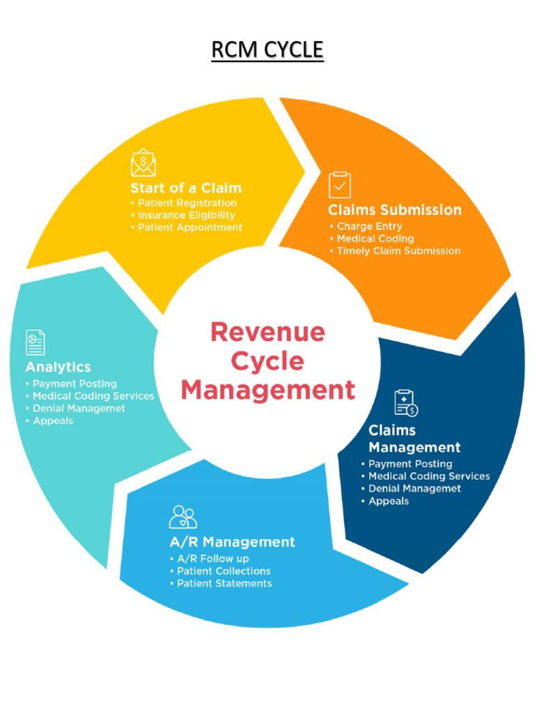
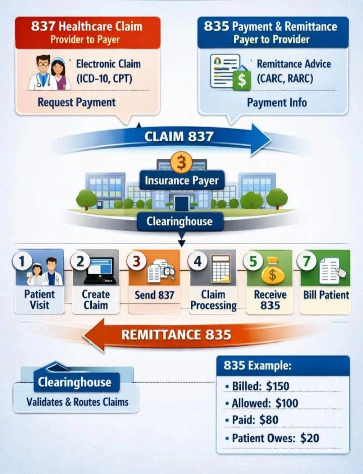
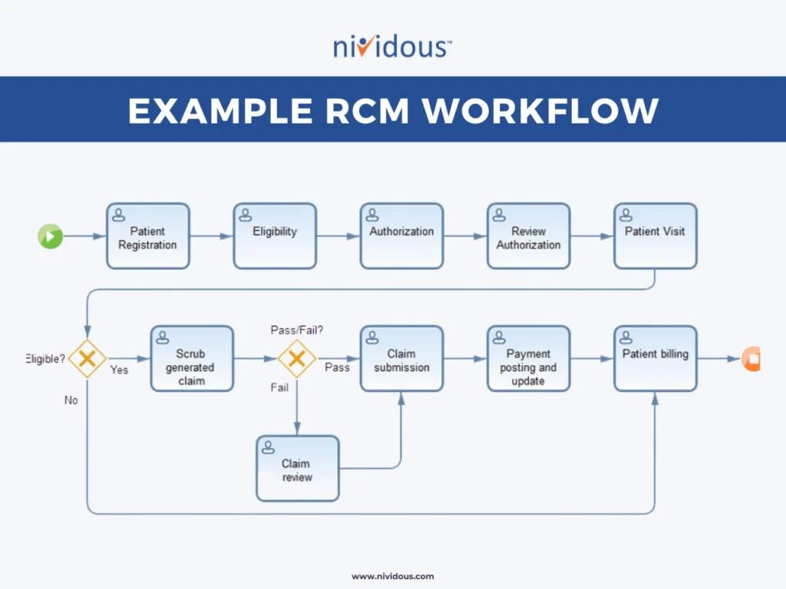

# 🎯 BA Interview Preparation

**🎯 BA Interview Preparation --- Part 1: Basic Questions**

**1. Tell me about yourself / Walk me through your profile**

**What interviewer wants**

**They want a 60--90 second summary, not your entire life story.**

**Your answer should cover:**

**Education → Previous experience → Career transition → BA skills →
Projects → Target role**

**Interview-ready answer**

**I have a background in pharmacy, with a Master\'s degree in
Pharmacology, and I started my professional career in the pharmaceutical
industry.**

**I have experience in regulatory affairs and business development,
where I worked with business requirements, documentation, coordination
with different stakeholders, and process-related activities.**

**Over time, I developed an interest in technology and decided to
transition into Business Analysis. To build practical IT BA skills, I
have worked on hands-on healthcare projects covering areas such as
Hospital Management, Clinical Trial Management, Healthcare Revenue Cycle
Management, and Healthcare Analytics.**

**As part of these projects, I have practiced requirement gathering,
stakeholder analysis, BRD and FRD documentation, process modelling,
BPMN/UML, user stories, acceptance criteria, backlog management, Jira,
SQL, API concepts, UAT, and Agile/Scrum practices.**

**My domain background in pharmaceuticals and healthcare gives me an
additional advantage when working on healthcare technology products.**

**Now I am looking for a Business Analyst opportunity where I can
combine my healthcare domain knowledge with my BA and technology skills
and contribute to real-world product and project delivery.**

**Tip: Don\'t say *\"I don\'t have IT experience\"* in the opening. Let
your background and practical work establish the transition naturally.
If they specifically ask about real production experience, answer
honestly.**

**2. What are your roles & responsibilities as a BA?**

**A strong answer:**

**As a Business Analyst, my primary responsibility is to understand the
business problem and translate it into clear and actionable requirements
for the development and QA teams.**

**My responsibilities include:**

1.  **Understanding business objectives and problems.**

2.  **Identifying and communicating with stakeholders.**

3.  **Gathering requirements through interviews, meetings, workshops and
    document analysis.**

4.  **Analyzing and validating requirements.**

5.  **Preparing BRD, FRD and other requirement documentation.**

6.  **Creating process flows, use cases, user journeys and UML/BPMN
    diagrams where required.**

7.  **Creating user stories and acceptance criteria in Agile projects.**

8.  **Working with Product Owners and developers during backlog
    refinement and sprint planning.**

9.  **Clarifying requirements during development.**

10. **Supporting QA by explaining business scenarios and validating test
    cases.**

11. **Supporting UAT and coordinating business feedback.**

12. **Supporting deployment and post-production validation.**

13. **Managing requirement changes and maintaining traceability.**

**Remember this formula:**

**Business Problem → Requirements → Documentation → Development →
Testing → UAT → Deployment → Feedback**

**That is the BA lifecycle you should keep in your head.**

**3. Tell me about your day-to-day activities. How do you start your
day?**

**Don\'t say:**

**\"I attend standup and check emails.\"**

**That\'s too weak.**

**Say:**

**I usually start my day by checking my emails, Teams or project
communication channels for any new business updates, issues or
dependencies.**

**Then I review my Jira board and check the status of the stories I am
working on. If there is a daily Scrum, I attend the stand-up and
understand what the development and QA teams are working on and whether
there are any blockers related to requirements.**

**After that, my activities depend on the project phase. I may conduct
requirement discussions with stakeholders, clarify questions from
developers or testers, update user stories and acceptance criteria,
review test scenarios, participate in backlog refinement, or support
UAT.**

**I also make sure that any important decisions, requirement changes or
stakeholder feedback are properly documented and communicated to the
relevant team members.**

**Very important**

**If they ask:**

**\"What happens after stand-up?\"**

**You should be able to explain your actual BA workflow, not just Scrum
ceremonies.**

**4. As a BA, how do you gather requirements and prepare for a
stakeholder meeting?**

**Use this framework:**

**Before → During → After**

**Before meeting**

-   **Understand business objective**

-   **Review existing documents**

-   **Identify stakeholders**

-   **Prepare questions**

-   **Understand current process**

-   **Identify known issues**

-   **Prepare agenda**

**During**

-   **Ask open-ended questions**

-   **Understand AS-IS**

-   **Understand pain points**

-   **Understand desired TO-BE**

-   **Capture functional requirements**

-   **Capture NFRs**

-   **Identify assumptions/dependencies**

-   **Confirm priorities**

**After**

-   **Prepare MoM**

-   **Document requirements**

-   **Validate understanding**

-   **Share for stakeholder confirmation**

-   **Update BRD/FRD/user stories**

**Interview answer**

**I normally prepare for a stakeholder meeting in three stages.**

**Before the meeting, I understand the business objective, review
existing documentation and identify the relevant stakeholders. I prepare
an agenda and a list of questions based on the current process and known
pain points.**

**During the meeting, I first understand the AS-IS process, identify the
problems or gaps, and then understand the desired TO-BE process. I ask
questions around business rules, users, exceptions, integrations, data,
reporting and non-functional requirements. I also confirm priorities and
dependencies.**

**After the meeting, I document the discussion, prepare the requirements
or update the relevant documentation, capture action items and open
questions, and share the understanding with stakeholders for
validation.**

**5. What is your role as a BA in Testing?**

**This is a very important interview question.**

**BA does not normally execute all testing.**

**Your role is primarily to ensure that testing validates the business
requirements.**

**BA involvement**

**Requirement → Acceptance Criteria → Test Scenarios → Test Cases → UAT
→ Defects → Business Validation**

**Answer**

**As a BA, I am involved throughout the testing lifecycle, although I am
not the primary person responsible for executing technical testing.**

**I make sure that requirements and acceptance criteria are clear and
testable. During test preparation, I work with QA to clarify business
scenarios, business rules and expected outcomes.**

**I review test scenarios from a business perspective and make sure
important positive, negative and exception scenarios are covered.**

**During defect discussions, I help determine whether the observed
behavior is actually a defect or an expected business behavior.**

**During UAT, I support business users, clarify requirements, help
validate the results and collect feedback.**

**So my main responsibility in testing is to make sure that the
developed solution behaves according to the approved business
requirements.**

**6. What is your role as a BA in Deployment?**

**A BA is not normally responsible for technically deploying the
application.**

**DevOps/development/technical teams generally handle deployment.**

**BA supports the business readiness and validation.**

**Answer**

**As a BA, I don\'t normally perform the technical deployment myself.
The development or DevOps team handles that activity.**

**My responsibility is to support business readiness for deployment.**

**Before deployment, I verify that the required functionality has passed
testing and UAT and that the business stakeholders are aware of the
changes.**

**I may support release notes, business communication, training material
or process updates.**

**After deployment, I participate in smoke or business validation
testing, monitor whether the expected functionality is working correctly
and collect feedback from business users.**

**If an issue occurs, I help determine the business impact and
coordinate with the appropriate technical team.**

**📌 PROJECT QUESTIONS**

**For your project questions, we should use one consistent project
story.**

**For example:**

**Healthcare RCM Platform**

**Problem:**

**Hospitals have difficulty tracking claims, denials, payments and
outstanding receivables.**

**Users:**

-   **Billing staff**

-   **Revenue cycle managers**

-   **Finance team**

-   **Hospital administrators**

**Workflow:**

**Patient registration\
↓\
Insurance verification\
↓\
Charge capture\
↓\
Claim creation\
↓\
Claim submission\
↓\
Payer response\
↓\
Payment posting\
↓\
Denial management\
↓\
AR follow-up\
↓\
Reporting**

**This single project can help you answer 20+ interview questions.**

**7. Explain the project workflow & user journey**

**Answer structure**

**User → Action → System → Outcome**

**Example:**

**In my healthcare RCM project, the user journey starts when a patient
receives a healthcare service.**

**First, the patient\'s demographic and insurance information is
captured. The system then verifies the patient\'s insurance
eligibility.**

**Once the service is completed, the required charges and clinical
information are captured and a claim is generated.**

**The claim is then submitted to the payer through an integration. The
system receives the payer response and updates the claim status.**

**If the claim is paid, the payment is posted to the patient\'s account.
If the claim is rejected or denied, the denial is categorized and
assigned for follow-up.**

**Finally, the revenue cycle manager can use dashboards and reports to
monitor claim status, denial trends, outstanding receivables and
collection performance.**

**From a BA perspective, I mapped this journey to identify business
processes, user roles, system interactions, exceptions and reporting
requirements.**

**8. What was your contribution as a BA?**

**Don\'t say:**

**\"I created BRD and user stories.\"**

**That\'s too generic.**

**Show the complete BA lifecycle.**

**My contribution covered the project from requirement discovery through
UAT.**

**I started by understanding the business problem and identifying the
key stakeholders and user roles.**

**I analyzed the AS-IS process and designed the TO-BE process. I
documented the requirements and created process flows and user
journeys.**

**For Agile delivery, I converted the requirements into epics, features
and user stories with acceptance criteria.**

**During development, I worked as the bridge between the business and
technical teams and clarified requirement-related questions.**

**I also supported QA by reviewing business scenarios and helped during
UAT by validating whether the implemented functionality met the expected
business requirements.**

**Finally, I supported post-implementation feedback and identified
improvement opportunities.**

**9. Project challenges and how did you overcome them?**

**Use STAR:**

**Situation → Task → Action → Result**

**Example:**

**Challenge: Changing requirements**

**One challenge I faced was changing requirements during the development
phase.**

**For example, a stakeholder initially wanted a basic denial report, but
later requested additional filtering by payer, denial reason and date
range.**

**Instead of directly asking the development team to implement the
change, I first understood the business reason behind the request.**

**I analyzed the impact on existing requirements, UI, database,
reporting and development effort. I discussed the impact with the
Product Owner and technical team and helped prioritize the change.**

**If it was critical, we included it in the current sprint only after
understanding the impact. Otherwise, we moved it to the product backlog
for prioritization.**

**This helped us avoid uncontrolled scope changes while still addressing
the stakeholder\'s business need.**

**10. APIs integrated into your project**

**This question needs special preparation because interviewers may go
deep.**

**You need to understand:**

**API → Request → Endpoint → Authentication → Payload → Response → Error
handling → Integration → Business outcome**

**For healthcare RCM, examples could include:**

-   **Insurance eligibility API**

-   **Claim submission API**

-   **Payment API**

-   **Patient/EMR integration API**

-   **Notification API**

**But be careful: don\'t claim you integrated production APIs if you
didn\'t actually do so.**

**You can say:**

**\"In my portfolio project, I designed/worked through the integration
flow\...\"**

**rather than falsely saying:**

**\"I integrated this production API.\"**

**⭐ Webhook vs Polling vs Fallback**

**This is actually a good interview topic.**

**Webhook**

**System A tells System B:**

**\"Something happened.\"**

**Example:**

**Payer → RCM system**

**Claim status changed → webhook → RCM updates claim**

**Polling**

**Your system repeatedly asks:**

**\"Has anything changed?\"**

**Example:**

**RCM → Payer API**

**Every 5 minutes:**

**\"Any new claim status?\"**

**Fallback**

**If the preferred mechanism fails, use another mechanism.**

**Example:**

**Primary: Webhook\
↓ failure\
Fallback: Polling**

**You should understand this architecture rather than simply memorizing
the terms.**

**📌 DOCUMENTATION**

**11. What is BRD?**

**Simple definition**

**BRD = Business Requirements Document**

**It explains:**

**WHAT the business needs and WHY it needs it.**

**Example:**

**Business problem:**

**Hospital management wants to reduce claim processing delays.**

**BRD may describe:**

-   **Business problem**

-   **Business objectives**

-   **Scope**

-   **Stakeholders**

-   **High-level requirements**

-   **Business rules**

-   **Assumptions**

-   **Constraints**

-   **Success criteria**

**12. BRD vs FRD**

  -----------------------------------------------------------------------
  **BRD**                        **FRD**
  ------------------------------ ----------------------------------------
  **Business Requirements        **Functional Requirements Document**
  Document**                     

  **Business perspective**       **System/function perspective**

  **WHAT & WHY**                 **HOW the system should behave
                                 functionally**

  **High-level**                 **More detailed**

  **Business stakeholders**      **Business + BA + technical/QA teams**

  **Business objectives**        **Functional behavior**

  **Business requirements**      **Functional requirements**
  -----------------------------------------------------------------------

**Easy example**

**BRD:**

**The hospital should be able to track insurance claim status.**

**FRD:**

**The system shall display claim status as Submitted, Accepted,
Rejected, Denied or Paid.**

**13. Explain FRD in detail**

**Think of FRD as:**

**\"Exactly what should the system do?\"**

**Typical FRD sections:**

1.  **Purpose**

2.  **Scope**

3.  **Actors/users**

4.  **Functional requirements**

5.  **Business rules**

6.  **Process flows**

7.  **Use cases**

8.  **Screen behavior**

9.  **Input/output**

10. **Validations**

11. **Error handling**

12. **Integration requirements**

13. **Data requirements**

14. **Reports**

15. **Permissions**

16. **Assumptions**

17. **Dependencies**

**Example**

**Requirement:**

**User should be able to submit a claim.**

**FRD could specify:**

**Input:**

-   **Patient ID**

-   **Insurance ID**

-   **Service date**

-   **Diagnosis**

-   **Procedure**

-   **Charges**

**Validation:**

-   **Patient ID mandatory**

-   **Insurance must be active**

-   **Service date cannot be future date**

**System behavior:**

-   **Generate claim ID**

-   **Validate required fields**

-   **Submit claim**

-   **Display confirmation**

-   **Update status to \"Submitted\"**

**Error:**

**If insurance is inactive, claim submission must be blocked and an
appropriate error message displayed.**

**That\'s functional requirement detail.**

**14. What is a Use Case?**

**A use case describes:**

**How an actor interacts with the system to achieve a goal.**

**Three RCM examples**

1.  **Verify Insurance Eligibility**

    -   **Actor: Billing staff**

    -   **Goal: Verify patient\'s insurance**

2.  **Submit Claim**

    -   **Actor: Billing staff/system**

    -   **Goal: Submit claim to payer**

3.  **Manage Denial**

    -   **Actor: AR specialist**

    -   **Goal: Review and resolve denied claim**

**15. Functional vs Non-Functional Requirements**

**Functional**

**What the system does.**

**Example:**

**System shall allow billing staff to submit insurance claims.**

**Non-functional**

**How well the system should perform.**

**Examples:**

**The dashboard should load within 3 seconds.**

**System should support 5,000 concurrent users.**

**Patient data must be encrypted.**

**System availability should be 99.9%.**

**Memory trick**

**Functional = WHAT**

**Non-functional = HOW WELL**

**16. What are User Stories?**

**Format:**

**As a \[user\], I want \[function\], so that \[business value\].**

**RCM examples**

**User Story 1 --- Insurance Verification**

**As a billing executive,\
I want to verify a patient\'s insurance eligibility,\
so that I can confirm coverage before submitting a claim.**

**User Story 2 --- Claim Submission**

**As a billing executive,\
I want to submit a validated claim electronically,\
so that the claim can be processed by the payer.**

**User Story 3 --- Denial Management**

**As an AR specialist,\
I want to view and categorize denied claims,\
so that I can prioritize follow-up actions and improve collections.**

**17. How do you define Acceptance Criteria?**

**Acceptance criteria define:**

**When can we say that this user story is successfully completed?**

**Use Given → When → Then.**

**Example:**

**Story: Verify insurance.**

**Given the patient has a valid insurance ID**

**When the billing executive requests eligibility verification**

**Then the system should display the patient\'s eligibility status**

**Another:**

**Given the insurance ID is invalid**

**When the user submits the verification request**

**Then the system should display an appropriate validation message**

**Strong interview answer**

**\"I define acceptance criteria based on the expected business
behavior, business rules, positive scenarios, negative scenarios and
exception scenarios. I generally use Given-When-Then format where
appropriate.\"**

**18. Root Cause Analysis**

**RCA means:**

**Finding the underlying reason why a problem occurred instead of fixing
only the symptom.**

**Example**

**Problem:**

**Claims are being rejected.**

**Don\'t immediately say:**

**\"Developer should fix the claim API.\"**

**Ask:**

**Why?**

**Claim rejected\
↓\
Missing insurance information\
↓\
Insurance data not validated\
↓\
Eligibility API response not mapped correctly\
↓\
Integration mapping issue**

**Techniques**

-   **5 Whys**

-   **Fishbone/Ishikawa**

-   **Pareto analysis**

-   **Process analysis**

**📌 SQL**

**19. \"I see SQL in your CV. What do you do using SQL?\"**

**For a BA, don\'t pretend you\'re a DBA.**

**A good answer:**

**As a BA, I use SQL mainly for data validation, requirement analysis
and troubleshooting rather than database administration.**

**For example, I can query tables to verify whether the data displayed
in an application matches the database.**

**I use SELECT queries, WHERE conditions, JOINs, GROUP BY, aggregate
functions and subqueries.**

**I also use SQL to validate business rules, investigate data
discrepancies and support QA or UAT when a business issue requires
checking the underlying data.**

**20. Primary Key vs Foreign Key**

**Primary Key**

**Uniquely identifies a record.**

**Example:**

**patient_id**

**Foreign Key**

**Connects one table to another.**

**Example:**

**claim.patient_id**

**connects to**

**patient.patient_id**

**21. SQL Joins**

**Suppose:**

**Patient**

  -----------------------------------------------------------------------
  **patient_id**                               **name**
  -------------------------------------------- --------------------------
  **1**                                        **Raj**

  **2**                                        **Amit**
  -----------------------------------------------------------------------

**Claim**

  -----------------------------------------------------------------------
  **claim_id**                     **patient_id**
  -------------------------------- --------------------------------------
  **101**                          **1**

  **102**                          **1**
  -----------------------------------------------------------------------

**INNER JOIN**

**Only matching records.**

**LEFT JOIN**

**All records from left table + matching right records.**

**RIGHT JOIN**

**All records from right table + matching left records.**

**FULL OUTER JOIN**

**All records from both tables.**

**For interviews, INNER JOIN and LEFT JOIN are especially important for
a BA.**

**22. DELETE vs TRUNCATE vs DROP**

  -----------------------------------------------------------------------
  **DELETE**               **TRUNCATE**         **DROP**
  ------------------------ -------------------- -------------------------
  **Removes selected       **Removes all rows** **Removes table**
  rows**                                        

  **WHERE allowed**        **WHERE not          **Table structure
                           allowed**            removed**

  **Table remains**        **Table remains**    **Table doesn\'t remain**

  **DML**                  **Usually DDL**      **DDL**
  -----------------------------------------------------------------------

**Simple memory:**

**DELETE = rows**

**TRUNCATE = all rows**

**DROP = table itself**

**23. SQL --- Maximum salary**

**SELECT MAX(salary)**

**FROM employee;**

**Second highest salary**

**SELECT MAX(salary)**

**FROM employee**

**WHERE salary \< (**

**SELECT MAX(salary)**

**FROM employee**

**);**

**A more interview-friendly approach:**

**SELECT DISTINCT salary**

**FROM employee**

**ORDER BY salary DESC**

**LIMIT 2;**

**For SQL Server, you\'d use TOP or DENSE_RANK() instead, depending on
the requirement.**

**📌 API**

**24. What is an API?**

**API = Application Programming Interface**

**Simple explanation:**

**API allows two software systems to communicate with each other.**

**Example:**

**RCM System**

**↓**

**API request**

**↓**

**Insurance/Payer System**

**↓**

**API response**

**↓**

**RCM System**

**Advantages**

-   **System integration**

-   **Automation**

-   **Reusability**

-   **Data exchange**

-   **Reduced manual work**

-   **Real-time communication**

**Common API styles/types you\'ll hear**

-   **REST**

-   **SOAP**

-   **GraphQL**

-   **Webhooks**

**25. REST vs SOAP**

  -----------------------------------------------------------------------
  **REST**                     **SOAP**
  ---------------------------- ------------------------------------------
  **Architectural style**      **Protocol**

  **Usually JSON**             **XML**

  **Lightweight**              **More formal/heavier**

  **Easy for web/mobile APIs** **Common in enterprise/legacy systems**

  **HTTP methods**             **SOAP operations**

  **Flexible**                 **Strict standards**
  -----------------------------------------------------------------------

**Interview answer**

**\"REST is an architectural style generally using HTTP and commonly
JSON, whereas SOAP is a protocol based primarily on XML with defined
standards and contracts.\"**

**📌 AGILE & SCRUM**

**26. What is Agile?**

**Don\'t say only:**

**Agile means flexibility.**

**Better:**

**Agile is an iterative and incremental approach to delivering software
where teams continuously deliver value, receive feedback and adapt to
changing requirements.**

**Advantages**

-   **Faster feedback**

-   **Early value delivery**

-   **Adaptability**

-   **Continuous improvement**

-   **Better stakeholder collaboration**

-   **Reduced risk**

**27. What is Scrum?**

**Scrum is a framework for developing and delivering products
iteratively and incrementally.**

**Scrum has:**

**Roles/accountabilities**

-   **Product Owner**

-   **Scrum Master**

-   **Developers**

**Events**

-   **Sprint**

-   **Sprint Planning**

-   **Daily Scrum**

-   **Sprint Review**

-   **Sprint Retrospective**

**Artifacts**

-   **Product Backlog**

-   **Sprint Backlog**

-   **Increment**

**28. Sprint vs Sprint Backlog**

**Sprint**

**A fixed time-box, commonly 1--4 weeks, during which the team works
toward a Sprint Goal.**

**Sprint Backlog**

**The selected Product Backlog Items plus the plan for delivering them
during the Sprint.**

**Easy:**

**Product Backlog = Everything**

**Sprint Backlog = What we\'re taking into this Sprint**

**29. Scrum Pillars**

**Three empirical process-control pillars:**

**Transparency**

**Everyone can understand the work/status.**

**Inspection**

**Regularly inspect progress/results.**

**Adaptation**

**Change course when necessary.**

**📌 BEHAVIORAL QUESTIONS**

**30. Rate yourself 1--10 in SQL/API/Power BI**

**Don\'t say:**

**SQL = 10/10.**

**That creates a trap.**

**For your current level, I\'d recommend something like:**

**I would rate myself around 7 out of 10 in SQL from a Business Analyst
perspective. I am comfortable with querying, joins, filtering,
aggregation and data validation.**

**For APIs, I would rate myself around 7. I understand REST APIs,
request-response flow, authentication concepts, JSON payloads, status
codes and integration scenarios, and I can analyze API requirements and
troubleshoot basic integration issues.**

**For Power BI, I would rate myself around 6. I can work with datasets,
create relationships, build visuals, use filters and create business
dashboards. I am continuing to strengthen advanced DAX and data
modelling.**

**Rule: Never claim 9/10 unless you can handle deep technical follow-up
questions.**

**31. How do you handle changing requirements?**

**Use:**

**Understand → Impact → Prioritize → Approve → Update → Communicate**

**Answer**

**\"I don\'t reject changing requirements automatically. I first
understand why the requirement changed and what business value it
provides. Then I perform an impact analysis covering scope, timeline,
cost, dependencies, development and testing. I discuss the impact with
the Product Owner/business stakeholders and prioritize the change. Once
approved, I update the relevant requirements, backlog items and
acceptance criteria and communicate the change to the affected
teams.\"**

**Excellent BA answer.**

**32. Project is delayed but business wants faster delivery**

**This is a very important scenario question.**

**Don\'t say:**

**\"I\'ll ask developers to work faster.\"**

**Instead:**

**Assess → Identify bottleneck → Prioritize → Re-plan → Communicate**

**Example:**

**\"First, I would understand why the project is delayed---requirements,
development, dependencies, testing, resources or scope. Then I would
identify the critical path and discuss options with the Product Owner
and technical team. We could prioritize the MVP, defer lower-priority
features, remove unnecessary scope, parallelize activities where
possible, or add resources if appropriate. I would communicate the
realistic impact rather than promising an unrealistic delivery date.\"**

**33. How do you ensure solution meets requirements after
implementation?**

**Use:**

**Requirement → Acceptance Criteria → Testing → UAT → Production
Validation → Feedback**

**Answer:**

**\"I maintain traceability from requirements to acceptance criteria and
test scenarios. Before release, I ensure UAT validates the business
scenarios. After deployment, I support production validation and collect
user feedback. If there are gaps, I analyze them against the original
requirement and acceptance criteria and create defects or enhancement
items accordingly.\"**

**34. Most challenging project?**

**Don\'t invent some dramatic production incident.**

**For your portfolio, you can discuss integration complexity or changing
requirements.**

**Example:**

**\"One of the more challenging areas in my healthcare RCM project was
designing the claim-status integration because the business expected
near-real-time status updates while the external system might not always
provide an immediate response.\"**

**Then explain:**

**Problem → Analysis → Webhook → Polling fallback → Error handling →
Business outcome**

**This connects nicely with your API preparation.**

**📌 BUSINESS PROCESS & TOOLS**

**35. Wireframe vs Prototype**

**Wireframe**

**Basic structure/layout.**

**Think:**

**Blueprint**

**Shows:**

-   **Screen structure**

-   **Placement**

-   **Navigation**

-   **Fields**

-   **Buttons**

**Prototype**

**Interactive representation.**

**Think:**

**Clickable model**

**It demonstrates:**

-   **Navigation**

-   **User interaction**

-   **Screen transitions**

-   **User experience**

**Memory trick**

**Wireframe = How the screen is structured**

**Prototype = How the user interacts**

**36. What do you do in Power BI?**

**For a BA:**

**\"I use Power BI to convert business data into dashboards and reports
that help stakeholders monitor KPIs and make decisions.\"**

**Typical workflow:**

**Business requirement**

**↓**

**Identify KPIs**

**↓**

**Collect data**

**↓**

**Clean/transform data**

**↓**

**Create data model**

**↓**

**Create relationships**

**↓**

**Create measures/DAX**

**↓**

**Create visuals**

**↓**

**Add filters/slicers**

**↓**

**Validate numbers**

**↓**

**Publish/share dashboard**

**Healthcare RCM example**

**Dashboard could show:**

-   **Total claims**

-   **Paid claims**

-   **Denied claims**

-   **Claim acceptance rate**

-   **Denial rate**

-   **Outstanding AR**

-   **Days in AR**

-   **Payer-wise performance**

-   **Denial reason trends**

**⭐ 37. What is Gap Analysis?**

**This is one of the most important BA concepts.**

**Gap Analysis means:**

**Comparing the current state (AS-IS) with the desired future state
(TO-BE) to identify what is missing or needs to change.**

**Example**

**Hospital currently:**

**AS-IS**

**Billing staff manually checks insurance eligibility.**

**Desired:**

**TO-BE**

**System automatically verifies insurance through an API.**

**Gap**

**Manual eligibility verification**

**needs to become**

**Automated eligibility verification**

**BA identifies:**

-   **Process gap**

-   **Technology gap**

-   **Data gap**

-   **Skill gap**

-   **Compliance gap**

-   **Integration gap**

**Interview-ready answer**

**Gap Analysis is a technique used to compare the current state with the
desired future state and identify the gaps that need to be addressed.**

**For example, in a healthcare RCM process, suppose the current process
requires billing staff to manually verify insurance eligibility. The
desired process is to automatically verify eligibility through an API.**

**The gap is the lack of automated eligibility integration.**

**As a BA, I would analyze the gap, understand the business impact,
identify the required system changes, dependencies and risks, and then
convert the identified needs into requirements and actionable backlog
items.**

**🧠 Your BA Interview Mental Model**

**You should be able to connect almost every question to this flow:**

**BUSINESS PROBLEM**

**↓**

**STAKEHOLDERS**

**↓**

**REQUIREMENT ELICITATION**

**↓**

**AS-IS PROCESS**

**↓**

**GAP ANALYSIS**

**↓**

**TO-BE PROCESS**

**↓**

**BRD / FRD**

**↓**

**USE CASE / USER STORY**

**↓**

**ACCEPTANCE CRITERIA**

**↓**

**BACKLOG**

**↓**

**SPRINT**

**↓**

**DEVELOPMENT**

**↓**

**QA / TESTING**

**↓**

**UAT**

**↓**

**DEPLOYMENT**

**↓**

**PRODUCTION VALIDATION**

**↓**

**FEEDBACK / ENHANCEMENT**

**This is much more important than memorizing 50 isolated definitions.**

**BUSINESS ANALYST INTERVIEW MASTER ANSWER BANK**

**Your Interview Strategy**

For almost every answer, think:

**Business Problem → Requirement → Analysis → Solution → Development →
Testing → UAT → Deployment → Feedback**

And for project questions:

**Problem → Users → AS-IS → Gap → TO-BE → Requirements → Solution → BA
contribution → Result**

**📌 SECTION 1 --- BASIC BA QUESTIONS**

**1. Tell me about yourself / Walk me through your profile**

**Interview-ready answer**

I have a background in pharmacy, with a Master\'s degree in
Pharmacology, and I started my professional career in the pharmaceutical
industry.

I have experience in areas such as regulatory affairs and business
development, where I worked with business stakeholders, documentation,
coordination and process-related activities.

Over time, I developed an interest in technology and decided to
transition into Business Analysis. To build practical IT BA skills, I
worked on hands-on healthcare projects covering Hospital Management,
Clinical Trial Management, Healthcare Revenue Cycle Management and
Healthcare Analytics.

Through these projects, I have practiced requirement elicitation,
stakeholder analysis, BRD and FRD documentation, process modelling, BPMN
and UML, use cases, user stories, acceptance criteria, Jira, SQL, API
concepts, UAT and Agile/Scrum practices.

My pharmaceutical and healthcare background gives me an additional
advantage when working on healthcare technology products because I
understand the business and domain context.

I am now looking for a Business Analyst opportunity where I can combine
my healthcare domain knowledge, business analysis skills and technology
understanding to contribute to real-world projects.

**Likely follow-up**

**\"You don\'t have IT BA experience. Why should we hire you?\"**

Answer:

Although I am transitioning into IT, I have deliberately built practical
BA skills through hands-on projects rather than learning only theory. I
also bring prior experience working with business stakeholders,
documentation and pharmaceutical processes. So I understand both the
business side and the BA methodology, and I am now looking for an
opportunity to apply these skills in a real project environment.

**2. What are your roles and responsibilities as a BA?**

My primary responsibility as a BA is to understand the business problem
and translate it into clear and actionable requirements for the
technical team.

My responsibilities include stakeholder identification, requirement
elicitation, requirement analysis, BRD and FRD preparation, process
modelling, use cases, user stories and acceptance criteria.

In Agile projects, I also participate in backlog refinement, sprint
planning and requirement clarification.

During development, I act as a bridge between business stakeholders and
the development team.

I support QA by clarifying business scenarios and reviewing requirements
against test scenarios.

During UAT, I support business users, clarify expected behavior and help
validate whether the solution meets the business requirements.

After deployment, I support business validation and collect feedback for
defects or future enhancements.

**3. What are your day-to-day activities?**

I usually start by checking project communication, emails and Jira for
any new updates, questions, blockers or requirement changes.

If there is a Daily Scrum, I participate and understand the progress of
development and QA and whether there are any requirement-related
blockers.

Depending on the project phase, my day may include stakeholder meetings,
requirement elicitation, documentation, process modelling, writing or
refining user stories, answering developer questions, reviewing test
scenarios, supporting UAT or analyzing business issues.

I also make sure that important decisions, requirement changes and
stakeholder feedback are properly documented and communicated.

**Interviewer may ask:**

**\"What exactly do you do in Jira?\"**

We\'ll cover that later.

**4. How do you gather requirements?**

Use this structure:

**Prepare → Elicit → Analyze → Validate → Document → Approve**

First, I understand the business objective and identify the relevant
stakeholders.

Then I select the appropriate elicitation technique such as interviews,
workshops, observation, document analysis, questionnaires or
brainstorming.

I understand the current AS-IS process, pain points, business rules and
exceptions.

Then I identify the desired TO-BE process and analyze the gap between
the current and future state.

I document the requirements, validate them with stakeholders and resolve
ambiguity or conflicts.

Finally, I obtain stakeholder confirmation or approval and maintain
traceability throughout the project.

**5. How do you prepare for a stakeholder meeting?**

**Before**

-   Understand objective

-   Identify stakeholders

-   Review existing documents

-   Understand AS-IS process

-   Prepare questions

-   Prepare agenda

**During**

-   Understand business problem

-   Ask open-ended questions

-   Identify requirements

-   Capture business rules

-   Identify exceptions

-   Identify dependencies

-   Confirm priorities

**After**

-   MoM

-   Action items

-   Open questions

-   Requirement updates

-   Stakeholder validation

**Interview answer**

I prepare by first understanding the purpose of the meeting and
reviewing any available documentation. I identify the right stakeholders
and prepare an agenda and questions.

During the meeting, I focus on understanding the business problem,
current process, pain points, desired future state, business rules,
exceptions, integrations and priorities.

After the meeting, I document the decisions, action items and open
questions and update the relevant requirements. I then validate my
understanding with the stakeholders.

**6. What is your role as a BA in testing?**

A BA is not normally responsible for executing all technical testing. My
responsibility is to ensure that the testing validates the business
requirements.

I make sure requirements and acceptance criteria are clear and testable.

I work with QA to clarify business scenarios, business rules, expected
outcomes and edge cases.

I may review test scenarios and help determine whether a reported issue
is actually a defect or expected behavior.

During UAT, I support business users and validate that the implemented
functionality meets the agreed business requirements.

**Remember:**

**BA = Business validation**

**QA = Quality/testing execution**

There can be overlap, but don\'t say BA replaces QA.

**7. What is your role in deployment?**

I don\'t normally perform the technical deployment myself. Development
or DevOps teams handle that.

My role is to support business readiness and validation.

Before deployment, I ensure UAT is completed and business stakeholders
understand the changes.

After deployment, I support smoke or business validation, verify
critical functionality and collect production feedback.

If an issue occurs, I help assess its business impact and coordinate
with the appropriate technical team.

**📌 SECTION 2 --- PROJECT QUESTIONS**

For your interviews, we\'ll use **Healthcare RCM** as one of your main
project stories because it gives you excellent opportunities to discuss:

-   Requirements

-   Healthcare

-   APIs

-   SQL

-   User journey

-   Agile

-   UAT

-   Power BI

-   Business process

-   Integrations

-   RCA

**8. Explain your project**

**Healthcare RCM Platform**

The project was a healthcare Revenue Cycle Management platform designed
to help healthcare organizations manage the financial lifecycle of
patient services.

The major objective was to improve visibility into claims, payments,
denials and accounts receivable and reduce manual effort.

The key users included billing executives, AR specialists, revenue cycle
managers and administrators.

The major workflow included patient and insurance information,
eligibility verification, charge capture, claim creation, claim
submission, payer response, payment posting, denial management and
reporting.

As a BA, I focused on understanding the business process, identifying
requirements and gaps, designing the TO-BE process, creating functional
requirements and Agile user stories, and supporting development, testing
and UAT.

**9. Explain the project workflow and user journey**

Patient Registration

↓

Insurance Verification

↓

Service / Charge Capture

↓

Claim Creation

↓

Claim Validation

↓

Claim Submission

↓

Payer Response

↓

Payment Posting

↓

Denial Management

↓

AR Follow-up

↓

Analytics / Reporting

**Interview answer**

The journey starts when patient and insurance information is captured.
The system verifies insurance eligibility.

After the healthcare service is provided, charges and relevant
information are captured and a claim is generated.

The claim goes through validation and is submitted to the payer.

The payer sends a response such as accepted, rejected, denied or paid.

Payments are posted when applicable, while denied claims are routed for
investigation and follow-up.

Finally, managers use dashboards to monitor claims, denials, collections
and outstanding AR.

**10. What was your contribution as a BA?**

Use the **full lifecycle**.

I started by understanding the business problem and identifying
stakeholders and user roles.

I analyzed the AS-IS process and identified pain points and gaps.

I worked on the TO-BE process and documented requirements.

I prepared functional requirements, process flows, use cases and user
stories with acceptance criteria.

I supported backlog refinement and requirement clarification during
development.

I worked with QA to clarify business scenarios and supported UAT.

I also analyzed feedback and identified defects or enhancement
requirements.

**11. What challenges did you face?**

Don\'t give only one. Prepare **three stories**.

**Challenge 1 --- Changing requirements**

A stakeholder requested additional functionality after the initial
requirement had already been defined. I first understood the business
reason, then performed impact analysis covering scope, development,
testing, dependencies and timeline. I discussed the impact with the
Product Owner and helped prioritize the change. After approval, I
updated the relevant requirements and communicated the change.

**Challenge 2 --- Requirement ambiguity**

Different stakeholders had different interpretations of the same
requirement. I organized a clarification discussion, documented the
different expectations, identified the business rule that should drive
the requirement and obtained agreement before finalizing it.

**Challenge 3 --- Integration issue**

An external system did not always provide an immediate response. I
analyzed the expected business behavior and worked with the technical
team on an asynchronous integration approach using webhook-based updates
with polling as a fallback.

**12. What solution did you implement on your own?**

Be careful with wording.

Don\'t say:

\"I developed the complete system myself.\"

Instead:

One solution I worked through from a BA and solution-analysis
perspective was an asynchronous claim-status update mechanism.

Instead of repeatedly requiring users to manually check claim status,
the external system could notify our platform through a webhook when the
status changed.

Because external systems may occasionally fail to send the notification,
we also considered polling as a fallback mechanism.

This reduced dependence on manual checking and provided a more reliable
claim-status update process.

**13. Explain Webhook, Polling and Fallback API**

**Webhook**

**Push model**

External System

↓

Webhook Event

↓

Our Application

External system tells us when something happens.

**Polling**

**Pull model**

Our Application

↓

\"Has status changed?\"

↓

External System

Our application asks repeatedly.

**Fallback**

Webhook

↓

If successful → Update status

If webhook fails

↓

Polling

↓

Check status

**Excellent interview statement**

\"For asynchronous integration, I considered webhook as the primary
mechanism because it provides event-driven updates, with polling as a
fallback when a webhook is unavailable or fails.\"

**📌 SECTION 3 --- DOCUMENTATION**

**14. What is BRD?**

**BRD = Business Requirements Document**

BRD captures the business need, business objectives, scope and
high-level business requirements. It primarily explains **what the
business needs and why**.

Typical sections:

-   Business problem

-   Objective

-   Scope

-   Stakeholders

-   Business requirements

-   Business rules

-   Assumptions

-   Constraints

-   Dependencies

-   Success criteria

**15. BRD vs FRD**

  -----------------------------------------------------------------------
  **BRD**                            **FRD**
  ---------------------------------- ------------------------------------
  Business Requirements Document     Functional Requirements Document

  Business perspective               System/function perspective

  WHAT and WHY                       Detailed functional behavior

  Usually higher level               More detailed

  Business needs                     System functionality

  Business stakeholders              BA, development, QA and business
  -----------------------------------------------------------------------

**Example**

**BRD:**

Hospital should be able to track insurance claims.

**FRD:**

System shall allow billing users to search claims by Claim ID, Patient
ID, payer and claim status.

**16. What is FRD?**

FRD stands for Functional Requirements Document. It describes in detail
how the system should behave from a functional perspective to satisfy
the business requirements.

It can contain:

-   Functional requirements

-   User roles

-   Use cases

-   Business rules

-   Process flows

-   Input fields

-   Validations

-   System behavior

-   Error handling

-   Reports

-   Integration behavior

-   Data requirements

-   Permissions

-   Dependencies

-   Assumptions

**Example**

Requirement:

**\"User should submit a claim.\"**

FRD might specify:

**Inputs**

-   Patient ID

-   Insurance ID

-   Service date

-   Diagnosis

-   Procedure

-   Charges

**Validation**

-   Patient ID mandatory

-   Insurance active

-   Required fields completed

**System behavior**

-   Validate claim

-   Generate claim ID

-   Submit claim

-   Update status

-   Display confirmation

**Exception**

If validation fails:

Claim should not be submitted and the user should receive an appropriate
error message.

**17. What is a Use Case?**

A use case describes how an actor interacts with a system to achieve a
specific goal.

**Three examples**

**Use Case 1:** Verify Insurance Eligibility

Actor: Billing Executive

Goal: Verify patient coverage.

**Use Case 2:** Submit Claim

Actor: Billing Executive

Goal: Submit validated claim to payer.

**Use Case 3:** Manage Denial

Actor: AR Specialist

Goal: Review and resolve denied claims.

**18. Functional vs Non-Functional Requirements**

**Functional**

**What system does**

System shall allow users to submit claims.

**Non-functional**

**How well/system characteristics**

Claim submission response should be received within 5 seconds under
normal conditions.

Examples:

-   Performance

-   Security

-   Availability

-   Scalability

-   Reliability

-   Usability

-   Compliance

**Memory trick:**

**Functional = WHAT**

**NFR = HOW WELL**

**19. What is a User Story?**

Standard format:

**As a \[user\], I want \[function\], so that \[business value\].**

**Example 1**

As a billing executive, I want to verify insurance eligibility so that I
can confirm coverage before claim submission.

**Example 2**

As a billing executive, I want to submit a validated claim
electronically so that it can be processed by the payer.

**Example 3**

As an AR specialist, I want to view denied claims by denial reason so
that I can prioritize follow-up activities.

**20. How do you define Acceptance Criteria?**

I define acceptance criteria based on expected business behavior,
business rules, positive scenarios, negative scenarios and exceptions.

Example:

Given the patient has a valid insurance ID

When the billing executive requests eligibility verification

Then the system should display the patient\'s eligibility status.

Negative scenario:

Given the insurance ID is invalid

When the user requests verification

Then the system should display an appropriate validation message.

**21. What is RCA?**

**Root Cause Analysis**

RCA is a structured approach used to identify the underlying cause of a
problem rather than simply fixing its symptoms.

Common techniques:

-   5 Whys

-   Fishbone diagram

-   Pareto analysis

-   Process analysis

**Example**

Problem:

**Claims are being rejected.**

Why?

→ Missing insurance data.

Why?

→ Insurance information isn\'t being validated.

Why?

→ Eligibility integration isn\'t correctly mapping the response.

Root cause:

→ Integration/data-mapping issue.

**📌 SECTION 4 --- REQUIREMENT MANAGEMENT**

These are **important additional questions** that were missing from your
list.

**22. What is requirement elicitation?**

Requirement elicitation is the process of discovering and understanding
stakeholder needs, expectations, problems and business requirements
using techniques such as interviews, workshops, observation,
questionnaires and document analysis.

**23. What is requirement validation?**

Requirement validation ensures that requirements are correct, complete,
consistent, feasible, testable, unambiguous and aligned with the
business objective.

**24. What is requirement verification?**

A useful interview distinction:

**Verification:**

Are we documenting the requirement correctly?

**Validation:**

Are we documenting the right requirement?

**25. What makes a good requirement?**

A good requirement should be:

-   Clear

-   Complete

-   Consistent

-   Unambiguous

-   Feasible

-   Testable

-   Traceable

-   Prioritized

**26. What is requirement traceability?**

Requirement Traceability means maintaining a relationship between the
original business requirement and downstream artifacts such as
functional requirements, user stories, test cases and defects.

Example:

BR-001

↓

FR-001

↓

US-001

↓

AC-001

↓

TC-001

↓

UAT-001

This is where **RTM --- Requirement Traceability Matrix** becomes
important.

**27. What is RTM?**

RTM is a Requirement Traceability Matrix used to ensure that
requirements are mapped to corresponding test cases and ultimately
validated.

Typical columns:

  ------------------------------------------------------------------------------------
  **Requirement ID** **Requirement**   **User       **Test      **UAT**   **Status**
                                       Story**      Case**                
  ------------------ ----------------- ------------ ----------- --------- ------------

  ------------------------------------------------------------------------------------

**28. What is scope?**

Scope defines what is included and excluded from the project.

Remember:

**In Scope**

and

**Out of Scope**

are both important.

**29. What is scope creep?**

Scope creep occurs when additional requirements or functionality are
added without proper evaluation and control of their impact on scope,
timeline, resources or cost.

**30. What is Gap Analysis?**

Gap Analysis compares the current AS-IS state with the desired TO-BE
state to identify what needs to change.

Example:

**AS-IS**

Billing staff manually verifies insurance.

**TO-BE**

System automatically verifies eligibility through an API.

**Gap**

No automated eligibility integration.

Then the BA determines:

-   Business impact

-   Required functionality

-   Technology changes

-   Dependencies

-   Data requirements

-   Integration requirements

-   Risks

**📌 SECTION 5 --- SQL**

**31. I see SQL on your CV. What do you do using SQL?**

As a BA, I mainly use SQL for data validation, analysis and
troubleshooting rather than database administration.

I use SELECT statements, filtering, joins, aggregate functions, GROUP
BY, subqueries and sorting.

For example, if a dashboard shows a certain number of denied claims, I
can query the underlying data to validate whether the number is correct.

I can also use SQL to investigate data discrepancies and support QA or
UAT.

**32. Primary Key vs Foreign Key**

**Primary Key**

Uniquely identifies a record.

Patient

patient_id

**Foreign Key**

References another table\'s primary key.

Claim

claim_id

patient_id

claim.patient_id references patient.patient_id.

**33. What are SQL joins?**

**INNER JOIN**

Only matching records.

**LEFT JOIN**

All records from left table + matching records from right.

**RIGHT JOIN**

All records from right + matching left.

**FULL OUTER JOIN**

All records from both sides.

For BA interviews, be particularly comfortable with:

**INNER JOIN + LEFT JOIN**

**34. DELETE vs TRUNCATE vs DROP**

  ------------------------------------------------------------------------
  **DELETE**           **TRUNCATE**          **DROP**
  -------------------- --------------------- -----------------------------
  Removes rows         Removes all rows      Removes table

  WHERE possible       No WHERE              Table structure removed

  Table remains        Table remains         Table removed
  ------------------------------------------------------------------------

Memory:

**DELETE → rows**

**TRUNCATE → all rows**

**DROP → table**

**35. Maximum salary**

SELECT MAX(salary)

FROM employee;

**Second highest salary**

SELECT MAX(salary)

FROM employee

WHERE salary \< (

SELECT MAX(salary)

FROM employee

);

**Using DENSE_RANK**

SELECT salary

FROM (

SELECT salary,

DENSE_RANK() OVER (ORDER BY salary DESC) AS rnk

FROM employee

) x

WHERE rnk = 2;

**📌 SECTION 6 --- API**

**36. What is an API?**

API stands for Application Programming Interface. It provides a defined
way for one software system to communicate with another software system.

Example:

RCM System

↓

Eligibility API

↓

Insurance System

↓

Response

↓

RCM System

**Advantages**

-   Integration

-   Automation

-   Data exchange

-   Reusability

-   Reduced manual effort

-   System interoperability

**37. What happens in an API request?**

Understand this flow:

Client

↓

Endpoint

↓

Authentication

↓

HTTP Method

↓

Request Headers

↓

Request Body

↓

Server

↓

Response

↓

Status Code

↓

Response Body

Example:

**POST**

/claims

Request:

{

\"patientId\": \"P1001\",

\"insuranceId\": \"INS5001\"

}

Response:

{

\"claimId\": \"CLM10001\",

\"status\": \"SUBMITTED\"

}

**38. What are HTTP methods?**

**GET**

Retrieve data.

**POST**

Create/submit data.

**PUT**

Update/replace a resource.

**PATCH**

Partially update.

**DELETE**

Delete resource.

**39. What are common HTTP status codes?**

**200**

Successful request.

**201**

Resource created.

**400**

Bad request.

**401**

Unauthorized/authentication problem.

**403**

Forbidden.

**404**

Resource not found.

**500**

Server-side error.

**40. REST vs SOAP**

  -----------------------------------------------------------------------
  **REST**                     **SOAP**
  ---------------------------- ------------------------------------------
  Architectural style          Protocol

  Commonly JSON                XML

  Lightweight                  More formal

  HTTP commonly used           Can use multiple transport mechanisms

  Flexible                     Strict standards

  Common modern web APIs       Common in enterprise/legacy integrations
  -----------------------------------------------------------------------

Strong answer:

REST is an architectural style commonly used with HTTP and JSON, while
SOAP is a protocol based on XML and defined standards. SOAP generally
has stricter contracts and enterprise features, whereas REST is usually
simpler and more lightweight.

**📌 SECTION 7 --- AGILE & SCRUM**

**41. What is Agile?**

Agile is an iterative and incremental approach to product development
where teams deliver value in smaller increments, receive continuous
feedback and adapt to changing requirements.

**Benefits**

-   Faster feedback

-   Early value

-   Flexibility

-   Continuous improvement

-   Stakeholder collaboration

-   Reduced risk

**42. What is Scrum?**

Scrum is an Agile framework used to develop and deliver products
iteratively and incrementally.

**Accountabilities**

-   Product Owner

-   Scrum Master

-   Developers

**Artifacts**

-   Product Backlog

-   Sprint Backlog

-   Increment

**Events**

-   Sprint

-   Sprint Planning

-   Daily Scrum

-   Sprint Review

-   Sprint Retrospective

**43. What is a Sprint?**

A Sprint is a fixed-length period during which the Scrum Team works
toward a Sprint Goal and produces a usable Increment.

Typically:

**1--4 weeks**

**44. What is Sprint Backlog?**

Sprint Backlog contains the Product Backlog Items selected for the
Sprint, along with the plan for delivering them.

Memory:

**Product Backlog = Everything**

**Sprint Backlog = Selected work for current Sprint**

**45. Scrum events**

**Sprint Planning**

What will we do and how?

**Daily Scrum**

Where are we and are there blockers?

**Sprint Review**

What did we build and what feedback did we receive?

**Retrospective**

How can we improve?

**Sprint**

The actual time-box in which the work happens.

**46. What are the three Scrum pillars?**

**Transparency**

Work and information are visible.

**Inspection**

Progress and results are regularly examined.

**Adaptation**

Process/product is adjusted when necessary.

**47. What is Product Backlog?**

An ordered list of everything that may be needed to improve the product.

It can contain:

-   Epics

-   Features

-   User stories

-   Bugs

-   Technical work

-   Enhancements

**48. Epic vs Feature vs User Story**

Think hierarchy:

EPIC

↓

FEATURE

↓

USER STORY

↓

TASK

Example:

**Epic:** Claims Management

**Feature:** Claim Submission

**User Story:** Submit claim electronically

**Task:** Develop claim submission API integration

**📌 SECTION 8 --- JIRA**

These are very likely questions for a BA position.

**49. What do you do in Jira?**

I use Jira to manage and track Agile work. As a BA, I can create and
refine epics, features and user stories, write acceptance criteria, add
business details, prioritize or support backlog refinement, track
dependencies and monitor story progress.

**50. What is backlog refinement?**

Backlog refinement is a collaborative activity where upcoming backlog
items are reviewed, clarified, split if necessary, estimated and
prepared for future Sprints.

**51. What is Definition of Ready?**

A story is sufficiently prepared to enter development.

Typical conditions:

-   Requirement understood

-   Acceptance criteria available

-   Dependencies identified

-   Designs available if needed

-   Questions resolved

**52. What is Definition of Done?**

A shared agreement about when work is considered complete.

Could include:

-   Development completed

-   Code reviewed

-   Testing completed

-   Acceptance criteria passed

-   No critical defects

-   Documentation updated

-   UAT completed where applicable

**📌 SECTION 9 --- BEHAVIORAL / SCENARIO QUESTIONS**

**53. Rate yourself 1--10 in SQL/API/Power BI**

For your current profile, don\'t overrate yourself.

Example:

I would rate myself around 7 out of 10 in SQL from a BA perspective.
I\'m comfortable with querying, filtering, joins, aggregation and data
validation.

For APIs, I would rate myself around 7 because I understand REST,
request-response flow, JSON, authentication concepts, status codes and
integration scenarios.

For Power BI, I would rate myself around 6. I can work with datasets,
relationships, visuals, filters and business dashboards, while
continuing to improve advanced DAX and modelling.

Then say:

\"I prefer to rate myself based on practical BA usage rather than pure
technical depth.\"

That\'s a mature answer.

**54. How do you handle changing requirements?**

Use:

**Understand → Impact → Prioritize → Approve → Update → Communicate**

First, I understand why the requirement changed and what business value
it provides.

Then I perform impact analysis covering scope, timeline, development,
testing, dependencies and risks.

I discuss the impact with the Product Owner and stakeholders and
prioritize the change.

If approved, I update the relevant requirements, user stories and
acceptance criteria and communicate the change to the affected teams.

**55. Last-minute scope change?**

Don\'t immediately say yes.

I would first understand the urgency and business reason. Then I would
assess the impact on the current Sprint or release. If the change is
critical, I would discuss whether lower-priority work can be removed or
whether the change should be planned for the next Sprint. The important
point is to make the impact visible before committing.

**56. Project is delayed but business wants faster delivery**

Excellent framework:

**Assess → Identify bottleneck → Prioritize → Re-plan → Communicate**

First, I would identify the reason for the delay---requirements,
development, dependencies, resources, testing or scope.

Then I would identify the critical items required for business value and
discuss options with the Product Owner and technical team.

We could prioritize an MVP, defer lower-priority features, parallelize
activities where possible or address critical dependencies.

I would communicate a realistic delivery plan rather than promising an
unrealistic date.

**57. How do you handle stakeholder conflict?**

First, I listen to both stakeholders and understand the reason behind
their positions.

I bring the discussion back to the business objective, user impact and
available data rather than personal opinions.

I document the different viewpoints, identify the conflict and
facilitate a discussion to reach agreement.

If the decision requires business ownership, I escalate it to the
appropriate Product Owner or decision-maker rather than making an
unauthorized decision myself.

**58. What if a stakeholder doesn\'t know what they want?**

Very common.

I don\'t simply ask, \"What requirement do you want?\"

I start with the business problem. I ask what they are trying to
achieve, how the current process works, what problems they face and what
outcome they expect.

I use the AS-IS process, examples, prototypes or workshops to help them
articulate the requirement.

Then I validate the proposed TO-BE process with them.

**59. Developer says requirement is technically impossible. What do you
do?**

I first understand the technical limitation rather than immediately
pushing the original requirement.

Then I go back to the business objective and determine whether there are
alternative ways to achieve the same outcome.

I discuss the alternatives with the technical team and stakeholders and
document the agreed solution and its limitations.

This is a **very strong BA answer**.

**60. QA says requirement is unclear. What do you do?**

I review the requirement and acceptance criteria with QA to understand
the ambiguity.

If necessary, I discuss the expected behavior with the stakeholder or
Product Owner.

Once clarified, I update the requirement and acceptance criteria and
communicate the clarification to both development and QA so everyone
works from the same understanding.

**61. How do you prioritize requirements?**

Know:

**MoSCoW**

**Must Have**

Essential.

**Should Have**

Important but not absolutely critical.

**Could Have**

Nice to have.

**Won\'t Have**

Not planned for current release.

You can also mention:

-   Business value

-   Customer impact

-   Risk

-   Regulatory importance

-   Dependency

-   Cost/effort

-   Urgency

For healthcare, **regulatory/compliance requirements can become very
high priority**.

**📌 SECTION 10 --- UAT & PRODUCTION**

**62. What is UAT?**

UAT stands for User Acceptance Testing. It is the stage where business
users validate whether the solution meets their business needs and is
acceptable for business use.

**BA role:**

-   Prepare/support UAT scenarios

-   Coordinate users

-   Explain requirements

-   Clarify expected behavior

-   Track defects

-   Collect feedback

-   Support sign-off

**63. UAT vs QA testing?**

  -----------------------------------------------------------------------
  **QA**                            **UAT**
  --------------------------------- -------------------------------------
  Technical/quality validation      Business acceptance

  QA team                           Business/end users

  Finds defects                     Determines business suitability

  System behavior                   Business outcome
  -----------------------------------------------------------------------

**64. What happens after UAT?**

UAT

↓

Defect Fixes

↓

Retesting

↓

Business Sign-off

↓

Release Approval

↓

Deployment

↓

Production Validation

↓

Monitoring / Feedback

**📌 SECTION 11 --- BUSINESS PROCESS**

**65. What is AS-IS and TO-BE?**

**AS-IS**

Current process.

**TO-BE**

Future/improved process.

Example:

**AS-IS:**

Manual insurance verification.

**TO-BE:**

Automated insurance verification API.

**66. What is process mapping?**

Process mapping visually represents the sequence of activities,
decisions, actors and system interactions in a business process.

Common formats:

-   Flowchart

-   BPMN

-   UML Activity Diagram

-   Swimlane diagram

**67. BPMN vs UML**

**BPMN**

Primarily focused on **business processes and workflows**.

**UML**

Used to model **software/system behavior and structure**.

Examples:

**BPMN → Claims processing workflow**

**UML Use Case → Billing executive submits claim**

**UML Activity → Claim submission activities**

**📌 SECTION 12 --- WIREFRAME / PROTOTYPE**

**68. Wireframe vs Prototype**

**Wireframe**

Basic screen structure.

Think:

**Blueprint**

**Prototype**

Interactive representation.

Think:

**Clickable model**

**Interview answer**

A wireframe focuses mainly on structure and layout, while a prototype
demonstrates interaction and user flow. A wireframe is like a blueprint,
whereas a prototype is closer to a working model of the user experience.

**📌 SECTION 13 --- POWER BI**

**69. What do you do in Power BI?**

From a BA perspective, I use Power BI to convert business data into
meaningful dashboards and reports.

I first understand what business decisions the report needs to support
and identify the required KPIs.

Then I identify the data sources, transform the data where necessary,
create relationships and data models, create measures, build visuals and
apply filters or slicers.

Finally, I validate the report numbers against the source data and
business requirements.

**70. Explain how you build a Power BI report**

Remember:

Business Requirement

↓

Identify KPIs

↓

Identify Data Sources

↓

Power Query / Data Cleaning

↓

Data Model

↓

Relationships

↓

DAX Measures

↓

Visualizations

↓

Filters / Slicers

↓

Validate

↓

Publish

Healthcare RCM example:

-   Claim volume

-   Claim acceptance rate

-   Denial rate

-   Payment amount

-   Outstanding AR

-   Payer performance

-   Denial reasons

-   Collection trends

**🔥 ADDITIONAL QUESTIONS YOU SHOULD PREPARE**

These were not in your original list, but I strongly recommend adding
them.

**Requirements**

71. What is requirement elicitation?

72. What are requirement elicitation techniques?

73. What is requirement analysis?

74. What is requirement validation?

75. What is requirement prioritization?

76. What is requirement traceability?

77. What is RTM?

78. What is scope?

79. What is scope creep?

80. What makes a good requirement?

81. What is a business rule?

82. What is an assumption?

83. What is a dependency?

84. What is a constraint?

85. What is a requirement change request?

**Agile**

86. Product Backlog vs Sprint Backlog?

87. Epic vs Feature vs Story?

88. User Story vs Use Case?

89. Definition of Ready vs Definition of Done?

90. What happens during Sprint Planning?

91. What happens during Sprint Review?

92. What happens during Retrospective?

93. What is backlog refinement?

94. What is velocity?

95. What are story points?

96. Who prioritizes the Product Backlog?

97. What is Sprint Goal?

98. What is Product Goal?

**BA scenarios**

99. Two stakeholders give conflicting requirements. What do you do?

100. Stakeholder doesn\'t attend requirement meeting. What do you do?

101. Developer misunderstood the requirement. What do you do?

102. QA finds a defect that isn\'t mentioned in the requirement. What do
     you do?

103. Business wants a feature but there is no budget. What do you do?

104. Stakeholder asks for a change during UAT. What do you do?

105. Production issue is reported by business. What do you do?

106. How do you manage requirement ambiguity?

107. How do you communicate bad news to stakeholders?

108. How do you handle an aggressive stakeholder?

**Technical BA**

109. What is database normalization?

110. What is a database?

111. What is an API endpoint?

112. What is JSON?

113. What is authentication vs authorization?

114. What is API status code?

115. What is API request and response?

116. What is Postman?

117. How do you test an API using Postman?

118. What is webhook?

119. What is polling?

120. What is asynchronous vs synchronous communication?

**Healthcare BA**

121. What is EHR/EMR?

122. What is HL7?

123. What is FHIR?

124. What is HIPAA?

125. What is PHI?

126. What is ICD?

127. What is CPT?

128. What is claims processing?

129. What is denial management?

130. What is Revenue Cycle Management?

131. What is eligibility verification?

132. What is prior authorization?

133. What is EDI?

134. What is an 837 transaction?

135. What is an 835 transaction?

These healthcare questions are particularly valuable for **your
profile** because they allow you to connect your
pharmaceutical/healthcare background with BA work.

**🧠 THE MOST IMPORTANT 20 TO MASTER FIRST**

Don\'t try to memorize all 135 immediately.

I\'d prioritize these:

  -----------------------------------------------------------------------
  **Priority**          **Question**
  --------------------- -------------------------------------------------
  ⭐⭐⭐                Tell me about yourself

  ⭐⭐⭐                Roles & responsibilities

  ⭐⭐⭐                Day-to-day BA activities

  ⭐⭐⭐                Requirement gathering

  ⭐⭐⭐                Stakeholder meeting

  ⭐⭐⭐                Project explanation

  ⭐⭐⭐                BA contribution

  ⭐⭐⭐                Project challenge

  ⭐⭐⭐                BRD vs FRD

  ⭐⭐⭐                FRD

  ⭐⭐⭐                User Story

  ⭐⭐⭐                Acceptance Criteria

  ⭐⭐⭐                Functional vs NFR

  ⭐⭐⭐                API

  ⭐⭐⭐                REST vs SOAP

  ⭐⭐⭐                SQL

  ⭐⭐⭐                Agile/Scrum

  ⭐⭐⭐                Changing requirements

  ⭐⭐⭐                UAT

  ⭐⭐⭐                Gap Analysis
  -----------------------------------------------------------------------

**🎯 One More Important Thing: Don\'t Memorize These Answers**

This is the part I want you to understand before we start the mock
interview.

An interviewer may ask:

**\"What is gap analysis?\"**

That\'s easy.

But then they may immediately ask:

**\"Okay, give me an example from your project.\"**

Then:

**\"How did you identify the gap?\"**

Then:

**\"Who approved the TO-BE process?\"**

Then:

**\"How did you convert that gap into requirements?\"**

Then:

**\"Did you document it in BRD or FRD?\"**

Then:

**\"How did you validate that requirement?\"**

So our mock interview will deliberately work this way.

**Example interview chain**

Interviewer:

What is Gap Analysis?

↓

Give me an example.

↓

What was your AS-IS process?

↓

What was your TO-BE process?

↓

How did you identify the gap?

↓

What requirement came from that gap?

↓

How did you document it?

↓

What user story did you create?

↓

What acceptance criteria?

↓

How did QA test it?

↓

How did you perform UAT?

↓

What happened after deployment?

**This is how we will practice.**

And I will also deliberately challenge answers that sound like
**\"textbook BA answers\"** so that you learn to respond like a real BA
rather than reciting definitions.

**SECTION A --- REQUIREMENTS**

**71. What is Requirement Elicitation?**

**Interview-ready answer**

Requirement elicitation is the process of discovering and understanding
the needs, expectations, problems and requirements of stakeholders.

As a BA, I use different techniques to understand the current process,
identify pain points and determine what the stakeholders actually need
from the solution.

The objective is not just to collect what stakeholders say, but to
understand the underlying business problem and convert it into clear
requirements.

**Example**

A hospital says:

\"We need a better claims system.\"

I would ask:

-   What problems are you facing?

-   Where is the current process slow?

-   What are users doing manually?

-   What information is missing?

-   What outcome do you expect?

**72. What are Requirement Elicitation Techniques?**

Common techniques include:

1.  **Interviews**

2.  **Workshops**

3.  **Observation**

4.  **Document analysis**

5.  **Questionnaires/surveys**

6.  **Brainstorming**

7.  **Focus groups**

8.  **Prototyping**

9.  **Interface analysis**

**Interview answer**

The technique I choose depends on the situation. For individual
stakeholder requirements, I may use interviews. For conflicting or
complex requirements, workshops are useful. If I need to understand how
users actually perform a process, I can use observation. I can also
analyze existing documents, reports and systems.

**73. What is Requirement Analysis?**

Requirement analysis is the process of examining, organizing, refining
and prioritizing gathered requirements to ensure they are clear,
complete, consistent, feasible and aligned with the business objective.

**Example**

Stakeholder says:

\"The dashboard should be fast.\"

That\'s vague.

I would clarify:

\"What response time would the business consider acceptable?\"

It might become:

\"The dashboard should load within 3 seconds under normal operating
conditions.\"

That\'s requirement analysis and refinement.

**74. What is Requirement Validation?**

Requirement validation is the process of confirming that requirements
correctly represent the business need and are suitable for
implementation and testing.

I check whether requirements are:

-   Correct

-   Complete

-   Consistent

-   Unambiguous

-   Feasible

-   Testable

-   Traceable

**Example**

If a requirement says:

\"System should process claims quickly.\"

I would validate what **quickly** means and convert it into a measurable
requirement.

**75. What is Requirement Prioritization?**

Requirement prioritization means determining which requirements are most
important based on factors such as business value, customer impact,
risk, urgency, regulatory importance, dependencies and implementation
effort.

**Common technique**

**MoSCoW**

-   Must Have

-   Should Have

-   Could Have

-   Won\'t Have

**Healthcare example**

A regulatory requirement may become a **Must Have**, while a cosmetic
dashboard enhancement may be a **Could Have**.

**76. What is Requirement Traceability?**

Requirement traceability means maintaining a relationship between a
requirement and the downstream artifacts associated with it, such as
functional requirements, user stories, acceptance criteria, test cases,
defects and UAT scenarios.

Example:

Business Requirement

↓

Functional Requirement

↓

User Story

↓

Acceptance Criteria

↓

Test Case

↓

UAT

**Why?**

To make sure nothing gets lost between **requirement and delivery**.

**77. What is RTM?**

**RTM = Requirement Traceability Matrix**

RTM is a document or matrix used to map requirements to corresponding
test cases and other project artifacts so that we can verify that
requirements are implemented and tested.

Example:

  -----------------------------------------------------------------------------
  **Req    **Requirement**     **User        **Test      **UAT**   **Status**
  ID**                         Story**       Case**                
  -------- ------------------- ------------- ----------- --------- ------------
  BR-01    Verify insurance    US-01         TC-01       UAT-01    Passed

  BR-02    Submit claim        US-02         TC-02       UAT-02    Passed
  -----------------------------------------------------------------------------

**Interview tip**

Don\'t say:

\"RTM is only used by QA.\"

BA is often heavily involved in maintaining or supporting traceability.

**78. What is Scope?**

Scope defines the boundaries of a project or product---what is included
and what is not included.

**Example**

**In Scope:**

-   Claim submission

-   Claim tracking

-   Denial management

**Out of Scope:**

-   Payroll management

-   Hospital inventory

**79. What is Scope Creep?**

Scope creep occurs when additional requirements or functionality are
added without proper evaluation and control of their impact on project
scope, timeline, cost, resources or quality.

**Example**

Project originally includes:

Claim submission.

Later stakeholders keep adding:

Payment processing → Analytics → Patient portal → Mobile app

without adjusting scope, resources or timeline.

That\'s scope creep.

**80. What makes a Good Requirement?**

A good requirement should be:

-   Clear

-   Complete

-   Consistent

-   Unambiguous

-   Feasible

-   Testable

-   Traceable

-   Prioritized

**Strong interview answer**

A good requirement should clearly describe the expected business or
system behavior without ambiguity. It should be feasible, testable and
traceable, and it should have enough detail for development and QA to
understand what needs to be delivered.

**81. What is a Business Rule?**

A business rule is a policy, condition or constraint that defines or
controls how a business process or system should behave.

**Healthcare example**

A claim cannot be submitted if the patient\'s insurance coverage is
inactive.

That\'s a **business rule**.

Another:

Only authorized billing users can submit claims.

**82. What is an Assumption?**

An assumption is something we consider to be true for planning or
analysis purposes, even though it has not necessarily been fully
confirmed.

Example:

We assume that the payer will provide claim-status information through
an API.

If that assumption turns out to be wrong, it could affect the solution.

**83. What is a Dependency?**

A dependency means one activity, requirement, team or system depends on
another item being available or completed.

Example:

Claim submission depends on the insurance eligibility integration being
available.

**84. What is a Constraint?**

A constraint is a limitation that restricts how a project or solution
can be delivered.

Examples:

-   Budget

-   Timeline

-   Technology

-   Resources

-   Regulatory requirements

-   Existing system limitations

Example:

The project must use the organization\'s existing authentication
platform.

That\'s a constraint.

**85. What is a Requirement Change Request?**

A requirement change request is a formal request to modify, add or
remove an existing requirement after it has already been defined or
approved.

As a BA, I would:

**Understand → Analyze impact → Prioritize → Get approval → Update
documentation → Communicate**

**📌 SECTION B --- AGILE**

**86. Product Backlog vs Sprint Backlog**

**Product Backlog**

Contains the **ordered list of product work**.

**Sprint Backlog**

Contains the work selected for the **current Sprint**, plus the team\'s
plan for delivering it.

**Easy example**

Product Backlog

├── Claim Management

├── Payment

├── Denial Management

├── Analytics

└── Notifications

Sprint Backlog

├── Claim Search

├── Claim Status

└── Claim Submission

**Interview answer**

Product Backlog represents the broader ordered product work, whereas
Sprint Backlog contains the items selected for the current Sprint along
with the plan for delivering them.

**87. Epic vs Feature vs User Story**

Think:

EPIC

↓

FEATURE

↓

USER STORY

↓

TASK

**Example**

**Epic:** Claims Management

**Feature:** Claim Submission

**User Story:**

As a billing executive, I want to submit a validated claim
electronically so that it can be processed by the payer.

**Task:**

Develop claim submission API integration.

**88. User Story vs Use Case**

  -----------------------------------------------------------------------
  **User Story**             **Use Case**
  -------------------------- --------------------------------------------
  Common in Agile            Often used for detailed interaction analysis

  Short                      More detailed

  User need/value focused    Actor-system interaction

  \"As a\... I want\... so   Actor, preconditions, flow, exceptions
  that\...\"                 
  -----------------------------------------------------------------------

**Interview answer**

A user story expresses a user need and business value in a concise Agile
format. A use case provides more detailed interaction between an actor
and the system, including scenarios, preconditions, main flow and
exceptions.

**89. Definition of Ready vs Definition of Done**

**Definition of Ready**

Is the story ready to be worked on?

Typical:

-   Requirement understood

-   Acceptance criteria defined

-   Dependencies identified

-   Questions resolved

**Definition of Done**

Is the work actually complete?

Typical:

-   Development completed

-   Code reviewed

-   Testing completed

-   Acceptance criteria passed

-   Required documentation updated

-   No critical defects

**Memory trick**

**Ready = Start**

**Done = Finish**

**90. What happens during Sprint Planning?**

During Sprint Planning, the Scrum Team discusses what can be delivered
during the Sprint and how the work will be accomplished.

The Product Owner provides context around priorities and the Product
Goal. The Developers select work based on priority, capacity and their
understanding of the work and establish a Sprint Goal.

The team then creates the Sprint Backlog and develops a plan for
delivering the selected work.

**91. What happens during Sprint Review?**

Sprint Review is held at the end of the Sprint to inspect the Increment
and discuss progress with stakeholders.

The team demonstrates the completed work, receives feedback and
discusses what should happen next.

The feedback may lead to changes or additions to the Product Backlog.

**Important:**

**Review = Product**

**Retrospective = Process/team**

**92. What happens during Retrospective?**

The team reflects on how the Sprint went and discusses what went well,
what didn\'t go well and what improvements should be made.

The team identifies actionable improvement items for future Sprints.

Example:

QA was receiving requirements too late.

Improvement:

BA and QA will review acceptance criteria during refinement.

**93. What is Backlog Refinement?**

Backlog refinement is an ongoing activity where upcoming Product Backlog
Items are reviewed, clarified, split when necessary, estimated and
prepared for future Sprints.

BA activities can include:

-   Clarifying requirements

-   Updating acceptance criteria

-   Splitting stories

-   Identifying dependencies

-   Answering developer/QA questions

**94. What is Velocity?**

Velocity is a measure of the amount of work a Scrum Team completes
during a Sprint, commonly expressed using story points.

Example:

Sprint 1 = 25 points

Sprint 2 = 28 points

Sprint 3 = 27 points

Average velocity ≈ 27 points.

It can help with **forecasting**, but it should not be treated as a
performance score.

**95. What are Story Points?**

Story points are a relative estimation technique used by Agile teams to
estimate the size or complexity of a Product Backlog Item.

They consider things such as:

-   Complexity

-   Effort

-   Uncertainty

-   Dependencies

Example:

Simple story = 2

Medium story = 5

Complex story = 8

Important:

Story points are **not hours**.

**96. Who Prioritizes the Product Backlog?**

The **Product Owner** is accountable for ordering/prioritizing the
Product Backlog.

**BA\'s role**

A BA can provide:

-   Requirement analysis

-   Business impact

-   Stakeholder input

-   Dependencies

-   Risk information

-   Data

-   Acceptance criteria

But don\'t say:

\"The BA owns the Product Backlog priority.\"

In Scrum, the **Product Owner is accountable** for Product Backlog
ordering.

**97. What is Sprint Goal?**

Sprint Goal is the single objective for the Sprint. It provides the team
with a common purpose and helps guide decisions during the Sprint.

Example:

\"Enable billing users to submit and track insurance claims
electronically.\"

**98. What is Product Goal?**

Product Goal describes a future objective for the product and provides a
longer-term target for the Scrum Team.

Example:

\"Build an integrated healthcare RCM platform that improves claim
processing and revenue visibility.\"

**Difference**

**Product Goal = longer-term product objective**

**Sprint Goal = current Sprint objective**

**📌 SECTION C --- BA SCENARIO QUESTIONS**

These are extremely important because experienced interviewers often
spend more time here than definitions.

**99. Two stakeholders give conflicting requirements. What do you do?**

First, I understand the reason behind each stakeholder\'s requirement
rather than deciding immediately who is right.

I compare both requirements against the business objective, user impact,
process, risk and available data.

I facilitate a discussion between the stakeholders and try to reach a
common understanding.

If the conflict requires a business decision, I involve the Product
Owner or appropriate decision-maker.

Once the decision is made, I document the agreed requirement and
communicate it to the affected teams.

**100. Stakeholder doesn\'t attend requirement meeting. What do you
do?**

I would first determine whether that stakeholder is critical for the
decision.

If their input is required, I would reschedule or arrange an alternative
session.

I wouldn\'t finalize important requirements based on assumptions without
the appropriate stakeholder\'s input.

If the delay affects the project timeline, I would communicate the
dependency and escalate appropriately.

**101. Developer misunderstood the requirement. What do you do?**

First, I understand what the developer interpreted and compare it with
the approved requirement and acceptance criteria.

If my requirement was ambiguous, I take responsibility for clarifying it
and update the documentation.

If the requirement was already clear but was misunderstood, I explain
the expected behavior and ensure the developer and QA team have the same
understanding.

I also check whether the misunderstanding has affected other work.

**102. QA finds a defect that isn\'t mentioned in the requirement. What
do you do?**

Don\'t automatically say it\'s a defect.

First, I would understand the issue and determine the expected business
behavior.

I would review the requirement, acceptance criteria, business rules and
stakeholder expectations.

If the behavior violates an existing business requirement, it should be
treated as a defect.

If the functionality was never defined and is actually a new business
expectation, I would treat it as a requirement or enhancement and follow
the appropriate change process.

Excellent BA answer.

**103. Business wants a feature but there is no budget.**

I would understand the business value and urgency first.

Then I would work with the Product Owner and technical team to assess
alternatives, effort, impact and possible scope trade-offs.

We could consider an MVP or lower-cost solution.

If there is still no budget, I would document the requirement and
prioritize it for a future release rather than committing to something
that cannot realistically be delivered.

**104. Stakeholder asks for a change during UAT.**

First, I determine whether the request is a defect, clarification or
genuinely new functionality.

If it is a defect against the approved requirement, it should be
addressed through defect management.

If it is new functionality, I assess its impact on scope, timeline,
testing and release and discuss it with the Product Owner and
stakeholders.

Based on priority and impact, it can either be included in the current
release if appropriate or moved to the backlog for a future release.

**105. Production issue reported by business. What do you do?**

First, I understand and document the issue, including what the user
expected, what actually happened, affected users, business impact and
severity.

I coordinate with the technical and support teams to investigate the
issue.

I help determine whether it is a defect, data issue, configuration issue
or expected behavior.

If necessary, I support root cause analysis and stakeholder
communication.

After resolution, I help validate the fix and identify whether any
requirement, test case or process needs to be updated to prevent
recurrence.

**106. How do you manage requirement ambiguity?**

I don\'t make assumptions silently.

I identify the ambiguous part and ask targeted questions using examples
and scenarios.

I may use process flows, wireframes, prototypes or sample data to make
the discussion clearer.

Once the expected behavior is agreed, I update the requirement and
acceptance criteria and communicate the clarification to the relevant
teams.

**107. How do you communicate bad news to stakeholders?**

I communicate it early rather than waiting until the problem becomes
bigger.

I explain the issue objectively, the business impact, the reason, and
the available options.

Instead of only saying \"we can\'t do it\", I try to provide
alternatives and their trade-offs.

I also make sure the stakeholder understands the impact on scope,
timeline, cost or quality before a decision is made.

**108. How do you handle an aggressive stakeholder?**

I remain calm and professional and avoid responding emotionally.

I try to understand the underlying concern because sometimes frustration
comes from business pressure or unmet expectations.

I bring the discussion back to facts, requirements, business objectives
and available options.

If the behavior becomes inappropriate or prevents productive discussion,
I involve the appropriate manager or Product Owner while maintaining
professionalism.

**📌 SECTION D --- TECHNICAL BA**

**109. What is Database Normalization?**

Database normalization is the process of organizing data into related
tables to reduce unnecessary duplication and improve data integrity.

**Simple example**

Instead of storing:

Patient Name

Patient Address

Patient Insurance

Patient Insurance

Patient Insurance

repeatedly in every claim record, we can separate patient and insurance
information into appropriate related tables.

**BA-level understanding**

You don\'t need to be a database architect.

Remember:

**Normalization → reduce redundancy + improve data integrity.**

**110. What is a Database?**

A database is an organized collection of data that allows applications
and users to store, retrieve, update and manage information efficiently.

Example:

Healthcare RCM database could contain:

-   Patient

-   Insurance

-   Claim

-   Payment

-   Denial

-   Provider

**111. What is an API Endpoint?**

An API endpoint is a specific URL or address through which a client can
access a particular API resource or operation.

Example:

GET /patients/123

Here:

-   GET = HTTP method

-   /patients/123 = endpoint/path

-   123 = patient identifier

**112. What is JSON?**

**JSON = JavaScript Object Notation**

JSON is a lightweight data format commonly used to exchange structured
data between systems, especially in REST APIs.

Example:

{

\"patientId\": \"P1001\",

\"status\": \"ACTIVE\"

}

**113. Authentication vs Authorization**

**Authentication**

**Who are you?**

Example:

Login using username/password or token.

**Authorization**

**What are you allowed to do?**

Example:

A billing executive can submit claims, but only a manager can approve
certain adjustments.

**Memory:**

**Authentication = Identity**

**Authorization = Permission**

**114. What is an API Status Code?**

An HTTP status code tells the client the outcome of an API request.

Common codes:

  -----------------------------------------------------------------------
  **Code**             **Meaning**
  -------------------- --------------------------------------------------
  200                  Success

  201                  Created

  400                  Bad Request

  401                  Unauthorized

  403                  Forbidden

  404                  Not Found

  500                  Server Error
  -----------------------------------------------------------------------

**115. What is API Request and Response?**

**Request**

Client → Server

Contains things such as:

-   URL

-   Method

-   Headers

-   Parameters

-   Body

**Response**

Server → Client

Contains:

-   Status code

-   Headers

-   Response body

-   Error information where applicable

**116. What is Postman?**

Postman is a tool commonly used to work with and test APIs. It allows us
to send API requests and inspect responses.

You can use it to test:

-   GET

-   POST

-   PUT

-   PATCH

-   DELETE

and inspect:

-   Status code

-   Response body

-   Headers

-   Response time

-   Authentication

**117. How do you test an API using Postman?**

Interview-ready flow:

First, I identify the API endpoint and HTTP method.

Then I configure authentication, headers and request parameters or body.

I send the request and verify the HTTP status code, response body,
response structure and business data.

I test positive, negative and boundary scenarios.

For example, for an eligibility API, I might test a valid insurance ID,
invalid insurance ID, missing required field and unauthorized request.

I compare the actual response against the expected business behavior and
document any discrepancies.

**118. What is Webhook?**

A webhook is a mechanism where one system sends an HTTP notification to
another system when a specific event occurs.

Example:

Payer

↓

Claim Status Changed

↓

Webhook

↓

RCM Platform

↓

Update Claim Status

**Key idea**

**Webhook = Push**

**119. What is Polling?**

Polling is a mechanism where one system repeatedly sends requests to
another system to check whether new information or a status change is
available.

Example:

RCM

↓

\"Has claim status changed?\"

↓

Payer

↓

No

↓

Wait

↓

Ask again

**Key idea**

**Polling = Pull**

**120. Synchronous vs Asynchronous Communication**

**Synchronous**

System waits for the response.

Request

↓

Wait

↓

Response

Example:

RCM asks eligibility API → waits for eligibility response.

**Asynchronous**

System does not need to wait for an immediate response.

Request

↓

Continue

↓

Response/Event later

Example:

Claim submitted → payer processes it → later sends claim-status update.

**Memory**

**Synchronous = Wait**

**Asynchronous = Continue**

**📌 SECTION E --- HEALTHCARE BA**

These are particularly important for you because your **pharmaceutical
background + healthcare BA target** can be a strong differentiator.

**121. What is EHR / EMR?**

**EMR**

**Electronic Medical Record**

Digital version of a patient\'s medical record within a healthcare
provider organization.

**EHR**

**Electronic Health Record**

A broader electronic health record designed to support
sharing/coordination of patient health information across authorized
healthcare settings.

**Interview answer**

EMR is generally focused on a patient\'s digital medical record within a
healthcare organization, while EHR is broader and is designed to support
information sharing and continuity of care across healthcare settings.

**122. What is HL7?**

**HL7 = Health Level Seven**

HL7 refers to standards used for exchanging and integrating healthcare
information between different systems.

Example:

Hospital System

↓

HL7 Message

↓

Laboratory System

Healthcare systems may exchange information such as:

-   Patient information

-   Admissions

-   Orders

-   Results

-   Discharge information

**123. What is FHIR?**

**FHIR = Fast Healthcare Interoperability Resources**

FHIR is a healthcare interoperability standard from HL7 that defines
resources and APIs for exchanging healthcare information.

Examples of FHIR resources include:

-   Patient

-   Observation

-   Medication

-   Encounter

-   Condition

**Important distinction**

**HL7 = broader family of healthcare interoperability standards**

**FHIR = a modern HL7 standard based around resources and commonly
RESTful APIs**

**124. What is HIPAA?**

**HIPAA = Health Insurance Portability and Accountability Act**

For an interview:

HIPAA is a U.S. federal law that includes requirements related to
protecting the privacy and security of protected health information and
regulating certain healthcare transactions.

**BA relevance**

When gathering requirements, I need to consider:

-   Privacy

-   Security

-   Access control

-   Auditability

-   Data protection

-   Appropriate disclosure

**125. What is PHI?**

**PHI = Protected Health Information**

PHI is individually identifiable health information that is protected
under applicable healthcare privacy regulations such as HIPAA when
handled by covered entities and business associates.

Examples can include:

-   Patient name

-   Medical information

-   Diagnosis

-   Treatment information

-   Insurance information

-   Patient identifiers

**BA relevance**

Requirements should consider:

**Who can access the data?**

**What data can they see?**

**How is it protected?**

**Is access logged?**

**126. What is ICD?**

**ICD = International Classification of Diseases**

ICD is a standardized classification system used to code diagnoses and
other health-related conditions.

Example:

A diagnosis is converted into an appropriate ICD code for clinical,
billing, reporting or analytical purposes.

**127. What is CPT?**

**CPT = Current Procedural Terminology**

CPT codes are standardized codes used primarily in the U.S. to represent
medical procedures and services.

Simple distinction:

**ICD → Diagnosis/condition**

**CPT → Procedure/service**

**128. What is Claims Processing?**

Claims processing is the sequence of activities through which a
healthcare claim is prepared, validated, submitted to a payer,
adjudicated and ultimately paid, rejected or denied.

Typical flow:

Patient Service

↓

Charge Capture

↓

Claim Creation

↓

Validation

↓

Submission

↓

Payer Adjudication

↓

Accepted / Rejected / Denied / Paid

↓

Payment Posting

**129. What is Denial Management?**

Denial management is the process of identifying, analyzing, correcting
and resolving denied healthcare claims to recover appropriate
reimbursement and reduce future denials.

Example:

Claim denied because:

Insurance information incorrect.

AR specialist:

1.  Investigates

2.  Corrects information

3.  Resubmits/appeals as appropriate

4.  Tracks outcome

**BA opportunity**

A BA can analyze denial trends and identify process/system improvements.

**130. What is Revenue Cycle Management?**

**RCM = Revenue Cycle Management**

RCM is the financial process healthcare organizations use to manage
revenue from the point of patient registration/service through claim
submission, payment and account resolution.

**Simplified:**

Patient

↓

Registration

↓

Insurance Verification

↓

Service

↓

Charge Capture

↓

Claim

↓

Payer

↓

Payment

↓

Denial / AR Follow-up

↓

Collection

**Very important for your interviews**

You should be able to explain:

**RCM = clinical service → billing → claim → payment → revenue**

**131. What is Eligibility Verification?**

Eligibility verification is the process of checking whether a patient\'s
insurance coverage is active and determining relevant coverage
information before or around the time services are provided.

Example:

Patient Insurance ID

↓

Eligibility API

↓

Active?

↓

YES

↓

Coverage information

**Why important?**

It can help reduce:

-   Claim rejections

-   Unexpected patient responsibility

-   Billing errors

-   Manual verification

**132. What is Prior Authorization?**

Prior authorization is a process where a payer requires approval before
certain healthcare services, procedures or medications are provided or
covered.

Example:

Doctor requests procedure

↓

Authorization required?

↓

Yes

↓

Submit authorization request

↓

Payer review

↓

Approved / Denied

**BA perspective**

You might gather requirements for:

-   Authorization request

-   Document submission

-   Status tracking

-   Approval/denial

-   Notifications

-   Expiration dates

**133. What is EDI?**

**EDI = Electronic Data Interchange**

EDI is the structured electronic exchange of business documents between
organizations using standardized formats.

In healthcare, EDI is widely used for exchanging transactions between
providers, payers and other organizations.

Examples:

**837 → Claim**

**835 → Payment/Remittance**

**134. What is an 837 Transaction?**

The 837 is a standard healthcare EDI transaction used to electronically
submit healthcare claims from providers or their representatives to
payers.

Think:

Provider

↓

837 Claim

↓

Payer

It can contain information related to:

-   Patient

-   Provider

-   Services

-   Diagnoses

-   Charges

-   Insurance

**BA perspective**

You don\'t necessarily need to construct an 837 manually.

You should understand:

**837 = claim submission**

**135. What is an 835 Transaction?**

The 835 is a healthcare EDI transaction used by payers to communicate
payment and remittance information back to providers or their
representatives.

Think:

Payer

↓

835 Remittance

↓

Provider / RCM System

It can communicate information related to:

-   Payments

-   Adjustments

-   Claim-level outcomes

-   Patient responsibility

-   Reasons for reductions/denials

**Easy memory**

837 = Send Claim

835 = Receive Payment/Remittance

**🧠 MASTER MEMORY MAP**

You don\'t need to memorize 65 answers separately.

Group them.

**Requirements**

Elicitation

↓

Analysis

↓

Validation

↓

Prioritization

↓

Documentation

↓

Traceability

↓

Change Management

**Agile**

Product Goal

↓

Product Backlog

↓

Sprint Planning

↓

Sprint Goal

↓

Sprint Backlog

↓

Development

↓

Sprint Review

↓

Retrospective

**Technical BA**

Requirement

↓

API

↓

Request

↓

Endpoint

↓

Authentication

↓

Response

↓

Status Code

↓

Validation

**Healthcare RCM**

Patient

↓

Eligibility

↓

Service

↓

Claim

↓

837

↓

Payer

↓

Adjudication

↓

835

↓

Payment

↓

Denial / AR

**BA CORE --- 136--147**

**136. What is the difference between Requirement Elicitation and
Requirement Gathering?**

Requirement elicitation is the broader process of discovering and
understanding stakeholder needs, problems, expectations and
requirements.

Requirement gathering is often used informally to describe collecting
those requirements from stakeholders and other sources.

As a BA, I would say elicitation is more about **discovering the actual
need**, while gathering is about **collecting and documenting the
information**.

**Example**

Stakeholder says:

\"We need an automated claim system.\"

I don\'t simply document that statement. I ask **why**, what problem
exists, who is affected and what outcome is expected.

That\'s **elicitation**.

**137. Business Requirement vs Functional Requirement**

**Business Requirement**

Describes **what business wants to achieve and why**.

Example:

\"Reduce claim-processing time by 30%.\"

**Functional Requirement**

Describes **what the system should do** to support that business
objective.

Example:

\"The system shall automatically validate insurance eligibility before
claim submission.\"

**Interview answer**

Business requirements focus on the business objective or outcome,
whereas functional requirements describe the specific capabilities or
behavior the system must provide to achieve that objective.

**138. Functional vs Non-Functional Requirements**

**Functional**

Describes **what the system should do**.

Example:

\"The system shall allow billing staff to submit a claim.\"

**Non-functional**

Describes **how well or under what qualities/constraints the system
should operate**.

Examples:

\"The claim submission response should be returned within 3 seconds.\"

\"Only authorized users should access patient information.\"

**Easy memory**

**Functional = WHAT**

**Non-functional = HOW WELL / CONSTRAINT**

**139. What are Business Rules? Give examples.**

Business rules are policies, conditions or constraints that define how a
business process or system should operate.

**Healthcare examples**

A claim cannot be submitted if required patient insurance information is
missing.

Only authorized billing users can submit claims.

Prior authorization is required for certain procedures based on payer
policy.

**Important distinction**

**Requirement:** System should validate insurance eligibility.

**Business rule:** Claim cannot be submitted if insurance coverage is
inactive.

**140. What is Requirement Decomposition?**

Requirement decomposition is the process of breaking a large or
high-level requirement into smaller, manageable requirements that can be
understood, estimated, developed and tested.

**Example**

High-level requirement:

\"Build Claim Management.\"

Break it into:

Claim Management

↓

Claim Creation

Claim Validation

Claim Submission

Claim Status

Claim Search

Claim Correction

Claim History

In Agile, these may eventually become **features and user stories**.

**141. How do you identify stakeholders?**

I start by understanding the project\'s objective, business process and
affected areas. Then I identify people who are involved in the process,
make decisions, provide information, use the system, approve
requirements or are impacted by the solution.

For a healthcare RCM project, stakeholders might include:

-   Product Owner

-   Billing users

-   AR specialists

-   Provider representatives

-   Payer/insurance stakeholders

-   Compliance/security teams

-   Developers

-   QA

-   Integration/API teams

-   Project Manager

**142. What is Stakeholder Analysis?**

Stakeholder analysis is the process of identifying stakeholders and
understanding their roles, interests, influence, expectations and level
of involvement in the project.

A common technique is:

**Power vs Interest Matrix**

High Power + High Interest

↓

Manage Closely

High Power + Low Interest

↓

Keep Satisfied

Low Power + High Interest

↓

Keep Informed

Low Power + Low Interest

↓

Monitor

**BA purpose**

It helps determine **who needs what level of communication and
involvement**.

**143. What is a Stakeholder Register?**

A stakeholder register is a document that records important information
about project stakeholders, such as their role, area of interest,
influence, expectations, communication needs and involvement.

Example:

  ----------------------------------------------------------------------------
  **Stakeholder**       **Role**                **Influence**   **Interest**
  --------------------- ----------------------- --------------- --------------
  Product Owner         Business decision       High            High

  Billing Manager       SME                     High            High

  QA Lead               Testing                 Medium          High

  Developer             Technical               Medium          Medium
  ----------------------------------------------------------------------------

**144. What is MoM?**

**MoM = Minutes of Meeting**

Minutes of Meeting is a documented summary of a meeting, including key
discussions, decisions, action items, owners and deadlines.

Typical format:

  ------------------------------------------------------------------------
  **Discussion**    **Decision/Action**      **Owner**          **Due
                                                                Date**
  ----------------- ------------------------ ------------------ ----------
  Eligibility API   Use payer API            Integration Team   Friday

  Claim validation  Add mandatory checks     BA/Dev             Monday
  ------------------------------------------------------------------------

**BA responsibility**

A BA often prepares or contributes to MoM after important requirement or
stakeholder meetings.

**145. What is a Business Case?**

A Business Case explains why a project or initiative should be
undertaken. It typically describes the business problem, proposed
solution, expected benefits, costs, risks, alternatives and overall
justification for investment.

Example:

**Problem:**

Manual claim verification causes delays.

**Proposed solution:**

Automated eligibility verification.

**Benefits:**

-   Reduce manual work

-   Reduce claim errors

-   Improve processing time

**Cost:**

Development + integration + maintenance.

The Business Case answers:

**\"Why should the organization invest in this?\"**

**146. What is a Project Charter?**

A Project Charter is a high-level document that formally authorizes a
project and establishes its purpose, objectives, high-level scope,
stakeholders, assumptions, constraints, timeline and key
responsibilities.

**Easy distinction**

**Business Case → Why should we do it?**

**Project Charter → What project are we authorizing and at a high level,
what will it achieve?**

**147. What is RACI?**

**RACI = Responsible, Accountable, Consulted, Informed**

It defines roles and responsibilities.

  --------------------------------------------------------------------------
  **Role**   **Meaning**
  ---------- ---------------------------------------------------------------
  R          Responsible --- does the work

  A          Accountable --- ultimately owns the outcome

  C          Consulted --- provides input

  I          Informed --- kept updated
  --------------------------------------------------------------------------

**Example**

For approving a claim workflow:

-   BA → Responsible

-   Product Owner → Accountable

-   Billing SME → Consulted

-   QA → Informed

**Important**

There should generally be **one Accountable person/role** for a
particular activity or decision.

**📌 AGILE --- 148--153**

**148. BA vs Product Owner --- What\'s the difference?**

The Product Owner is accountable for maximizing product value and
ordering the Product Backlog. The BA focuses more on understanding,
analyzing and documenting business needs and translating them into
detailed requirements that the delivery team can understand.

A BA can support the Product Owner with requirement analysis,
stakeholder discussions, acceptance criteria and backlog refinement.

**Simple memory**

**PO → Product value + backlog ordering**

**BA → Requirement analysis + detail + clarity**

**149. BA vs Product Manager --- What\'s the difference?**

A Product Manager generally focuses on the product\'s overall strategy,
market, customers, roadmap and business outcomes.

A BA generally focuses more on detailed business needs, requirements,
processes, stakeholder analysis and translating business needs into
implementable requirements.

However, responsibilities vary between organizations, and in some
companies the roles overlap.

**Simple:**

**Product Manager → What product should we build and why?**

**BA → What exactly does the business need and how should the process
work?**

**150. Who writes User Stories?**

It depends on the organization\'s process. A Product Owner is
accountable for the Product Backlog, while a BA, Product Owner or other
team member may write the actual user stories.

In many Agile teams, the BA drafts detailed user stories and acceptance
criteria, while the Product Owner validates them from a business-value
and priority perspective.

This is a much better answer than saying:

\"Only the BA writes user stories.\"

**151. Who creates Acceptance Criteria?**

Acceptance criteria can be drafted by the BA, Product Owner or
collaboratively by the team, depending on the organization\'s process.

As a BA, I would typically help define clear and testable acceptance
criteria based on the business requirement and expected user behavior,
and then confirm them with the Product Owner and relevant stakeholders.

**152. Can a BA change a User Story during a Sprint?**

A BA should not independently change the scope or acceptance criteria of
a committed story without alignment.

If clarification is needed, I would discuss it with the Product Owner
and development and QA teams. If the change materially affects scope or
effort, we should assess the impact and follow the team\'s change
process.

The key is to avoid silently changing the agreed requirement during the
Sprint.

**153. What happens if a Story cannot be completed during the Sprint?**

First, the team identifies the reason it cannot be completed.

If the story does not meet the Definition of Done by the end of the
Sprint, it is generally not considered Done. The team and Product Owner
then decide what should happen with the remaining work, such as
returning the item to the Product Backlog and re-planning it for a
future Sprint.

I would also help identify whether the reason was unclear requirements,
dependency, technical complexity or incorrect estimation so we can
prevent recurrence.

**📌 DOCUMENTATION --- 154--159**

**154. BRD vs SRS vs FRD**

This is an important interview question.

  ------------------------------------------------------------------------
  **Document**   **Focus**
  -------------- ---------------------------------------------------------
  BRD            Business needs

  FRD            Functional behavior

  SRS            Comprehensive system/software requirements
  ------------------------------------------------------------------------

**BRD**

Why does the business need this?

**FRD**

What functions should the system perform?

**SRS**

What are the complete software/system requirements, including functional
and non-functional requirements and relevant interfaces/constraints?

**Example**

**BRD:**

Reduce claim processing time.

**FRD:**

System shall validate claim information before submission.

**SRS:**

Could contain:

-   Functional requirements

-   Non-functional requirements

-   Interfaces

-   Data requirements

-   External system interactions

-   Constraints

**Important interview caveat**

Documentation terminology varies between organizations. Some companies
use SRS as the main requirements document and may not maintain separate
BRD and FRD documents.

That answer shows maturity.

**155. User Story vs Acceptance Criteria**

**User Story**

Describes the **user need and business value**.

As a billing executive, I want to verify insurance eligibility so that I
can reduce claim-related errors.

**Acceptance Criteria**

Defines **conditions that must be satisfied for the story to be
accepted**.

Example:

-   Given a valid insurance ID

-   When eligibility is requested

-   Then the system should display the coverage status.

**Memory**

**User Story = What user needs**

**Acceptance Criteria = How we know it is acceptable**

**156. Use Case vs User Story**

A user story is a concise expression of a user need and business value,
commonly used in Agile.

A use case provides more detailed interaction between an actor and the
system, including preconditions, main flow, alternative flows and
exceptions.

Example:

**User Story:**

As a billing executive, I want to submit a claim electronically so that
I can avoid manual submission.

**Use Case:**

Actor: Billing Executive

1\. Login

2\. Search patient

3\. Select claim

4\. Validate claim

5\. Submit claim

6\. System generates confirmation

Alternative:

Claim validation fails

→ System displays errors

→ User corrects claim

**157. Use Case vs Activity Diagram**

A use case describes the interaction between an actor and the system to
achieve a goal.

An activity diagram visually represents the workflow or sequence of
activities, decisions and paths in a process.

**Example**

**Use Case:**

Submit Claim

**Activity Diagram:**

Start

↓

Enter Claim

↓

Validate

↓

Valid?

↙ ↘

No Yes

↓ ↓

Correct Submit

↓

End

**158. What is a Process Flow?**

A process flow is a visual representation of the sequence of activities,
decisions, inputs and outputs involved in completing a business process.

Example:

Patient Registration

↓

Eligibility Check

↓

Service

↓

Claim Creation

↓

Claim Validation

↓

Claim Submission

**BA uses it to:**

-   Understand current state

-   Identify bottlenecks

-   Find manual activities

-   Design future state

-   Explain requirements

**159. What is BPMN?**

**BPMN = Business Process Model and Notation**

BPMN is a standardized graphical notation used to model business
processes and workflows.

Common elements:

-   Events

-   Activities/tasks

-   Gateways/decisions

-   Sequence flows

-   Pools

-   Lanes

-   Message flows

**BA example**

You could use BPMN to model:

**Eligibility Verification → Claim Submission → Payer Response**

**📌 API / SQL --- 160--169**

**160. How do you analyze an API requirement as a BA?**

This is an excellent **Technical BA** question.

I first understand the business purpose of the integration and what
systems need to communicate.

Then I identify the API operation, endpoint, request data, response
data, authentication, business rules, error scenarios and dependencies.

I also clarify data mapping between the source and target systems and
define expected success and failure behavior.

Finally, I make sure the requirements are testable and aligned with
security and non-functional requirements.

**Example**

Eligibility API:

RCM System

↓

Eligibility API

↓

Payer

↓

Eligibility Response

**161. How do you document API requirements?**

I would typically document:

API Name

Purpose

Business Scenario

Endpoint

HTTP Method

Authentication

Request Headers

Request Parameters

Request Body

Response Body

Status Codes

Business Rules

Error Scenarios

Data Mapping

Timeout

Retry/Fallback behavior

Security requirements

Dependencies

**BA example**

**API:** Insurance Eligibility

**Method:** GET/POST depending on API design

**Purpose:** Verify active coverage.

**Success:** Return eligibility status.

**Failure:** Return appropriate error and allow fallback/manual workflow
if defined.

**162. What is API Authentication?**

API authentication is the process of verifying the identity or
credentials of the client or user making an API request.

Common approaches include:

-   API key

-   Basic authentication

-   Bearer token

-   OAuth 2.0

-   Mutual TLS in some environments

**Remember**

Authentication answers:

**Who are you?**

**163. What is OAuth 2.0?**

OAuth 2.0 is an authorization framework that allows an application to
obtain limited access to a protected resource without requiring the
application to directly handle the user\'s password.

For a BA, understand the concept rather than implementation details.

Example:

Application

↓

Authorization Server

↓

Access Token

↓

Protected API

**164. What is a Bearer Token?**

A Bearer Token is a credential included with an API request, commonly in
the Authorization header, that allows the bearer of the token to access
protected resources according to the token\'s permissions.

Typical format:

Authorization: Bearer \<token\>

**Simple meaning**

\"I have a valid access token, so the API can authorize my request.\"

**165. How would you troubleshoot an API failure?**

My approach would be:

1\. Check endpoint

2\. Check HTTP method

3\. Check authentication

4\. Check headers

5\. Check request payload

6\. Check status code

7\. Check response/error message

8\. Check data mapping

9\. Check logs if available

10\. Check dependency/external system

11\. Reproduce in Postman if appropriate

12\. Document and coordinate resolution

**Example**

If API returns **401**:

I would first check authentication credentials/token rather than
immediately assuming there is a code defect.

**166. Write SQL using GROUP BY**

Suppose:

Employee

\-\-\-\-\-\-\-\--

id

name

department

salary

Question:

Find average salary by department.

SELECT department, AVG(salary) AS avg_salary

FROM Employee

GROUP BY department;

**BA understanding**

GROUP BY groups records based on a column so aggregate functions such as
COUNT, SUM, AVG, MIN, and MAX can be applied to each group.

**167. Write SQL using JOIN**

Suppose:

Patient

\-\-\-\-\-\-\-\--

patient_id

patient_name

Claim

\-\-\-\-\-\-\-\--

claim_id

patient_id

claim_amount

Query:

SELECT

p.patient_name,

c.claim_id,

c.claim_amount

FROM Patient p

JOIN Claim c

ON p.patient_id = c.patient_id;

**Meaning**

We are connecting Patient and Claim using their common patient_id.

**168. Find Duplicate Records**

Example: Find duplicate email addresses.

SELECT email, COUNT(\*) AS count

FROM Employee

GROUP BY email

HAVING COUNT(\*) \> 1;

**Logic**

GROUP BY

↓

COUNT

↓

HAVING \> 1

↓

Duplicates

**169. Find Employees with Salary Greater Than Average**

SELECT \*

FROM Employee

WHERE salary \> (

SELECT AVG(salary)

FROM Employee

);

**Explanation**

The subquery calculates average salary, and the outer query returns
employees whose salary is greater than that average.

**📌 HEALTHCARE --- 170--180**

**170. HIPAA vs PHI**

This is commonly confused.

**HIPAA**

HIPAA is a U.S. federal law that establishes requirements around areas
including privacy and security of protected health information and
certain healthcare transactions.

**PHI**

PHI is Protected Health Information---individually identifiable health
information that is protected under HIPAA when it falls within HIPAA\'s
scope.

**Easy memory**

**HIPAA = Regulation/Law**

**PHI = Protected Health Information**

**171. HL7 vs FHIR**

HL7 is a standards organization and also commonly refers to a family of
healthcare interoperability standards. FHIR is a specific modern HL7
standard that defines healthcare data resources and mechanisms for
exchanging them, commonly through RESTful APIs.

**Example**

FHIR resources:

Patient

Observation

Condition

Medication

Encounter

**Easy interview answer**

FHIR is one of the modern HL7 standards focused on interoperable
healthcare data exchange using standardized resources and APIs.

**172. EHR vs EMR**

EMR is generally the digital medical record maintained within a
healthcare organization, while EHR is broader and is designed to support
sharing and coordination of patient information across authorized
healthcare settings.

**Simple:**

**EMR → Within organization**

**EHR → Broader longitudinal/shared record**

**173. ICD vs CPT**

**ICD**

Used primarily to represent diagnoses and health conditions.

**CPT**

Used primarily to represent medical procedures and services in the U.S.

**Easy memory**

**ICD → What condition?**

**CPT → What service/procedure?**

**174. 837 vs 835**

This should be automatic in your interview.

**837**

Electronic healthcare claim transaction.

Provider

↓

837

↓

Payer

**835**

Electronic remittance/payment transaction.

Payer

↓

835

↓

Provider/RCM

**Memory**

**837 = Claim goes out**

**835 = Payment/remittance comes back**

**175. What is a Clearinghouse?**

A healthcare clearinghouse is an intermediary that receives healthcare
transactions from providers or other organizations, performs validation
and formatting according to applicable standards, and routes
transactions to the appropriate payer or trading partner.

Simplified:

Provider / RCM

↓

Clearinghouse

↓

Payer

**Why useful?**

It can help with:

-   Standardization

-   Validation

-   Routing

-   Transaction processing

**176. What is Claim Adjudication?**

Claim adjudication is the payer\'s process of evaluating a submitted
healthcare claim against coverage, eligibility, coding, policy and other
applicable rules to determine how the claim should be processed and what
amount is payable.

Simplified:

Claim

↓

Payer checks

↓

Eligibility

Coverage

Rules

Codes

Benefits

↓

Decision

↓

Pay / Deny / Adjust

**177. What is a Clean Claim?**

A clean claim is a claim submitted with the required information in a
correct and acceptable format, with no known issues that would prevent
normal processing.

Examples of information that may need to be correct:

-   Patient information

-   Insurance information

-   Provider information

-   Diagnosis codes

-   Procedure codes

-   Required claim fields

**Goal**

**Clean claim → fewer avoidable delays/rejections/denials**

**178. Denial vs Rejection**

This is an **important RCM interview question**.

**Rejection**

A rejection generally occurs when a claim fails validation or formatting
checks and is not accepted for normal adjudication.

Example:

Missing required field or invalid format.

**Denial**

A denial generally occurs when the payer processes/adjudicates the claim
but determines that payment will not be made for some or all of the
claim based on applicable rules.

Example:

Service not covered or authorization requirement not met.

**Memory**

**Rejection → Failed before/at acceptance**

**Denial → Payer adjudicated but won\'t pay as submitted**

**179. What is Patient Responsibility?**

Patient responsibility is the portion of the healthcare cost that the
patient is responsible for paying after considering the payer\'s
coverage and applicable contractual adjustments.

It can include things such as:

-   Deductible

-   Copayment

-   Coinsurance

-   Other applicable patient amounts

**Example**

Total Charge = \$1,000

Insurance Payment = \$700

Adjustment = \$200

Patient Responsibility = \$100

The exact calculation depends on the payer\'s adjudication and
applicable benefit rules.

**180. Explain the Complete Healthcare RCM Lifecycle**

This is one of the **most important questions for your healthcare BA
interviews**.

Don\'t just memorize the individual definitions. Learn this flow:

{width="6.5in" height="8.666666666666666in"}

{width="6.5in" height="8.495833333333334in"}

{width="6.5in" height="4.875in"}

6

**Interview-ready answer**

Revenue Cycle Management is the complete financial lifecycle from
patient registration and insurance verification through charge capture,
claim submission, payer adjudication, payment posting and accounts
receivable or denial management.

A typical lifecycle starts with patient registration and eligibility
verification. After healthcare services are provided, charges are
captured and the claim is created and validated. The claim may then be
submitted electronically, for example using an 837 transaction, often
through a clearinghouse. The payer adjudicates the claim and determines
payment, adjustment, rejection or denial. Remittance information can
come back through an 835 transaction, after which payment is posted and
any outstanding accounts receivable or denials are followed up.

**Complete flow**

1\. Patient Registration

↓

2\. Insurance Eligibility Verification

↓

3\. Prior Authorization (if required)

↓

4\. Healthcare Service

↓

5\. Charge Capture

↓

6\. Medical Coding

↓

7\. Claim Creation

↓

8\. Claim Validation / Scrubbing

↓

9\. Claim Submission

↓

10\. Clearinghouse

↓

11\. Payer Adjudication

↓

12\. Claim Outcome

┌────┼───────────┐

↓ ↓ ↓

Paid Rejected Denied

↓ ↓ ↓

Payment Correction/Appeal

Posting Resubmission

└────┼───────────┘

↓

13\. Remittance / 835

↓

14\. Payment Posting

↓

15\. Patient Responsibility

↓

16\. AR / Denial Management

↓

17\. Account Resolution

**As a BA, where do YOU fit?**

This is where you should take the answer one step further in an
interview:

As a BA, my role can span several parts of this lifecycle. I would
understand the current and future-state process, gather requirements
from billing and business stakeholders, define business rules, document
functional requirements or user stories, support API and EDI
integrations, clarify requirements for development and QA, support UAT,
and help analyze production issues and process improvements.

That answer connects **healthcare domain + BA responsibilities +
technical BA knowledge**.

**🎯 ONE IMPORTANT INTERVIEW RULE FOR YOU**

Because you\'re preparing for **Healthcare BA / Technical BA** roles,
don\'t answer technical questions like a developer.

For example, if asked:

**\"What is an API?\"**

Don\'t spend five minutes explaining API architecture.

Say:

\"An API is a mechanism that allows two systems to communicate and
exchange data. From a BA perspective, I focus on the business purpose of
the integration, data being exchanged, request and response,
authentication, business rules, error scenarios and expected behavior.\"

That immediately tells the interviewer:

**\"This person understands technology from a BA perspective.\"**

**🧠 Your 136--180 Final Revision Map**

  -----------------------------------------------------------------------
  **Area**                 **Remember**
  ------------------------ ----------------------------------------------
  Elicitation              Discover the real need

  Analysis                 Refine and understand

  Validation               Confirm correctness

  Prioritization           Decide importance

  Traceability             Requirement → Test

  BRD                      Business need

  FRD                      Functional behavior

  SRS                      Comprehensive system requirements

  RACI                     Responsibility

  MoM                      Meeting record

  Product Owner            Product value/backlog ordering

  BA                       Requirements/process/detail

  User Story               User need + value

  Acceptance Criteria      Conditions for acceptance

  BPMN                     Business process modeling

  API                      System-to-system communication

  Endpoint                 API access point

  OAuth                    Authorization framework

  Bearer Token             Access credential

  837                      Claim

  835                      Remittance

  Clearinghouse            Transaction intermediary

  Adjudication             Payer decision

  Rejection                Not accepted for normal processing

  Denial                   Processed but payment denied

  ICD                      Diagnosis

  CPT                      Procedure/service

  EHR                      Broader electronic health record

  EMR                      Organization-focused digital record

  HL7                      Healthcare interoperability standards

  FHIR                     Modern HL7 interoperability standard

  HIPAA                    U.S. privacy/security/transaction law

  PHI                      Protected health information

  RCM                      Complete revenue cycle
  -----------------------------------------------------------------------

**Next step should be the mock interview.** I recommend we don\'t start
by randomly asking technical questions. We\'ll simulate a **real
Healthcare/Technical BA interview** in this order:

**Introduction → Experience → Project → Requirements → Agile → SQL → API
→ Healthcare → Scenario/Behavioral → HR**
